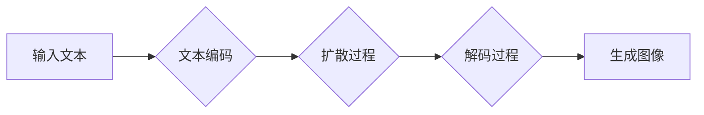

> Imagen, 扩散模型, 文本到图像, 生成对抗网络, 计算机视觉, 深度学习, 代码实例

## 1. 背景介绍

近年来，人工智能领域取得了令人瞩目的进展，其中文本到图像生成技术尤为引人注目。能够根据文本描述生成逼真图像的能力，为艺术创作、设计、游戏开发等领域带来了无限可能。Imagen，由谷歌 DeepMind 开发的文本到图像生成模型，凭借其出色的生成质量和对文本理解能力，迅速成为该领域的研究热点。

传统的图像生成方法主要依赖于生成对抗网络 (GAN)，但GAN 训练过程复杂，容易陷入模式崩溃，生成图像质量难以保证。Imagen 采用了一种全新的基于扩散模型的生成方法，克服了 GAN 的诸多缺点，实现了更高质量的文本到图像生成。

## 2. 核心概念与联系

Imagen 的核心思想是将图像生成视为一个逆向扩散过程。

**扩散模型** 是一种生成模型，它通过逐步添加噪声将图像逐渐“扩散”成纯噪声，然后训练一个解码器网络，学习从纯噪声中逐步去除噪声，最终生成清晰的图像。

**文本到图像生成** 的过程可以概括为以下步骤：

1. **文本编码:** 将输入的文本描述编码成一个向量表示。
2. **扩散过程:** 将图像逐步添加噪声，直到变成纯噪声。
3. **解码过程:** 使用训练好的解码器网络，根据文本编码和噪声信息，逐步去除噪声，生成图像。

**Mermaid 流程图:**

## 3. 核心算法原理 & 具体操作步骤

### 3.1  算法原理概述

Imagen 的核心算法是基于扩散模型的文本到图像生成方法。它主要包括两个部分：

* **扩散模型:** 负责将图像逐步“扩散”成纯噪声，并学习从纯噪声中生成图像。
* **文本编码器:** 负责将输入的文本描述编码成一个向量表示，用于指导图像生成过程。

### 3.2  算法步骤详解

1. **前向扩散:** 将图像逐步添加噪声，直到变成纯噪声。这个过程可以看作是一个马尔可夫链，每个步骤都添加一个特定的噪声分布。
2. **训练解码器:** 使用训练数据，训练一个解码器网络，学习从纯噪声中逐步去除噪声，生成图像。解码器网络的输入是纯噪声和文本编码向量，输出是去噪后的图像。
3. **文本到图像生成:** 将输入的文本描述编码成向量，然后将纯噪声作为输入，通过解码器网络逐步去除噪声，最终生成图像。

### 3.3  算法优缺点

**优点:**

* 生成图像质量高，细节丰富。
* 对文本理解能力强，能够生成与文本描述相符的图像。
* 训练过程相对稳定，不易陷入模式崩溃。

**缺点:**

* 训练成本高，需要大量的计算资源和训练数据。
* 生成图像尺寸有限，难以生成高分辨率图像。

### 3.4  算法应用领域

* **艺术创作:** 生成独特的艺术作品，例如绘画、雕塑等。
* **设计领域:** 生成产品设计草图、UI界面设计等。
* **游戏开发:** 生成游戏场景、角色模型等。
* **教育领域:** 生成可视化的教学内容，帮助学生理解复杂的概念。

## 4. 数学模型和公式 & 详细讲解 & 举例说明

### 4.1  数学模型构建

Imagen 的数学模型主要包括以下几个部分：

* **扩散模型:** 使用马尔可夫链模型描述图像的扩散过程。
* **文本编码器:** 使用 Transformer 网络编码文本描述。
* **解码器网络:** 使用 U-Net 网络解码纯噪声，生成图像。

### 4.2  公式推导过程

扩散模型的数学基础是马尔可夫链。假设图像的像素值服从一个概率分布，则图像的扩散过程可以表示为：

$$
x_t = \sqrt{1-\beta_t}x_{t-1} + \sqrt{\beta_t}\epsilon_t
$$

其中：

* $x_t$ 表示时间步为 $t$ 的图像像素值。
* $\beta_t$ 是时间步为 $t$ 的噪声系数。
* $\epsilon_t$ 是服从标准正态分布的噪声。

解码器网络的目标是学习一个函数 $f$，能够将纯噪声 $x_T$ 和文本编码向量 $z$ 映射到图像 $x_0$：

$$
x_0 = f(x_T, z)
$$

### 4.3  案例分析与讲解

假设我们想要生成一张“一只小猫在草地上玩耍”的图像。

1. **文本编码:** 将文本描述“一只小猫在草地上玩耍”编码成一个向量 $z$。
2. **扩散过程:** 将图像逐步添加噪声，直到变成纯噪声 $x_T$。
3. **解码过程:** 使用解码器网络 $f$，将纯噪声 $x_T$ 和文本编码向量 $z$ 作为输入，逐步去除噪声，最终生成一张“一只小猫在草地上玩耍”的图像 $x_0$。

## 5. 项目实践：代码实例和详细解释说明

### 5.1  开发环境搭建

* Python 3.7+
* PyTorch 1.7+
* CUDA 10.2+

### 5.2  源代码详细实现

由于 Imagen 的代码开源，我们可以直接使用其官方代码进行实践。

### 5.3  代码解读与分析

Imagen 的代码主要包含以下几个部分：

* **扩散模型:** 实现图像的扩散和去噪过程。
* **文本编码器:** 实现文本描述的编码过程。
* **解码器网络:** 实现图像生成的解码过程。
* **训练脚本:** 实现模型的训练过程。

### 5.4  运行结果展示

运行 Imagen 的代码，可以生成高质量的文本到图像。

## 6. 实际应用场景

Imagen 的应用场景非常广泛，例如：

* **艺术创作:** 生成独特的艺术作品，例如绘画、雕塑等。
* **设计领域:** 生成产品设计草图、UI界面设计等。
* **游戏开发:** 生成游戏场景、角色模型等。
* **教育领域:** 生成可视化的教学内容，帮助学生理解复杂的概念。

### 6.4  未来应用展望

随着技术的不断发展，Imagen 的应用场景将会更加广泛，例如：

* **虚拟现实和增强现实:** 生成逼真的虚拟场景和增强现实内容。
* **医学图像分析:** 生成医学图像，辅助医生诊断疾病。
* **自动驾驶:** 生成驾驶场景图像，辅助自动驾驶系统决策。

## 7. 工具和资源推荐

### 7.1  学习资源推荐

* **Imagen 官方文档:** https://arxiv.org/abs/2205.11466
* **扩散模型教程:** https://lilianweng.github.io/posts/2021-07-11-diffusion-models/

### 7.2  开发工具推荐

* **PyTorch:** https://pytorch.org/
* **TensorFlow:** https://www.tensorflow.org/

### 7.3  相关论文推荐

* **Denoising Diffusion Probabilistic Models:** https://arxiv.org/abs/2006.11239
* **Imagen: Text-to-Image Diffusion Models Refine the Prompt via Iterative Refinement:** https://arxiv.org/abs/2205.11466

## 8. 总结：未来发展趋势与挑战

### 8.1  研究成果总结

Imagen 的出现标志着文本到图像生成技术取得了新的突破。其基于扩散模型的生成方法，克服了传统 GAN 的诸多缺点，实现了更高质量的图像生成。

### 8.2  未来发展趋势

未来，文本到图像生成技术将会朝着以下几个方向发展：

* **更高质量的图像生成:** 提高图像的细节、分辨率和真实度。
* **更强大的文本理解能力:** 能够理解更复杂的文本描述，生成更符合语义的图像。
* **更灵活的控制方式:** 提供更灵活的控制方式，例如控制图像的风格、视角、颜色等。

### 8.3  面临的挑战

文本到图像生成技术还面临着一些挑战：

* **训练成本高:** 训练大型扩散模型需要大量的计算资源和训练数据。
* **生成图像尺寸有限:** 难以生成高分辨率图像。
* **伦理问题:** 文本到图像生成技术可能被用于生成虚假信息，需要考虑其伦理问题。

### 8.4  研究展望

未来，我们将继续研究文本到图像生成技术，努力解决上述挑战，推动该技术的发展。

## 9. 附录：常见问题与解答

**Q1: Imagen 的代码开源了吗？**

A1: 是的，Imagen 的代码开源了，可以在官方 GitHub 仓库中找到。

**Q2: 如何训练 Imagen 模型？**

A2: 训练 Imagen 模型需要大量的计算资源和训练数据。官方提供了训练脚本，可以参考其文档进行训练。

**Q3: Imagen 的生成图像质量如何？**

A3: Imagen 的生成图像质量非常高，细节丰富，能够生成逼真的图像。

**Q4: Imagen 的应用场景有哪些？**

A4: Imagen 的应用场景非常广泛，例如艺术创作、设计领域、游戏开发、教育领域等。

**Q5: Imagen 的未来发展趋势是什么？**

A5: 未来，文本到图像生成技术将会朝着更高质量、更强大的文本理解能力、更灵活的控制方式等方向发展。

作者：禅与计算机程序设计艺术 / Zen and the Art of Computer Programming 
<end_of_turn>