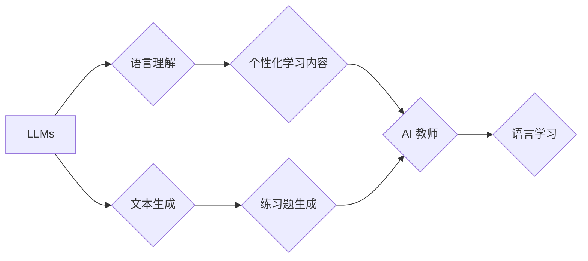

> LLMs, 语言学习, AI 教师, 自然语言处理, 知识表示, 语言模型, 迁移学习

## 1. 背景介绍

语言是人类最重要的沟通工具，也是人类智慧的体现。学习语言是人类成长过程中必不可少的环节，它不仅能够帮助我们理解世界，更能让我们表达自己的思想和情感。随着人工智能技术的飞速发展，大型语言模型（LLMs）的出现为语言学习带来了新的可能性。LLMs 拥有强大的文本生成、理解和翻译能力，可以作为智能化的语言学习助手，为用户提供个性化的学习体验。

传统的语言学习方法主要依赖于教师、教材和练习，学习过程相对单调且缺乏互动性。而LLMs可以打破这些局限，提供更加灵活、高效和个性化的学习方式。例如，LLMs可以根据用户的学习进度和水平，定制个性化的学习内容和练习题；可以模拟真实的语言环境，帮助用户进行口语练习；还可以提供即时的反馈和纠正，帮助用户更快地掌握语言知识。

## 2. 核心概念与联系

**2.1 核心概念**

* **大型语言模型 (LLM):** 训练于海量文本数据上的深度学习模型，能够理解和生成人类语言。
* **语言学习:** 指的是学习一种新的语言，包括语音、词汇、语法和文化等方面的知识。
* **AI 教师:** 利用人工智能技术，模拟教师角色，为用户提供个性化的语言学习指导和帮助。

**2.2 核心概念联系**

LLMs 可以作为 AI 教师的核心技术，为语言学习提供智能化的支持。



## 3. 核心算法原理 & 具体操作步骤

**3.1 算法原理概述**

LLMs 通常基于 Transformer 架构，利用自注意力机制学习语言的上下文关系。通过训练大量的文本数据，LLMs 可以学习到语言的语法规则、语义理解和文本生成能力。

**3.2 算法步骤详解**

1. **数据预处理:** 将文本数据进行清洗、分词、标记等预处理操作，使其能够被模型理解。
2. **模型训练:** 使用 Transformer 架构的 LLM 模型，训练数据并优化模型参数，使其能够准确地理解和生成文本。
3. **模型评估:** 使用测试数据评估模型的性能，例如准确率、困惑度等指标。
4. **模型部署:** 将训练好的模型部署到服务器或云平台，供用户使用。

**3.3 算法优缺点**

* **优点:**
    * 强大的文本理解和生成能力
    * 可以学习到复杂的语言规律
    * 可以进行个性化的学习推荐
* **缺点:**
    * 训练成本高
    * 需要大量的训练数据
    * 可能存在偏差和错误

**3.4 算法应用领域**

* **语言翻译:** 将一种语言翻译成另一种语言。
* **文本摘要:** 将长篇文本压缩成简短的摘要。
* **对话系统:** 与用户进行自然语言对话。
* **写作辅助:** 帮助用户进行写作，例如语法检查、内容生成等。

## 4. 数学模型和公式 & 详细讲解 & 举例说明

**4.1 数学模型构建**

LLMs 通常使用 Transformer 架构，其核心是自注意力机制。自注意力机制可以学习文本中每个词与其他词之间的关系，从而更好地理解文本的语义。

**4.2 公式推导过程**

自注意力机制的计算公式如下：

$$
Attention(Q, K, V) = softmax(\frac{QK^T}{\sqrt{d_k}})V
$$

其中：

* $Q$：查询矩阵
* $K$：键矩阵
* $V$：值矩阵
* $d_k$：键向量的维度
* $softmax$：softmax 函数

**4.3 案例分析与讲解**

假设我们有一个句子 "The cat sat on the mat"，其词向量表示为：

* The: [0.1, 0.2, 0.3]
* cat: [0.4, 0.5, 0.6]
* sat: [0.7, 0.8, 0.9]
* on: [0.2, 0.3, 0.4]
* the: [0.1, 0.2, 0.3]
* mat: [0.5, 0.6, 0.7]

使用自注意力机制，我们可以计算每个词与其他词之间的注意力权重，例如 "cat" 与 "sat" 之间的注意力权重会比较高，因为它们在语义上相关。

## 5. 项目实践：代码实例和详细解释说明

**5.1 开发环境搭建**

* Python 3.7+
* PyTorch 或 TensorFlow
* CUDA (可选)

**5.2 源代码详细实现**

```python
import torch
import torch.nn as nn

class Transformer(nn.Module):
    def __init__(self, vocab_size, embedding_dim, num_heads, num_layers):
        super(Transformer, self).__init__()
        self.embedding = nn.Embedding(vocab_size, embedding_dim)
        self.transformer_layers = nn.ModuleList([
            nn.TransformerEncoderLayer(embedding_dim, num_heads)
            for _ in range(num_layers)
        ])

    def forward(self, x):
        x = self.embedding(x)
        for layer in self.transformer_layers:
            x = layer(x)
        return x
```

**5.3 代码解读与分析**

* `Transformer` 类定义了一个 Transformer 模型。
* `embedding` 层将词索引转换为词向量。
* `transformer_layers` 是一个列表，包含多个 Transformer Encoder Layer。
* `forward` 方法定义了模型的正向传播过程。

**5.4 运行结果展示**

训练好的 Transformer 模型可以用于各种语言任务，例如文本生成、翻译等。

## 6. 实际应用场景

**6.1 个性化学习内容**

LLMs 可以根据用户的学习进度和水平，定制个性化的学习内容和练习题。例如，如果用户在学习语法方面遇到困难，LLMs 可以提供针对性的语法练习和讲解。

**6.2 口语练习**

LLMs 可以模拟真实的语言环境，帮助用户进行口语练习。用户可以与 LLMs 进行对话，练习发音、语法和词汇。

**6.3 即时反馈和纠正**

LLMs 可以提供即时的反馈和纠正，帮助用户更快地掌握语言知识。例如，当用户说错单词时，LLMs 可以立即提示正确的单词。

**6.4 未来应用展望**

* **沉浸式语言学习:** 利用虚拟现实技术，构建沉浸式的语言学习环境，让用户身临其境地体验语言学习。
* **跨语言学习:** 利用 LLMs 的多语言能力，帮助用户学习多种语言。
* **个性化语言教学:** 利用 LLMs 的个性化学习能力，为每个用户提供定制化的语言教学方案。

## 7. 工具和资源推荐

**7.1 学习资源推荐**

* **课程:**
    * Stanford CS224N: Natural Language Processing with Deep Learning
    * MIT 6.S191: Introduction to Deep Learning
* **书籍:**
    * Deep Learning by Ian Goodfellow, Yoshua Bengio, and Aaron Courville
    * Speech and Language Processing by Daniel Jurafsky and James H. Martin
* **在线平台:**
    * Hugging Face: https://huggingface.co/
    * TensorFlow: https://www.tensorflow.org/
    * PyTorch: https://pytorch.org/

**7.2 开发工具推荐**

* **深度学习框架:** TensorFlow, PyTorch
* **自然语言处理库:** NLTK, spaCy
* **代码编辑器:** VS Code, Sublime Text

**7.3 相关论文推荐**

* Attention Is All You Need (Vaswani et al., 2017)
* BERT: Pre-training of Deep Bidirectional Transformers for Language Understanding (Devlin et al., 2018)
* GPT-3: Language Models are Few-Shot Learners (Brown et al., 2020)

## 8. 总结：未来发展趋势与挑战

**8.1 研究成果总结**

LLMs 在语言理解和生成方面取得了显著的进展，为语言学习带来了新的可能性。

**8.2 未来发展趋势**

* **模型规模和能力的提升:** LLMs 将继续朝着更大的规模和更强的能力发展。
* **多模态学习:** LLMs 将与其他模态数据（例如图像、音频）进行融合，实现更全面的语言理解。
* **可解释性和安全性:** 研究将更加注重 LLMs 的可解释性和安全性，使其能够更好地服务于人类。

**8.3 面临的挑战**

* **数据获取和标注:** LLMs 的训练需要大量的文本数据，数据获取和标注成本较高。
* **计算资源:** 训练大型 LLMs 需要大量的计算资源，这对于资源有限的机构来说是一个挑战。
* **伦理问题:** LLMs 的应用可能带来一些伦理问题，例如信息操纵、隐私泄露等，需要引起重视。

**8.4 研究展望**

未来，LLMs 将在更多领域得到应用，例如教育、医疗、法律等。研究者将继续探索 LLMs 的潜力，使其更好地服务于人类社会。

## 9. 附录：常见问题与解答

**9.1 如何训练一个 LLMs？**

训练一个 LLMs 需要大量的文本数据、强大的计算资源和专业的机器学习知识。

**9.2 LLMs 的应用场景有哪些？**

LLMs 的应用场景非常广泛，例如文本生成、翻译、对话系统、写作辅助等。

**9.3 LLMs 的伦理问题有哪些？**

LLMs 的应用可能带来一些伦理问题，例如信息操纵、隐私泄露等，需要引起重视。

作者：禅与计算机程序设计艺术 / Zen and the Art of Computer Programming


<end_of_turn>