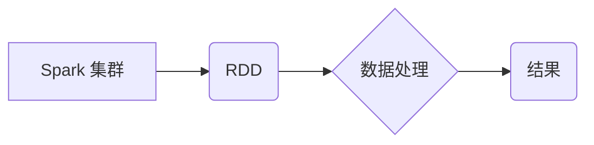

> Apache Spark, RDD, 分布式计算, 数据处理, 数据分析, 大数据

## 1. 背景介绍

在海量数据时代，传统的单机计算模式已难以满足对数据处理和分析的需求。分布式计算应运而生，成为处理海量数据的有效解决方案。Apache Spark 是一个开源的分布式计算框架，以其高性能、易用性和灵活性而备受关注。Spark 的核心概念之一是 Resilient Distributed Datasets (RDD)，它为分布式数据处理提供了强大的抽象层。

## 2. 核心概念与联系

RDD 是 Spark 中的基本数据结构，它是一个分布式、可恢复的集合。RDD 的特点是：

* **分布式:** RDD 数据存储在集群中的多个节点上，并通过分区机制进行划分。
* **可恢复:** RDD 数据可以被持久化存储，即使节点发生故障，也可以通过历史数据进行恢复。
* **并行处理:** RDD 支持并行操作，可以将数据分发到多个节点上进行并行计算，提高处理效率。

**RDD 与 Spark 集群的关系**



## 3. 核心算法原理 & 具体操作步骤

### 3.1  算法原理概述

RDD 的核心算法原理是基于数据分区和并行处理。数据首先被划分为多个分区，每个分区存储在集群中的一个节点上。然后，Spark 会将操作应用于每个分区，并通过聚合操作将结果合并起来。

### 3.2  算法步骤详解

1. **数据加载:** 将数据加载到 Spark 集群中，并将其划分为多个 RDD 分区。
2. **数据转换:** 对 RDD 进行各种转换操作，例如过滤、映射、聚合等。
3. **数据行动:** 对 RDD 执行行动操作，例如收集、打印、保存等。

### 3.3  算法优缺点

**优点:**

* **高性能:** 并行处理机制可以显著提高数据处理速度。
* **易用性:** RDD 提供了简洁的 API，方便用户进行数据操作。
* **可恢复性:** RDD 数据可以被持久化存储，即使节点发生故障，也可以进行恢复。

**缺点:**

* **内存限制:** RDD 数据需要加载到内存中进行处理，对于海量数据可能存在内存限制问题。
* **数据依赖:** RDD 操作之间存在数据依赖关系，需要进行依赖管理。

### 3.4  算法应用领域

RDD 广泛应用于各种大数据处理场景，例如：

* **数据分析:** 对海量数据进行统计分析、模式识别等。
* **机器学习:** 对数据进行特征提取、模型训练等。
* **推荐系统:** 基于用户行为数据进行推荐。
* **日志分析:** 对日志数据进行分析，发现异常行为等。

## 4. 数学模型和公式 & 详细讲解 & 举例说明

### 4.1  数学模型构建

RDD 可以抽象为一个集合，其中每个元素都对应一个数据分区。我们可以用以下数学模型来表示 RDD：

```latex
RDD = {D_1, D_2, ..., D_n}
```

其中，$D_i$ 表示第 $i$ 个数据分区。

### 4.2  公式推导过程

RDD 的并行处理机制可以利用并行计算的理论进行推导。假设我们有一个 RDD $RDD_1$，需要对其进行一个操作 $op$。我们可以将 $RDD_1$ 分成 $n$ 个分区，每个分区分别执行 $op$ 操作，然后将结果合并起来得到最终结果 $RDD_2$。

```latex
RDD_2 = op(D_1), op(D_2), ..., op(D_n)
```

### 4.3  案例分析与讲解

例如，我们有一个 RDD $RDD_1$，包含用户购买记录，我们需要计算每个用户的购买总金额。我们可以使用 RDD 的 `map` 和 `reduceByKey` 操作来实现：

1. 使用 `map` 操作将每个购买记录映射成 (用户 ID, 金额) 的元组。
2. 使用 `reduceByKey` 操作对每个用户 ID 进行聚合，计算总金额。

## 5. 项目实践：代码实例和详细解释说明

### 5.1  开发环境搭建

需要安装 Apache Spark 和 Java 开发环境。

### 5.2  源代码详细实现

```python
from pyspark import SparkContext

# 创建 SparkContext
sc = SparkContext("local", "RDD Example")

# 加载数据
data = sc.textFile("data.txt")

# 将数据转换为元组
data_tuple = data.map(lambda line: (line.split(",")[0], float(line.split(",")[1])))

# 计算每个用户的购买总金额
total_amount = data_tuple.reduceByKey(lambda x, y: x + y)

# 打印结果
total_amount.collect()
```

### 5.3  代码解读与分析

* `SparkContext` 是 Spark 的入口点，用于创建 Spark 应用。
* `textFile` 方法用于加载文本文件数据。
* `map` 方法用于对数据进行转换操作，将每个数据行转换为 (用户 ID, 金额) 的元组。
* `reduceByKey` 方法用于对数据进行聚合操作，计算每个用户 ID 的总金额。
* `collect` 方法用于将结果从集群中收集到本地。

### 5.4  运行结果展示

运行代码后，将输出每个用户的购买总金额。

## 6. 实际应用场景

RDD 在实际应用场景中广泛应用，例如：

* **电商平台:** 计算用户购买商品的总金额、热门商品等。
* **社交网络:** 计算用户之间的关系、热门话题等。
* **金融行业:** 计算交易金额、风险评估等。

### 6.4  未来应用展望

随着大数据量的不断增长，RDD 将在未来继续发挥重要作用，并与其他技术结合，例如机器学习、深度学习等，为数据分析和处理提供更强大的工具。

## 7. 工具和资源推荐

### 7.1  学习资源推荐

* Apache Spark 官方文档: https://spark.apache.org/docs/latest/
* Spark 中文文档: https://spark.apache.org/docs/latest/zh-cn/
* Spark 入门教程: https://www.datacamp.com/courses/intro-to-apache-spark

### 7.2  开发工具推荐

* IntelliJ IDEA
* Eclipse

### 7.3  相关论文推荐

* Resilient Distributed Datasets: A Fault-Tolerant Abstraction for In-Memory Cluster Computing

## 8. 总结：未来发展趋势与挑战

### 8.1  研究成果总结

RDD 作为 Spark 的核心概念，为分布式数据处理提供了强大的抽象层，并推动了大数据处理技术的进步。

### 8.2  未来发展趋势

未来，RDD 将继续朝着以下方向发展：

* **更强大的功能:** 扩展 RDD 的功能，支持更复杂的计算操作。
* **更优的性能:** 优化 RDD 的算法和实现，提高处理效率。
* **更易于使用:** 简化 RDD 的 API，降低用户学习成本。

### 8.3  面临的挑战

RDD 也面临一些挑战，例如：

* **内存限制:** 对于海量数据，RDD 的内存限制可能成为瓶颈。
* **数据依赖:** RDD 操作之间存在数据依赖关系，需要进行依赖管理。

### 8.4  研究展望

未来，研究人员将继续探索新的算法和技术，以克服 RDD 的挑战，并使其在更广泛的场景中发挥作用。

## 9. 附录：常见问题与解答

* **问题:** 如何解决 RDD 的内存限制问题？
* **解答:** 可以使用 Spark 的持久化机制，将 RDD 数据持久化存储到磁盘上，以减轻内存压力。

* **问题:** 如何管理 RDD 的数据依赖关系？
* **解答:** Spark 会自动管理 RDD 的数据依赖关系，用户无需手动进行管理。


作者：禅与计算机程序设计艺术 / Zen and the Art of Computer Programming 
<end_of_turn>