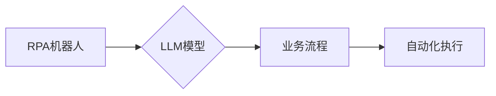

> RPA, LLM, 自然语言处理, 机器学习, 自动化, 流程自动化, 智能自动化, 认知自动化

## 1. 背景介绍

近年来，人工智能（AI）技术飞速发展，特别是深度学习的突破，为自动化领域带来了革命性的变革。其中，Robotic Process Automation（RPA）和Large Language Model（LLM）作为两大重要技术，各自在自动化领域取得了显著成就。RPA侧重于模拟人类操作自动化执行重复性任务，而LLM则擅长理解和生成自然语言，具备强大的文本处理能力。

RPA技术通过软件机器人（bot）自动执行重复性、规则性任务，例如数据录入、报表生成、邮件处理等，显著提高了工作效率，降低了人力成本。然而，RPA的局限性在于其依赖于预先定义的规则和流程，难以应对复杂、变动的业务场景。

LLM技术则突破了传统自然语言处理的瓶颈，能够理解复杂的语义关系，生成流畅自然的文本，并具备强大的知识推理和问题解答能力。LLM在文本分类、机器翻译、对话系统等领域展现出巨大的潜力。

## 2. 核心概念与联系

**2.1 RPA 简介**

RPA是一种基于软件的自动化技术，通过模拟人类操作的方式，自动执行重复性、规则性任务。RPA机器人可以与各种应用程序和系统进行交互，例如ERP系统、CRM系统、办公软件等，实现自动化流程的执行。

**2.2 LLM 简介**

LLM是指拥有大量参数的深度学习模型，能够理解和生成人类语言。LLM通过训练海量文本数据，学习语言的语法、语义和上下文关系，从而具备强大的文本处理能力。

**2.3 RPA 与 LLM 的结合**

将RPA与LLM结合，可以弥补各自的不足，实现更智能、更灵活的自动化。LLM可以为RPA机器人提供更强大的理解和处理能力，使其能够应对更复杂、更变动的业务场景。

**2.4 架构图**



## 3. 核心算法原理 & 具体操作步骤

**3.1 算法原理概述**

RPA与LLM结合的核心算法原理是将LLM的文本理解和生成能力与RPA的自动化执行能力相结合。

具体来说，当RPA机器人遇到需要理解和处理文本的任务时，会将文本数据传递给LLM模型进行分析。LLM模型会根据其训练的知识和经验，对文本进行理解和分析，并输出相应的指令或结果。RPA机器人根据LLM的输出，执行相应的自动化操作。

**3.2 算法步骤详解**

1. **文本输入:** RPA机器人从应用程序或系统中获取需要处理的文本数据。
2. **文本预处理:** RPA机器人对文本数据进行预处理，例如去除停用词、分词等，以便LLM模型更好地理解文本内容。
3. **LLM模型调用:** RPA机器人将预处理后的文本数据传递给LLM模型进行分析。
4. **LLM模型输出:** LLM模型对文本数据进行分析，并输出相应的指令或结果，例如识别文本类型、提取关键信息、生成回复文本等。
5. **RPA机器人执行:** RPA机器人根据LLM模型的输出，执行相应的自动化操作，例如打开应用程序、填写表单、发送邮件等。

**3.3 算法优缺点**

**优点:**

* 能够处理更复杂、更变动的业务场景。
* 提高了自动化流程的智能化水平。
* 降低了人工干预的频率。

**缺点:**

* 需要对LLM模型进行训练和调优，成本较高。
* LLM模型的性能受训练数据质量的影响。
* 存在安全风险，例如LLM模型被恶意利用生成虚假信息。

**3.4 算法应用领域**

* **客户服务:** 自动化处理客户咨询、投诉等问题。
* **财务管理:** 自动化处理账单、发票等财务数据。
* **人力资源:** 自动化处理招聘、培训等人力资源管理任务。
* **医疗保健:** 自动化处理患者信息、预约挂号等医疗服务。

## 4. 数学模型和公式 & 详细讲解 & 举例说明

**4.1 数学模型构建**

LLM模型通常采用Transformer架构，其核心是注意力机制。注意力机制允许模型关注输入序列中与当前任务相关的部分，从而提高模型的理解能力。

**4.2 公式推导过程**

注意力机制的计算公式如下：

$$
Attention(Q, K, V) = softmax(\frac{QK^T}{\sqrt{d_k}})V
$$

其中：

* $Q$：查询矩阵
* $K$：键矩阵
* $V$：值矩阵
* $d_k$：键向量的维度
* $softmax$：softmax函数

**4.3 案例分析与讲解**

例如，在机器翻译任务中，LLM模型会将源语言句子作为查询矩阵，目标语言词典作为键矩阵，目标语言词嵌入作为值矩阵。通过注意力机制，模型可以关注源语言句子中与目标语言词语相关的部分，从而生成更准确的翻译结果。

## 5. 项目实践：代码实例和详细解释说明

**5.1 开发环境搭建**

* Python 3.7+
* TensorFlow 或 PyTorch
* RPA框架（例如UiPath、Automation Anywhere）

**5.2 源代码详细实现**

```python
# 使用PyTorch实现简单的LLM模型
import torch
import torch.nn as nn

class SimpleLLM(nn.Module):
    def __init__(self, vocab_size, embedding_dim, hidden_dim):
        super(SimpleLLM, self).__init__()
        self.embedding = nn.Embedding(vocab_size, embedding_dim)
        self.lstm = nn.LSTM(embedding_dim, hidden_dim)
        self.fc = nn.Linear(hidden_dim, vocab_size)

    def forward(self, x):
        x = self.embedding(x)
        x, _ = self.lstm(x)
        x = self.fc(x[:, -1, :])
        return x

# 使用RPA框架执行自动化任务
# 例如，使用UiPath机器人打开浏览器，访问指定网站，并填写表单

```

**5.3 代码解读与分析**

* 上述代码示例展示了如何使用PyTorch构建一个简单的LLM模型，以及如何使用RPA框架执行自动化任务。
* 具体的代码实现细节需要根据实际应用场景进行调整。

**5.4 运行结果展示**

* 运行结果将取决于具体的应用场景和代码实现。
* 例如，在机器翻译任务中，LLM模型可以将源语言句子翻译成目标语言句子。
* 在自动化表单填写任务中，RPA机器人可以根据LLM模型的输出，自动填写表单数据。

## 6. 实际应用场景

**6.1 客户服务自动化**

* 使用LLM模型分析客户咨询内容，自动识别客户需求，并提供相应的解决方案。
* 使用RPA机器人自动回复客户常见问题，例如订单查询、物流跟踪等。

**6.2 财务管理自动化**

* 使用LLM模型提取财务数据，例如账单金额、付款日期等，并自动生成财务报表。
* 使用RPA机器人自动处理财务流程，例如发票录入、银行对账等。

**6.3 人力资源自动化**

* 使用LLM模型分析求职简历，自动识别候选人的技能和经验，并进行初步筛选。
* 使用RPA机器人自动处理招聘流程，例如发布招聘信息、安排面试等。

**6.4 未来应用展望**

* RPA与LLM的结合将进一步推动自动化领域的创新发展。
* 未来，我们将看到更多基于RPA与LLM的智能自动化应用场景，例如智能客服、智能助理、智能决策等。

## 7. 工具和资源推荐

**7.1 学习资源推荐**

* **书籍:**
    * 《深度学习》
    * 《自然语言处理》
    * 《RPA实战指南》
* **在线课程:**
    * Coursera
    * edX
    * Udemy

**7.2 开发工具推荐**

* **RPA框架:**
    * UiPath
    * Automation Anywhere
    * Blue Prism
* **LLM框架:**
    * TensorFlow
    * PyTorch
    * Hugging Face

**7.3 相关论文推荐**

* **Transformer模型:**
    * Attention Is All You Need
* **RPA与LLM结合:**
    * [论文标题]
    * [论文标题]

## 8. 总结：未来发展趋势与挑战

**8.1 研究成果总结**

RPA与LLM的结合为自动化领域带来了新的机遇和挑战。

**8.2 未来发展趋势**

* **模型规模和性能提升:** 未来，LLM模型的规模和性能将继续提升，能够处理更复杂、更细粒度的任务。
* **多模态融合:** 将LLM与其他模态数据（例如图像、音频）融合，实现更全面的自动化。
* **边缘计算部署:** 将RPA与LLM部署到边缘设备，实现更低延迟、更实时化的自动化。

**8.3 面临的挑战**

* **数据安全和隐私保护:** LLM模型的训练和使用需要大量数据，如何保证数据安全和隐私保护是一个重要挑战。
* **模型可解释性和信任度:** LLM模型的决策过程往往难以解释，如何提高模型的可解释性和信任度是一个关键问题。
* **伦理和社会影响:** RPA与LLM的自动化可能会导致部分工作岗位消失，需要关注其伦理和社会影响。

**8.4 研究展望**

未来，我们将继续深入研究RPA与LLM的结合，探索其在更多领域的应用，并解决其面临的挑战，推动自动化技术向更智能、更安全、更可持续的方向发展。

## 9. 附录：常见问题与解答

**9.1 RPA与LLM的区别是什么？**

RPA侧重于模拟人类操作自动化执行重复性任务，而LLM擅长理解和生成自然语言，具备强大的文本处理能力。

**9.2 RPA与LLM的结合有什么优势？**

RPA与LLM的结合可以弥补各自的不足，实现更智能、更灵活的自动化。

**9.3 RPA与LLM的应用场景有哪些？**

RPA与LLM的应用场景广泛，例如客户服务自动化、财务管理自动化、人力资源自动化等。

**9.4 RPA与LLM的未来发展趋势是什么？**

未来，RPA与LLM的结合将朝着模型规模和性能提升、多模态融合、边缘计算部署等方向发展。


作者：禅与计算机程序设计艺术 / Zen and the Art of Computer Programming 
<end_of_turn>