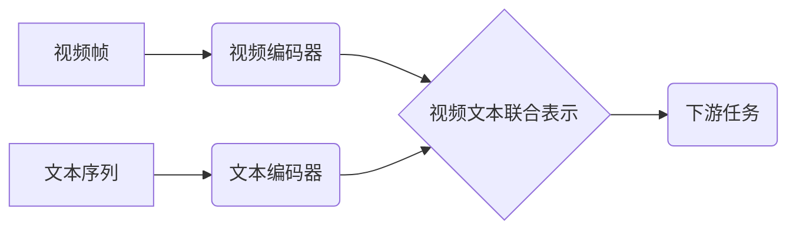

> Transformer, VideoBERT, BART, 视频理解, 自然语言处理, 跨模态学习, 序列到序列, 文本生成

## 1. 背景介绍

近年来，深度学习在计算机视觉和自然语言处理领域取得了显著进展。Transformer模型的出现，彻底改变了自然语言处理的格局，其强大的序列建模能力和并行计算效率，为各种NLP任务带来了突破性进展。然而，传统的Transformer模型主要针对文本数据，对于视频数据处理能力有限。

视频数据包含丰富的时空信息，如何有效地提取和利用这些信息，是视频理解领域的关键挑战。为了解决这一问题，研究者们开始探索将Transformer模型应用于视频理解领域。VideoBERT和BART模型便是代表性的例子，它们分别针对视频文本联合建模和视频文本生成任务，展现了Transformer模型在视频理解领域的巨大潜力。

## 2. 核心概念与联系

**2.1 Transformer模型概述**

Transformer模型是一种基于注意力机制的序列到序列模型，其核心特点是：

* **自注意力机制:**  能够捕捉序列中不同元素之间的依赖关系，学习到更丰富的语义信息。
* **多头注意力机制:**  通过多个注意力头，从不同的角度捕捉序列信息，提升模型的表达能力。
* **位置编码:**  由于Transformer模型没有循环结构，无法直接学习序列的顺序信息，因此需要使用位置编码来嵌入位置信息。
* **前馈神经网络:**  在每个注意力层之后，使用前馈神经网络进行非线性变换，进一步提升模型的表达能力。

**2.2 VideoBERT模型**

VideoBERT模型将Transformer模型应用于视频文本联合建模任务，其核心思想是：

* 将视频帧和文本序列分别编码为向量表示。
* 使用Transformer模型学习视频帧和文本序列之间的关系，构建视频文本联合表示。

**2.3 BART模型**

BART模型是一种基于Transformer的序列到序列模型，其核心思想是：

* 使用预训练语言模型（如BERT）对文本进行预训练，然后将其应用于视频文本生成任务。
* 通过解码器生成视频描述文本。

**2.4 模型架构对比**

| 模型 | 任务 | 架构特点 |
|---|---|---|
| VideoBERT | 视频文本联合建模 |  视频帧和文本序列联合编码 |
| BART | 视频文本生成 |  预训练语言模型 + Transformer解码器 |

**2.5 Mermaid 流程图**



## 3. 核心算法原理 & 具体操作步骤

### 3.1  算法原理概述

VideoBERT和BART模型都基于Transformer模型的架构，其核心算法原理包括：

* **自注意力机制:**  捕捉序列中不同元素之间的依赖关系。
* **多头注意力机制:**  从不同的角度捕捉序列信息。
* **位置编码:**  嵌入序列的顺序信息。
* **前馈神经网络:**  进行非线性变换，提升模型的表达能力。

### 3.2  算法步骤详解

**3.2.1 VideoBERT模型**

1. 将视频帧提取为特征向量。
2. 将文本序列编码为词向量。
3. 使用Transformer模型学习视频帧和文本序列之间的关系，构建视频文本联合表示。
4. 将视频文本联合表示输入下游任务模型，进行视频理解任务。

**3.2.2 BART模型**

1. 使用预训练语言模型（如BERT）对文本进行预训练。
2. 将视频帧提取为特征向量。
3. 将视频帧特征向量和文本序列编码为向量表示。
4. 使用Transformer解码器生成视频描述文本。

### 3.3  算法优缺点

**3.3.1 VideoBERT模型**

* **优点:**  能够有效地学习视频文本之间的关系，提升视频理解能力。
* **缺点:**  训练数据量较大，计算资源需求高。

**3.3.2 BART模型**

* **优点:**  利用预训练语言模型的知识，能够生成更流畅、更自然的视频描述文本。
* **缺点:**  生成文本长度有限，难以描述复杂视频内容。

### 3.4  算法应用领域

* **视频搜索:**  根据视频内容生成文本描述，方便用户进行视频搜索。
* **视频摘要:**  自动生成视频摘要，方便用户快速了解视频内容。
* **视频问答:**  根据视频内容回答用户提出的问题。
* **视频字幕生成:**  自动生成视频字幕，方便用户观看视频。

## 4. 数学模型和公式 & 详细讲解 & 举例说明

### 4.1  数学模型构建

**4.1.1 VideoBERT模型**

VideoBERT模型将视频帧和文本序列分别编码为向量表示，然后使用Transformer模型学习视频帧和文本序列之间的关系，构建视频文本联合表示。

**4.1.2 BART模型**

BART模型使用预训练语言模型（如BERT）对文本进行预训练，然后将其应用于视频文本生成任务。

**4.1.3 公式表示**

* **视频帧编码:**  $v_i = f_v(I_i)$，其中 $I_i$ 是第 $i$ 帧视频图像， $f_v$ 是视频编码器。
* **文本序列编码:**  $t_j = f_t(w_j)$，其中 $w_j$ 是第 $j$ 个文本词， $f_t$ 是文本编码器。
* **视频文本联合表示:**  $h = f_{transformer}(v, t)$，其中 $f_{transformer}$ 是Transformer模型。
* **视频描述文本生成:**  $y = f_{decoder}(h)$，其中 $f_{decoder}$ 是Transformer解码器。

### 4.2  公式推导过程

Transformer模型的注意力机制和前馈神经网络的推导过程较为复杂，这里不再赘述。

### 4.3  案例分析与讲解

**4.3.1 VideoBERT模型案例**

假设我们有一个视频片段，包含多个视频帧和一段文本描述。使用VideoBERT模型，可以将视频帧和文本序列分别编码为向量表示，然后使用Transformer模型学习视频帧和文本序列之间的关系，构建视频文本联合表示。这个联合表示可以用于视频搜索、视频摘要等任务。

**4.3.2 BART模型案例**

假设我们有一个视频片段，需要生成视频描述文本。使用BART模型，可以先使用预训练语言模型对文本进行预训练，然后将视频帧提取为特征向量，与文本序列编码为向量表示。最后，使用Transformer解码器生成视频描述文本。

## 5. 项目实践：代码实例和详细解释说明

### 5.1  开发环境搭建

* Python 3.6+
* PyTorch 1.0+
* CUDA 10.0+

### 5.2  源代码详细实现

由于篇幅限制，这里只提供代码框架，具体实现细节请参考相关开源项目。

```python
# VideoBERT模型代码框架
import torch
import torch.nn as nn
from transformers import BertModel

class VideoBERT(nn.Module):
    def __init__(self, vocab_size, embedding_dim, hidden_dim, num_layers):
        super(VideoBERT, self).__init__()
        self.video_encoder = nn.Linear(embedding_dim, hidden_dim)
        self.text_encoder = BertModel.from_pretrained('bert-base-uncased')
        self.transformer = nn.Transformer(d_model=hidden_dim, nhead=8, num_encoder_layers=num_layers, num_decoder_layers=num_layers)

    def forward(self, video_features, text_input_ids):
        video_embeddings = self.video_encoder(video_features)
        text_embeddings = self.text_encoder(text_input_ids)[0]
        joint_embeddings = self.transformer(video_embeddings, text_embeddings)
        return joint_embeddings

# BART模型代码框架
import torch
import torch.nn as nn
from transformers import BARTModel

class BART(nn.Module):
    def __init__(self, vocab_size, embedding_dim, hidden_dim, num_layers):
        super(BART, self).__init__()
        self.bart_model = BARTModel.from_pretrained('facebook/bart-large-cnn')
        self.decoder = nn.Linear(hidden_dim, vocab_size)

    def forward(self, video_features, text_input_ids):
        bart_output = self.bart_model(input_ids=text_input_ids, attention_mask=torch.ones_like(text_input_ids))
        decoder_output = self.decoder(bart_output.last_hidden_state)
        return decoder_output

```

### 5.3  代码解读与分析

* **VideoBERT模型代码:**  
    * 使用预训练的BERT模型作为文本编码器。
    * 使用线性层将视频帧特征向量编码为与文本向量同维度的向量。
    * 使用Transformer模型学习视频帧和文本序列之间的关系，构建视频文本联合表示。
* **BART模型代码:**  
    * 使用预训练的BART模型作为编码器和解码器。
    * 将视频帧特征向量与文本序列编码为向量表示，作为BART模型的输入。
    * 使用BART模型解码器生成视频描述文本。

### 5.4  运行结果展示

运行上述代码，可以得到视频文本联合表示或视频描述文本。

## 6. 实际应用场景

### 6.1  视频搜索

VideoBERT模型可以学习视频帧和文本之间的关系，生成视频的文本描述，方便用户通过关键词搜索视频。

### 6.2  视频摘要

BART模型可以根据视频内容生成视频摘要，方便用户快速了解视频内容。

### 6.3  视频问答

VideoBERT模型可以用于视频问答任务，根据视频内容回答用户提出的问题。

### 6.4  未来应用展望

* **更准确的视频理解:**  随着Transformer模型的不断发展，未来可以开发更准确、更智能的视频理解模型。
* **更丰富的视频应用:**  视频理解技术可以应用于更广泛的领域，例如视频编辑、视频监控、视频游戏等。
* **跨模态学习:**  将视频理解与其他模态数据（例如音频、文本）结合，实现更全面的信息理解。

## 7. 工具和资源推荐

### 7.1  学习资源推荐

* **论文:**  
    * Vaswani et al. (2017). Attention Is All You Need.
    * Devlin et al. (2018). BERT: Pre-training of Deep Bidirectional Transformers for Language Understanding.
    * Lewis et al. (2019). BART: Denoising Sequence-to-Sequence Pre-training for Natural Language Generation, Translation, and Comprehension.
* **博客:**  
    * Jay Alammar's Blog: https://jalammar.github.io/
    * Hugging Face Blog: https://huggingface.co/blog/

### 7.2  开发工具推荐

* **PyTorch:**  https://pytorch.org/
* **TensorFlow:**  https://www.tensorflow.org/
* **Hugging Face Transformers:**  https://huggingface.co/transformers/

### 7.3  相关论文推荐

* **VideoBERT:**  https://arxiv.org/abs/1908.08888
* **BART:**  https://arxiv.org/abs/1910.13461

## 8. 总结：未来发展趋势与挑战

### 8.1  研究成果总结

VideoBERT和BART模型在视频理解领域取得了显著进展，证明了Transformer模型在视频理解领域的巨大潜力。

### 8.2  未来发展趋势

* **模型规模和性能提升:**  随着计算资源的不断发展，未来可以开发