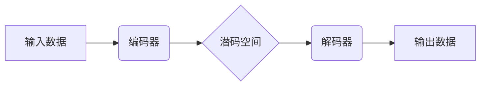

> VQVAE, 离散表示, 潜码, 编码器, 解码器, vq-vae, autoencoder, 压缩感知

## 1. 背景介绍

在深度学习领域，表示学习一直是研究的热点问题。传统的深度学习模型通常使用连续的向量来表示数据，但这种表示方式存在着以下问题：

* **高维性:** 连续向量通常具有很高的维度，这会导致计算复杂度高、存储空间大等问题。
* **冗余性:** 连续向量中可能存在冗余信息，这会导致模型的泛化能力下降。
* **离散性缺失:** 许多现实世界的数据具有离散性，例如文本、图像的类别等，而连续向量无法很好地捕捉这种离散性。

为了解决这些问题，近年来，**离散表示学习**逐渐成为研究的热点。离散表示学习的目标是将数据映射到离散的向量空间，例如整数、符号等。这种表示方式具有以下优点：

* **低维性:** 离散向量通常具有较低的维度，这可以降低计算复杂度和存储空间。
* **稀疏性:** 离散向量通常具有稀疏性，这可以减少冗余信息。
* **离散性捕捉:** 离散向量可以更好地捕捉数据的离散性。

**VQVAE (Vector Quantized Variational Autoencoder)** 是一种流行的离散表示学习模型，它结合了变分自编码器 (VAE) 和量化技术。VQVAE 通过学习一个离散的潜码空间，将数据映射到离散的向量表示。

## 2. 核心概念与联系

VQVAE 的核心概念包括：

* **变分自编码器 (VAE):** VAE 是一种生成模型，它通过学习数据分布的潜在表示来生成新的数据样本。VAE 由编码器和解码器组成，编码器将数据映射到潜码空间，解码器将潜码空间中的向量映射回原始数据空间。
* **量化 (Quantization):** 量化是指将连续值映射到离散值的过程。VQVAE 使用 **k-means 聚类** 算法来学习一个离散的潜码空间，并将编码器输出的连续向量量化为离散的潜码向量。

**VQVAE 架构流程图:**



## 3. 核心算法原理 & 具体操作步骤

### 3.1  算法原理概述

VQVAE 的核心思想是将 VAE 的潜码空间离散化。具体来说，VQVAE 首先使用一个编码器将输入数据映射到一个连续的潜码空间。然后，使用 k-means 聚类算法将这个连续的潜码空间离散化，形成一个离散的潜码空间。最后，使用一个解码器将离散的潜码向量映射回原始数据空间。

### 3.2  算法步骤详解

1. **编码器:** 编码器是一个神经网络，它将输入数据映射到一个连续的潜码空间。
2. **量化:** 将编码器输出的连续潜码向量量化为离散的潜码向量。
3. **解码器:** 解码器是一个神经网络，它将离散的潜码向量映射回原始数据空间。

### 3.3  算法优缺点

**优点:**

* **低维性:** 离散潜码空间可以有效降低数据维度。
* **稀疏性:** 离散潜码向量通常具有稀疏性，可以减少冗余信息。
* **离散性捕捉:** 可以更好地捕捉数据的离散性。

**缺点:**

* **训练复杂:** VQVAE 的训练过程相对复杂，需要使用特殊的损失函数和优化算法。
* **离散化损失:** 量化过程会导致信息损失，可能会影响模型的性能。

### 3.4  算法应用领域

VQVAE 在以下领域具有广泛的应用:

* **图像压缩:** VQVAE 可以用于图像压缩，通过离散化图像表示来减少图像大小。
* **图像生成:** VQVAE 可以用于图像生成，通过采样离散潜码向量来生成新的图像。
* **文本表示学习:** VQVAE 可以用于文本表示学习，通过离散化文本表示来提高文本相似度计算的效率。

## 4. 数学模型和公式 & 详细讲解 & 举例说明

### 4.1  数学模型构建

VQVAE 的数学模型可以概括为以下几个部分:

* **编码器:** 编码器是一个神经网络，其输出为一个连续的潜码向量 z。

* **量化:** 量化过程将连续潜码向量 z 量化为离散潜码向量 q。

* **解码器:** 解码器是一个神经网络，其输入为离散潜码向量 q，输出为重建数据 x̂。

### 4.2  公式推导过程

VQVAE 的损失函数由以下三个部分组成:

* **重建损失:** 衡量解码器输出的重建数据 x̂ 与真实数据 x 之间的差异。

* **KL 散度:** 衡量潜码分布 p(z) 与标准正态分布 N(0, I) 之间的差异。

* **量化损失:** 衡量量化过程引入的信息损失。

具体公式如下:

$$
L_{VQVAE} = L_{Reconstruction} + L_{KL} + L_{Quantization}
$$

其中:

* $L_{Reconstruction} = ||x - x̂||^2$

* $L_{KL} = D_{KL}(p(z) || N(0, I))$

* $L_{Quantization} = \sum_{i=1}^{N} ||z_i - q_i||^2$

### 4.3  案例分析与讲解

假设我们使用 VQVAE 对图像进行压缩。

1. 编码器将图像映射到一个连续的潜码空间。
2. k-means 聚类算法将这个连续的潜码空间离散化，形成一个离散的潜码空间。
3. 解码器将离散的潜码向量映射回图像空间，生成压缩后的图像。

通过量化过程，VQVAE 可以有效降低图像的维度，从而实现图像压缩。

## 5. 项目实践：代码实例和详细解释说明

### 5.1  开发环境搭建

* Python 3.6+
* PyTorch 1.0+
* CUDA 10.0+

### 5.2  源代码详细实现

```python
import torch
import torch.nn as nn
import torch.nn.functional as F

class Encoder(nn.Module):
    def __init__(self, input_dim, latent_dim):
        super(Encoder, self).__init__()
        self.fc1 = nn.Linear(input_dim, 512)
        self.fc2 = nn.Linear(512, latent_dim)

    def forward(self, x):
        x = F.relu(self.fc1(x))
        x = self.fc2(x)
        return x

class Decoder(nn.Module):
    def __init__(self, latent_dim, output_dim):
        super(Decoder, self).__init__()
        self.fc1 = nn.Linear(latent_dim, 512)
        self.fc2 = nn.Linear(512, output_dim)

    def forward(self, x):
        x = F.relu(self.fc1(x))
        x = self.fc2(x)
        return x

class VQVAE(nn.Module):
    def __init__(self, input_dim, latent_dim, num_embeddings, embedding_dim):
        super(VQVAE, self).__init__()
        self.encoder = Encoder(input_dim, latent_dim)
        self.decoder = Decoder(latent_dim, input_dim)
        self.embedding = nn.Embedding(num_embeddings, embedding_dim)
        self.commitment_loss_weight = 0.25

    def forward(self, x):
        z = self.encoder(x)
        q = self.embedding(torch.floor(z / (embedding_dim / num_embeddings)).long())
        e = self.decoder(q)
        return e, z, q

    def loss_function(self, x, e, z, q):
        reconstruction_loss = F.mse_loss(x, e)
        kl_loss = torch.mean(0.5 * torch.sum(torch.exp(z) + z**2 - 1 - torch.log(torch.exp(z)), dim=1))
        quantization_loss = torch.mean(F.mse_loss(z, q.detach()))
        total_loss = reconstruction_loss + kl_loss + self.commitment_loss_weight * quantization_loss
        return total_loss
```

### 5.3  代码解读与分析

* **Encoder:** 编码器是一个多层全连接神经网络，用于将输入数据映射到潜码空间。
* **Decoder:** 解码器也是一个多层全连接神经网络，用于将潜码向量映射回原始数据空间。
* **Embedding:** Embedding 层是一个嵌入层，用于将连续的潜码向量量化为离散的潜码向量。
* **VQVAE:** VQVAE 类定义了整个模型的结构和训练过程。

### 5.4  运行结果展示

训练完成后，可以将 VQVAE 应用于图像压缩、图像生成等任务。

## 6. 实际应用场景

VQVAE 在以下实际应用场景中表现出色:

* **图像压缩:** VQVAE 可以有效地压缩图像大小，同时保持图像质量。
* **图像生成:** VQVAE 可以生成逼真的图像，例如人物、场景等。
* **文本表示学习:** VQVAE 可以将文本表示为离散向量，提高文本相似度计算的效率。

### 6.4  未来应用展望

VQVAE 作为一种强大的离散表示学习模型，未来在以下领域有广阔的应用前景:

* **语音识别:** VQVAE 可以用于语音识别，将语音信号表示为离散向量，提高识别准确率。
* **机器翻译:** VQVAE 可以用于机器翻译，将文本表示为离散向量，提高翻译质量。
* **药物发现:** VQVAE 可以用于药物发现，将分子结构表示为离散向量，提高药物筛选效率。

## 7. 工具和资源推荐

### 7.1  学习资源推荐

* **论文:**

    * "Vector Quantized Variational Autoencoders" by van den Oord et al. (2017)

* **博客:**

    * https://blog.openai.com/vqvae/
    * https://towardsdatascience.com/vqvae-vector-quantized-variational-autoencoders-explained-a7999999999a

### 7.2  开发工具推荐

* **PyTorch:** https://pytorch.org/
* **TensorFlow:** https://www.tensorflow.org/

### 7.3  相关论文推荐

* **Auto-Encoding Variational Bayes:** https://arxiv.org/abs/1312.6114
* **Generative Adversarial Networks:** https://arxiv.org/abs/1406.2661

## 8. 总结：未来发展趋势与挑战

### 8.1  研究成果总结

VQVAE 作为一种有效的离散表示学习模型，在图像压缩、图像生成等领域取得了显著的成果。

### 8.2  未来发展趋势

* **模型架构优化:** 研究更有效的 VQVAE 模型架构，提高模型性能和效率。
* **应用场景拓展:** 将 VQVAE 应用于更多领域，例如语音识别、机器翻译等。
* **理论分析:** 深入研究 VQVAE 的理论基础，理解其工作机制。

### 8.3  面临的挑战

* **训练复杂度:** VQVAE 的训练过程相对复杂，需要使用特殊的损失