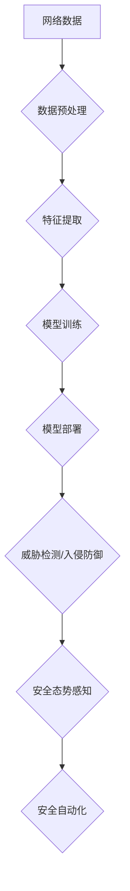

>  人工智能、网络安全、机器学习、深度学习、威胁检测、入侵防御、数据分析、安全态势感知

## 1. 背景介绍

网络安全已成为当今社会面临的重大挑战。随着互联网的快速发展和数字化转型进程的加速，网络攻击手段日益复杂，攻击者利用漏洞和技术手段不断突破安全防线，对个人、企业和国家安全构成严重威胁。传统安全防御方法难以有效应对新兴的网络威胁，迫切需要新的安全解决方案。

人工智能（AI）作为一门新兴技术，凭借其强大的数据处理能力、学习能力和决策能力，为网络安全领域带来了新的希望。AI技术能够帮助我们更好地理解网络攻击行为，提高安全检测和防御能力，构建更加智能化、自动化和可持续的网络安全体系。

## 2. 核心概念与联系

**2.1 网络安全与人工智能的融合**

网络安全与人工智能的融合，旨在利用人工智能技术增强网络安全防御能力。AI技术可以应用于网络安全各个环节，例如：

* **威胁检测：** 利用机器学习算法分析网络流量和系统日志，识别异常行为和潜在威胁。
* **入侵防御：** 基于深度学习模型构建入侵防御系统，实时检测和阻止恶意攻击。
* **安全态势感知：** 利用AI技术分析安全数据，构建全面的安全态势感知，帮助安全人员快速响应和处理安全事件。
* **安全自动化：** 利用AI技术自动化安全任务，例如漏洞扫描、安全配置管理和安全事件响应。

**2.2 核心概念原理和架构**



**2.3 AI技术在网络安全中的应用场景**

AI技术在网络安全中的应用场景广泛，包括：

* **企业网络安全：** 保护企业网络和数据免受攻击，例如入侵检测、防病毒、数据泄露防护等。
* **个人网络安全：** 保护个人设备和数据免受攻击，例如身份验证、密码管理、恶意软件防护等。
* **国家网络安全：** 保护国家关键基础设施和信息安全，例如网络攻击溯源、网络战防御等。

## 3. 核心算法原理 & 具体操作步骤

**3.1 算法原理概述**

在网络安全领域，常用的AI算法包括：

* **机器学习算法：** 
    * **监督学习：** 利用标记数据训练模型，例如分类、回归等。
    * **无监督学习：** 从未标记数据中发现模式，例如聚类、降维等。
    * **强化学习：** 通过奖励和惩罚机制训练模型，例如游戏AI、机器人控制等。
* **深度学习算法：** 
    * **卷积神经网络（CNN）：** 用于图像识别、视频分析等。
    * **循环神经网络（RNN）：** 用于序列数据处理，例如文本分析、语音识别等。
    * **生成对抗网络（GAN）：** 用于生成数据，例如图像生成、文本生成等。

**3.2 算法步骤详解**

以机器学习算法为例，其基本步骤如下：

1. **数据收集和预处理：** 收集网络安全相关数据，例如网络流量、系统日志、恶意代码等，并进行清洗、转换、特征提取等预处理操作。
2. **模型选择和训练：** 根据具体任务选择合适的机器学习算法，并利用训练数据训练模型，调整模型参数，使其能够准确识别网络威胁。
3. **模型评估和优化：** 利用测试数据评估模型性能，并根据评估结果对模型进行优化，例如调整模型参数、增加训练数据等。
4. **模型部署和应用：** 将训练好的模型部署到生产环境中，用于实时检测和防御网络威胁。

**3.3 算法优缺点**

**优点：**

* **自动化能力强：** AI算法能够自动学习和识别网络威胁，减少人工干预。
* **检测能力强：** AI算法能够识别传统安全工具难以检测到的新型威胁。
* **适应性强：** AI算法能够不断学习和进化，适应不断变化的网络威胁环境。

**缺点：**

* **数据依赖性强：** AI算法需要大量高质量的数据进行训练，否则性能会下降。
* **解释性差：** 一些AI算法的决策过程难以解释，难以理解模型是如何做出判断的。
* **可被攻击：** AI模型本身也可能受到攻击，例如数据 poisoning、模型攻击等。

**3.4 算法应用领域**

AI算法在网络安全领域应用广泛，例如：

* **入侵检测系统（IDS）：** 利用机器学习算法分析网络流量，识别恶意攻击行为。
* **入侵防御系统（IPS）：** 利用深度学习模型构建入侵防御系统，实时检测和阻止恶意攻击。
* **恶意软件检测系统：** 利用机器学习算法分析恶意软件样本，识别恶意软件特征。
* **安全态势感知系统：** 利用AI技术分析安全数据，构建全面的安全态势感知，帮助安全人员快速响应和处理安全事件。

## 4. 数学模型和公式 & 详细讲解 & 举例说明

**4.1 数学模型构建**

在网络安全领域，常用的数学模型包括：

* **贝叶斯网络：** 用于表示随机变量之间的依赖关系，可以用于威胁建模和风险评估。
* **Markov链：** 用于描述系统状态的转移概率，可以用于网络流量分析和攻击路径预测。
* **支持向量机（SVM）：** 用于分类和回归问题，可以用于恶意软件检测和入侵检测。

**4.2 公式推导过程**

以贝叶斯网络为例，其核心公式为：

$$P(A|B) = \frac{P(B|A)P(A)}{P(B)}$$

其中：

* $P(A|B)$ 表示在已知事件B发生的情况下，事件A发生的概率。
* $P(B|A)$ 表示在已知事件A发生的情况下，事件B发生的概率。
* $P(A)$ 表示事件A发生的概率。
* $P(B)$ 表示事件B发生的概率。

**4.3 案例分析与讲解**

假设我们想要预测网络攻击的发生概率，我们可以构建一个贝叶斯网络，其中节点表示事件，边表示事件之间的依赖关系。例如，我们可以将“网络流量异常”，“系统日志异常”，“用户行为异常”作为节点，并将它们连接起来，表示这些事件之间存在依赖关系。

通过收集历史数据，我们可以估计每个节点的概率分布以及节点之间依赖关系的强度。然后，我们可以利用贝叶斯公式计算网络攻击发生的概率。

## 5. 项目实践：代码实例和详细解释说明

**5.1 开发环境搭建**

* 操作系统：Ubuntu 20.04
* Python版本：3.8
* 必要的库：TensorFlow、Keras、NumPy、Pandas等

**5.2 源代码详细实现**

```python
import tensorflow as tf
from tensorflow.keras.models import Sequential
from tensorflow.keras.layers import Dense, Dropout

# 构建模型
model = Sequential()
model.add(Dense(128, activation='relu', input_shape=(10,)))
model.add(Dropout(0.2))
model.add(Dense(64, activation='relu'))
model.add(Dropout(0.2))
model.add(Dense(1, activation='sigmoid'))

# 编译模型
model.compile(optimizer='adam', loss='binary_crossentropy', metrics=['accuracy'])

# 训练模型
model.fit(X_train, y_train, epochs=10, batch_size=32)

# 评估模型
loss, accuracy = model.evaluate(X_test, y_test)
print('Loss:', loss)
print('Accuracy:', accuracy)
```

**5.3 代码解读与分析**

这段代码实现了基于深度学习的网络入侵检测模型。

* 首先，我们使用TensorFlow框架构建了一个多层感知机模型。
* 模型包含三个全连接层，每个层后都添加了ReLU激活函数和Dropout正则化层，以防止过拟合。
* 最后，模型输出层只有一个神经元，使用sigmoid激活函数，输出网络攻击发生的概率。
* 我们使用Adam优化器、二分类交叉熵损失函数和准确率作为评估指标训练模型。
* 训练完成后，我们使用测试数据评估模型的性能。

**5.4 运行结果展示**

训练完成后，我们可以观察模型的训练曲线和测试准确率，评估模型的性能。

## 6. 实际应用场景

**6.1 企业网络安全**

AI技术可以帮助企业构建更加智能化、自动化和可持续的网络安全体系。例如：

* **入侵检测：** 利用AI算法分析网络流量，识别恶意攻击行为，及时报警。
* **防病毒：** 利用AI算法分析恶意软件样本，识别新的病毒和恶意软件，及时更新防病毒数据库。
* **数据泄露防护：** 利用AI算法分析用户行为，识别数据泄露风险，及时采取措施保护数据安全。

**6.2 个人网络安全**

AI技术可以帮助个人保护个人设备和数据免受攻击。例如：

* **身份验证：** 利用AI算法识别用户的身份，提高身份验证的安全性。
* **密码管理：** 利用AI算法生成安全的密码，并提醒用户及时更换密码。
* **恶意软件防护：** 利用AI算法分析应用程序，识别恶意软件，保护个人设备免受攻击。

**6.3 国家网络安全**

AI技术可以帮助国家保护国家关键基础设施和信息安全。例如：

* **网络攻击溯源：** 利用AI算法分析网络攻击痕迹，追踪攻击源头，打击网络犯罪。
* **网络战防御：** 利用AI算法分析网络战攻击手段，构建防御体系，抵御网络战攻击。
* **网络安全态势感知：** 利用AI技术分析网络安全数据，构建全面的网络安全态势感知，帮助国家安全部门及时应对网络安全威胁。

**6.4 未来应用展望**

随着AI技术的不断发展，其在网络安全领域的应用将更加广泛和深入。例如：

* **主动防御：** 利用AI技术主动识别和防御网络威胁，而不是被动地响应攻击。
* **自动化安全运营：** 利用AI技术自动化安全任务，例如漏洞扫描、安全配置管理和安全事件响应。
* **个性化安全防护：** 利用AI技术根据用户的行为和需求，提供个性化的安全防护方案。

## 7. 工具和资源推荐

**7.1 学习资源推荐**

* **书籍：**
    * 《深度学习》
    * 《机器学习实战》
    * 《网络安全》
* **在线课程：**
    * Coursera：机器学习、深度学习
    * edX：网络安全
    * Udemy：AI在网络安全中的应用

**7.2 开发工具推荐**

* **TensorFlow：** 开源深度学习框架
* **Keras：** 高级API，用于构建和训练深度学习模型
* **PyTorch：** 开源深度学习框架
* **Scikit-learn：** 机器学习库

**7.3 相关论文推荐**

* **使用机器学习进行网络入侵检测的综述**
* **深度学习在网络安全中的应用**
* **AI驱动的网络安全：挑战和机遇**

## 8. 总结：未来发展趋势与挑战

**8.1 研究成果总结**

AI技术在网络安全领域取得了显著的成果，例如：

* **提高了网络威胁检测的准确率和效率。**
* **增强了网络安全防御能力。**
* **构建了更加智能化、自动化和可持续的网络安全体系。**

**8.2 未来发展趋势**

* **更强大的AI模型：** 随着AI技术的不断发展，我们将看到更强大、更智能的AI模型，能够识别更加复杂的网络威胁。
* **更广泛的应用场景：** AI技术将应用于更多网络安全领域，例如网络战防御、数据泄露防护、网络安全态势感知等