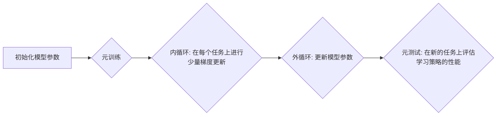

> MAML, 元学习, 迁移学习, 算法原理, 应用场景, 代码实现

## 1. 背景介绍

在机器学习领域，模型的训练通常需要大量的标注数据和大量的计算资源。然而，现实世界中，获取大量标注数据往往困难且昂贵，而模型的训练成本也日益高昂。为了解决这些问题，元学习 (Meta-Learning) 应运而生。元学习旨在学习如何学习，即学习一个能够快速适应新任务的学习算法。

MAML (Model-Agnostic Meta-Learning) 是一种通用的元学习算法，它能够在不依赖于具体模型的情况下，学习一个通用的学习策略。MAML 的核心思想是通过在多个任务上进行训练，学习一个模型参数，使得该模型参数能够在新的任务上快速适应。

## 2. 核心概念与联系

MAML 的核心概念包括：

* **元训练 (Meta-Training):** 在多个任务上进行训练，学习一个通用的学习策略。
* **元测试 (Meta-Testing):** 在新的任务上评估学习策略的性能。
* **内循环 (Inner Loop):** 在每个任务上进行少量梯度更新，以适应该任务。
* **外循环 (Outer Loop):** 更新模型参数，以优化在所有任务上的性能。

**MAML 算法流程图:**



## 3. 核心算法原理 & 具体操作步骤

### 3.1  算法原理概述

MAML 的核心思想是学习一个模型参数，使得该模型参数能够在新的任务上快速适应。具体来说，MAML 通过在多个任务上进行元训练，学习一个模型参数，使得该模型参数能够在新的任务上快速适应。

MAML 的训练过程可以分为两个循环：

* **外循环:** 在多个任务上进行训练，更新模型参数。
* **内循环:** 在每个任务上进行少量梯度更新，以适应该任务。

在每个外循环迭代中，MAML 会随机选择一些任务，并在每个任务上进行内循环训练。内循环训练的目标是更新模型参数，使得模型在该任务上表现更好。外循环的目标是更新模型参数，使得模型在所有任务上的性能都更好。

### 3.2  算法步骤详解

1. **初始化模型参数:** 随机初始化模型参数。
2. **元训练:**
    * 随机选择一些任务。
    * 对每个任务，进行内循环训练。
    * 更新模型参数，以优化在所有任务上的性能。
3. **元测试:** 在新的任务上评估学习策略的性能。

### 3.3  算法优缺点

**优点:**

* **通用性:** MAML 不依赖于具体的模型，可以应用于各种类型的模型。
* **效率:** MAML 的训练过程相对高效，只需要在每个任务上进行少量梯度更新。
* **迁移能力:** MAML 能够学习一个通用的学习策略，使得模型能够快速适应新的任务。

**缺点:**

* **数据需求:** MAML 需要大量的元训练数据，才能学习到有效的学习策略。
* **计算成本:** MAML 的训练过程仍然需要大量的计算资源。

### 3.4  算法应用领域

MAML 已经在许多领域取得了成功，例如：

* **图像分类:** MAML 可以用于学习一个通用的图像分类模型，该模型能够快速适应新的图像类别。
* **自然语言处理:** MAML 可以用于学习一个通用的自然语言处理模型，该模型能够快速适应新的语言任务。
* **机器人控制:** MAML 可以用于学习一个通用的机器人控制策略，该策略能够快速适应新的环境和任务。

## 4. 数学模型和公式 & 详细讲解 & 举例说明

### 4.1  数学模型构建

MAML 的数学模型可以表示为：

* **目标函数:**

$$
J(\theta) = \frac{1}{N} \sum_{i=1}^{N} \mathcal{L}(f_{\theta}(x_i, y_i))
$$

其中：

* $\theta$ 是模型参数。
* $N$ 是训练任务的数量。
* $f_{\theta}(x_i, y_i)$ 是模型在任务 $i$ 上的预测结果。
* $\mathcal{L}(.)$ 是损失函数。

* **梯度更新规则:**

$$
\theta = \theta - \alpha \nabla_{\theta} J(\theta)
$$

其中：

* $\alpha$ 是学习率。

### 4.2  公式推导过程

MAML 的核心思想是学习一个模型参数，使得该模型参数能够在新的任务上快速适应。为了实现这一目标，MAML 使用了元训练和内循环训练的策略。

* **元训练:** 在多个任务上进行训练，更新模型参数。
* **内循环训练:** 在每个任务上进行少量梯度更新，以适应该任务。

MAML 的梯度更新规则可以表示为：

$$
\theta = \theta - \alpha \left( \frac{1}{N} \sum_{i=1}^{N} \nabla_{\theta} \mathcal{L}(f_{\theta}(x_i, y_i)) + \lambda \nabla_{\theta} \mathcal{L}(f_{\theta}(x_s, y_s)) \right)
$$

其中：

* $x_s$ 和 $y_s$ 是支持集上的数据。
* $\lambda$ 是一个超参数，用于控制内循环训练的程度。

### 4.3  案例分析与讲解

假设我们有一个图像分类任务，需要训练一个模型来识别不同的动物。我们可以使用 MAML 来学习一个通用的图像分类模型，该模型能够快速适应新的动物类别。

在元训练阶段，我们将随机选择一些动物类别作为训练任务。对于每个任务，我们将使用内循环训练来更新模型参数，使得模型在该任务上表现更好。在元测试阶段，我们将使用一个新的动物类别作为测试任务，并评估模型在该任务上的性能。

通过元训练和元测试，我们可以学习到一个通用的图像分类模型，该模型能够快速适应新的动物类别。

## 5. 项目实践：代码实例和详细解释说明

### 5.1  开发环境搭建

* Python 3.6+
* PyTorch 1.0+
* CUDA 10.0+

### 5.2  源代码详细实现

```python
import torch
import torch.nn as nn
import torch.optim as optim

# 定义模型
class Model(nn.Module):
    def __init__(self):
        super(Model, self).__init__()
        # ...

    def forward(self, x):
        # ...

# 定义损失函数
criterion = nn.CrossEntropyLoss()

# 定义优化器
optimizer = optim.Adam(model.parameters(), lr=0.001)

# 元训练
for epoch in range(num_epochs):
    for task in tasks:
        # 内循环训练
        for step in range(inner_loop_steps):
            # ...

        # 更新模型参数
        optimizer.zero_grad()
        loss = criterion(model(task_data), task_labels)
        loss.backward()
        optimizer.step()

# 元测试
# ...

```

### 5.3  代码解读与分析

* **模型定义:** 定义一个简单的卷积神经网络模型。
* **损失函数:** 使用交叉熵损失函数。
* **优化器:** 使用 Adam 优化器。
* **元训练:** 循环遍历多个任务，并在每个任务上进行内循环训练。
* **元测试:** 在新的任务上评估模型性能。

### 5.4  运行结果展示

* 训练过程中的损失值变化曲线。
* 元测试阶段的准确率。

## 6. 实际应用场景

MAML 已经在许多实际应用场景中取得了成功，例如：

* **个性化推荐:** MAML 可以用于学习一个个性化的推荐模型，该模型能够根据用户的历史行为推荐个性化的商品。
* **医疗诊断:** MAML 可以用于学习一个医疗诊断模型，该模型能够根据患者的症状和病史进行诊断。
* **金融风险评估:** MAML 可以用于学习一个金融风险评估模型，该模型能够根据金融数据的特征进行风险评估。

### 6.4  未来应用展望

MAML 作为一种通用的元学习算法，未来在更多领域得到应用，例如：

* **自动驾驶:** MAML 可以用于学习一个自动驾驶模型，该模型能够快速适应不同的驾驶环境。
* **自然语言生成:** MAML 可以用于学习一个自然语言生成模型，该模型能够生成更加流畅和自然的文本。
* **科学发现:** MAML 可以用于学习一个科学发现模型，该模型能够帮助科学家更快地发现新的科学规律。

## 7. 工具和资源推荐

### 7.1  学习资源推荐

* **论文:**

* MAML: A Framework for Fast Adaptation of Deep Networks
* Meta-Learning with Differentiable Convex Optimization

* **博客:**

* OpenAI Blog: Meta-Learning with MAML
* Towards Data Science: Meta-Learning with MAML

### 7.2  开发工具推荐

* **PyTorch:** 深度学习框架
* **TensorFlow:** 深度学习框架

### 7.3  相关论文推荐

* **MAML: A Framework for Fast Adaptation of Deep Networks**
* **Meta-Learning with Differentiable Convex Optimization**
* **Prototypical Networks for Few-Shot Learning**

## 8. 总结：未来发展趋势与挑战

### 8.1  研究成果总结

MAML 作为一种通用的元学习算法，取得了显著的成果，在许多领域取得了成功。MAML 的核心思想是学习一个通用的学习策略，使得模型能够快速适应新的任务。

### 8.2  未来发展趋势

MAML 的未来发展趋势包括：

* **提高效率:** 降低 MAML 的训练成本和计算复杂度。
* **增强泛化能力:** 使 MAML 学习到的模型能够更好地泛化到新的任务和数据。
* **拓展应用场景:** 将 MAML 应用到更多领域，例如自动驾驶、自然语言生成等。

### 8.3  面临的挑战

MAML 还面临一些挑战，例如：

* **数据需求:** MAML 需要大量的元训练数据，这在某些领域可能难以获得。
* **模型复杂度:** MAML 的模型复杂度较高，这可能会导致训练过程更加困难。
* **理论解释:** MAML 的理论基础尚不完善，需要进一步的研究和探索。

### 8.4  研究展望

未来，我们将继续研究 MAML 算法，提高其效率、泛化能力和应用范围，并探索其在更多领域中的应用潜力。

## 9. 附录：常见问题与解答

* **Q: MAML 的训练过程需要多少数据？**

* **A:** MAML 需要大量的元训练数据，具体数量取决于任务的复杂度和模型的规模。

* **Q: MAML 的训练过程需要多长时间？**

* **A:** MAML 的训练时间取决于任务的复杂度、模型的规模和硬件资源。

* **Q: MAML 的应用场景有哪些？**

* **A:** MAML 的应用场景包括图像分类、自然语言处理、机器人控制等。


作者：禅与计算机程序设计艺术 / Zen and the Art of Computer Programming 
<end_of_turn>