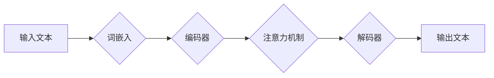

> 深度学习，自然语言处理，词嵌入，Transformer，BERT，GPT，语言模型，文本生成

## 1. 背景介绍

自然语言处理（NLP）是人工智能领域的一个重要分支，旨在使计算机能够理解、处理和生成人类语言。随着大数据时代的到来，以及深度学习技术的飞速发展，NLP领域取得了长足的进步。深度学习模型能够从海量文本数据中学习语言的复杂模式，从而实现更精准、更自然的语言理解和生成。

传统的NLP方法主要依赖于手工设计的特征工程，而深度学习方法则能够自动学习特征，从而提高模型的性能。近年来，基于深度学习的NLP模型取得了突破性的进展，例如BERT、GPT等模型在各种NLP任务中都取得了state-of-the-art的成绩。

## 2. 核心概念与联系

### 2.1 词嵌入

词嵌入是将单词映射到低维向量空间的技术，每个单词都对应一个唯一的向量表示。通过词嵌入，我们可以捕捉单词之间的语义关系，例如“国王”和“皇后”之间的关系，或者“猫”和“狗”之间的关系。

### 2.2 Transformer

Transformer是一种基于注意力机制的深度学习模型，它能够有效地处理长距离依赖关系，并取得了在机器翻译、文本摘要等任务上的优异性能。Transformer的结构主要包括编码器和解码器，编码器用于将输入文本编码成语义表示，解码器则根据编码后的表示生成输出文本。

### 2.3 语言模型

语言模型是能够预测下一个词出现的概率分布的模型。语言模型可以用于各种NLP任务，例如文本生成、机器翻译、语音识别等。

**Mermaid 流程图**



## 3. 核心算法原理 & 具体操作步骤

### 3.1 算法原理概述

深度学习模型的训练过程是通过反向传播算法来进行的。反向传播算法通过计算模型输出与真实值的误差，并根据误差反向传播到模型的各个参数，从而更新模型的参数，使模型的输出更加接近真实值。

### 3.2 算法步骤详解

1. **数据预处理:** 将原始文本数据进行清洗、分词、标记等预处理操作，使其能够被模型理解。
2. **模型构建:** 根据具体的NLP任务，选择合适的深度学习模型架构，例如Transformer、BERT等。
3. **模型训练:** 使用训练数据训练模型，通过反向传播算法更新模型参数，使模型的性能不断提高。
4. **模型评估:** 使用测试数据评估模型的性能，例如准确率、召回率、F1-score等指标。
5. **模型部署:** 将训练好的模型部署到实际应用场景中，例如聊天机器人、文本摘要系统等。

### 3.3 算法优缺点

**优点:**

* 自动学习特征，无需人工设计特征工程。
* 能够处理复杂的数据模式，例如长距离依赖关系。
* 在各种NLP任务中取得了state-of-the-art的性能。

**缺点:**

* 需要大量的训练数据。
* 训练过程耗时且耗资源。
* 模型解释性较差，难以理解模型的决策过程。

### 3.4 算法应用领域

深度学习在NLP领域有着广泛的应用，例如:

* **机器翻译:** 将一种语言翻译成另一种语言。
* **文本摘要:** 将长篇文本压缩成短篇摘要。
* **问答系统:** 回答用户提出的问题。
* **情感分析:** 分析文本的情感倾向。
* **文本生成:** 生成新的文本内容。

## 4. 数学模型和公式 & 详细讲解 & 举例说明

### 4.1 数学模型构建

Transformer模型的编码器和解码器分别由多层编码器块和解码器块组成，每个块包含多头注意力机制、前馈神经网络等模块。

**注意力机制:**

注意力机制能够学习文本中不同词语之间的关系，并赋予每个词语不同的权重。注意力机制的公式如下:

$$
Attention(Q, K, V) = softmax(\frac{QK^T}{\sqrt{d_k}})V
$$

其中，Q、K、V分别代表查询矩阵、键矩阵和值矩阵，$d_k$代表键向量的维度。

**前馈神经网络:**

前馈神经网络是一个多层感知机，它能够学习文本的复杂特征。前馈神经网络的公式如下:

$$
f(x) = \sigma(W_2 \sigma(W_1 x + b_1) + b_2)
$$

其中，$x$代表输入向量，$W_1$、$W_2$分别代表前馈神经网络的两层权重矩阵，$b_1$、$b_2$分别代表两层的偏置向量，$\sigma$代表激活函数。

### 4.2 公式推导过程

注意力机制的公式推导过程可以参考相关文献，例如Vaswani et al. (2017)的论文。

### 4.3 案例分析与讲解

BERT模型是基于Transformer架构的预训练语言模型，它在大量的文本数据上进行预训练，并能够在各种下游NLP任务中进行微调。BERT模型的预训练目标是预测句子中被遮盖的词语，从而学习到词语之间的语义关系。

## 5. 项目实践：代码实例和详细解释说明

### 5.1 开发环境搭建

使用Python语言和深度学习框架TensorFlow或PyTorch进行开发。

### 5.2 源代码详细实现

```python
# 使用TensorFlow构建一个简单的Transformer模型
import tensorflow as tf

# 定义编码器块
class EncoderBlock(tf.keras.layers.Layer):
    def __init__(self, d_model, num_heads, dff):
        super(EncoderBlock, self).__init__()
        self.mha = tf.keras.layers.MultiHeadAttention(num_heads=num_heads, key_dim=d_model)
        self.ffn = tf.keras.layers.Dense(dff, activation='relu')

    def call(self, inputs):
        attn_output = self.mha(inputs, inputs)
        ffn_output = self.ffn(attn_output)
        return ffn_output

# 定义解码器块
class DecoderBlock(tf.keras.layers.Layer):
    def __init__(self, d_model, num_heads, dff):
        super(DecoderBlock, self).__init__()
        self.mha = tf.keras.layers.MultiHeadAttention(num_heads=num_heads, key_dim=d_model)
        self.ffn = tf.keras.layers.Dense(dff, activation='relu')

    def call(self, inputs):
        attn_output = self.mha(inputs, inputs)
        ffn_output = self.ffn(attn_output)
        return ffn_output

# 定义Transformer模型
class Transformer(tf.keras.Model):
    def __init__(self, vocab_size, d_model, num_heads, dff, num_layers):
        super(Transformer, self).__init__()
        self.embedding = tf.keras.layers.Embedding(vocab_size, d_model)
        self.encoder = tf.keras.Sequential([EncoderBlock(d_model, num_heads, dff) for _ in range(num_layers)])
        self.decoder = tf.keras.Sequential([DecoderBlock(d_model, num_heads, dff) for _ in range(num_layers)])
        self.linear = tf.keras.layers.Dense(vocab_size)

    def call(self, inputs):
        embeddings = self.embedding(inputs)
        encoder_output = self.encoder(embeddings)
        decoder_output = self.decoder(encoder_output)
        logits = self.linear(decoder_output)
        return logits
```

### 5.3 代码解读与分析

代码实现了一个简单的Transformer模型，包括嵌入层、编码器、解码器和线性层。

### 5.4 运行结果展示

运行代码并使用训练数据训练模型，可以得到模型的训练和验证结果。

## 6. 实际应用场景

### 6.1 文本生成

利用深度学习模型生成各种文本内容，例如小说、诗歌、新闻报道等。

### 6.2 机器翻译

将一种语言翻译成另一种语言，例如将英文翻译成中文。

### 6.3 问答系统

根据用户提出的问题，从知识库中找到相应的答案。

### 6.4 情感分析

分析文本的情感倾向，例如判断文本是正面、负面还是中性。

### 6.5 文本摘要

将长篇文本压缩成短篇摘要，保留文本的主要信息。

## 7. 工具和资源推荐

### 7.1 学习资源推荐

* **书籍:**
    * 《深度学习》 by Ian Goodfellow, Yoshua Bengio, Aaron Courville
    * 《自然语言处理》 by Dan Jurafsky, James H. Martin
* **在线课程:**
    * Coursera: Natural Language Processing Specialization
    * Stanford CS224N: Natural Language Processing with Deep Learning

### 7.2 开发工具推荐

* **深度学习框架:** TensorFlow, PyTorch
* **自然语言处理库:** NLTK, spaCy, Gensim

### 7.3 相关论文推荐

* Attention Is All You Need (Vaswani et al., 2017)
* BERT: Pre-training of Deep Bidirectional Transformers for Language Understanding (Devlin et al., 2018)
* GPT-3: Language Models are Few-Shot Learners (Brown et al., 2020)

## 8. 总结：未来发展趋势与挑战

### 8.1 研究成果总结

深度学习在NLP领域取得了长足的进步，例如BERT、GPT等模型在各种NLP任务中都取得了state-of-the-art的成绩。

### 8.2 未来发展趋势

* **更强大的模型:** 研究更强大的语言模型，例如能够理解更复杂语言结构和语义关系的模型。
* **更广泛的应用:** 将深度学习应用到更多NLP领域，例如法律文本分析、医学文本理解等。
* **更可解释的模型:** 研究更可解释的深度学习模型，以便更好地理解模型的决策过程。

### 8.3 面临的挑战

* **数据稀缺:** 许多NLP任务的数据量仍然很小，这限制了模型的训练效果。
* **计算资源:** 训练大型深度学习模型需要大量的计算资源。
* **伦理问题:** 深度学习模型可能存在偏见和歧视问题，需要进行伦理审查和监管。

### 8.4 研究展望

未来，深度学习在NLP领域将继续取得突破性的进展，并应用于更多领域，为人类社会带来更多便利。

## 9. 附录：常见问题与解答

**Q1: 深度学习模型的训练需要多少数据？**

**A1:** 深度学习模型的训练数据量取决于模型的复杂度和任务的难度。一般来说，需要大量的训练数据才能训练出性能良好的模型。

**Q2: 如何评估深度学习模型的性能？**

**A2:** 深度学习模型的性能可以通过各种指标来评估，例如准确率、召回率、F1-score等。

**Q3: 深度学习模型的解释性如何？**

**A3:** 深度学习模型的解释性相对较差，难以理解模型的决策过程。


作者：禅与计算机程序设计艺术 / Zen and the Art of Computer Programming 
<end_of_turn>