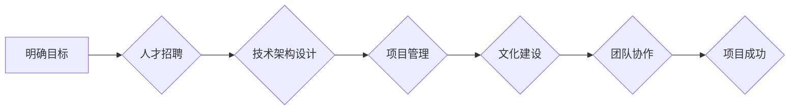

> 人工智能，创业，团队建设，人才招聘，技术架构，项目管理，文化建设

## 1. 背景介绍

人工智能（AI）正以惊人的速度发展，其应用领域不断拓展，为创业者带来了前所未有的机遇。然而，AI创业并非易事，成功的关键之一在于构建一支高效、专业的团队。

近年来，涌现出许多AI初创公司，但许多公司在团队建设方面遇到了挑战，导致项目进展缓慢、目标难以实现。因此，深入探讨AI创业团队建设策略，对于推动AI产业发展至关重要。

## 2. 核心概念与联系

**2.1 核心概念**

* **人工智能（AI）：** 指使计算机模拟人类智能行为的能力，包括学习、推理、决策、感知等。
* **创业团队：** 由一群具有共同目标和愿景的人员组成的团队，致力于开发和推广新产品或服务。
* **团队建设：** 指通过一系列的策略和措施，将团队成员凝聚在一起，形成高效协作的团队。

**2.2 联系**

AI创业团队建设的核心在于将AI技术与团队优势相结合，形成合力，实现商业目标。

**2.3  团队建设流程图**

## 3. 核心算法原理 & 具体操作步骤

**3.1 算法原理概述**

在AI创业团队建设中，需要运用多种算法和技术，例如机器学习、深度学习、自然语言处理等。这些算法的原理和应用直接影响团队的效率和成果。

**3.2 算法步骤详解**

* **机器学习：**
    1. 数据收集和预处理
    2. 模型选择
    3. 模型训练
    4. 模型评估和优化
    5. 模型部署

* **深度学习：**
    1. 数据收集和预处理
    2. 网络结构设计
    3. 模型训练
    4. 模型评估和优化
    5. 模型部署

* **自然语言处理：**
    1. 文本预处理
    2. 词汇向量化
    3. 模型训练
    4. 模型评估和优化
    5. 模型部署

**3.3 算法优缺点**

* **机器学习：**
    * 优点：能够从数据中学习，不断改进模型性能。
    * 缺点：需要大量的数据进行训练，对数据质量要求高。

* **深度学习：**
    * 优点：能够处理复杂的数据，学习更深层次的特征。
    * 缺点：训练时间长，计算资源需求高。

* **自然语言处理：**
    * 优点：能够理解和处理人类语言。
    * 缺点：语义理解能力有限，容易受到上下文的影响。

**3.4 算法应用领域**

* **机器学习：**
    * 预测分析
    * 欺诈检测
    * 个性化推荐

* **深度学习：**
    * 图像识别
    * 语音识别
    * 机器翻译

* **自然语言处理：**
    * 聊天机器人
    * 文本摘要
    * 情感分析

## 4. 数学模型和公式 & 详细讲解 & 举例说明

**4.1 数学模型构建**

在AI创业团队建设中，可以使用数学模型来分析和优化团队绩效。例如，可以使用线性回归模型来预测团队产出与成员数量之间的关系。

**4.2 公式推导过程**

假设团队产出为Y，成员数量为X，则线性回归模型的公式为：

$$Y = a + bX$$

其中，a为截距，b为斜率。

**4.3 案例分析与讲解**

假设一个AI创业团队有5名成员，他们的产出为10个产品。如果增加一名成员，团队的产出增加到12个产品。

可以使用线性回归模型来计算a和b的值。

**4.4 举例说明**

假设a = 2，b = 1.6，则团队产出的预测公式为：

$$Y = 2 + 1.6X$$

如果团队成员数量增加到7人，则预测产出为：

$$Y = 2 + 1.6 * 7 = 12.2$$

## 5. 项目实践：代码实例和详细解释说明

**5.1 开发环境搭建**

AI创业团队需要搭建一个合适的开发环境，包括硬件、软件和网络等。

**5.2 源代码详细实现**

可以使用Python语言编写AI算法的源代码。

**5.3 代码解读与分析**

需要对源代码进行详细解读和分析，了解算法的实现原理和逻辑。

**5.4 运行结果展示**

需要运行代码并展示结果，验证算法的正确性和有效性。

## 6. 实际应用场景

**6.1 医疗保健**

AI可以用于辅助诊断、预测疾病风险、个性化治疗方案等。

**6.2 金融服务**

AI可以用于欺诈检测、风险评估、投资决策等。

**6.3 制造业**

AI可以用于预测性维护、质量控制、生产优化等。

**6.4 未来应用展望**

AI的应用场景将不断拓展，未来将对各个行业产生深远影响。

## 7. 工具和资源推荐

**7.1 学习资源推荐**

* 在线课程：Coursera、edX、Udacity
* 书籍：深度学习、机器学习实战

**7.2 开发工具推荐**

* Python：机器学习和深度学习的常用语言
* TensorFlow：深度学习框架
* PyTorch：深度学习框架

**7.3 相关论文推荐**

* ImageNet Classification with Deep Convolutional Neural Networks
* Attention Is All You Need

## 8. 总结：未来发展趋势与挑战

**8.1 研究成果总结**

AI技术取得了长足进步，在各个领域都有了广泛应用。

**8.2 未来发展趋势**

* AI技术将更加智能化、自动化
* AI应用场景将更加广泛
* AI伦理和安全问题将更加重要

**8.3 面临的挑战**

* 数据获取和隐私保护
* 计算资源需求
* 算法解释性和可信度

**8.4 研究展望**

未来需要继续加强AI基础研究，解决算法的局限性，提高AI的安全性、可靠性和可解释性。

## 9. 附录：常见问题与解答

**9.1 如何招聘AI人才？**

* 通过招聘平台、高校招聘会等渠道寻找人才
* 关注AI领域的专业论坛和社群
* 建立良好的企业文化，吸引人才

**9.2 如何构建高效的AI团队？**

* 明确团队目标和职责
* 建立良好的沟通机制
* 鼓励团队成员之间的协作和学习

**9.3 如何评估AI团队的绩效？**

* 设定明确的绩效指标
* 定期评估团队成员的贡献
* 及时反馈和改进

作者：禅与计算机程序设计艺术 / Zen and the Art of Computer Programming

<end_of_turn>