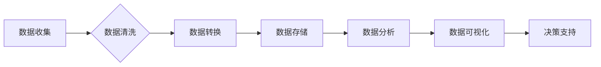

> 人工智能，数据管理，数据存储，数据处理，数据分析，机器学习，深度学习，数据可视化

## 1. 背景介绍

人工智能（AI）正以惊人的速度发展，并深刻地改变着我们生活的方方面面。从自动驾驶汽车到个性化推荐系统，AI技术正在各个领域展现出巨大的潜力。然而，AI技术的成功离不开高质量的数据支撑。数据是AI算法的燃料，是训练模型、发现模式和做出预测的关键要素。

对于人工智能创业者来说，数据管理是一个至关重要的挑战。如何有效地收集、存储、处理和分析海量数据，是决定AI项目成败的关键因素。本文将深入探讨人工智能创业中数据管理的技巧，帮助创业者更好地利用数据资源，推动AI项目的成功。

## 2. 核心概念与联系

**2.1 数据管理的核心概念**

数据管理是指规划、组织、存储、保护和利用数据资源的整个过程。在人工智能创业中，数据管理涵盖以下几个核心概念：

* **数据收集:** 从各种来源收集相关数据，例如传感器数据、用户行为数据、文本数据等。
* **数据存储:** 选择合适的存储系统，例如数据库、文件系统、云存储等，安全可靠地存储数据。
* **数据处理:** 对收集到的数据进行清洗、转换、整合等操作，使其符合AI算法的输入要求。
* **数据分析:** 利用统计学、机器学习等方法对数据进行分析，发现隐藏的模式和趋势。
* **数据可视化:** 将数据以图表、图形等形式呈现，方便理解和决策。

**2.2 数据管理与人工智能的关系**

数据管理是人工智能的核心基础。AI算法需要大量的数据进行训练和测试，才能有效地学习和预测。数据管理的质量直接影响着AI模型的性能和准确性。

**2.3 数据管理流程图**



## 3. 核心算法原理 & 具体操作步骤

**3.1 算法原理概述**

在人工智能创业中，数据管理通常涉及到以下核心算法：

* **数据清洗算法:** 用于处理数据中的缺失值、异常值、重复值等问题，提高数据质量。常见的算法包括均值填充、中位数填充、删除异常值等。
* **数据转换算法:** 用于将数据转换为AI算法所需的格式，例如将文本数据转换为数字向量。常见的算法包括词袋模型、TF-IDF、Word2Vec等。
* **数据聚类算法:** 用于将数据按照相似性进行分组，发现数据中的潜在结构。常见的算法包括K-means聚类、层次聚类等。
* **数据降维算法:** 用于减少数据维度，提高计算效率和数据可视化效果。常见的算法包括主成分分析（PCA）、线性判别分析（LDA）等。

**3.2 算法步骤详解**

以数据清洗算法为例，详细说明其操作步骤：

1. **数据导入:** 将原始数据导入到数据处理系统中。
2. **缺失值处理:** 识别数据中的缺失值，并选择合适的填充方法，例如均值填充、中位数填充等。
3. **异常值处理:** 识别数据中的异常值，并选择合适的处理方法，例如删除异常值、替换异常值等。
4. **重复值处理:** 识别数据中的重复值，并选择合适的处理方法，例如删除重复值、保留唯一值等。
5. **数据转换:** 将数据转换为AI算法所需的格式，例如将文本数据转换为数字向量。
6. **数据输出:** 将处理后的数据输出到指定位置。

**3.3 算法优缺点**

不同的数据管理算法具有不同的优缺点，需要根据实际情况选择合适的算法。例如，K-means聚类算法简单易用，但对数据分布敏感；PCA算法降维效果好，但可能会丢失部分信息。

**3.4 算法应用领域**

数据管理算法广泛应用于人工智能创业的各个领域，例如：

* **推荐系统:** 利用数据聚类和降维算法，推荐用户感兴趣的内容。
* **个性化营销:** 利用数据分析和可视化，进行精准营销。
* **风险控制:** 利用数据清洗和异常值检测，识别潜在风险。
* **智能客服:** 利用自然语言处理和机器学习，提供智能客服服务。

## 4. 数学模型和公式 & 详细讲解 & 举例说明

**4.1 数学模型构建**

数据管理算法通常基于数学模型进行构建。例如，K-means聚类算法的数学模型可以表示为：

* **目标函数:** 
$$
J = \sum_{i=1}^{k} \sum_{x \in C_i} ||x - \mu_i||^2
$$

其中，$J$ 是目标函数，$k$ 是聚类数，$C_i$ 是第 $i$ 个聚类，$x$ 是数据点，$\mu_i$ 是第 $i$ 个聚类的中心点。

* **优化目标:** 找到使目标函数最小的聚类中心点。

**4.2 公式推导过程**

K-means聚类算法的优化过程通常采用迭代算法，不断更新聚类中心点，直到目标函数收敛。

**4.3 案例分析与讲解**

假设我们有一组数据点，需要将其聚类成3个簇。我们可以使用K-means算法进行聚类。首先，随机选择3个数据点作为初始聚类中心点。然后，将每个数据点分配到最近的聚类中心点。更新每个聚类中心点的坐标为该聚类中所有数据点的平均值。重复以上步骤，直到聚类中心点不再变化。

## 5. 项目实践：代码实例和详细解释说明

**5.1 开发环境搭建**

* 操作系统：Linux/macOS/Windows
* Python版本：3.6+
* 必要的库：pandas, numpy, scikit-learn

**5.2 源代码详细实现**

```python
import pandas as pd
from sklearn.cluster import KMeans

# 加载数据
data = pd.read_csv('data.csv')

# 选择特征列
features = data[['feature1', 'feature2', 'feature3']]

# 创建KMeans模型
kmeans = KMeans(n_clusters=3, random_state=0)

# 训练模型
kmeans.fit(features)

# 获取聚类标签
labels = kmeans.labels_

# 将聚类标签添加到数据中
data['cluster'] = labels

# 保存结果
data.to_csv('data_clustered.csv', index=False)
```

**5.3 代码解读与分析**

* 首先，我们使用pandas库加载数据，并选择需要进行聚类的特征列。
* 然后，我们使用scikit-learn库中的KMeans算法创建模型，并设置聚类数为3。
* 接着，我们使用fit()方法训练模型，并将聚类标签存储在labels变量中。
* 最后，我们将聚类标签添加到原始数据中，并保存结果到新的CSV文件。

**5.4 运行结果展示**

运行代码后，我们将得到一个新的CSV文件，其中包含了原始数据和聚类标签。我们可以使用数据可视化工具，例如matplotlib或seaborn，将数据进行可视化，观察聚类结果。

## 6. 实际应用场景

**6.1 客户画像分析**

电商平台可以利用数据管理技术，对客户进行画像分析，了解客户的消费习惯、偏好和行为模式，从而提供更精准的个性化推荐和营销服务。

**6.2 欺诈检测**

金融机构可以利用数据管理技术，对交易数据进行分析，识别潜在的欺诈行为，降低风险。

**6.3 医疗诊断辅助**

医疗机构可以利用数据管理技术，对患者的病历数据进行分析，辅助医生进行诊断，提高诊断准确率。

**6.4 未来应用展望**

随着人工智能技术的不断发展，数据管理技术将在更多领域得到应用，例如：

* **自动驾驶:** 利用数据管理技术，训练自动驾驶汽车的感知和决策模型。
* **智能制造:** 利用数据管理技术，优化生产流程，提高生产效率。
* **智慧城市:** 利用数据管理技术，收集和分析城市数据，提高城市管理水平。

## 7. 工具和资源推荐

**7.1 学习资源推荐**

* **书籍:**
    * 《数据科学实战》
    * 《Python数据分析》
    * 《机器学习实战》
* **在线课程:**
    * Coursera: 数据科学
    * edX: 机器学习
    * Udacity: 数据分析

**7.2 开发工具推荐**

* **数据处理:** pandas, numpy
* **机器学习:** scikit-learn, TensorFlow, PyTorch
* **数据可视化:** matplotlib, seaborn

**7.3 相关论文推荐**

* K-means聚类算法的论文
* 数据清洗算法的论文
* 数据降维算法的论文

## 8. 总结：未来发展趋势与挑战

**8.1 研究成果总结**

数据管理技术在人工智能创业中发挥着至关重要的作用。通过有效的收集、存储、处理和分析数据，我们可以训练更准确的AI模型，开发更智能的应用。

**8.2 未来发展趋势**

未来，数据管理技术将朝着以下几个方向发展：

* **自动化:** 利用人工智能技术，自动完成数据清洗、转换和分析等任务。
* **智能化:** 利用机器学习技术，智能地识别和处理数据中的异常值和模式。
* **可解释性:** 提高数据管理算法的可解释性，使人类能够更好地理解算法的决策过程。

**8.3 面临的挑战**

数据管理技术也面临着一些挑战：

* **数据量爆炸:** 数据量的不断增长，给数据存储和处理带来了挑战。
* **数据质量问题:** 数据中的噪声、缺失值和异常值，会影响AI模型的性能。
* **数据安全和隐私:** 如何保护数据安全和隐私，是一个重要的伦理问题。

**8.4 研究展望**

未来，我们需要继续研究和开发更先进的数据管理技术，以应对数据量爆炸、数据质量问题和数据安全隐私等挑战。


## 9. 附录：常见问题与解答

**9.1 如何选择合适的聚类算法？**

选择合适的聚类算法需要根据数据的特点和应用场景进行选择。例如，对于数据分布较为均匀的情况，K-means算法是一个不错的选择；对于数据分布较为复杂的情况，层次聚类算法可能更合适。

**9.2 如何处理数据中的缺失值？**

处理数据中的缺失值的方法有很多，例如均值填充、中位数填充、删除缺失值等。选择合适的填充方法需要根据数据的特点和缺失值的比例进行判断。

**9.3 如何评估聚类结果的质量？**

评估聚类结果的质量可以使用多种指标，例如Silhouette score、Dunn index等。这些指标可以衡量聚类结果的紧密性和分离度。

**9.4 如何保护数据安全和隐私？**

保护数据安全和隐私需要采取多种措施，例如数据加密、访问控制、匿名化等。


作者：禅与计算机程序设计艺术 / Zen and the Art of Computer Programming 
<end_of_turn>