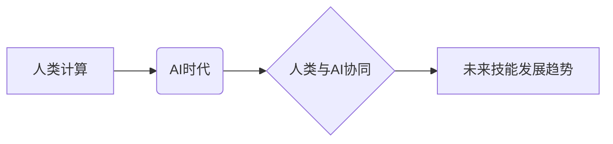

> 人工智能，未来技能，计算能力，数据分析，机器学习，深度学习，编程，软件开发，职业发展

## 1. 背景介绍

人工智能（AI）正在以惊人的速度发展，深刻地改变着我们的生活和工作方式。从自动驾驶汽车到智能医疗，从个性化教育到金融风险管理，AI技术的应用领域日益广泛。然而，AI的发展也带来了新的挑战，即如何培养具备应对未来技术变革所需技能的人才。

传统的教育模式和职业培训体系难以适应AI时代的需求。我们需要重新思考如何培养具备跨学科知识、批判性思维、解决问题能力和适应性强的未来人才。

## 2. 核心概念与联系

**2.1 人类计算**

人类计算是指利用人类的认知能力和创造力来解决复杂问题，并进行创新。它强调人类的智慧、经验和情感在解决问题和创造价值中的重要作用。

**2.2 AI时代的人类计算**

在AI时代，人类计算不再局限于传统的思维方式和操作模式。AI技术可以辅助人类进行计算、分析和决策，从而提升人类计算的效率和准确性。

**2.3 人类与AI的协同**

AI时代，人类和AI将形成紧密的协作关系。人类负责制定目标、提供创意和进行决策，而AI负责提供数据分析、模型预测和自动化执行等支持。

**2.4 未来技能发展趋势**

AI时代，未来人才需要具备以下核心技能：

* **数据分析和解读能力:** 能够从海量数据中提取有价值的信息，并进行分析和解读。
* **机器学习和深度学习基础:** 了解机器学习和深度学习的基本原理和应用，能够利用AI工具进行数据分析和预测。
* **编程和软件开发能力:** 能够编写代码，开发软件应用程序，并进行软件测试和维护。
* **批判性思维和解决问题能力:** 能够独立思考，分析问题，并提出有效的解决方案。
* **跨学科知识和沟通能力:** 能够整合不同领域的知识，并与不同背景的人进行有效沟通。

**2.5 核心概念关系图**



## 3. 核心算法原理 & 具体操作步骤

**3.1 算法原理概述**

机器学习算法是AI的核心技术之一，它能够通过学习数据样本，自动发现数据中的模式和规律，并进行预测或分类。常见的机器学习算法包括：

* **线性回归:** 用于预测连续数值型变量。
* **逻辑回归:** 用于预测分类型变量。
* **决策树:** 用于分类和回归问题，通过树状结构进行决策。
* **支持向量机:** 用于分类问题，寻找最佳的分隔超平面。
* **神经网络:** 能够模拟人脑神经网络结构，用于复杂模式识别和预测。

**3.2 算法步骤详解**

以线性回归为例，其算法步骤如下：

1. **数据准备:** 收集和预处理数据，将数据转换为机器学习算法可以理解的格式。
2. **模型训练:** 使用训练数据训练线性回归模型，找到最佳的模型参数。
3. **模型评估:** 使用测试数据评估模型的性能，例如预测准确率、平均绝对误差等。
4. **模型调优:** 根据评估结果，调整模型参数，提高模型性能。
5. **模型部署:** 将训练好的模型部署到实际应用场景中，用于预测或分类。

**3.3 算法优缺点**

* **优点:** 能够自动学习数据模式，无需人工特征工程；性能优良，能够处理大规模数据。
* **缺点:** 算法复杂，需要大量的计算资源；对数据质量要求高，数据偏差会影响模型性能。

**3.4 算法应用领域**

机器学习算法广泛应用于各个领域，例如：

* **图像识别:** 人脸识别、物体检测、图像分类。
* **自然语言处理:** 文本分类、情感分析、机器翻译。
* **推荐系统:** 商品推荐、内容推荐、用户画像。
* **金融预测:** 股票预测、信用风险评估、欺诈检测。

## 4. 数学模型和公式 & 详细讲解 & 举例说明

**4.1 数学模型构建**

线性回归模型的数学模型如下：

$$
y = \theta_0 + \theta_1x_1 + \theta_2x_2 + ... + \theta_nx_n + \epsilon
$$

其中：

* $y$ 是预测值。
* $\theta_0, \theta_1, ..., \theta_n$ 是模型参数。
* $x_1, x_2, ..., x_n$ 是输入特征。
* $\epsilon$ 是误差项。

**4.2 公式推导过程**

线性回归模型的目标是找到最佳的模型参数，使得预测值与真实值之间的误差最小。常用的误差函数是均方误差（MSE）：

$$
MSE = \frac{1}{n} \sum_{i=1}^{n} (y_i - \hat{y}_i)^2
$$

其中：

* $n$ 是样本数量。
* $y_i$ 是真实值。
* $\hat{y}_i$ 是预测值。

通过最小化MSE，可以得到最佳的模型参数。

**4.3 案例分析与讲解**

假设我们想要预测房屋价格，输入特征包括房屋面积、房间数量、地理位置等。我们可以使用线性回归模型训练一个预测模型，并根据模型预测，估算不同房屋的价格。

## 5. 项目实践：代码实例和详细解释说明

**5.1 开发环境搭建**

可以使用Python语言和相关的机器学习库，例如Scikit-learn，进行项目实践。

**5.2 源代码详细实现**

```python
from sklearn.linear_model import LinearRegression
from sklearn.model_selection import train_test_split
import pandas as pd

# 加载数据
data = pd.read_csv('house_price.csv')

# 划分训练集和测试集
X = data[['area', 'rooms']]
y = data['price']
X_train, X_test, y_train, y_test = train_test_split(X, y, test_size=0.2, random_state=42)

# 创建线性回归模型
model = LinearRegression()

# 训练模型
model.fit(X_train, y_train)

# 预测测试集数据
y_pred = model.predict(X_test)

# 评估模型性能
from sklearn.metrics import mean_squared_error
mse = mean_squared_error(y_test, y_pred)
print(f'Mean Squared Error: {mse}')
```

**5.3 代码解读与分析**

* 首先，加载数据并划分训练集和测试集。
* 然后，创建线性回归模型并训练模型。
* 接着，使用训练好的模型预测测试集数据。
* 最后，评估模型性能，例如使用均方误差（MSE）来衡量预测精度。

**5.4 运行结果展示**

运行代码后，会输出模型的均方误差值，表示模型预测的准确性。

## 6. 实际应用场景

**6.1 房屋价格预测**

使用机器学习算法可以预测房屋价格，帮助房地产经纪人、买家和卖家进行更明智的决策。

**6.2 股票价格预测**

使用机器学习算法可以分析股票市场数据，预测股票价格走势，帮助投资者进行投资决策。

**6.3 医疗诊断辅助**

使用机器学习算法可以分析患者的医疗数据，辅助医生进行疾病诊断和治疗方案制定。

**6.4 欺诈检测**

使用机器学习算法可以分析交易数据，识别异常交易行为，帮助金融机构进行欺诈检测。

**6.5 未来应用展望**

随着AI技术的不断发展，机器学习算法将在更多领域得到应用，例如自动驾驶、个性化教育、智能制造等。

## 7. 工具和资源推荐

**7.1 学习资源推荐**

* **在线课程:** Coursera、edX、Udacity 等平台提供丰富的机器学习课程。
* **书籍:** 《机器学习》 (周志华)、《深度学习》 (Ian Goodfellow) 等书籍。
* **开源库:** Scikit-learn、TensorFlow、PyTorch 等开源库。

**7.2 开发工具推荐**

* **Python:** 机器学习开发的常用语言。
* **Jupyter Notebook:** 用于代码编写、数据分析和可视化。
* **Git:** 用于代码版本控制。

**7.3 相关论文推荐**

* **《机器学习》 (周志华)**
* **《深度学习》 (Ian Goodfellow)**
* **《神经网络与深度学习》 (Michael Nielsen)**

## 8. 总结：未来发展趋势与挑战

**8.1 研究成果总结**

AI技术在各个领域取得了显著的成果，例如图像识别、自然语言处理、语音识别等。机器学习算法成为AI的核心技术之一，并取得了广泛应用。

**8.2 未来发展趋势**

* **模型规模和复杂度提升:** 未来AI模型将更加庞大，更加复杂，能够处理更复杂的任务。
* **跨模态学习:** AI模型将能够处理多种数据类型，例如文本、图像、音频等。
* **解释性AI:** 研究如何使AI模型更加透明，能够解释其决策过程。
* **联邦学习:** 研究如何在不共享原始数据的情况下进行模型训练。

**8.3 面临的挑战**

* **数据安全和隐私保护:** AI模型训练需要大量数据，如何保证数据安全和隐私保护是一个重要挑战。
* **算法偏见:** AI模型可能存在算法偏见，导致不公平的结果。
* **伦理问题:** AI技术的应用可能带来伦理问题，例如自动驾驶汽车的决策问题。

**8.4 研究展望**

未来，AI研究将继续朝着更智能、更安全、更可解释的方向发展。我们需要加强跨学科合作，解决AI技术带来的挑战，并将其应用于人类社会发展。

## 9. 附录：常见问题与解答

**9.1 如何学习机器学习？**

可以参考上述学习资源推荐，选择适合自己的学习方式。

**9.2 如何选择合适的机器学习算法？**

需要根据具体问题和数据特点选择合适的算法。

**9.3 如何解决机器学习算法的偏见问题？**

可以通过数据预处理、算法设计和模型评估等方式来解决算法偏见问题。


作者：禅与计算机程序设计艺术 / Zen and the Art of Computer Programming 
<end_of_turn>