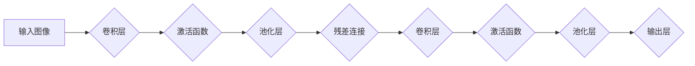

> ResNet, 深度学习, 计算机视觉, 图像分类, 微调, CIFAR-10, 深度神经网络, 迁移学习

## 1. 背景介绍

深度学习近年来在计算机视觉领域取得了突破性的进展，尤其是在图像分类任务上。ResNet（Residual Network）作为一种经典的深度卷积神经网络架构，凭借其残差连接的设计，有效解决了深度网络训练中的梯度消失问题，使得网络能够训练更深，学习更复杂的特征。

CIFAR-10数据集是一个常用的图像分类数据集，包含10个类别（飞机、汽车、鸟类、猫、鹿、狗、船、卡车、猫头鹰、青蛙）的60000张彩色图像，每张图像大小为32x32像素。该数据集规模相对较小，但对于初学者来说非常适合学习和实践深度学习模型的训练和微调。

本篇文章将从零开始，带领读者一步步构建一个ResNet模型，并使用CIFAR-10数据集进行训练和微调，帮助读者深入理解ResNet的原理和应用。

## 2. 核心概念与联系

### 2.1 深度学习与卷积神经网络

深度学习是一种机器学习的子领域，它利用多层神经网络来学习数据中的复杂模式。卷积神经网络（CNN）是一种专门用于处理图像数据的深度学习模型，它利用卷积操作来提取图像特征，并通过池化操作来降低特征图的维度，从而提高模型的鲁棒性和泛化能力。

### 2.2 ResNet架构

ResNet的创新之处在于引入了残差连接（Residual Connection），它将网络的输入直接连接到网络的输出，从而缓解了梯度消失问题，使得网络能够训练更深。残差连接可以看作是一种捷径，它允许网络学习残差信息，即输入到输出之间的差异。

### 2.3 迁移学习

迁移学习是一种利用预训练模型来解决新任务的技术。在图像分类任务中，我们可以使用在ImageNet等大型数据集上预训练的ResNet模型，将其作为基础模型，并对模型进行微调，使其能够适应CIFAR-10数据集。

**ResNet架构流程图**



## 3. 核心算法原理 & 具体操作步骤

### 3.1  算法原理概述

ResNet的核心算法原理是残差连接。残差连接将网络的输入直接连接到网络的输出，从而使得网络能够学习残差信息，即输入到输出之间的差异。残差连接可以看作是一种捷径，它允许网络学习更深层的特征，并缓解梯度消失问题。

### 3.2  算法步骤详解

1. **输入图像预处理:** 将输入图像调整到模型所需的尺寸和数据类型。
2. **卷积层:** 使用卷积核对图像进行卷积操作，提取图像特征。
3. **激活函数:** 使用激活函数（如ReLU）对卷积层的输出进行非线性变换，增加模型的表达能力。
4. **池化层:** 使用池化操作（如最大池化）对特征图进行降维，提高模型的鲁棒性和泛化能力。
5. **残差连接:** 将网络的输入直接连接到网络的输出，形成残差连接。
6. **输出层:** 使用全连接层对最终的特征进行分类，输出预测结果。

### 3.3  算法优缺点

**优点:**

* 能够训练更深的网络，学习更复杂的特征。
* 缓解了梯度消失问题，提高了模型的训练效率。
* 在图像分类任务上取得了优异的性能。

**缺点:**

* 模型结构复杂，参数量较大。
* 训练时间较长。

### 3.4  算法应用领域

ResNet在图像分类、目标检测、图像分割等计算机视觉任务中得到了广泛应用。

## 4. 数学模型和公式 & 详细讲解 & 举例说明

### 4.1  数学模型构建

ResNet的数学模型可以表示为一个多层卷积神经网络，其中每一层包含卷积层、激活函数和池化层。残差连接则是在每一层之间添加的捷径。

### 4.2  公式推导过程

ResNet的残差连接可以表示为：

$$
F(x) = H(x) + x
$$

其中：

* $F(x)$ 是残差连接的输出。
* $H(x)$ 是卷积层、激活函数和池化层的输出。
* $x$ 是网络的输入。

### 4.3  案例分析与讲解

假设我们有一个输入图像 $x$，经过卷积层、激活函数和池化层后，得到特征图 $H(x)$。然后，我们将 $H(x)$ 与输入图像 $x$ 相加，得到残差连接的输出 $F(x)$。

## 5. 项目实践：代码实例和详细解释说明

### 5.1  开发环境搭建

本项目使用Python语言和TensorFlow框架进行开发。需要安装Python、TensorFlow和必要的库。

### 5.2  源代码详细实现

```python
import tensorflow as tf
from tensorflow.keras.models import Sequential
from tensorflow.keras.layers import Conv2D, MaxPooling2D, Flatten, Dense, Activation

# 定义ResNet模型
def build_resnet(input_shape):
    model = Sequential()
    model.add(Conv2D(32, (3, 3), activation='relu', input_shape=input_shape))
    model.add(MaxPooling2D((2, 2)))
    model.add(Conv2D(64, (3, 3), activation='relu'))
    model.add(MaxPooling2D((2, 2)))
    model.add(Flatten())
    model.add(Dense(10, activation='softmax'))
    return model

# 加载CIFAR-10数据集
(x_train, y_train), (x_test, y_test) = tf.keras.datasets.cifar10.load_data()

# 数据预处理
x_train = x_train.astype('float32') / 255
x_test = x_test.astype('float32') / 255

# 构建模型
model = build_resnet(input_shape=(32, 32, 3))

# 编译模型
model.compile(optimizer='adam',
              loss='sparse_categorical_crossentropy',
              metrics=['accuracy'])

# 训练模型
model.fit(x_train, y_train, epochs=10, batch_size=32)

# 评估模型
loss, accuracy = model.evaluate(x_test, y_test)
print('Test Loss:', loss)
print('Test Accuracy:', accuracy)
```

### 5.3  代码解读与分析

* **模型构建:** 使用`Sequential`类构建一个顺序模型，并添加卷积层、池化层、扁平化层和全连接层。
* **数据加载:** 使用`tf.keras.datasets.cifar10.load_data()`函数加载CIFAR-10数据集。
* **数据预处理:** 将图像数据转换为浮点数，并归一化到[0, 1]之间。
* **模型编译:** 使用`adam`优化器、`sparse_categorical_crossentropy`损失函数和`accuracy`指标编译模型。
* **模型训练:** 使用`model.fit()`函数训练模型，指定训练轮数和批处理大小。
* **模型评估:** 使用`model.evaluate()`函数评估模型在测试集上的性能。

### 5.4  运行结果展示

训练完成后，模型将输出测试集上的损失值和准确率。

## 6. 实际应用场景

ResNet在图像分类任务中有着广泛的应用场景，例如：

* **物体识别:** 用于识别图像中的物体，例如人脸识别、车辆识别、场景识别等。
* **图像检索:** 用于根据图像内容检索相似的图像。
* **医疗诊断:** 用于辅助医生诊断疾病，例如识别肿瘤、肺炎等。

### 6.4  未来应用展望

随着深度学习技术的不断发展，ResNet模型的应用场景将会更加广泛，例如：

* **视频分析:** 用于分析视频内容，例如动作识别、事件检测等。
* **自然语言处理:** 用于处理文本数据，例如文本分类、情感分析等。
* **自动驾驶:** 用于辅助自动驾驶系统进行决策，例如目标检测、路径规划等。

## 7. 工具和资源推荐

### 7.1  学习资源推荐

* **书籍:**
    * Deep Learning by Ian Goodfellow, Yoshua Bengio, and Aaron Courville
    * Hands-On Machine Learning with Scikit-Learn, Keras & TensorFlow by Aurélien Géron
* **在线课程:**
    * Deep Learning Specialization by Andrew Ng on Coursera
    * Fast.ai Deep Learning Course

### 7.2  开发工具推荐

* **TensorFlow:** 一个开源的机器学习框架。
* **Keras:** 一个基于TensorFlow的高级API，用于构建和训练深度学习模型。
* **PyTorch:** 另一个开源的机器学习框架。

### 7.3  相关论文推荐

* **Deep Residual Learning for Image Recognition** by Kaiming He et al. (2015)

## 8. 总结：未来发展趋势与挑战

### 8.1  研究成果总结

ResNet的提出极大地推动了深度学习在图像分类领域的进展，其残差连接的设计有效解决了深度网络训练中的梯度消失问题，使得网络能够训练更深，学习更复杂的特征。

### 8.2  未来发展趋势

* **更深的网络:** 研究更深的ResNet模型，进一步提高模型的性能。
* **新的残差连接设计:** 设计更有效的残差连接结构，例如注意力机制、动态残差连接等。
* **高效训练:** 研究更有效的训练方法，例如知识蒸馏、联邦学习等，降低模型训练的成本和时间。

### 8.3  面临的挑战

* **模型复杂度:** ResNet模型结构复杂，参数量较大，训练和部署成本较高。
* **数据依赖:** ResNet模型的性能依赖于训练数据的质量和数量。
* **可解释性:** ResNet模型的决策过程难以解释，缺乏可解释性。

### 8.4  研究展望

未来，ResNet模型将会继续发展和完善，在更多领域得到应用。研究人员将继续探索更深、更有效的ResNet模型，并解决模型复杂度、数据依赖和可解释性等挑战。

## 9. 附录：常见问题与解答

* **Q: ResNet模型为什么能够训练更深？**

* **A:** ResNet模型通过残差连接，将网络的输入直接连接到网络的输出，使得网络能够学习残差信息，从而缓解了梯度消失问题，使得网络能够训练更深。

* **Q: ResNet模型的训练时间很长，有什么方法可以加速训练？**

* **A:** 可以使用一些加速训练的方法，例如知识蒸馏、联邦学习等。

* **Q: ResNet模型的决策过程难以解释，有什么方法可以提高模型的可解释性？**

* **A:** 可以使用一些可解释性分析方法，例如梯度可视化、集成模型等。


作者：禅与计算机程序设计艺术 / Zen and the Art of Computer Programming 
<end_of_turn>