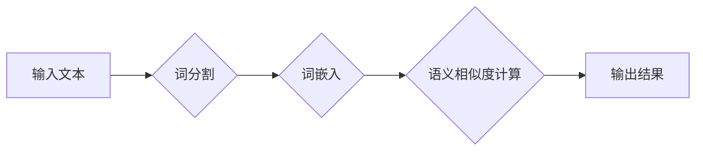

> 词嵌入，FastText，预训练词向量，自然语言处理，深度学习，文本表示

## 1. 背景介绍

自然语言处理 (NLP) 领域近年来取得了显著进展，这得益于深度学习技术的应用。深度学习模型能够从海量文本数据中学习到复杂的语言模式，从而实现各种 NLP 任务，例如文本分类、情感分析、机器翻译等。

词嵌入是 NLP 领域的基础技术之一，它将每个单词映射到一个低维向量空间中，使得具有语义相似性的单词拥有相似的向量表示。有效的词嵌入能够帮助深度学习模型更好地理解文本语义，从而提升模型性能。

传统的词嵌入方法，例如 Word2Vec 和 GloVe，主要基于单词的上下文信息进行训练。然而，这些方法存在一些局限性，例如：

* 对长距离依赖关系的捕捉能力有限。
* 对低频词的表示效果较差。
* 训练过程耗时且资源消耗大。

为了克服这些问题，FastText 和预训练词向量等新兴方法应运而生。

## 2. 核心概念与联系

### 2.1 FastText

FastText 是一种高效的词嵌入模型，由 Facebook AI 研究团队开发。它基于神经网络，并引入了字符级信息，能够更好地处理罕见词和长距离依赖关系。

### 2.2 预训练词向量

预训练词向量是指在大量文本数据上预先训练好的词嵌入模型。这些模型已经学习到丰富的语言知识，可以用于各种下游 NLP 任务，例如文本分类、情感分析、机器翻译等。

### 2.3 联系

FastText 和预训练词向量都属于词嵌入方法，但它们在训练方式和应用场景上有所不同。

* FastText 是一种基于神经网络的词嵌入模型，可以从头开始训练，也可以利用预训练词向量进行微调。
* 预训练词向量通常是在大型文本语料库上预先训练好的，可以用于各种下游 NLP 任务，无需进行额外的训练。

**Mermaid 流程图**



## 3. 核心算法原理 & 具体操作步骤

### 3.1 算法原理概述

FastText 的核心思想是利用字符级信息来表示单词。它将每个单词分解成一系列字符，并使用神经网络学习每个字符的嵌入向量。然后，将所有字符的嵌入向量进行加权求和，得到单词的最终嵌入向量。

### 3.2 算法步骤详解

1. **字符级词嵌入:** 将每个单词分解成一系列字符，并为每个字符学习一个嵌入向量。
2. **单词级词嵌入:** 将每个字符的嵌入向量进行加权求和，得到单词的最终嵌入向量。
3. **训练模型:** 使用负采样和随机梯度下降等优化算法，训练模型以最小化预测目标和实际目标之间的误差。

### 3.3 算法优缺点

**优点:**

* 能够更好地处理罕见词和长距离依赖关系。
* 训练速度快，效率高。

**缺点:**

* 对单词的顺序信息感知能力有限。
* 词嵌入维度较高，可能导致过拟合。

### 3.4 算法应用领域

FastText 广泛应用于各种 NLP 任务，例如：

* 文本分类
* 情感分析
* 机器翻译
* 问答系统
* 语义相似度计算

## 4. 数学模型和公式 & 详细讲解 & 举例说明

### 4.1 数学模型构建

FastText 的数学模型可以表示为一个多层神经网络，其中包含输入层、隐藏层和输出层。

* **输入层:** 接收每个单词的字符序列。
* **隐藏层:** 使用非线性激活函数对字符嵌入向量进行处理，学习单词的语义表示。
* **输出层:** 输出单词的嵌入向量。

### 4.2 公式推导过程

FastText 的目标函数是使用负采样技术来最小化预测目标和实际目标之间的误差。

$$
J(\theta) = -\frac{1}{N} \sum_{i=1}^{N} \log \sigma(v_i^T h_i) + \frac{1}{N} \sum_{j=1}^{N} \sum_{k \in \mathcal{D}_j} \log \sigma(-v_k^T h_j)
$$

其中：

* $N$ 是训练样本的数量。
* $v_i$ 是单词 $i$ 的嵌入向量。
* $h_i$ 是单词 $i$ 的隐藏层输出。
* $\sigma$ 是 sigmoid 函数。
* $\mathcal{D}_j$ 是单词 $j$ 的负采样样本集合。

### 4.3 案例分析与讲解

假设我们有一个单词 "king"，FastText 会将它分解成字符序列 "k i n g"，并为每个字符学习一个嵌入向量。然后，将所有字符的嵌入向量进行加权求和，得到单词 "king" 的最终嵌入向量。

## 5. 项目实践：代码实例和详细解释说明

### 5.1 开发环境搭建

* Python 3.6+
* TensorFlow 或 PyTorch

### 5.2 源代码详细实现

```python
import tensorflow as tf

# 定义 FastText 模型
class FastText(tf.keras.Model):
    def __init__(self, vocab_size, embedding_dim):
        super(FastText, self).__init__()
        self.embedding = tf.keras.layers.Embedding(vocab_size, embedding_dim)
        self.dense = tf.keras.layers.Dense(embedding_dim)

    def call(self, inputs):
        embeddings = self.embedding(inputs)
        output = tf.reduce_sum(embeddings, axis=1)
        output = self.dense(output)
        return output

# 训练模型
model = FastText(vocab_size=10000, embedding_dim=128)
model.compile(optimizer='adam', loss='mse')
model.fit(x_train, y_train, epochs=10)

```

### 5.3 代码解读与分析

* `FastText` 类定义了 FastText 模型的结构。
* `embedding` 层将每个单词映射到一个低维向量空间。
* `dense` 层对嵌入向量进行进一步处理。
* `call` 方法定义了模型的输入和输出。
* `compile` 方法配置了模型的优化器和损失函数。
* `fit` 方法训练模型。

### 5.4 运行结果展示

训练完成后，可以将模型应用于各种 NLP 任务，例如文本分类、情感分析等。

## 6. 实际应用场景

### 6.1 文本分类

FastText 可以用于文本分类任务，例如垃圾邮件分类、情感分析等。

### 6.2 情感分析

FastText 可以用于情感分析任务，例如判断文本的正面、负面或中性情感。

### 6.3 机器翻译

FastText 可以用于机器翻译任务，例如将英文翻译成中文。

### 6.4 未来应用展望

FastText 作为一种高效的词嵌入模型，在未来将有更广泛的应用场景，例如：

* 自然语言理解
* 聊天机器人
* 语音识别
* 图像字幕

## 7. 工具和资源推荐

### 7.1 学习资源推荐

* FastText 官方文档: https://fasttext.cc/docs/en/
* 深度学习入门书籍: "深度学习" by Ian Goodfellow, Yoshua Bengio, and Aaron Courville

### 7.2 开发工具推荐

* TensorFlow: https://www.tensorflow.org/
* PyTorch: https://pytorch.org/

### 7.3 相关论文推荐

* "Efficient Estimation of Word Representations in Vector Space" by Tomas Mikolov et al.
* "GloVe: Global Vectors for Word Representation" by Stanford NLP Group

## 8. 总结：未来发展趋势与挑战

### 8.1 研究成果总结

FastText 和预训练词向量等新兴词嵌入方法取得了显著进展，为 NLP 领域的发展做出了重要贡献。

### 8.2 未来发展趋势

未来词嵌入方法的发展趋势包括：

* 更高效的训练算法
* 更强大的模型架构
* 更丰富的语义信息

### 8.3 面临的挑战

词嵌入方法仍然面临一些挑战，例如：

* 对长距离依赖关系的捕捉能力有限
* 对多模态数据的处理能力不足
* 缺乏可解释性

### 8.4 研究展望

未来研究将重点关注解决上述挑战，并探索新的词嵌入方法，以更好地理解和处理自然语言。

## 9. 附录：常见问题与解答

### 9.1 如何选择合适的词嵌入模型？

选择合适的词嵌入模型取决于具体的应用场景和数据特点。

* 如果数据量大，可以考虑使用预训练词向量。
* 如果数据量小，或者需要处理罕见词，可以考虑使用 FastText。

### 9.2 如何评估词嵌入模型的性能？

常用的评估指标包括：

* 词语相似度
* 文本分类准确率
* 机器翻译BLEU分数

### 9.3 如何使用预训练词向量？

可以使用预训练词向量库，例如 Gensim 或 HuggingFace，下载预训练词向量模型，并将其用于自己的 NLP 任务。


作者：禅与计算机程序设计艺术 / Zen and the Art of Computer Programming 
<end_of_turn>