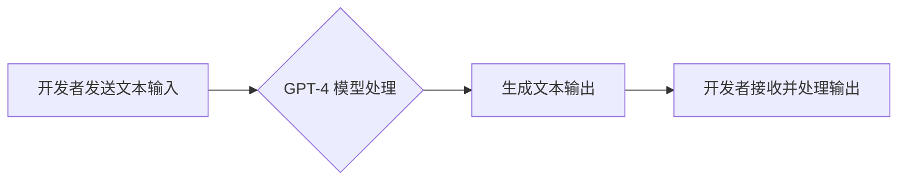

> GPT-4, API, 自然语言处理, 大语言模型, 应用程序开发, 创新应用

## 1. 背景介绍

近年来，人工智能（AI）技术取得了飞速发展，特别是大语言模型（LLM）的出现，为自然语言处理（NLP）领域带来了革命性的变革。其中，GPT-4 作为 OpenAI 最新推出的强大 LLM，凭借其出色的文本生成、理解和推理能力，引发了广泛的关注和研究兴趣。

GPT-4 的强大功能使其能够应用于各种领域，例如：

* **文本生成:**  创作高质量的诗歌、小说、剧本、文章等。
* **对话系统:**  构建更自然、更智能的聊天机器人和虚拟助手。
* **机器翻译:**  实现更高效、更准确的语言翻译。
* **代码生成:**  辅助程序员编写代码，提高开发效率。
* **数据分析:**  从文本数据中提取关键信息，进行分析和洞察。

为了让开发者能够更便捷地利用 GPT-4 的强大能力，OpenAI 推出了 GPT-4 API，为开发者提供了访问 GPT-4 模型的接口，并提供了丰富的文档和示例代码，方便开发者快速上手。

## 2. 核心概念与联系

GPT-4 是一种基于 Transformer 架构的深度学习模型，其核心原理是利用自注意力机制学习文本之间的上下文关系，从而实现对文本的理解和生成。

**GPT-4 API 的工作原理:**

1. 开发者通过 API 接口向 GPT-4 模型发送文本输入。
2. GPT-4 模型利用其训练好的参数和自注意力机制对输入文本进行处理。
3. 模型根据处理结果生成相应的文本输出。
4. 开发者接收并处理 GPT-4 生成的文本输出，将其应用于自己的应用程序中。

**Mermaid 流程图:**



## 3. 核心算法原理 & 具体操作步骤

### 3.1  算法原理概述

GPT-4 的核心算法是基于 Transformer 架构的深度学习模型，其主要特点是：

* **自注意力机制:**  允许模型关注输入文本中的不同部分，学习文本之间的上下文关系。
* **多头注意力:**  使用多个注意力头，从不同的角度学习文本信息。
* **位置编码:**  为输入文本添加位置信息，帮助模型理解文本的顺序关系。
* **解码器:**  负责根据输入文本生成输出文本。

### 3.2  算法步骤详解

1. **输入处理:** 将输入文本转换为模型可理解的格式，例如词嵌入。
2. **编码器:**  利用多层 Transformer 块对输入文本进行编码，生成文本的隐藏表示。
3. **解码器:**  利用解码器生成输出文本，并使用自回归机制逐个预测文本的下一个词。
4. **输出生成:**  将解码器生成的输出文本转换为人类可读的格式。

### 3.3  算法优缺点

**优点:**

* **强大的文本生成能力:**  能够生成高质量、流畅的文本。
* **优秀的文本理解能力:**  能够理解文本的语义和上下文关系。
* **可扩展性强:**  模型参数量大，可以训练出更强大的模型。

**缺点:**

* **计算资源需求高:**  训练和使用 GPT-4 模型需要大量的计算资源。
* **训练数据依赖性强:**  模型性能受训练数据质量的影响较大。
* **潜在的偏见问题:**  模型可能存在训练数据中的偏见。

### 3.4  算法应用领域

GPT-4 的应用领域非常广泛，包括：

* **自然语言处理:**  文本生成、机器翻译、问答系统、文本摘要等。
* **人工智能辅助:**  代码生成、数据分析、创意写作等。
* **教育和研究:**  语言学习、文本分析、知识发现等。

## 4. 数学模型和公式 & 详细讲解 & 举例说明

### 4.1  数学模型构建

GPT-4 的数学模型构建基于 Transformer 架构，其核心是自注意力机制和多层感知机。

**自注意力机制:**

自注意力机制允许模型关注输入文本中的不同部分，学习文本之间的上下文关系。其计算公式如下：

$$
Attention(Q, K, V) = softmax(\frac{QK^T}{\sqrt{d_k}})V
$$

其中：

* $Q$：查询矩阵
* $K$：键矩阵
* $V$：值矩阵
* $d_k$：键向量的维度
* $softmax$：softmax 函数

**多层感知机:**

多层感知机 (MLP) 用于对自注意力机制的输出进行非线性变换，其结构如下：

```
Input -> Linear -> ReLU -> Linear -> Output
```

其中：

* $Linear$：线性变换层
* $ReLU$：ReLU 激活函数

### 4.2  公式推导过程

自注意力机制的公式推导过程如下：

1. 将输入序列 $X$ 转换为查询矩阵 $Q$、键矩阵 $K$ 和值矩阵 $V$。
2. 计算每个词的注意力权重，即 $Attention(Q, K, V)$。
3. 将注意力权重与值矩阵 $V$ 进行加权求和，得到每个词的上下文表示。

### 4.3  案例分析与讲解

假设我们有一个句子 "The cat sat on the mat"，其词嵌入表示为：

* The: [0.1, 0.2, 0.3]
* cat: [0.4, 0.5, 0.6]
* sat: [0.7, 0.8, 0.9]
* on: [1.0, 1.1, 1.2]
* the: [0.1, 0.2, 0.3]
* mat: [1.3, 1.4, 1.5]

使用自注意力机制，模型可以计算每个词与其他词之间的注意力权重，例如 "cat" 与 "sat" 之间的注意力权重较高，因为它们在语义上相关。

## 5. 项目实践：代码实例和详细解释说明

### 5.1  开发环境搭建

* Python 3.7+
* OpenAI API 键

### 5.2  源代码详细实现

```python
import openai

# 设置 OpenAI API 键
openai.api_key = "YOUR_API_KEY"

# 定义一个函数，用于使用 GPT-4 API 生成文本
def generate_text(prompt):
    response = openai.Completion.create(
        engine="gpt-4",
        prompt=prompt,
        max_tokens=100,
        temperature=0.7,
    )
    return response.choices[0].text.strip()

# 示例用法
prompt = "写一首关于春天的诗"
generated_text = generate_text(prompt)
print(generated_text)
```

### 5.3  代码解读与分析

* 该代码首先导入 `openai` 库，并设置 OpenAI API 键。
* `generate_text()` 函数用于调用 GPT-4 API 生成文本。
* `engine="gpt-4"` 指定使用 GPT-4 模型。
* `prompt` 参数指定输入文本提示。
* `max_tokens` 参数指定生成的文本最大长度。
* `temperature` 参数控制文本生成的随机性。
* 代码最后调用 `generate_text()` 函数，并打印生成的文本。

### 5.4  运行结果展示

运行代码后，将输出一首关于春天的诗。

## 6. 实际应用场景

GPT-4 API 的应用场景非常广泛，以下是一些具体的例子：

### 6.1  聊天机器人

GPT-4 可以用于构建更自然、更智能的聊天机器人，例如客服机器人、陪伴机器人等。

### 6.2  文本生成

GPT-4 可以用于生成各种类型的文本，例如文章、故事、诗歌、代码等。

### 6.3  机器翻译

GPT-4 可以用于实现更高效、更准确的机器翻译。

### 6.4  未来应用展望

随着 GPT-4 API 的不断发展，其应用场景将会更加广泛，例如：

* **个性化教育:**  根据学生的学习情况，提供个性化的学习内容和辅导。
* **医疗诊断:**  辅助医生进行疾病诊断和治疗方案制定。
* **科学研究:**  加速科学研究的进程，例如药物研发、材料科学等。

## 7. 工具和资源推荐

### 7.1  学习资源推荐

* **OpenAI 官方文档:** https://platform.openai.com/docs/api-reference
* **Hugging Face Transformers:** https://huggingface.co/docs/transformers/index

### 7.2  开发工具推荐

* **Python:** https://www.python.org/
* **Jupyter Notebook:** https://jupyter.org/

### 7.3  相关论文推荐

* **Attention Is All You Need:** https://arxiv.org/abs/1706.03762
* **Language Models are Few-Shot Learners:** https://arxiv.org/abs/2005.14165

## 8. 总结：未来发展趋势与挑战

### 8.1  研究成果总结

GPT-4 的出现标志着大语言模型技术取得了重大突破，其强大的文本生成、理解和推理能力为人工智能领域带来了新的可能性。

### 8.2  未来发展趋势

未来，大语言模型技术将会继续发展，朝着以下方向发展：

* **模型规模更大:**  更大的模型参数量将带来更强大的性能。
* **多模态理解:**  模型将能够理解和生成多种模态数据，例如文本、图像、音频等。
* **更强的推理能力:**  模型将能够进行更复杂的推理和决策。

### 8.3  面临的挑战

大语言模型技术也面临着一些挑战，例如：

* **数据安全和隐私:**  模型训练需要大量数据，如何保证数据安全和隐私是一个重要问题。
* **模型可解释性:**  模型的决策过程难以理解，如何提高模型的可解释性是一个重要挑战。
* **伦理问题:**  大语言模型可能被用于生成虚假信息或进行恶意攻击，如何解决伦理问题是一个重要课题。

### 8.4  研究展望

未来，我们需要继续研究大语言模型的原理和应用，并积极应对其带来的挑战，以确保大语言模型技术能够安全、有效地服务于人类社会。

## 9. 附录：常见问题与解答

**Q1: 如何获取 OpenAI API 键？**

A1:  您可以访问 OpenAI 网站 (https://openai.com/) 注册账号并申请 API 键。

**Q2: GPT-4 API 的价格是多少？**

A2:  GPT-4 API 的价格根据使用情况而定，您可以参考 OpenAI 官方网站的定价信息。

**Q3: GPT-4 API 是否支持中文？**

A3:  GPT-4 模型支持多种语言，包括中文。

**Q4: 我可以使用 GPT-4 API 进行商业用途吗？**

A4:  是的，您可以使用 GPT-4 API 进行商业用途，但需要遵守 OpenAI 的服务条款。


作者：禅与计算机程序设计艺术 / Zen and the Art of Computer Programming 
<end_of_turn>