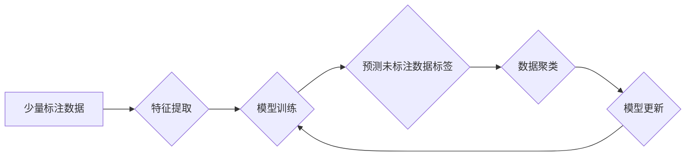

> 半监督学习, 监督学习, 无监督学习, 数据标注, 算法原理, 代码实例, 实际应用

## 1. 背景介绍

在机器学习领域，训练模型通常需要大量的标注数据。然而，获取高质量标注数据往往成本高昂且耗时费力。半监督学习 (Semi-Supervised Learning) 应运而生，它利用少量标注数据和大量未标注数据来训练模型，从而降低对标注数据的依赖。

半监督学习在图像识别、自然语言处理、语音识别等领域展现出巨大的潜力，尤其是在数据标注成本高昂的情况下，它成为一种高效的机器学习方法。

## 2. 核心概念与联系

半监督学习的核心思想是利用已有的标注数据来指导未标注数据的学习。它结合了监督学习和无监督学习的优势，在数据有限的情况下，可以获得更好的模型性能。

**半监督学习流程:**



**核心概念:**

* **标注数据:** 已知标签的数据，用于训练模型。
* **未标注数据:** 未知标签的数据，用于辅助模型学习。
* **特征提取:** 将数据转换为模型可理解的特征向量。
* **模型训练:** 利用标注数据和特征向量训练模型。
* **预测未标注数据标签:** 利用训练好的模型预测未标注数据的标签。
* **数据聚类:** 将未标注数据聚类，寻找潜在的标签。
* **模型更新:** 利用聚类结果更新模型参数。

## 3. 核心算法原理 & 具体操作步骤

### 3.1  算法原理概述

半监督学习算法主要分为两大类：

* **基于图的算法:** 将数据点和标签视为图中的节点和边，利用图结构信息进行学习。
* **基于概率的算法:** 将数据点和标签视为概率分布，利用最大似然估计或贝叶斯方法进行学习。

### 3.2  算法步骤详解

以基于图的算法为例，其具体步骤如下：

1. **构建图:** 将数据点和标签视为图中的节点和边，连接相似的节点。
2. **定义权重:** 根据节点之间的相似度定义边权重。
3. **传播标签:** 利用图结构信息，将已知标签传播到未标注节点。
4. **更新标签:** 根据传播后的标签，更新节点的标签概率。
5. **迭代训练:** 重复步骤3和4，直到模型收敛。

### 3.3  算法优缺点

**优点:**

* 可以利用大量未标注数据，提高模型性能。
* 相比完全监督学习，降低了对标注数据的依赖。

**缺点:**

* 算法复杂度较高，训练时间较长。
* 需要选择合适的图结构和权重函数，对算法性能有较大影响。

### 3.4  算法应用领域

半监督学习算法广泛应用于以下领域:

* **图像识别:** 利用少量标注图像，识别更多未标注图像中的物体。
* **自然语言处理:** 利用少量标注文本，进行文本分类、情感分析等任务。
* **语音识别:** 利用少量标注语音，识别更多未标注语音中的内容。

## 4. 数学模型和公式 & 详细讲解 & 举例说明

### 4.1  数学模型构建

半监督学习的数学模型通常基于概率图模型或最大似然估计。

**概率图模型:**

概率图模型是一种用于表示概率分布的图形模型，可以将数据点和标签视为图中的节点和边，并定义节点之间的依赖关系。

**最大似然估计:**

最大似然估计是一种常用的参数估计方法，其目标是找到最能解释观测数据的参数值。

### 4.2  公式推导过程

半监督学习的公式推导过程通常涉及到概率分布的计算、最大似然估计的优化等步骤。

**举例说明:**

假设我们有一个包含 $N$ 个数据点的集合 $D = \{x_1, x_2, ..., x_N\}$,其中 $y_i$ 是 $x_i$ 的真实标签，$y_i \in \{1, 2, ..., K\}$。我们使用半监督学习算法训练一个分类模型，目标是预测未标注数据点的标签。

**目标函数:**

$$
L(\theta) = -\sum_{i=1}^{N} \log p(y_i | x_i, \theta)
$$

其中，$\theta$ 是模型参数，$p(y_i | x_i, \theta)$ 是模型预测 $x_i$ 的标签为 $y_i$ 的概率。

### 4.3  案例分析与讲解

我们可以通过分析具体的半监督学习算法，例如图正则化、标签传播等算法，来深入理解其数学模型和公式推导过程。

## 5. 项目实践：代码实例和详细解释说明

### 5.1  开发环境搭建

为了实现半监督学习项目，我们需要搭建一个合适的开发环境。

**环境要求:**

* Python 3.x
* NumPy
* Scikit-learn
* TensorFlow 或 PyTorch

### 5.2  源代码详细实现

以下是一个使用 Scikit-learn 库实现半监督学习的简单代码实例：

```python
from sklearn.semi_supervised import LabelPropagation
from sklearn.datasets import make_classification
from sklearn.model_selection import train_test_split

# 生成合成数据集
X, y = make_classification(n_samples=1000, n_features=20, random_state=42)

# 将数据分成训练集和测试集
X_train, X_test, y_train, y_test = train_test_split(X, y, test_size=0.2, random_state=42)

# 创建半监督学习模型
clf = LabelPropagation(kernel='knn', gamma=0.5)

# 训练模型
clf.fit(X_train, y_train)

# 预测测试集标签
y_pred = clf.predict(X_test)

# 评估模型性能
accuracy = accuracy_score(y_test, y_pred)
print(f"Accuracy: {accuracy}")
```

### 5.3  代码解读与分析

* `make_classification()` 函数生成一个合成数据集，包含标注数据和未标注数据。
* `train_test_split()` 函数将数据分成训练集和测试集。
* `LabelPropagation()` 函数创建半监督学习模型，使用 k-最近邻 (k-NN) 算法作为核函数。
* `fit()` 函数训练模型，使用训练集数据进行学习。
* `predict()` 函数预测测试集标签。
* `accuracy_score()` 函数计算模型的准确率。

### 5.4  运行结果展示

运行上述代码，可以得到模型的准确率，并评估半监督学习算法的性能。

## 6. 实际应用场景

### 6.1  图像识别

在图像识别领域，半监督学习可以利用少量标注图像，识别更多未标注图像中的物体。例如，在医学图像分析中，可以使用半监督学习识别病变区域，辅助医生诊断。

### 6.2  自然语言处理

在自然语言处理领域，半监督学习可以用于文本分类、情感分析等任务。例如，可以使用半监督学习对新闻文章进行分类，识别其主题和情感。

### 6.3  语音识别

在语音识别领域，半监督学习可以利用少量标注语音，识别更多未标注语音中的内容。例如，可以使用半监督学习构建语音助手，识别用户的语音指令。

### 6.4  未来应用展望

随着数据量的不断增长和算法的不断改进，半监督学习将在更多领域得到应用，例如：

* **推荐系统:** 利用用户行为数据进行个性化推荐。
* **欺诈检测:** 利用交易数据识别欺诈行为。
* **药物研发:** 利用生物数据发现新的药物。

## 7. 工具和资源推荐

### 7.1  学习资源推荐

* **书籍:**
    * 半监督学习 (Semi-Supervised Learning)
    * 深度学习 (Deep Learning)
* **在线课程:**
    * Coursera: Machine Learning
    * edX: Deep Learning

### 7.2  开发工具推荐

* **Scikit-learn:** Python 机器学习库，提供多种半监督学习算法。
* **TensorFlow:** 开源深度学习框架，支持半监督学习。
* **PyTorch:** 开源深度学习框架，支持半监督学习。

### 7.3  相关论文推荐

* **Semi-Supervised Learning** by Christopher M. Bishop
* **Graph-Based Semi-Supervised Learning** by Zhou, D., & Bousquet, O.
* **Label Propagation** by Zhu, X., & Ghahramani, Z.

## 8. 总结：未来发展趋势与挑战

### 8.1  研究成果总结

半监督学习在过去几十年取得了显著进展，在数据有限的情况下，可以有效提高模型性能。

### 8.2  未来发展趋势

未来半监督学习的研究方向包括：

* **探索新的半监督学习算法:** 
* **提高算法的效率和鲁棒性:** 
* **将半监督学习与其他机器学习方法结合:** 

### 8.3  面临的挑战

半监督学习仍然面临一些挑战，例如：

* **如何选择合适的图结构和权重函数:** 
* **如何处理噪声数据:** 
* **如何评估半监督学习模型的性能:** 

### 8.4  研究展望

半监督学习是一个充满潜力的研究领域，未来将继续吸引研究者的关注，并为机器学习的发展做出重要贡献。

## 9. 附录：常见问题与解答

**常见问题:**

* 半监督学习与监督学习和无监督学习的区别是什么？
* 半监督学习的算法有哪些？
* 如何选择合适的半监督学习算法？
* 半监督学习的应用场景有哪些？

**解答:**

* 半监督学习结合了监督学习和无监督学习的优势，利用少量标注数据和大量未标注数据进行训练。
* 半监督学习的算法包括基于图的算法和基于概率的算法。
* 选择合适的半监督学习算法需要考虑数据类型、任务目标和算法性能等因素。
* 半监督学习的应用场景包括图像识别、自然语言处理、语音识别等领域。


作者：禅与计算机程序设计艺术 / Zen and the Art of Computer Programming 
<end_of_turn>