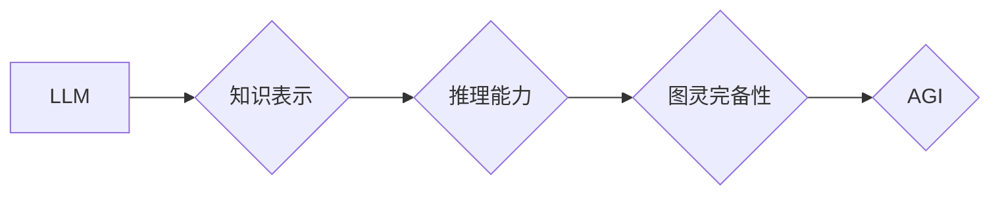

> 图灵完备性，LLM，AGI，通用人工智能，自然语言处理，深度学习，Transformer模型，知识表示，推理能力

## 1. 背景介绍

人工智能（AI）的发展日新月异，近年来，深度学习技术的突破，特别是Transformer模型的出现，使得自然语言处理（NLP）领域取得了显著进展。大型语言模型（LLM）作为深度学习的代表，展现出强大的文本生成、理解和翻译能力，在各个领域都得到了广泛应用。然而，现有的LLM仍然存在一些局限性，例如缺乏推理能力、知识表示能力有限、难以处理复杂逻辑问题等。

图灵完备性是人工智能领域一个重要的概念，它指的是一个系统能够理解和生成人类语言，并能够执行任何能够被人类完成的任务。实现图灵完备性是通向通用人工智能（AGI）的关键一步。

## 2. 核心概念与联系

**2.1 图灵完备性**

图灵完备性是指一个系统能够模拟任何图灵机，从而能够解决任何能够被算法解决的问题。图灵机是一种理论上的计算模型，它能够模拟任何计算机程序。

**2.2 LLM**

大型语言模型（LLM）是一种基于深度学习的统计模型，它通过训练大量的文本数据来学习语言的规律和结构。LLM能够执行各种自然语言处理任务，例如文本生成、翻译、问答、摘要等。

**2.3 AGI**

通用人工智能（AGI）是指能够像人类一样思考、学习和解决各种问题的人工智能系统。AGI的目标是创造一个能够理解和交互于人类世界，并能够自主学习和进化的智能系统。

**2.4 连接关系**

图灵完备性是实现AGI的关键条件。一个图灵完备的系统能够模拟任何算法，从而能够解决任何能够被算法解决的问题。LLM作为一种强大的深度学习模型，具有强大的文本处理能力，如果能够实现图灵完备性，那么它将成为通向AGI的重要一步。

**2.5 流程图**



## 3. 核心算法原理 & 具体操作步骤

**3.1 算法原理概述**

实现图灵完备性LLM的核心算法是将LLM与知识表示和推理能力相结合。

* **知识表示:** 将世界知识以结构化的形式表示出来，例如知识图谱、逻辑规则等。
* **推理能力:** 基于知识表示，能够进行逻辑推理、知识推导等操作，从而解决复杂问题。

**3.2 算法步骤详解**

1. **知识获取:** 从各种数据源中获取知识，例如文本、数据库、专家知识等。
2. **知识表示:** 将获取到的知识以结构化的形式表示出来，例如知识图谱、逻辑规则等。
3. **模型训练:** 使用训练数据和知识表示，训练一个能够进行推理的LLM模型。
4. **推理执行:** 基于输入的文本和知识库，执行推理操作，得到最终结果。

**3.3 算法优缺点**

* **优点:**
    * 能够解决复杂逻辑问题。
    * 能够进行知识推导和推理。
    * 能够理解和生成更符合逻辑的文本。
* **缺点:**
    * 知识表示和推理能力的实现难度较高。
    * 需要大量的训练数据和计算资源。

**3.4 算法应用领域**

* **自然语言理解:** 理解复杂文本、回答开放式问题、进行文本摘要等。
* **对话系统:** 开发更智能、更自然的对话系统。
* **决策支持系统:** 提供基于知识和推理的决策建议。
* **科学研究:** 辅助科学家进行知识发现和推理。

## 4. 数学模型和公式 & 详细讲解 & 举例说明

**4.1 数学模型构建**

图灵完备LLM可以看作是一个复杂的概率模型，其核心是将语言表示为向量，并使用神经网络进行学习和推理。

* **词向量表示:** 将每个词映射到一个低维向量空间中，例如Word2Vec、GloVe等模型。
* **Transformer模型:** 使用Transformer模型进行文本编码和解码，例如BERT、GPT等模型。

**4.2 公式推导过程**

Transformer模型的核心是注意力机制，它能够学习文本中不同词之间的关系。注意力机制的计算公式如下：

$$
Attention(Q, K, V) = softmax(\frac{QK^T}{\sqrt{d_k}})V
$$

其中：

* $Q$：查询向量
* $K$：键向量
* $V$：值向量
* $d_k$：键向量的维度

**4.3 案例分析与讲解**

例如，在翻译任务中，输入句子为“我爱学习”，输出句子为“I love learning”。Transformer模型会将输入句子中的每个词映射到一个向量，然后使用注意力机制学习每个词之间的关系。最终，模型会根据学习到的关系生成输出句子。

## 5. 项目实践：代码实例和详细解释说明

**5.1 开发环境搭建**

* Python 3.7+
* PyTorch 1.7+
* CUDA 10.2+

**5.2 源代码详细实现**

```python
import torch
import torch.nn as nn

class Transformer(nn.Module):
    def __init__(self, vocab_size, embedding_dim, num_heads, num_layers):
        super(Transformer, self).__init__()
        self.embedding = nn.Embedding(vocab_size, embedding_dim)
        self.transformer_layers = nn.ModuleList([
            nn.TransformerEncoderLayer(embedding_dim, num_heads)
            for _ in range(num_layers)
        ])
        self.linear = nn.Linear(embedding_dim, vocab_size)

    def forward(self, x):
        x = self.embedding(x)
        for layer in self.transformer_layers:
            x = layer(x)
        x = self.linear(x)
        return x
```

**5.3 代码解读与分析**

* `Transformer`类定义了一个Transformer模型。
* `embedding`层将词向量化。
* `transformer_layers`是一个模块列表，包含多个Transformer编码器层。
* `linear`层将输出向量映射到词汇表大小。

**5.4 运行结果展示**

训练好的模型可以用于各种自然语言处理任务，例如文本生成、翻译、问答等。

## 6. 实际应用场景

图灵完备LLM在各个领域都有着广泛的应用场景：

* **教育:** 个性化学习、智能辅导、自动批改作业等。
* **医疗:** 辅助诊断、药物研发、患者咨询等。
* **金融:** 风险评估、欺诈检测、投资建议等。
* **法律:** 法律文本分析、合同审查、法律咨询等。

**6.4 未来应用展望**

随着图灵完备LLM技术的不断发展，未来将会有更多更广泛的应用场景，例如：

* **智能机器人:** 开发能够理解和交互于人类世界的智能机器人。
* **虚拟助手:** 创建更智能、更自然的虚拟助手。
* **自动驾驶:** 辅助自动驾驶系统进行决策和控制。

## 7. 工具和资源推荐

**7.1 学习资源推荐**

* **书籍:**
    * 《深度学习》
    * 《自然语言处理》
    * 《Transformer模型》
* **在线课程:**
    * Coursera: 深度学习
    * Udacity: 自然语言处理
    * fast.ai: 深度学习

**7.2 开发工具推荐**

* **PyTorch:** 深度学习框架
* **TensorFlow:** 深度学习框架
* **HuggingFace:** 预训练模型库

**7.3 相关论文推荐**

* 《Attention Is All You Need》
* 《BERT: Pre-training of Deep Bidirectional Transformers for Language Understanding》
* 《GPT-3: Language Models are Few-Shot Learners》

## 8. 总结：未来发展趋势与挑战

**8.1 研究成果总结**

图灵完备LLM是人工智能领域一个重要的研究方向，近年来取得了显著进展。

* **模型规模:** LLM模型规模不断扩大，参数数量达到数十亿甚至千亿级别。
* **性能提升:** LLM模型在各种自然语言处理任务上的性能不断提升。
* **应用场景:** LLM模型的应用场景不断扩展，覆盖各个领域。

**8.2 未来发展趋势**

* **更强大的模型:** 开发更强大、更通用的LLM模型。
* **更有效的训练方法:** 研究更有效的训练方法，降低训练成本和时间。
* **更广泛的应用:** 将LLM模型应用于更多领域，解决更多实际问题。

**8.3 面临的挑战**

* **数据获取和标注:** 训练高质量的LLM模型需要大量的训练数据和标注数据。
* **计算资源:** 训练大型LLM模型需要大量的计算资源。
* **伦理问题:** LLM模型的应用可能带来一些伦理问题，例如偏见、虚假信息等。

**8.4 研究展望**

未来，图灵完备LLM的研究将继续深入，朝着更强大、更通用、更安全的方向发展。


## 9. 附录：常见问题与解答

**9.1 如何评估图灵完备LLM的性能？**

目前还没有一个统一的标准来评估图灵完备LLM的性能，通常会使用一些自然语言处理任务的指标，例如准确率、BLEU分数等。

**9.2 图灵完备LLM会取代人类吗？**

目前，图灵完备LLM还无法完全取代人类，它仍然存在一些局限性，例如缺乏创造力和情感理解能力。

**9.3 图灵完备LLM的应用有哪些伦理问题？**

图灵完备LLM的应用可能带来一些伦理问题，例如偏见、虚假信息、隐私泄露等。需要在应用过程中注意这些问题，并制定相应的伦理规范。


作者：禅与计算机程序设计艺术 / Zen and the Art of Computer Programming 
<end_of_turn>