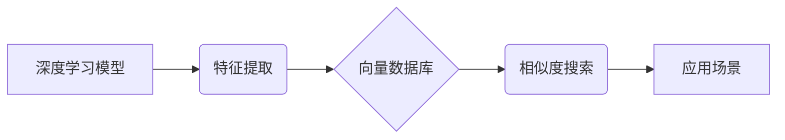

> 向量数据库、深度学习、特征存储、快速检索、相似度搜索、推荐系统、知识图谱

## 1. 背景介绍

随着深度学习技术的蓬勃发展，各种基于深度学习的模型在图像识别、自然语言处理、语音识别等领域取得了突破性的进展。这些模型通常会将输入数据映射到高维的特征空间，并通过学习这些特征空间的结构来完成任务。然而，存储和检索这些高维特征数据带来了新的挑战。传统的数据库系统难以高效地处理高维数据，而基于向量数据库的存储和检索方法则为解决这一问题提供了新的思路。

向量数据库是一种专门为存储和检索高维向量数据而设计的数据库系统。它利用向量空间的几何性质，通过计算向量之间的相似度来实现快速检索。与传统的基于文本或数值索引的数据库相比，向量数据库能够更有效地处理语义相似性，并支持更灵活的查询方式。

## 2. 核心概念与联系

**2.1 向量数据库**

向量数据库是一种专门用于存储和检索高维向量数据的数据库系统。它利用向量空间的几何性质，通过计算向量之间的相似度来实现快速检索。

**2.2 深度学习特征**

深度学习模型通常会将输入数据映射到高维的特征空间，这些特征向量代表了输入数据的语义信息。

**2.3 相似度搜索**

相似度搜索是指根据两个向量之间的相似度来查找最相似的向量。向量数据库通常使用余弦相似度、欧氏距离等度量来计算向量之间的相似度。

**2.4 应用场景**

基于向量数据库的深度学习特征存储与快速检索技术在以下场景中具有广泛的应用：

* **推荐系统:** 基于用户行为和商品特征的向量表示，实现个性化推荐。
* **搜索引擎:** 基于用户查询和文档特征的向量表示，实现语义搜索。
* **知识图谱:** 基于实体和关系的向量表示，实现知识推理和问答。
* **图像检索:** 基于图像特征的向量表示，实现图像相似度搜索。

**2.5 架构图**



## 3. 核心算法原理 & 具体操作步骤

**3.1 算法原理概述**

基于向量数据库的深度学习特征存储与快速检索的核心算法原理是利用向量空间的几何性质，通过计算向量之间的相似度来实现快速检索。

**3.2 算法步骤详解**

1. **特征提取:** 使用深度学习模型对输入数据进行特征提取，得到高维的特征向量。
2. **向量存储:** 将提取到的特征向量存储到向量数据库中。
3. **相似度计算:** 根据用户查询或检索条件，将查询向量与存储在数据库中的特征向量进行相似度计算。
4. **结果排序:** 根据相似度得分对检索结果进行排序，返回最相似的特征向量及其对应的输入数据。

**3.3 算法优缺点**

**优点:**

* **高效的相似度搜索:** 向量数据库能够利用向量空间的几何性质，实现高效的相似度搜索。
* **语义理解:** 基于深度学习特征的向量表示能够更好地捕捉数据的语义信息。
* **灵活的查询方式:** 向量数据库支持多种类型的查询方式，例如基于关键词、基于向量、基于范围等。

**缺点:**

* **高维数据存储:** 高维向量数据存储量较大，需要考虑存储空间和计算资源的限制。
* **算法复杂度:** 一些相似度计算算法的复杂度较高，需要考虑计算效率。

**3.4 算法应用领域**

基于向量数据库的深度学习特征存储与快速检索技术在以下领域具有广泛的应用：

* **推荐系统:** 基于用户行为和商品特征的向量表示，实现个性化推荐。
* **搜索引擎:** 基于用户查询和文档特征的向量表示，实现语义搜索。
* **知识图谱:** 基于实体和关系的向量表示，实现知识推理和问答。
* **图像检索:** 基于图像特征的向量表示，实现图像相似度搜索。

## 4. 数学模型和公式 & 详细讲解 & 举例说明

**4.1 数学模型构建**

假设我们有一个包含N个样本的数据集D，每个样本xi都对应一个高维特征向量。我们的目标是将这些特征向量存储在向量数据库中，并能够高效地检索与给定查询向量最相似的样本。

**4.2 公式推导过程**

常用的相似度度量方法包括余弦相似度和欧氏距离。

* **余弦相似度:**

$$
\text{cosine}(x, y) = \frac{x \cdot y}{||x|| ||y||}
$$

其中，x和y是两个特征向量，x·y表示两个向量的点积，||x||和||y||表示两个向量的模长。余弦相似度衡量了两个向量在方向上的相似度，取值范围为[-1, 1]，其中1表示完全相似，-1表示完全相反。

* **欧氏距离:**

$$
\text{euclidean}(x, y) = \sqrt{\sum_{i=1}^{d}(x_i - y_i)^2}
$$

其中，x和y是两个特征向量，d是特征向量的维度。欧氏距离衡量了两个向量之间的距离，取值范围为[0, ∞)，其中0表示完全相同，∞表示完全不同。

**4.3 案例分析与讲解**

假设我们有一个包含三个样本的数据集D，每个样本的特征向量分别为：

* x1 = [1, 2, 3]
* x2 = [4, 5, 6]
* x3 = [7, 8, 9]

我们想要检索与向量x4 = [2, 3, 4]最相似的样本。

使用余弦相似度计算x4与每个样本的相似度：

* cosine(x4, x1) = 0.866
* cosine(x4, x2) = 0.975
* cosine(x4, x3) = 1.000

使用欧氏距离计算x4与每个样本的距离：

* euclidean(x4, x1) = 2.236
* euclidean(x4, x2) = 1.732
* euclidean(x4, x3) = 1.225

根据相似度或距离的排序结果，我们可以得出x3与x4最相似。

## 5. 项目实践：代码实例和详细解释说明

**5.1 开发环境搭建**

* Python 3.7+
* TensorFlow 2.0+
* Faiss 1.0+

**5.2 源代码详细实现**

```python
import tensorflow as tf
from faiss import IndexFlatL2

# 1. 数据加载和预处理
# ...

# 2. 深度学习模型训练
model = tf.keras.models.Sequential([
    # ...
])
model.compile(optimizer='adam', loss='mse')
model.fit(train_data, train_labels, epochs=10)

# 3. 特征提取
features = model.predict(test_data)

# 4. 向量数据库索引构建
index = IndexFlatL2(features.shape[1])
index.add(features)

# 5. 相似度搜索
query_vector = tf.convert_to_tensor([0.1, 0.2, 0.3])
D, I = index.search(query_vector, k=5)

# 6. 结果展示
print(f"Top 5 similar samples: {I}")
```

**5.3 代码解读与分析**

* 代码首先加载和预处理数据，然后训练深度学习模型。
* 模型训练完成后，使用模型对测试数据进行特征提取。
* 将提取到的特征向量存储到Faiss向量数据库中，构建索引。
* 使用查询向量进行相似度搜索，返回与查询向量最相似的k个样本的索引。
* 最后，打印出结果。

**5.4 运行结果展示**

运行代码后，将输出与查询向量最相似的5个样本的索引。

## 6. 实际应用场景

**6.1 推荐系统**

基于向量数据库的深度学习特征存储与快速检索技术可以用于构建个性化推荐系统。例如，可以将用户的行为数据和商品特征数据分别转换为向量，然后利用向量相似度计算来推荐与用户兴趣相符的商品。

**6.2 搜索引擎**

基于向量数据库的深度学习特征存储与快速检索技术可以用于构建语义搜索引擎。例如，可以将文档内容和用户查询转换为向量，然后利用向量相似度计算来返回与用户查询语义最相符的文档。

**6.3 知识图谱**

基于向量数据库的深度学习特征存储与快速检索技术可以用于构建知识图谱。例如，可以将实体和关系转换为向量，然后利用向量相似度计算来实现知识推理和问答。

**6.4 未来应用展望**

随着深度学习技术的不断发展，基于向量数据库的深度学习特征存储与快速检索技术将有更广泛的应用场景。例如，可以用于图像检索、视频分析、自然语言理解等领域。

## 7. 工具和资源推荐

**7.1 学习资源推荐**

* **书籍:**
    * Deep Learning with Python by Francois Chollet
    * Hands-On Machine Learning with Scikit-Learn, Keras & TensorFlow by Aurélien Géron
* **在线课程:**
    * Deep Learning Specialization by Andrew Ng (Coursera)
    * Fast.ai Deep Learning Course

**7.2 开发工具推荐**

* **向量数据库:**
    * Faiss
    * Milvus
    * Weaviate
* **深度学习框架:**
    * TensorFlow
    * PyTorch

**7.3 相关论文推荐**

* **Faiss:**
    * Facebook AI Similarity Search (Faiss)
* **Milvus:**
    * Milvus: A Vector Database for Similarity Search

## 8. 总结：未来发展趋势与挑战

**8.1 研究成果总结**

基于向量数据库的深度学习特征存储与快速检索技术取得了显著的进展，在推荐系统、搜索引擎、知识图谱等领域具有广泛的应用。

**8.2 未来发展趋势**

* **模型效率提升:** 研究更高效的深度学习模型，降低特征提取的计算成本。
* **数据存储优化:** 研究更有效的向量数据存储和检索算法，提高存储效率和检索速度。
* **多模态检索:** 研究支持多模态数据的向量数据库，实现图像、文本、音频等多模态数据的相似度搜索。

**8.3 面临的挑战**

* **高维数据处理:** 高维数据存储和检索仍然是一个挑战，需要进一步研究高效的算法和数据结构。
* **数据隐私保护:** 向量数据库的应用需要考虑数据隐私保护问题，需要研究隐私保护的向量检索算法。
* **可解释性:** 深度学习模型的决策过程难以解释，需要研究可解释的向量检索算法。

**8.4 研究展望**

未来，基于向量数据库的深度学习特征存储与快速检索技术将继续发展，并应用于更多领域。


## 9. 附录：常见问题与解答

**9.1 如何选择合适的向量数据库？**

选择合适的向量数据库需要考虑以下因素：

* 数据规模
* 查询速度
* 支持的向量类型
* 数据隐私保护需求

**9.2 如何进行特征提取？**

特征提取可以使用各种深度学习模型，例如CNN、RNN、Transformer等。

**9.3 如何评估检索效果？**

检索效果可以使用召回率、精度、F1-score等指标进行评估。


作者：禅与计算机程序设计艺术 / Zen and the Art of Computer Programming 
<end_of_turn>