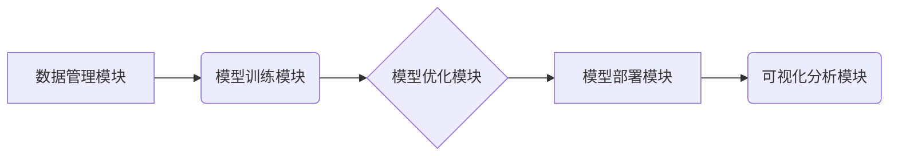

> 基础模型、统一开发工具、模型训练、模型部署、模型优化、人工智能、机器学习

## 1. 背景介绍

近年来，人工智能（AI）技术取得了飞速发展，基础模型（Foundation Models）作为AI领域的新兴热点，展现出强大的学习能力和泛化能力，在自然语言处理、计算机视觉、语音识别等领域取得了突破性进展。然而，基础模型的开发和应用仍然面临着诸多挑战，例如：

* **训练成本高昂：** 基础模型通常需要海量数据和强大的计算资源进行训练，这对于个人开发者和小型企业来说是一个巨大的负担。
* **模型部署复杂：** 将训练好的基础模型部署到实际应用场景中需要复杂的工程化工作，包括模型优化、硬件适配等。
* **模型可解释性差：** 基础模型的内部结构和决策机制往往难以理解，这限制了模型的信任度和应用范围。

为了解决这些问题，我们需要开发一种统一的开发工具，简化基础模型的开发、训练、部署和优化流程，降低开发门槛，促进基础模型的广泛应用。

## 2. 核心概念与联系

**2.1 基础模型**

基础模型是指在海量数据上预训练的通用模型，具有强大的泛化能力，可以应用于多种下游任务。常见的基础模型包括：

* **语言模型：** 例如GPT-3、BERT、LaMDA等，擅长理解和生成文本。
* **图像模型：** 例如DALL-E 2、Stable Diffusion、Imagen等，擅长生成图像和理解图像内容。
* **多模态模型：** 例如FLAN-T5、CLIP等，能够处理多种模态数据，例如文本、图像、音频等。

**2.2 统一开发工具**

统一开发工具是指为基础模型开发提供一站式服务的平台，涵盖模型训练、模型部署、模型优化等全流程。

**2.3 核心架构**

统一开发工具的核心架构通常包括以下几个模块：

* **数据管理模块：** 用于存储、处理和管理基础模型的训练数据。
* **模型训练模块：** 提供各种训练算法和参数配置，支持用户自定义训练流程。
* **模型部署模块：** 提供模型部署到不同平台（例如云端、边缘设备）的工具和服务。
* **模型优化模块：** 提供模型压缩、加速和量化等优化技术，提高模型的效率和性能。
* **可视化分析模块：** 提供模型训练和部署过程的可视化分析工具，帮助用户了解模型的运行状态和性能指标。



## 3. 核心算法原理 & 具体操作步骤

**3.1 算法原理概述**

基础模型的训练通常采用深度学习算法，例如Transformer、CNN等。这些算法通过多层神经网络结构，学习数据中的复杂特征和模式。

**3.2 算法步骤详解**

1. **数据预处理：** 将原始数据进行清洗、格式化和转换，使其适合模型训练。
2. **模型构建：** 根据任务需求选择合适的模型架构，并设置模型参数。
3. **模型训练：** 使用训练数据训练模型，通过反向传播算法不断调整模型参数，使模型的预测结果与真实值尽可能接近。
4. **模型评估：** 使用验证数据评估模型的性能，并根据评估结果调整训练参数和模型结构。
5. **模型部署：** 将训练好的模型部署到实际应用场景中，并进行监控和维护。

**3.3 算法优缺点**

* **优点：** 
    * 强大的学习能力，能够学习到数据中的复杂模式。
    * 泛化能力强，能够应用于多种下游任务。
* **缺点：** 
    * 训练成本高昂，需要海量数据和强大的计算资源。
    * 模型可解释性差，难以理解模型的决策机制。

**3.4 算法应用领域**

基础模型在各个领域都有广泛的应用，例如：

* **自然语言处理：** 文本生成、机器翻译、问答系统等。
* **计算机视觉：** 图像识别、物体检测、图像生成等。
* **语音识别：** 语音转文本、语音合成等。
* **推荐系统：** 商品推荐、内容推荐等。

## 4. 数学模型和公式 & 详细讲解 & 举例说明

**4.1 数学模型构建**

基础模型的训练通常基于深度学习算法，这些算法可以看作是复杂的数学模型。例如，Transformer模型的注意力机制可以表示为以下数学公式：

$$
Attention(Q, K, V) = \frac{exp(Q \cdot K^T / \sqrt{d_k})}{exp(Q \cdot K^T / \sqrt{d_k})} \cdot V
$$

其中：

* $Q$：查询矩阵
* $K$：键矩阵
* $V$：值矩阵
* $d_k$：键向量的维度

**4.2 公式推导过程**

注意力机制的公式推导过程比较复杂，涉及到矩阵运算、指数函数和归一化操作。

**4.3 案例分析与讲解**

在文本生成任务中，Transformer模型利用注意力机制来学习文本中的上下文关系，从而生成更流畅、更自然的文本。例如，在生成“猫抓老鼠”这句话时，注意力机制会将“猫”和“抓”这两个词语联系起来，并将其与“老鼠”联系起来，从而生成更合理的句子。

## 5. 项目实践：代码实例和详细解释说明

**5.1 开发环境搭建**

使用Python语言开发基础模型的统一开发工具，需要安装以下软件包：

* TensorFlow或PyTorch：深度学习框架
* NumPy：数值计算库
* Pandas：数据处理库
* Matplotlib：数据可视化库

**5.2 源代码详细实现**

由于篇幅限制，这里只提供代码示例，详细的源代码实现可以参考开源项目或相关文献。

```python
# 模型训练示例
import tensorflow as tf

# 定义模型架构
model = tf.keras.models.Sequential([
    tf.keras.layers.Embedding(input_dim=vocab_size, output_dim=embedding_dim),
    tf.keras.layers.LSTM(units=hidden_size),
    tf.keras.layers.Dense(units=vocab_size, activation='softmax')
])

# 编译模型
model.compile(optimizer='adam', loss='sparse_categorical_crossentropy', metrics=['accuracy'])

# 训练模型
model.fit(train_data, train_labels, epochs=num_epochs)

# 模型部署示例
import flask

app = flask.Flask(__name__)

@app.route('/predict', methods=['POST'])
def predict():
    # 从请求中获取输入文本
    text = request.form['text']
    # 使用训练好的模型进行预测
    prediction = model.predict(text)
    # 返回预测结果
    return jsonify({'prediction': prediction.tolist()})

if __name__ == '__main__':
    app.run(debug=True)
```

**5.3 代码解读与分析**

这段代码示例展示了如何使用TensorFlow框架训练一个简单的文本生成模型，并使用Flask框架将其部署为一个Web服务。

**5.4 运行结果展示**

运行代码后，可以访问Web服务，输入文本进行预测，并获取模型的预测结果。

## 6. 实际应用场景

基础模型的统一开发工具可以应用于各种实际场景，例如：

* **教育领域：** 开发个性化学习平台，根据学生的学习情况提供定制化的学习内容和辅导。
* **医疗领域：** 辅助医生诊断疾病、预测患者病情，提高医疗效率和准确性。
* **金融领域：** 进行风险评估、欺诈检测、投资决策等，帮助金融机构降低风险和提高收益。

**6.4 未来应用展望**

随着基础模型技术的不断发展，统一开发工具将发挥越来越重要的作用，推动人工智能技术在更多领域得到应用。

## 7. 工具和资源推荐

**7.1 学习资源推荐**

* **书籍：**
    * 《深度学习》
    * 《机器学习》
* **在线课程：**
    * Coursera
    * edX
    * fast.ai

**7.2 开发工具推荐**

* **深度学习框架：** TensorFlow、PyTorch
* **云平台：** AWS、Azure、Google Cloud
* **开发环境：** Jupyter Notebook、VS Code

**7.3 相关论文推荐**

* 《Attention Is All You Need》
* 《BERT: Pre-training of Deep Bidirectional Transformers for Language Understanding》
* 《GPT-3: Language Models are Few-Shot Learners》

## 8. 总结：未来发展趋势与挑战

**8.1 研究成果总结**

基础模型的统一开发工具为基础模型的开发和应用提供了便捷的平台，降低了开发门槛，促进了基础模型的普及和应用。

**8.2 未来发展趋势**

* **模型效率提升：** 研究更轻量级、更高效的基础模型，降低模型训练和部署成本。
* **模型可解释性增强：** 开发更有效的模型解释方法，提高模型的透明度和信任度。
* **模型安全性和隐私保护：** 研究基础模型的安全性和隐私保护技术，防止模型被恶意利用。

**8.3 面临的挑战**

* **数据获取和标注：** 基础模型的训练需要海量数据，数据获取和标注成本较高。
* **计算资源限制：** 基础模型的训练需要强大的计算资源，对于个人开发者和小型企业来说是一个挑战。
* **伦理和社会影响：** 基础模型的应用可能带来伦理和社会问题，需要进行深入研究和探讨。

**8.4 研究展望**

未来，基础模型的统一开发工具将朝着更智能化、更自动化、更安全的方向发展，为人工智能技术的普及和应用提供更强大的支持。

## 9. 附录：常见问题与解答

**9.1 如何选择合适的基础模型？**

选择合适的基础模型需要根据具体的应用场景和任务需求进行考虑。例如，对于文本生成任务，可以选择GPT-3等语言模型；对于图像识别任务，可以选择DALL-E 2等图像模型。

**9.2 如何进行模型训练和部署？**

统一开发工具通常提供模型训练和部署的工具和服务，用户可以根据自己的需求进行配置和操作。

**9.3 如何评估模型的性能？**

模型的性能可以通过各种指标进行评估，例如准确率、召回率、F1-score等。

**9.4 如何解决模型过拟合问题？**

模型过拟合问题可以通过正则化、数据增强、早停等方法进行解决。

**9.5 如何保证模型的安全性和隐私保护？**

可以使用模型加密、数据脱敏等技术来保证模型的安全性和隐私保护。


作者：禅与计算机程序设计艺术 / Zen and the Art of Computer Programming 
<end_of_turn>