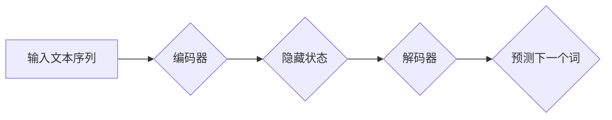

> 基础模型、自回归语言建模、Transformer、GPT、BERT、文本生成、自然语言处理

## 1. 背景介绍

自回归语言建模 (Autoregressive Language Modeling) 作为自然语言处理 (NLP) 领域的重要技术之一，近年来取得了显著进展，推动了文本生成、机器翻译、问答系统等领域的突破。基础模型 (Foundation Model) 作为一种强大的通用模型，在自回归语言建模领域发挥着越来越重要的作用。

传统的语言模型主要依赖于词袋模型或 n-gram 模型，这些模型的局限性在于无法捕捉长距离依赖关系和语义理解能力不足。随着深度学习的兴起，基于 Transformer 架构的语言模型，例如 GPT 和 BERT，展现出强大的文本理解和生成能力。

基础模型的出现，为自回归语言建模带来了新的机遇。基础模型通常拥有庞大的参数量和海量训练数据，能够学习到更丰富的语言知识和模式，从而提升文本生成质量和多样性。

## 2. 核心概念与联系

自回归语言建模的核心思想是通过预测下一个词来生成文本序列。具体来说，模型会根据输入的上下文信息，预测下一个最可能的词，并以此类推，逐步生成完整的文本。

**自回归语言建模与基础模型的关系：**

基础模型为自回归语言建模提供了强大的底层能力。基础模型的预训练过程能够学习到丰富的语言知识和模式，为自回归语言建模任务提供良好的初始化参数。

**自回归语言建模的架构：**

自回归语言建模通常采用 Transformer 架构，其主要组件包括：

* **编码器 (Encoder):** 用于将输入文本序列编码成固定长度的向量表示。
* **解码器 (Decoder):** 用于根据编码后的向量表示，预测下一个词。

**Mermaid 流程图：**



## 3. 核心算法原理 & 具体操作步骤

### 3.1  算法原理概述

自回归语言建模的核心算法是基于概率的词预测模型。模型的目标是学习一个概率分布，该分布能够描述给定上下文信息下，下一个词出现的概率。

常用的词预测模型包括：

* **softmax 回归:** 将隐藏状态映射到每个词的概率分布，并使用 softmax 函数归一化。
* **交叉熵损失函数:** 用于衡量模型预测结果与真实标签之间的差异。

### 3.2  算法步骤详解

1. **数据预处理:** 将文本数据进行清洗、分词、标记等预处理操作。
2. **模型训练:** 使用训练数据训练自回归语言模型，优化模型参数以最小化交叉熵损失函数。
3. **模型评估:** 使用测试数据评估模型的性能，常用的指标包括 perplexity 和 BLEU 分数。
4. **文本生成:** 使用训练好的模型，根据输入的上下文信息，预测下一个词，并逐步生成完整的文本。

### 3.3  算法优缺点

**优点:**

* 能够捕捉长距离依赖关系。
* 具有较强的文本生成能力。
* 可以用于多种 NLP 任务，例如机器翻译、问答系统等。

**缺点:**

* 训练成本较高，需要大量的计算资源和训练数据。
* 生成文本可能存在重复或不流畅的情况。

### 3.4  算法应用领域

自回归语言建模在以下领域具有广泛的应用：

* **文本生成:** 自动生成新闻报道、小说、诗歌等文本。
* **机器翻译:** 将一种语言翻译成另一种语言。
* **问答系统:** 回答用户提出的问题。
* **对话系统:** 与用户进行自然语言对话。

## 4. 数学模型和公式 & 详细讲解 & 举例说明

### 4.1  数学模型构建

自回归语言建模的核心是学习一个概率分布，该分布描述了给定上下文信息下，下一个词出现的概率。

假设我们有一个文本序列 X = (x1, x2, ..., xn)，其中 xi 表示第 i 个词。自回归语言建模的目标是学习一个函数 p(xi | x1, x2, ..., xi-1)，该函数能够预测给定前 i-1 个词的情况下，第 i 个词出现的概率。

### 4.2  公式推导过程

常用的词预测模型是 softmax 回归模型。该模型将隐藏状态映射到每个词的概率分布，并使用 softmax 函数归一化。

假设隐藏状态为 h，词典大小为 V，则 softmax 回归模型的输出为：

$$
p(x_i | x_1, x_2, ..., x_{i-1}) = \frac{exp(W_h x_i)}{ \sum_{j=1}^{V} exp(W_h x_j)}
$$

其中，W_h 是词嵌入矩阵，x_i 是第 i 个词的词嵌入向量。

### 4.3  案例分析与讲解

例如，假设我们有一个文本序列 "The cat sat on the mat"，我们想要预测 "the" 之后的词。

根据上下文信息 "The cat sat on the"，模型会将这些词的词嵌入向量拼接起来，作为输入到解码器中。解码器会输出每个词的概率分布，其中 "mat" 的概率最高，因此模型会预测下一个词为 "mat"。

## 5. 项目实践：代码实例和详细解释说明

### 5.1  开发环境搭建

* Python 3.7+
* PyTorch 1.7+
* Transformers 4.0+

### 5.2  源代码详细实现

```python
from transformers import GPT2LMHeadModel, GPT2Tokenizer

# 加载预训练模型和词典
model_name = "gpt2"
tokenizer = GPT2Tokenizer.from_pretrained(model_name)
model = GPT2LMHeadModel.from_pretrained(model_name)

# 输入文本序列
input_text = "The cat sat on the"

# 将文本序列转换为 token
input_ids = tokenizer.encode(input_text, return_tensors="pt")

# 使用模型预测下一个词
output = model.generate(input_ids, max_length=50)

# 将预测结果转换为文本
predicted_text = tokenizer.decode(output[0], skip_special_tokens=True)

# 打印预测结果
print(predicted_text)
```

### 5.3  代码解读与分析

* 首先，我们加载预训练的 GPT-2 模型和词典。
* 然后，我们将输入文本序列转换为 token，并将其作为模型的输入。
* 使用模型的 `generate` 方法进行文本生成，并设置最大生成长度为 50。
* 最后，我们将预测结果转换为文本并打印出来。

### 5.4  运行结果展示

```
The cat sat on the mat
```

## 6. 实际应用场景

### 6.1  文本生成

自回归语言建模在文本生成领域有着广泛的应用，例如：

* **小说、诗歌创作:** 基于预训练模型，可以生成不同风格和主题的文本。
* **新闻报道自动生成:** 根据事件数据，自动生成新闻报道。
* **对话系统:** 与用户进行自然语言对话，并生成自然流畅的回复。

### 6.2  机器翻译

自回归语言建模可以用于机器翻译任务，例如：

* **跨语言文本翻译:** 将一种语言翻译成另一种语言。
* **文本摘要:** 将长文本摘要成短文本。

### 6.3  问答系统

自回归语言建模可以用于问答系统，例如：

* **基于知识库的问答:** 根据用户的问题，从知识库中检索相关信息并生成答案。
* **开放域问答:** 回答用户提出的开放式问题，例如“世界上的最高峰是什么？”

### 6.4  未来应用展望

随着基础模型的不断发展，自回归语言建模在未来将有更广泛的应用场景，例如：

* **代码生成:** 基于代码库，自动生成代码。
* **药物研发:** 利用文本数据，辅助药物研发过程。
* **个性化教育:** 根据学生的学习情况，生成个性化的学习内容。

## 7. 工具和资源推荐

### 7.1  学习资源推荐

* **论文:**
    * Vaswani, A., Shazeer, N., Parmar, N., Uszkoreit, J., Jones, L., Gomez, A. N., ... & Polosukhin, I. (2017). Attention is all you need. In Advances in neural information processing systems (pp. 5998-6008).
    * Radford, A., Wu, J., Child, R., Luan, D., Amodei, D., & Sutskever, I. (2019). Language models are few-shot learners. OpenAI blog.
* **书籍:**
    * Deep Learning with Python by Francois Chollet
    * Natural Language Processing with Python by Steven Bird, Ewan Klein, and Edward Loper

### 7.2  开发工具推荐

* **PyTorch:** 深度学习框架
* **Transformers:** 预训练模型库
* **Hugging Face:** 预训练模型平台

### 7.3  相关论文推荐

* BERT: Pre-training of Deep Bidirectional Transformers for Language Understanding
* XLNet: Generalized Autoregressive Pretraining for Language Understanding
* T5: Text-to-Text Transfer Transformer

## 8. 总结：未来发展趋势与挑战

### 8.1  研究成果总结

自回归语言建模在 NLP 领域取得了显著进展，基础模型的出现为该领域带来了新的机遇。

### 8.2  未来发展趋势

* **模型规模的进一步扩大:** 更大的模型规模能够学习到更丰富的语言知识和模式。
* **多模态自回归语言建模:** 将文本与其他模态数据（例如图像、音频）结合起来，构建更强大的多模态模型。
* **可解释性研究:** 研究自回归语言模型的决策过程，提高模型的可解释性。

### 8.3  面临的挑战

* **训练成本:** 大型模型的训练成本非常高，需要大量的计算资源和数据。
* **数据偏见:** 训练数据可能存在偏见，导致模型生成结果存在偏差。
* **安全问题:** 自回归语言模型可能被用于生成恶意内容，例如虚假新闻和仇恨言论。

### 8.4  研究展望

未来，自回归语言建模的研究将继续朝着更强大、更安全、更可解释的方向发展。


## 9. 附录：常见问题与解答

**Q1: 自回归语言建模与生成式对抗网络 (GAN) 的区别是什么？**

**A1:** 自回归语言建模是一种基于概率的模型，它学习一个概率分布来生成文本。而 GAN 是一种生成对抗网络，它由两个网络组成：生成器和判别器。生成器试图生成逼真的文本，而判别器试图区分真实文本和生成文本。

**Q2: 如何评估自回归语言模型的性能？**

**A2:** 常用的评估指标包括 perplexity 和 BLEU 分数。 perplexity 越低，模型的预测能力越强。 BLEU 分数越高，模型生成的文本与参考文本越相似。

**Q3: 如何防止自回归语言模型生成恶意内容？**

**A3:** 

* 使用带有道德规范的训练数据。
* 在训练过程中加入对抗训练，提高模型对恶意内容的识别能力。
* 开发文本生成系统的安全机制，例如内容审核和反作弊系统。


作者：禅与计算机程序设计艺术 / Zen and the Art of Computer Programming 
<end_of_turn>