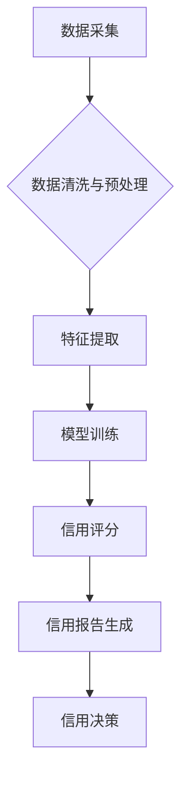

> 大数据，征信体系，机器学习，信用评分，风险控制，数据安全

## 1. 背景介绍

随着经济全球化和互联网技术的快速发展，金融行业正经历着前所未有的变革。大数据技术的兴起为银行个人征信体系的建设提供了新的机遇和挑战。传统征信体系主要依赖于银行和信用机构的静态数据，难以全面反映个人的信用状况。而大数据技术能够收集、整合和分析海量多元化的数据，为银行提供更全面的、更精准的个人信用评估。

近年来，银行个人征信体系建设已成为金融监管和行业发展的重点。中国人民银行等监管机构也积极推动征信体系的改革和完善，鼓励银行利用大数据技术提升征信体系的效率和准确性。

## 2. 核心概念与联系

**2.1 个人征信体系**

个人征信体系是指建立在法律法规基础上的，对个人信用行为进行记录、评估和报告的系统。其核心功能包括：

* **信用记录：** 收集、存储和管理个人信用行为的历史数据，包括贷款、信用卡、支付、交易等信息。
* **信用评估：** 利用算法模型对个人信用行为进行分析和评估，生成信用评分和信用报告。
* **信用报告：** 向个人和相关机构提供信用信息，帮助个人了解自己的信用状况，帮助机构进行信用风险评估。

**2.2 大数据技术**

大数据技术是指处理海量、高速度、多样化数据的技术体系。其主要特征包括：

* **海量数据：** 数据量巨大，难以用传统数据库技术处理。
* **高速度数据：** 数据流速快，需要实时处理和分析。
* **多样化数据：** 数据类型多样，包括结构化数据、非结构化数据和半结构化数据。

**2.3 核心概念联系**

大数据技术为银行个人征信体系的建设提供了新的机遇和挑战。

* **机遇：** 大数据技术能够收集、整合和分析海量多元化的数据，为银行提供更全面的、更精准的个人信用评估。
* **挑战：** 大数据技术也带来了新的挑战，例如数据安全、数据隐私、算法偏见等问题。

**2.4 核心架构**



## 3. 核心算法原理 & 具体操作步骤

**3.1 算法原理概述**

银行个人征信体系的核心算法主要包括信用评分模型和信用风险预测模型。

* **信用评分模型：** 利用机器学习算法对个人信用行为进行分析和评估，生成信用评分。信用评分是一个数值指标，用于衡量个人的信用风险水平。
* **信用风险预测模型：** 利用机器学习算法对个人信用风险进行预测，判断个人是否会发生违约行为。

**3.2 算法步骤详解**

**3.2.1 信用评分模型**

1. **数据采集：** 收集个人信用行为的历史数据，包括贷款、信用卡、支付、交易等信息。
2. **数据清洗与预处理：** 对数据进行清洗和预处理，例如删除缺失值、处理异常值、编码离散变量等。
3. **特征提取：** 从原始数据中提取特征，例如年龄、收入、工作年限、信用历史等。
4. **模型训练：** 利用机器学习算法对特征进行训练，建立信用评分模型。常用的机器学习算法包括逻辑回归、支持向量机、决策树、随机森林等。
5. **模型评估：** 对模型进行评估，例如使用准确率、召回率、F1-score等指标衡量模型的性能。
6. **模型部署：** 将训练好的模型部署到生产环境中，用于对新用户的信用评分。

**3.2.2 信用风险预测模型**

1. **数据采集：** 收集个人信用行为的历史数据，包括贷款、信用卡、支付、交易等信息。
2. **数据清洗与预处理：** 对数据进行清洗和预处理，例如删除缺失值、处理异常值、编码离散变量等。
3. **特征提取：** 从原始数据中提取特征，例如年龄、收入、工作年限、信用历史等。
4. **模型训练：** 利用机器学习算法对特征进行训练，建立信用风险预测模型。常用的机器学习算法包括逻辑回归、支持向量机、决策树、随机森林等。
5. **模型评估：** 对模型进行评估，例如使用准确率、召回率、AUC等指标衡量模型的性能。
6. **模型部署：** 将训练好的模型部署到生产环境中，用于对新用户的信用风险预测。

**3.3 算法优缺点**

**3.3.1 信用评分模型**

* **优点：** 可以对个人信用风险进行量化评估，为银行提供决策依据。
* **缺点：** 容易受到数据偏差的影响，可能导致算法偏见。

**3.3.2 信用风险预测模型**

* **优点：** 可以预测个人的违约风险，帮助银行提前采取措施。
* **缺点：** 预测结果存在一定的误差，可能导致误判。

**3.4 算法应用领域**

* **贷款审批：** 评估借款人的信用风险，决定是否批准贷款申请。
* **信用卡发卡：** 评估申请信用卡人的信用风险，决定是否发卡。
* **风险控制：** 识别和控制信用风险，降低银行的损失。
* **个性化服务：** 根据个人的信用状况提供个性化的金融服务。

## 4. 数学模型和公式 & 详细讲解 & 举例说明

**4.1 数学模型构建**

信用评分模型通常采用线性回归模型或逻辑回归模型。

* **线性回归模型：**

$$
\hat{y} = \beta_0 + \beta_1x_1 + \beta_2x_2 + ... + \beta_nx_n
$$

其中：

* $\hat{y}$ 是预测的信用评分。
* $\beta_0$ 是截距项。
* $\beta_1, \beta_2, ..., \beta_n$ 是特征系数。
* $x_1, x_2, ..., x_n$ 是特征变量。

* **逻辑回归模型：**

$$
P(Y=1) = \frac{1}{1 + e^{-( \beta_0 + \beta_1x_1 + \beta_2x_2 + ... + \beta_nx_n)}}
$$

其中：

* $P(Y=1)$ 是预测个体属于高风险群体的概率。
* $\beta_0, \beta_1, \beta_2, ..., \beta_n$ 是特征系数。
* $x_1, x_2, ..., x_n$ 是特征变量。

**4.2 公式推导过程**

线性回归模型的系数可以通过最小二乘法估计。逻辑回归模型的系数可以通过最大似然估计法估计。

**4.3 案例分析与讲解**

假设我们想要构建一个信用评分模型，预测个人的贷款违约风险。我们可以收集以下特征数据：

* 年龄
* 收入
* 工作年限
* 信用历史

我们可以使用逻辑回归模型对这些特征进行训练，建立信用评分模型。模型训练完成后，我们可以将新用户的特征数据输入到模型中，得到其贷款违约风险的预测概率。

## 5. 项目实践：代码实例和详细解释说明

**5.1 开发环境搭建**

* 操作系统：Windows/Linux/macOS
* Python 版本：3.6+
* 必要的库：pandas, numpy, scikit-learn, matplotlib

**5.2 源代码详细实现**

```python
import pandas as pd
from sklearn.model_selection import train_test_split
from sklearn.linear_model import LogisticRegression
from sklearn.metrics import accuracy_score

# 加载数据
data = pd.read_csv('credit_data.csv')

# 划分训练集和测试集
X = data.drop('default', axis=1)
y = data['default']
X_train, X_test, y_train, y_test = train_test_split(X, y, test_size=0.2, random_state=42)

# 训练模型
model = LogisticRegression()
model.fit(X_train, y_train)

# 预测结果
y_pred = model.predict(X_test)

# 评估模型性能
accuracy = accuracy_score(y_test, y_pred)
print(f'模型准确率: {accuracy}')
```

**5.3 代码解读与分析**

* 首先，我们加载数据并划分训练集和测试集。
* 然后，我们使用逻辑回归模型训练模型。
* 最后，我们使用测试集预测结果并评估模型性能。

**5.4 运行结果展示**

运行代码后，会输出模型的准确率。

## 6. 实际应用场景

**6.1 贷款审批**

银行可以使用信用评分模型来评估贷款申请人的信用风险，决定是否批准贷款申请。

**6.2 信用卡发卡**

银行可以使用信用评分模型来评估申请信用卡人的信用风险，决定是否发卡。

**6.3 风险控制**

银行可以使用信用风险预测模型来识别和控制信用风险，降低银行的损失。

**6.4 未来应用展望**

随着大数据技术的不断发展，银行个人征信体系将更加智能化、个性化和精准化。

## 7. 工具和资源推荐

**7.1 学习资源推荐**

* **书籍：**
    * 《机器学习》 - 周志华
    * 《Python机器学习实战》 - 塞缪尔·阿布拉姆斯
* **在线课程：**
    * Coursera: Machine Learning
    * edX: Introduction to Machine Learning

**7.2 开发工具推荐**

* **Python:** 
    * pandas: 数据分析和处理
    * numpy: 数值计算
    * scikit-learn: 机器学习库
    * matplotlib: 数据可视化

**7.3 相关论文推荐**

* **《基于大数据的银行个人征信体系研究》** - 中国人民银行
* **《大数据时代下的信用风险评估》** - 中国金融学会

## 8. 总结：未来发展趋势与挑战

**8.1 研究成果总结**

本文介绍了大数据背景下的银行个人征信体系建设，包括核心概念、算法原理、代码实例和实际应用场景。

**8.2 未来发展趋势**

* **人工智能技术应用:** 利用人工智能技术，例如深度学习、自然语言处理等，提升征信体系的智能化水平。
* **数据安全与隐私保护:** 加强数据安全和隐私保护措施，确保征信体系的合法合规性。
* **跨机构数据共享:** 推动跨机构数据共享，构建更加全面的征信体系。

**8.3 面临的挑战**

* **数据质量问题:** 大数据中的数据质量参差不齐，需要进行有效的数据清洗和预处理。
* **算法偏见问题:** 算法模型可能存在偏见，需要进行算法调优和公平性评估。
* **数据安全与隐私保护问题:** 大数据征信体系涉及大量个人敏感信息，需要加强数据安全和隐私保护措施。

**8.4 研究展望**

未来，我们将继续深入研究大数据背景下的银行个人征信体系，探索更先进的算法模型、更有效的风险控制方法和更完善的数据安全机制。


## 9. 附录：常见问题与解答

**9.1 如何解决数据质量问题？**

* 数据清洗：删除重复数据、缺失值、异常值等。
* 数据标准化：将不同格式的数据统一格式。
* 数据验证：对数据进行有效性验证。

**9.2 如何解决算法偏见问题？**

* 使用公平性评估指标，例如公平性、准确率、召回率等。
* 使用对抗训练方法，提高