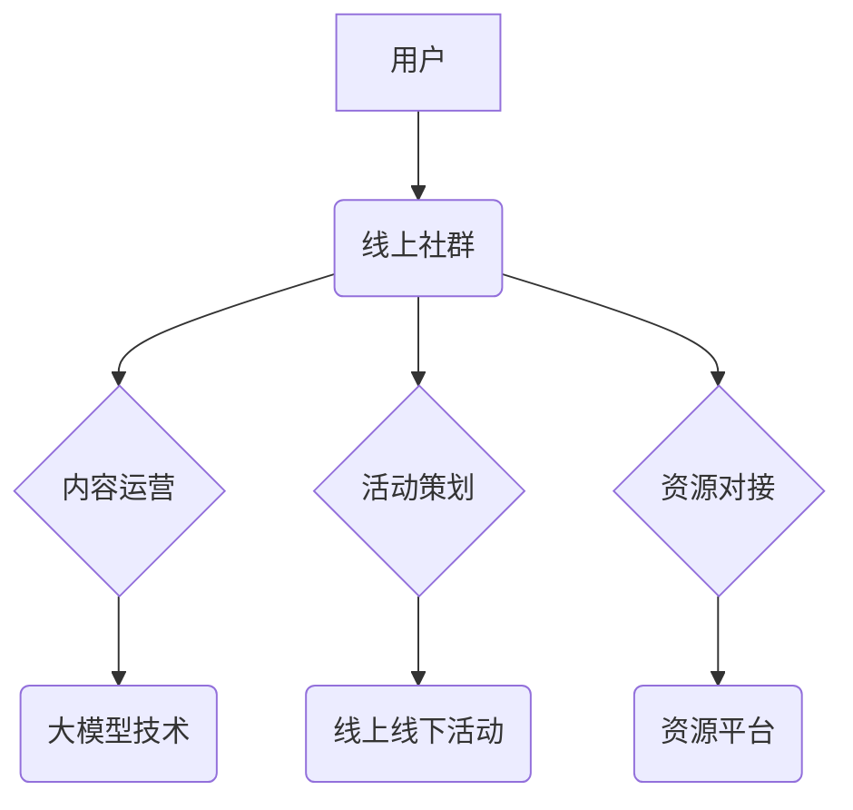

> 大模型、创业社群、线上社群、线下活动、资源对接、社区运营、大模型应用

## 1. 背景介绍

近年来，大模型技术蓬勃发展，其强大的生成、理解和推理能力为各行各业带来了革命性的变革。创业者们也开始积极探索大模型在商业领域的应用，希望借助其强大的功能，加速产品创新、提升运营效率，并开拓新的市场机遇。然而，创业者们往往面临着技术门槛高、资源有限、信息不对称等挑战。

为了解决这些问题，创业者创业社群应运而生。这些社群为创业者们提供了一个交流学习、分享经验、互相支持的平台，帮助他们更好地理解和应用大模型技术，并加速商业化进程。

## 2. 核心概念与联系

**2.1 社群运营的核心概念**

* **社区建设:**  建立一个活跃、有凝聚力的社区，需要关注用户需求，提供优质内容和服务，并营造良好的互动氛围。
* **内容运营:**  持续输出有价值、有吸引力的内容，例如行业资讯、技术分享、案例分析等，吸引用户参与并留存。
* **活动策划:**  组织线上线下活动，例如技术沙龙、创业论坛、项目合作等，促进用户之间的交流和合作。
* **资源对接:**  搭建资源对接平台，帮助创业者获取资金、人才、技术等资源，加速项目发展。

**2.2 大模型与创业社群的联系**

大模型技术为创业社群运营提供了新的可能性：

* **智能化内容推荐:**  利用大模型的理解和生成能力，为用户推荐个性化内容，提高用户参与度。
* **智能化社区管理:**  利用大模型进行社区内容审核、用户行为分析等，提高社区运营效率。
* **智能化项目孵化:**  利用大模型分析项目需求、匹配资源，帮助创业者更快地孵化项目。

**2.3 社群运营架构**



## 3. 核心算法原理 & 具体操作步骤

**3.1 算法原理概述**

大模型的训练主要基于深度学习算法，例如Transformer模型。这些模型通过大量的文本数据进行训练，学习语言的结构和语义关系，从而能够理解和生成人类语言。

**3.2 算法步骤详解**

1. **数据预处理:**  收集并清洗文本数据，将其转换为模型可理解的格式。
2. **模型构建:**  选择合适的深度学习模型架构，例如Transformer模型。
3. **模型训练:**  利用训练数据训练模型，调整模型参数，使其能够准确地理解和生成文本。
4. **模型评估:**  使用测试数据评估模型的性能，例如准确率、流畅度等。
5. **模型部署:**  将训练好的模型部署到服务器上，使其能够为用户提供服务。

**3.3 算法优缺点**

* **优点:**  大模型能够处理大量文本数据，学习复杂的语言模式，生成高质量的文本内容。
* **缺点:**  大模型训练成本高，需要大量的计算资源和数据。

**3.4 算法应用领域**

* **自然语言处理:**  文本分类、情感分析、机器翻译等。
* **对话系统:**  聊天机器人、虚拟助手等。
* **内容创作:**  文章写作、诗歌创作、剧本创作等。

## 4. 数学模型和公式 & 详细讲解 & 举例说明

**4.1 数学模型构建**

大模型的训练过程可以看作是一个优化问题，目标是找到一个模型参数向量，使得模型在训练数据上的损失函数最小。

损失函数通常采用交叉熵损失函数，用于衡量模型预测结果与真实标签之间的差异。

**4.2 公式推导过程**

交叉熵损失函数的公式如下：

$$
H(p, q) = -\sum_{i=1}^{n} p(i) \log q(i)
$$

其中：

* $p(i)$ 是真实标签的概率分布。
* $q(i)$ 是模型预测的概率分布。

**4.3 案例分析与讲解**

假设我们训练一个文本分类模型，目标是将文本分类为“正面”或“负面”两类。

训练数据包含1000个文本样本，每个样本都有对应的标签。

模型预测每个文本的“正面”概率，例如：

* 文本1：预测概率为0.8
* 文本2：预测概率为0.2

真实标签为：

* 文本1：正面
* 文本2：负面

根据交叉熵损失函数的公式，可以计算出模型的损失值。

## 5. 项目实践：代码实例和详细解释说明

**5.1 开发环境搭建**

* Python 3.7+
* TensorFlow 2.0+
* PyTorch 1.0+

**5.2 源代码详细实现**

```python
import tensorflow as tf

# 定义模型结构
model = tf.keras.Sequential([
    tf.keras.layers.Embedding(input_dim=10000, output_dim=128),
    tf.keras.layers.LSTM(units=64),
    tf.keras.layers.Dense(units=1, activation='sigmoid')
])

# 编译模型
model.compile(optimizer='adam', loss='binary_crossentropy', metrics=['accuracy'])

# 训练模型
model.fit(x_train, y_train, epochs=10)

# 评估模型
loss, accuracy = model.evaluate(x_test, y_test)
print('Loss:', loss)
print('Accuracy:', accuracy)
```

**5.3 代码解读与分析**

* 代码首先定义了一个简单的文本分类模型，使用Embedding层将文本词向量化，LSTM层提取文本特征，Dense层输出分类结果。
* 模型使用Adam优化器，交叉熵损失函数，并使用准确率作为评估指标。
* 代码使用训练数据训练模型，并使用测试数据评估模型性能。

**5.4 运行结果展示**

训练完成后，可以查看模型的损失值和准确率，评估模型的性能。

## 6. 实际应用场景

**6.1 线上社群运营**

* **智能化内容推荐:**  利用大模型分析用户阅读历史和兴趣偏好，推荐相关内容，提高用户参与度。
* **智能化社区管理:**  利用大模型进行社区内容审核，识别垃圾信息和恶意评论，维护社区秩序。

**6.2 线下活动策划**

* **智能化活动匹配:**  利用大模型分析用户兴趣和活动信息，推荐合适的活动，提高活动参与率。
* **智能化活动预估:**  利用大模型分析历史活动数据，预测未来活动参与人数和效果，优化活动策划。

**6.3 资源对接**

* **智能化资源匹配:**  利用大模型分析创业者需求和资源信息，精准匹配资源，提高资源利用率。
* **智能化项目孵化:**  利用大模型分析项目需求和市场趋势，为创业者提供项目孵化建议，提高项目成功率。

**6.4 未来应用展望**

随着大模型技术的不断发展，其在创业社群运营领域的应用将更加广泛和深入。例如：

* **个性化学习推荐:**  根据用户的学习进度和兴趣，推荐个性化的学习内容和学习路径。
* **虚拟导师:**  利用大模型模拟导师的角色，为创业者提供一对一指导和支持。
* **智能化项目管理:**  利用大模型自动生成项目计划、跟踪项目进度、识别项目风险，提高项目管理效率。

## 7. 工具和资源推荐

**7.1 学习资源推荐**

* **书籍:**  《深度学习》、《自然语言处理》
* **在线课程:**  Coursera、edX、Udacity
* **开源项目:**  HuggingFace、TensorFlow Hub

**7.2 开发工具推荐**

* **深度学习框架:**  TensorFlow、PyTorch
* **文本处理工具:**  NLTK、spaCy
* **云计算平台:**  AWS、Google Cloud、Azure

**7.3 相关论文推荐**

* **BERT:**  BERT: Pre-training of Deep Bidirectional Transformers for Language Understanding
* **GPT-3:**  Language Models are Few-Shot Learners
* **T5:**  Exploring the Limits of Transfer Learning with a Unified Text-to-Text Transformer

## 8. 总结：未来发展趋势与挑战

**8.1 研究成果总结**

大模型技术在创业社群运营领域取得了显著成果，例如智能化内容推荐、智能化社区管理、智能化资源对接等。

**8.2 未来发展趋势**

* **模型规模和能力的提升:**  未来大模型将更加强大，能够处理更复杂的任务，提供更精准的服务。
* **模型的个性化定制:**  未来大模型将能够根据用户的需求进行个性化定制，提供更加精准的解决方案。
* **模型的解释性和可信度提升:**  未来大模型将更加透明，能够解释自己的决策过程，提高用户对模型的信任度。

**8.3 面临的挑战**

* **数据安全和隐私保护:**  大模型的训练需要大量数据，如何保证数据安全和隐私保护是一个重要的挑战。
* **模型的公平性和可解释性:**  大模型的决策可能存在偏见，如何保证模型的公平性和可解释性是一个重要的研究方向。
* **模型的部署和维护成本:**  大模型的部署和维护成本较高，如何降低成本是一个重要的挑战。

**8.4 研究展望**

未来，我们将继续研究大模型在创业社群运营领域的应用，探索其更大的潜力，并解决其面临的挑战，为创业者提供更加智能化、高效的运营服务。

## 9. 附录：常见问题与解答

**9.1 如何选择合适的深度学习模型？**

选择合适的深度学习模型需要根据具体任务和数据特点进行选择。例如，文本分类任务可以使用BERT模型，文本生成任务可以使用GPT模型。

**9.2 如何训练大模型？**

训练大模型需要大量的计算资源和数据。可以使用云计算平台进行训练，例如AWS、Google Cloud、Azure。

**9.3 如何评估大模型的性能？**

大模型的性能可以使用准确率、召回率、F1-score等指标进行评估。

**9.4 如何部署大模型？**

大模型可以部署到服务器上，也可以部署到云端。

**9.5 如何维护大模型？**

大模型需要定期更新模型参数，并进行性能监控。


作者：禅与计算机程序设计艺术 / Zen and the Art of Computer Programming 
<end_of_turn>