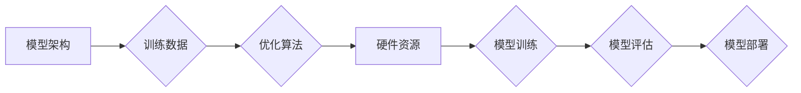

> 大模型训练, 基础设施, 算法, 数据处理, 梯度下降, 并行计算, 优化器, 数据增强, 预训练, 微调

## 1. 背景介绍

近年来，深度学习技术取得了飞速发展，大模型的出现更是推动了人工智能领域向前迈进了一大步。大模型是指参数规模庞大、训练数据海量的人工智能模型，其强大的学习能力和泛化能力使其在自然语言处理、计算机视觉、语音识别等领域展现出令人瞩目的应用潜力。然而，大模型的训练也面临着诸多技术挑战，这些挑战涵盖了基础设施、算法和数据处理等多个方面。

## 2. 核心概念与联系

大模型训练的核心概念包括：

* **模型架构:**  指模型的结构设计，例如 Transformer、BERT 等。
* **训练数据:**  模型学习的基础，需要海量高质量的数据进行训练。
* **优化算法:**  用于更新模型参数的算法，例如梯度下降、Adam 等。
* **硬件资源:**  大模型训练需要强大的计算能力，通常需要使用 GPU 或 TPU 等加速器。

这些概念相互关联，共同决定了大模型的训练效果。

**Mermaid 流程图:**



## 3. 核心算法原理 & 具体操作步骤

### 3.1  算法原理概述

梯度下降是深度学习中常用的优化算法，其原理是通过不断迭代更新模型参数，使得模型的损失函数最小化。具体来说，梯度下降算法会计算模型参数的梯度，然后根据梯度方向调整参数值，朝着损失函数下降的方向前进。

### 3.2  算法步骤详解

1. **初始化模型参数:**  随机初始化模型参数。
2. **计算损失函数:**  使用训练数据计算模型的损失函数值。
3. **计算梯度:**  计算模型参数的梯度，即损失函数对每个参数的偏导数。
4. **更新参数:**  根据梯度方向和学习率更新模型参数。
5. **重复步骤2-4:**  重复以上步骤，直到损失函数收敛或达到预设的迭代次数。

### 3.3  算法优缺点

**优点:**

* 算法简单易懂，易于实现。
* 能够有效地找到损失函数的最小值。

**缺点:**

* 容易陷入局部最优解。
* 训练速度较慢，尤其是在模型参数规模较大时。

### 3.4  算法应用领域

梯度下降算法广泛应用于深度学习领域，例如图像分类、目标检测、自然语言处理等。

## 4. 数学模型和公式 & 详细讲解 & 举例说明

### 4.1  数学模型构建

假设模型参数为 $\theta$, 训练数据为 $(x_i, y_i)$, 损失函数为 $L(\theta)$, 则模型训练的目标是找到最优参数 $\theta^*$，使得损失函数最小化：

$$\theta^* = \arg \min_{\theta} L(\theta)$$

### 4.2  公式推导过程

梯度下降算法的更新公式为：

$$\theta = \theta - \eta \nabla L(\theta)$$

其中，$\eta$ 为学习率，$\nabla L(\theta)$ 为损失函数对参数 $\theta$ 的梯度。

### 4.3  案例分析与讲解

假设我们训练一个线性回归模型，损失函数为均方误差，则梯度下降算法的更新公式为：

$$\theta = \theta - \eta \frac{1}{m} \sum_{i=1}^{m} (y_i - \hat{y}_i) x_i$$

其中，$m$ 为训练样本数量，$\hat{y}_i$ 为模型预测值。

## 5. 项目实践：代码实例和详细解释说明

### 5.1  开发环境搭建

使用 Python 语言和 TensorFlow 或 PyTorch 深度学习框架进行大模型训练。

### 5.2  源代码详细实现

```python
import tensorflow as tf

# 定义模型架构
model = tf.keras.models.Sequential([
    tf.keras.layers.Dense(64, activation='relu', input_shape=(10,)),
    tf.keras.layers.Dense(10, activation='softmax')
])

# 定义损失函数和优化器
loss_fn = tf.keras.losses.CategoricalCrossentropy()
optimizer = tf.keras.optimizers.Adam(learning_rate=0.001)

# 训练模型
for epoch in range(10):
    for batch in dataset:
        with tf.GradientTape() as tape:
            predictions = model(batch['features'])
            loss = loss_fn(batch['labels'], predictions)
        gradients = tape.gradient(loss, model.trainable_variables)
        optimizer.apply_gradients(zip(gradients, model.trainable_variables))
    print(f'Epoch {epoch+1}, Loss: {loss.numpy()}')
```

### 5.3  代码解读与分析

代码首先定义了模型架构，然后定义了损失函数和优化器。训练模型时，使用梯度下降算法更新模型参数，并记录每个epoch的损失值。

### 5.4  运行结果展示

训练完成后，可以评估模型的性能，例如使用测试集计算准确率。

## 6. 实际应用场景

大模型在各个领域都有广泛的应用场景，例如：

* **自然语言处理:**  机器翻译、文本摘要、问答系统等。
* **计算机视觉:**  图像分类、目标检测、图像生成等。
* **语音识别:**  语音转文本、语音助手等。

### 6.4  未来应用展望

随着大模型技术的不断发展，其应用场景将会更加广泛，例如：

* **个性化推荐:**  根据用户的兴趣和行为，提供个性化的商品推荐。
* **自动驾驶:**  帮助车辆感知周围环境，并做出安全驾驶决策。
* **医疗诊断:**  辅助医生进行疾病诊断，提高诊断准确率。

## 7. 工具和资源推荐

### 7.1  学习资源推荐

* **书籍:**  《深度学习》、《自然语言处理》
* **在线课程:**  Coursera、edX、Udacity 等平台上的深度学习课程。
* **博客:**  OpenAI、Google AI 等机构的博客。

### 7.2  开发工具推荐

* **TensorFlow:**  Google 开发的开源深度学习框架。
* **PyTorch:**  Facebook 开发的开源深度学习框架。
* **JAX:**  Google 开发的基于 XLA 的高性能机器学习库。

### 7.3  相关论文推荐

* **Attention Is All You Need:**  Transformer 模型的提出论文。
* **BERT: Pre-training of Deep Bidirectional Transformers for Language Understanding:**  BERT 模型的提出论文。
* **GPT-3: Language Models are Few-Shot Learners:**  GPT-3 模型的提出论文。

## 8. 总结：未来发展趋势与挑战

### 8.1  研究成果总结

近年来，大模型训练取得了显著进展，模型规模不断扩大，性能不断提升。预训练模型的出现也为大模型的应用提供了便利。

### 8.2  未来发展趋势

* **模型规模进一步扩大:**  更大的模型规模能够带来更强的学习能力和泛化能力。
* **训练效率提升:**  研究更高效的训练算法和硬件架构，降低训练成本和时间。
* **模型解释性增强:**  研究更有效的模型解释方法，提高模型的可解释性和可信度。

### 8.3  面临的挑战

* **数据获取和处理:**  大模型训练需要海量高质量的数据，数据获取和处理成本较高。
* **计算资源需求:**  大模型训练需要大量的计算资源，成本高昂。
* **模型安全性和可控性:**  大模型的强大能力也带来潜在的风险，需要加强模型的安全性和可控性研究。

### 8.4  研究展望

未来，大模型训练的研究将继续朝着更高效、更安全、更可解释的方向发展，并将在更多领域发挥重要作用。

## 9. 附录：常见问题与解答

* **Q: 如何选择合适的模型架构？**
* **A:**  模型架构的选择取决于具体的应用场景和数据特点。

* **Q: 如何处理过拟合问题？**
* **A:**  可以使用正则化、数据增强、Dropout 等技术来防止过拟合。

* **Q: 如何评估模型性能？**
* **A:**  可以使用准确率、召回率、F1-score 等指标来评估模型性能。


作者：禅与计算机程序设计艺术 / Zen and the Art of Computer Programming 
<end_of_turn>