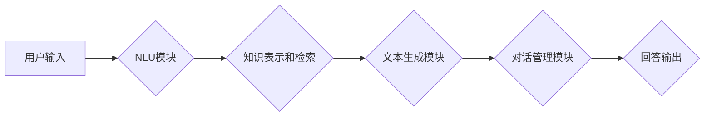

> 大模型、问答机器人、自然语言处理、深度学习、Transformer、BERT、GPT

## 1. 背景介绍

近年来，人工智能技术取得了飞速发展，特别是深度学习的兴起，为自然语言处理（NLP）领域带来了革命性的变革。其中，大模型问答机器人作为一种新型的智能交互系统，凭借其强大的语言理解和生成能力，在客服、教育、娱乐等领域展现出广阔的应用前景。

传统的问答系统主要依赖于规则引擎和知识库，其回答质量受限于规则的精细度和知识库的覆盖范围。而大模型问答机器人则通过训练海量文本数据，学习语言的语义和结构，能够理解更复杂、更开放式的自然语言问题，并生成更自然、更流畅的回答。

## 2. 核心概念与联系

大模型问答机器人主要由以下几个核心模块组成：

* **自然语言理解（NLU）模块：**负责对用户输入的自然语言进行分析和理解，提取关键信息，例如问题类型、实体、关系等。
* **知识表示和检索模块：**负责将知识存储在可查询的结构化形式中，并根据用户问题进行高效的知识检索。
* **文本生成模块：**负责根据理解到的问题和检索到的知识，生成自然流畅的回答文本。
* **对话管理模块：**负责管理对话流程，例如上下文维护、用户意图识别、对话策略等。

**Mermaid 流程图**



## 3. 核心算法原理 & 具体操作步骤

### 3.1  算法原理概述

大模型问答机器人的核心算法主要基于深度学习技术，特别是Transformer模型架构。Transformer模型通过自注意力机制，能够捕捉文本序列中长距离依赖关系，从而实现更准确的语言理解和生成。

### 3.2  算法步骤详解

1. **数据预处理：**将原始文本数据进行清洗、分词、标记等预处理操作，使其适合模型训练。
2. **模型训练：**使用预训练的Transformer模型，例如BERT或GPT，对预处理后的数据进行训练，学习语言的语义和结构。
3. **模型评估：**使用测试集评估模型的性能，例如准确率、召回率、F1-score等。
4. **模型部署：**将训练好的模型部署到服务器或云平台，提供问答服务。

### 3.3  算法优缺点

**优点：**

* 能够理解更复杂、更开放式的自然语言问题。
* 生成更自然、更流畅的回答文本。
* 能够不断学习和改进，随着数据量的增加，性能会不断提升。

**缺点：**

* 训练成本高，需要海量数据和强大的计算资源。
* 模型解释性差，难以理解模型的决策过程。
* 容易受到恶意攻击，例如生成虚假信息或进行攻击性对话。

### 3.4  算法应用领域

大模型问答机器人具有广泛的应用前景，例如：

* **客服机器人：**自动回答用户常见问题，提高客服效率。
* **教育机器人：**提供个性化学习辅导，帮助学生学习知识。
* **娱乐机器人：**进行对话娱乐，例如聊天、 storytelling 等。
* **搜索引擎：**提供更精准、更智能的搜索结果。

## 4. 数学模型和公式 & 详细讲解 & 举例说明

### 4.1  数学模型构建

大模型问答机器人的数学模型主要基于Transformer架构，其核心是自注意力机制。自注意力机制能够捕捉文本序列中不同词之间的依赖关系，从而实现更准确的语言理解。

### 4.2  公式推导过程

自注意力机制的计算公式如下：

$$
Attention(Q, K, V) = softmax(\frac{QK^T}{\sqrt{d_k}})V
$$

其中：

* $Q$：查询矩阵
* $K$：键矩阵
* $V$：值矩阵
* $d_k$：键向量的维度
* $softmax$：softmax函数

### 4.3  案例分析与讲解

假设我们有一个句子“我爱吃苹果”，我们想要计算“吃”这个词与其他词之间的注意力权重。

1. 将句子转换为词向量表示。
2. 计算查询矩阵 $Q$、键矩阵 $K$ 和值矩阵 $V$。
3. 计算注意力权重矩阵，即 $softmax(\frac{QK^T}{\sqrt{d_k}})$。
4. 将注意力权重矩阵与值矩阵相乘，得到最终的注意力输出。

通过分析注意力权重矩阵，我们可以发现“吃”这个词与“我爱”这两个词的注意力权重较高，说明它们在语义上是相关的。

## 5. 项目实践：代码实例和详细解释说明

### 5.1  开发环境搭建

* Python 3.7+
* TensorFlow 2.0+
* PyTorch 1.0+
* CUDA 10.0+

### 5.2  源代码详细实现

```python
# 导入必要的库
import tensorflow as tf

# 定义BERT模型
bert_model = tf.keras.applications.BERT_EN_uncased(
    weights='bert_base_uncased',
    include_output_layer=False
)

# 定义文本生成模型
generator_model = tf.keras.Sequential([
    bert_model.output,
    tf.keras.layers.Dense(128, activation='relu'),
    tf.keras.layers.Dense(vocab_size, activation='softmax')
])

# 编译模型
generator_model.compile(
    optimizer='adam',
    loss='sparse_categorical_crossentropy',
    metrics=['accuracy']
)

# 训练模型
generator_model.fit(
    train_data,
    train_labels,
    epochs=10
)

# 预测
predictions = generator_model.predict(test_data)
```

### 5.3  代码解读与分析

* 首先，我们导入必要的库，并定义BERT模型。
* 然后，我们定义文本生成模型，该模型接收BERT模型的输出作为输入，并通过全连接层和softmax层生成文本。
* 接着，我们编译模型，并使用训练数据进行训练。
* 最后，我们使用测试数据进行预测，并输出预测结果。

### 5.4  运行结果展示

训练完成后，我们可以使用测试数据进行预测，并观察模型的性能。例如，我们可以计算模型的准确率、召回率、F1-score等指标。

## 6. 实际应用场景

### 6.1  客服机器人

大模型问答机器人可以用于构建智能客服机器人，自动回答用户常见问题，例如订单查询、退换货流程、产品信息等。

### 6.2  教育机器人

大模型问答机器人可以用于构建智能教育机器人，提供个性化学习辅导，例如回答学生问题、讲解知识点、生成练习题等。

### 6.3  娱乐机器人

大模型问答机器人可以用于构建智能娱乐机器人，进行对话娱乐，例如聊天、故事讲述、游戏等。

### 6.4  未来应用展望

随着大模型技术的不断发展，大模型问答机器人的应用场景将会更加广泛，例如：

* **医疗诊断辅助：**帮助医生诊断疾病，提供治疗方案建议。
* **法律咨询：**解答用户法律问题，提供法律建议。
* **金融理财：**提供个性化理财建议，帮助用户管理资金。

## 7. 工具和资源推荐

### 7.1  学习资源推荐

* **书籍：**
    * 《深度学习》
    * 《自然语言处理》
    * 《Transformer模型》
* **在线课程：**
    * Coursera
    * edX
    * Udacity

### 7.2  开发工具推荐

* **TensorFlow:** https://www.tensorflow.org/
* **PyTorch:** https://pytorch.org/
* **HuggingFace:** https://huggingface.co/

### 7.3  相关论文推荐

* **BERT: Pre-training of Deep Bidirectional Transformers for Language Understanding**
* **GPT: Generative Pre-trained Transformer**
* **XLNet: Generalized Autoregressive Pretraining for Language Understanding**

## 8. 总结：未来发展趋势与挑战

### 8.1  研究成果总结

大模型问答机器人技术取得了显著进展，能够理解和生成更自然、更流畅的文本，并在多个应用场景中展现出强大的能力。

### 8.2  未来发展趋势

* **模型规模和能力的提升：**未来将会有更大规模、更强大的大模型问答机器人出现，能够理解更复杂、更抽象的语言。
* **多模态交互：**大模型问答机器人将与其他模态信息，例如图像、音频、视频等进行融合，实现更丰富的交互体验。
* **个性化定制：**大模型问答机器人将能够根据用户的个性化需求进行定制，提供更精准、更个性化的服务。

### 8.3  面临的挑战

* **数据安全和隐私保护：**大模型训练需要海量数据，如何保证数据安全和隐私保护是一个重要的挑战。
* **模型解释性和可信度：**大模型的决策过程难以理解，如何提高模型的解释性和可信度是一个重要的研究方向。
* **伦理和社会影响：**大模型问答机器人的应用可能会带来一些伦理和社会问题，例如信息误导、偏见放大等，需要引起重视和关注。

### 8.4  研究展望

未来，大模型问答机器人技术将继续发展，并在更多领域发挥重要作用。我们需要加强对该技术的研究和探索，并积极应对其带来的挑战，确保其健康、可持续发展。

## 9. 附录：常见问题与解答

**Q1：大模型问答机器人与传统问答系统的区别是什么？**

**A1：**传统问答系统主要依赖于规则引擎和知识库，而大模型问答机器人则通过训练海量文本数据，学习语言的语义和结构，能够理解更复杂、更开放式的自然语言问题。

**Q2：大模型问答机器人的训练成本高吗？**

**A2：**是的，大模型问答机器人的训练成本较高，需要海量数据和强大的计算资源。

**Q3：大模型问答机器人的模型解释性如何？**

**A3：**大模型的决策过程难以理解，模型解释性较差。

**Q4：大模型问答机器人容易受到恶意攻击吗？**

**A4：**是的，大模型问答机器人容易受到恶意攻击，例如生成虚假信息或进行攻击性对话。

**Q5：大模型问答机器人的未来发展趋势是什么？**

**A5：**未来大模型问答机器人将更加智能化、个性化、多模态化。


作者：禅与计算机程序设计艺术 / Zen and the Art of Computer Programming 
<end_of_turn>