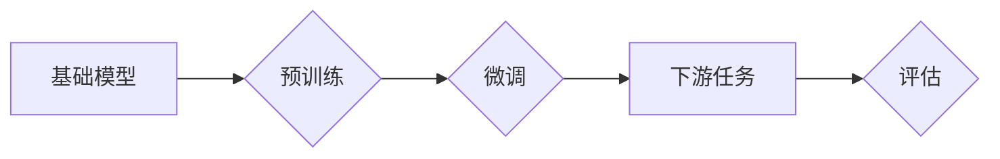

> 大规模语言模型，基础模型，评估指标，性能分析，应用场景

## 1. 背景介绍

近年来，大规模语言模型（Large Language Models，LLMs）在自然语言处理领域取得了显著进展，展现出强大的文本生成、翻译、问答和代码生成能力。这些模型通常拥有数十亿甚至数千亿个参数，通过海量文本数据进行训练，能够学习复杂的语言模式和知识。

然而，随着模型规模的不断扩大，评估 LLMs 的性能和泛化能力变得越来越重要。传统的评估指标，例如困惑度（Perplexity）和BLEU分数，在衡量 LLMs 的真实能力方面存在局限性。因此，需要开发更全面、更准确的评估方法，以更好地理解 LLMs 的优势和局限性，并指导模型的进一步发展。

## 2. 核心概念与联系

**2.1 基础模型**

基础模型是指在特定领域或任务上进行预训练的通用模型，能够通过微调适应不同的下游任务。基础模型的优势在于：

* **参数共享:** 基础模型的参数可以被多个下游任务共享，从而提高训练效率和模型性能。
* **知识迁移:** 基础模型在预训练过程中学习到的知识可以迁移到不同的下游任务，即使这些任务与预训练任务没有直接关系。
* **可扩展性:** 基础模型可以根据需要进行微调和扩展，以适应不同的任务需求。

**2.2 评估指标**

评估指标用于衡量 LLMs 在特定任务上的性能。常见的评估指标包括：

* **困惑度 (Perplexity):** 衡量模型预测下一个词的概率分布的质量。困惑度越低，模型的预测能力越强。
* **BLEU 分数:** 衡量机器翻译模型的准确性，通过比较机器翻译结果与参考翻译结果的词语重叠程度来计算。
* **ROUGE 分数:** 衡量文本摘要模型的准确性，通过比较模型生成的摘要与参考摘要的词语重叠程度来计算。
* **Accuracy:** 衡量分类任务模型的准确性，即模型正确分类的样本比例。

**2.3 评估方法**

评估 LLMs 的性能需要采用多种评估方法，以全面地了解模型的优势和局限性。常见的评估方法包括：

* **基准测试:** 使用公开的基准数据集和评估指标来比较不同 LLMs 的性能。
* **案例分析:** 对特定任务或场景进行案例分析，评估 LLMs 的实际应用效果。
* **用户反馈:** 收集用户对 LLMs 的反馈意见，了解模型的易用性和实用性。

**2.4 Mermaid 流程图**



## 3. 核心算法原理 & 具体操作步骤

### 3.1 算法原理概述

大规模语言模型通常基于 Transformer 架构，利用自注意力机制学习文本序列之间的关系。Transformer 架构的核心组件包括：

* **编码器 (Encoder):** 将输入文本序列编码成固定长度的向量表示。
* **解码器 (Decoder):** 根据编码器的输出生成目标文本序列。
* **自注意力机制 (Self-Attention):** 允许模型关注输入序列中的不同位置，学习词语之间的上下文关系。

### 3.2 算法步骤详解

1. **文本预处理:** 将输入文本进行分词、去停用词、词干化等预处理操作，以提高模型的训练效率和性能。
2. **词嵌入:** 将每个词语映射到一个低维向量空间，以便模型能够学习词语之间的语义关系。
3. **编码器:** 将预处理后的文本序列输入编码器，编码器通过多层 Transformer 块进行处理，将文本序列编码成固定长度的向量表示。
4. **解码器:** 将编码器的输出作为输入，解码器通过多层 Transformer 块进行处理，生成目标文本序列。
5. **损失函数:** 使用交叉熵损失函数衡量模型的预测结果与真实结果之间的差异。
6. **反向传播:** 使用梯度下降算法更新模型参数，以最小化损失函数的值。

### 3.3 算法优缺点

**优点:**

* **强大的文本理解和生成能力:** Transformer 架构能够学习复杂的语言模式和知识，从而实现强大的文本理解和生成能力。
* **并行训练效率高:** Transformer 架构的并行训练效率高，能够在大型数据集上进行高效训练。
* **可扩展性强:** Transformer 架构可以轻松扩展到更大的模型规模，从而进一步提高模型性能。

**缺点:**

* **训练成本高:** 训练大型 Transformer 模型需要大量的计算资源和时间。
* **参数量大:** Transformer 模型的参数量很大，需要大量的存储空间。
* **可解释性差:** Transformer 模型的内部机制比较复杂，难以解释模型的决策过程。

### 3.4 算法应用领域

Transformer 架构在自然语言处理领域有着广泛的应用，例如：

* **机器翻译:** 将一种语言翻译成另一种语言。
* **文本摘要:** 生成文本的简短摘要。
* **问答系统:** 回答用户提出的问题。
* **代码生成:** 自动生成代码。
* **对话系统:** 与用户进行自然语言对话。

## 4. 数学模型和公式 & 详细讲解 & 举例说明

### 4.1 数学模型构建

Transformer 模型的核心是自注意力机制，其数学模型可以表示为：

$$
Attention(Q, K, V) = softmax(\frac{QK^T}{\sqrt{d_k}})V
$$

其中：

* $Q$：查询矩阵
* $K$：键矩阵
* $V$：值矩阵
* $d_k$：键向量的维度
* $softmax$：softmax 函数

### 4.2 公式推导过程

自注意力机制的目的是计算每个词语与其他词语之间的相关性。

1. 将输入序列中的每个词语分别映射到查询向量 $Q$、键向量 $K$ 和值向量 $V$。
2. 计算查询向量 $Q$ 与键向量 $K$ 的点积，并进行归一化处理，得到注意力权重。
3. 将注意力权重与值向量 $V$ 进行加权求和，得到每个词语的注意力输出。

### 4.3 案例分析与讲解

例如，假设我们有一个句子 "The cat sat on the mat"，其词语分别为 "The"、"cat"、"sat"、"on"、"the"、"mat"。

使用自注意力机制，我们可以计算每个词语与其他词语之间的相关性。例如，"cat" 与 "sat" 之间存在较强的相关性，因为它们描述了同一个事件。

## 5. 项目实践：代码实例和详细解释说明

### 5.1 开发环境搭建

* Python 3.7+
* PyTorch 1.7+
* CUDA 10.2+

### 5.2 源代码详细实现

```python
import torch
import torch.nn as nn

class Transformer(nn.Module):
    def __init__(self, vocab_size, embedding_dim, num_heads, num_layers):
        super(Transformer, self).__init__()
        self.embedding = nn.Embedding(vocab_size, embedding_dim)
        self.transformer_layers = nn.ModuleList([
            nn.TransformerEncoderLayer(embedding_dim, num_heads)
            for _ in range(num_layers)
        ])
        self.linear = nn.Linear(embedding_dim, vocab_size)

    def forward(self, x):
        x = self.embedding(x)
        for layer in self.transformer_layers:
            x = layer(x)
        x = self.linear(x)
        return x
```

### 5.3 代码解读与分析

* `__init__` 方法初始化模型参数，包括词嵌入层、Transformer 层和输出层。
* `forward` 方法定义模型的正向传播过程，将输入序列编码成目标文本序列。

### 5.4 运行结果展示

使用训练好的 Transformer 模型，可以对文本进行各种任务，例如机器翻译、文本摘要和问答系统。

## 6. 实际应用场景

### 6.1 机器翻译

Transformer 模型在机器翻译领域取得了显著的成果，例如 Google Translate 和 DeepL 使用 Transformer 模型进行翻译，能够提供更准确、更流畅的翻译结果。

### 6.2 文本摘要

Transformer 模型可以用于生成文本的简短摘要，例如新闻摘要、会议记录摘要和学术论文摘要。

### 6.3 问答系统

Transformer 模型可以用于构建问答系统，能够回答用户提出的问题，例如搜索引擎问答和聊天机器人问答。

### 6.4 未来应用展望

随着 Transformer 模型的不断发展，其应用场景将更加广泛，例如：

* **代码生成:** 自动生成代码，提高开发效率。
* **创意写作:** 辅助人类进行创意写作，例如诗歌、小说和剧本创作。
* **个性化教育:** 提供个性化的学习内容和辅导。

## 7. 工具和资源推荐

### 7.1 学习资源推荐

* **论文:** "Attention Is All You Need"
* **博客:** Jay Alammar's Blog
* **课程:** Stanford CS224N: Natural Language Processing with Deep Learning

### 7.2 开发工具推荐

* **PyTorch:** 深度学习框架
* **Hugging Face Transformers:** 预训练 Transformer 模型库
* **TensorFlow:** 深度学习框架

### 7.3 相关论文推荐

* "BERT: Pre-training of Deep Bidirectional Transformers for Language Understanding"
* "GPT-3: Language Models are Few-Shot Learners"
* "T5: Text-to-Text Transfer Transformer"

## 8. 总结：未来发展趋势与挑战

### 8.1 研究成果总结

近年来，大规模语言模型在自然语言处理领域取得了显著进展，展现出强大的文本理解和生成能力。Transformer 架构成为 LLMs 的主流架构，自注意力机制成为 LLMs 的核心技术。

### 8.2 未来发展趋势

* **模型规模的进一步扩大:** 随着计算资源的不断发展，LLMs 的模型规模将继续扩大，从而进一步提高模型性能。
* **多模态 LLMs 的发展:** 将文本、图像、音频等多种模态信息融合到 LLMs 中，实现更全面的信息理解和生成。
* **可解释性研究的加强:** 研究 LLMs 的内部机制，提高模型的可解释性和透明度。

### 8.3 面临的挑战

* **训练成本高:** 训练大型 LLMs 需要大量的计算资源和时间，成本很高。
* **数据偏见:** LLMs 的训练数据可能存在偏见，导致模型输出存在偏差。
* **安全风险:** LLMs 可能被用于生成虚假信息、进行恶意攻击等，需要加强安全防护。

### 8.4 研究展望

未来，LLMs 将在更多领域得到应用，例如医疗、教育、金融等。研究人员将继续探索 LLMs 的潜力，解决其面临的挑战，推动 LLMs 的健康发展。

## 9. 附录：常见问题与解答

**Q1: Transformer 模型的优势是什么？**

**A1:** Transformer 模型的优势在于：

* **强大的文本理解和生成能力:** Transformer 架构能够学习复杂的语言模式和知识，从而实现强大的文本理解和生成能力。
* **并行训练效率高:** Transformer 架构的并行训练效率高，能够在大型数据集上进行高效训练。
* **可扩展性强:** Transformer 架构可以轻松扩展到更大的模型规模，从而进一步提高模型性能。

**Q2: Transformer 模型的缺点是什么？**

**A2:** Transformer 模型的缺点在于：

* **训练成本高:** 训练大型 Transformer 模型需要大量的计算资源和时间。
* **参数量大:** Transformer 模型的参数量很大，需要大量的存储空间。
* **可解释性差:** Transformer 模型的内部机制比较复杂，难以解释模型的决策过程。

**Q3: 如何评估 LLMs 的性能？**

**A3:** 评估 LLMs 的性能需要采用