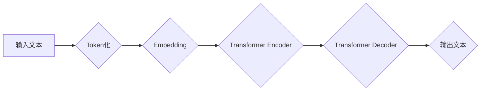

> 大语言模型、Transformer、自然语言处理、深度学习、文本生成、机器翻译

## 1. 背景介绍

近年来，人工智能领域取得了令人瞩目的进展，其中自然语言处理（NLP）领域尤为突出。大语言模型（LLM）作为NLP领域的新兴技术，凭借其强大的文本理解和生成能力，在机器翻译、文本摘要、对话系统等多个领域展现出巨大的应用潜力。

传统的NLP模型主要依赖于手工设计的特征工程和规则化方法，难以捕捉语言的复杂性和语义关系。随着深度学习技术的兴起，基于深度神经网络的语言模型逐渐成为主流。其中，Transformer模型凭借其强大的并行计算能力和长距离依赖建模能力，在自然语言处理任务中取得了突破性的进展，成为LLM的核心架构。

## 2. 核心概念与联系

大语言模型的核心概念包括：

* **Transformer模型:** Transformer是一种基于注意力机制的深度神经网络架构，能够有效地捕捉文本序列中的长距离依赖关系。
* **自回归语言模型:** 自回归语言模型是一种预测下一个词的概率分布的模型，通过训练大量的文本数据，学习语言的语法和语义规律。
* **预训练和微调:** 预训练是指在大量文本数据上训练一个通用的语言模型，微调是指将预训练模型应用于特定任务，通过少量任务数据进行调整。

**Mermaid 流程图:**



## 3. 核心算法原理 & 具体操作步骤

### 3.1  算法原理概述

Transformer模型的核心是注意力机制，它能够学习文本序列中不同词之间的关系，并赋予每个词不同的权重。

Transformer模型由两个主要部分组成：Encoder和Decoder。Encoder负责将输入文本编码成一个隐藏表示，Decoder则根据编码后的表示生成输出文本。

### 3.2  算法步骤详解

1. **Token化:** 将输入文本分割成一个个独立的词或子词（Token）。
2. **Embedding:** 将每个Token映射到一个低维度的向量表示。
3. **Encoder:** 将每个Token的向量表示输入到Encoder中，通过多层Transformer块进行编码，最终得到一个隐藏表示。
4. **Decoder:** 将隐藏表示输入到Decoder中，通过多层Transformer块进行解码，最终生成输出文本。

### 3.3  算法优缺点

**优点:**

* 能够有效地捕捉长距离依赖关系。
* 并行计算能力强，训练速度快。
* 在多种NLP任务中取得了优异的性能。

**缺点:**

* 参数量大，训练成本高。
* 对训练数据质量要求高。

### 3.4  算法应用领域

Transformer模型在以下领域具有广泛的应用：

* 机器翻译
* 文本摘要
* 问答系统
* 对话系统
* 代码生成

## 4. 数学模型和公式 & 详细讲解 & 举例说明

### 4.1  数学模型构建

Transformer模型的核心是注意力机制，其数学模型可以表示为：

$$
Attention(Q, K, V) = softmax(\frac{QK^T}{\sqrt{d_k}})V
$$

其中：

* $Q$：查询矩阵
* $K$：键矩阵
* $V$：值矩阵
* $d_k$：键向量的维度

### 4.2  公式推导过程

注意力机制的目的是计算每个查询词与所有键词之间的相关性，并根据相关性赋予每个键词不同的权重。

softmax函数将相关性分数转换为概率分布，使得每个键词的权重在0到1之间。

### 4.3  案例分析与讲解

例如，在机器翻译任务中，查询词为源语言中的一个词，键词和值词分别为目标语言中的词向量。

注意力机制可以计算查询词与所有目标语言词之间的相关性，并根据相关性选择最合适的目标语言词作为翻译结果。

## 5. 项目实践：代码实例和详细解释说明

### 5.1  开发环境搭建

* Python 3.7+
* PyTorch 1.7+
* CUDA 10.2+

### 5.2  源代码详细实现

```python
import torch
import torch.nn as nn

class Transformer(nn.Module):
    def __init__(self, vocab_size, embedding_dim, num_heads, num_layers):
        super(Transformer, self).__init__()
        self.embedding = nn.Embedding(vocab_size, embedding_dim)
        self.transformer_layers = nn.ModuleList([
            nn.TransformerEncoderLayer(embedding_dim, num_heads)
            for _ in range(num_layers)
        ])
        self.linear = nn.Linear(embedding_dim, vocab_size)

    def forward(self, x):
        x = self.embedding(x)
        x = self.transformer_layers(x)
        x = self.linear(x)
        return x
```

### 5.3  代码解读与分析

* `__init__`方法初始化模型参数，包括词嵌入层、Transformer编码器层和输出层。
* `forward`方法定义模型的正向传播过程，将输入词序列编码成隐藏表示，并通过输出层生成预测结果。

### 5.4  运行结果展示

训练好的Transformer模型可以用于各种NLP任务，例如机器翻译、文本摘要等。

## 6. 实际应用场景

### 6.1  机器翻译

LLM可以用于构建高性能的机器翻译系统，例如Google Translate、DeepL等。

### 6.2  文本摘要

LLM可以自动生成文本摘要，例如新闻摘要、会议纪要等。

### 6.3  对话系统

LLM可以用于构建更智能的对话系统，例如聊天机器人、虚拟助手等。

### 6.4  未来应用展望

LLM在未来将应用于更多领域，例如：

* 代码生成
* 文本创作
* 教育
* 医疗

## 7. 工具和资源推荐

### 7.1  学习资源推荐

* **书籍:**
    * 《深度学习》
    * 《自然语言处理》
* **在线课程:**
    * Coursera: 自然语言处理
    * Udacity: 深度学习

### 7.2  开发工具推荐

* **PyTorch:** 深度学习框架
* **TensorFlow:** 深度学习框架
* **Hugging Face Transformers:** 预训练模型库

### 7.3  相关论文推荐

* 《Attention Is All You Need》
* 《BERT: Pre-training of Deep Bidirectional Transformers for Language Understanding》
* 《GPT-3: Language Models are Few-Shot Learners》

## 8. 总结：未来发展趋势与挑战

### 8.1  研究成果总结

近年来，LLM取得了显著进展，在多种NLP任务中取得了突破性成果。

### 8.2  未来发展趋势

* 模型规模进一步扩大
* 训练数据质量提升
* 算法效率优化
* 多模态LLM发展

### 8.3  面临的挑战

* 训练成本高
* 数据偏见问题
* 安全性和伦理问题

### 8.4  研究展望

未来研究将重点关注：

* 更高效的训练方法
* 更鲁棒的模型
* 更广泛的应用场景

## 9. 附录：常见问题与解答

* **什么是LLM？**

LLM是指能够理解和生成人类语言的大型语言模型。

* **LLM的训练数据是什么？**

LLM的训练数据通常是大量的文本数据，例如书籍、文章、网站内容等。

* **LLM有哪些应用场景？**

LLM的应用场景非常广泛，例如机器翻译、文本摘要、对话系统等。

作者：禅与计算机程序设计艺术 / Zen and the Art of Computer Programming


<end_of_turn>