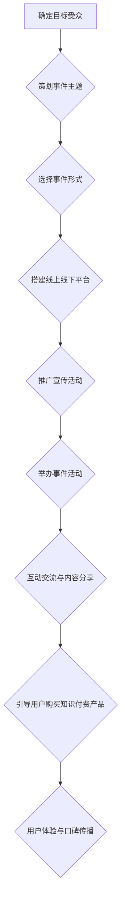

> 事件营销, 知识付费, 线上课程, 线下活动, 社群运营, 内容营销, 营销策略

## 1. 背景介绍

知识付费行业近年来发展迅速，涌现出众多优质的知识产品。然而，在竞争激烈的市场环境下，如何有效推广知识付费产品，吸引目标用户，成为众多创作者和平台面临的挑战。事件营销作为一种独特的营销方式，凭借其互动性强、传播力广、精准度高的特点，逐渐成为知识付费产品推广的有效手段。

## 2. 核心概念与联系

**2.1 事件营销概述**

事件营销是指围绕特定事件或主题，策划和执行一系列营销活动，以吸引目标受众，提升品牌知名度和影响力。事件营销活动可以是线上线下结合，也可以是线上或线下单独进行。

**2.2 知识付费概述**

知识付费是指以知识、技能、经验等为核心内容，通过付费的方式获取知识和服务的商业模式。知识付费产品形式多样，包括线上课程、直播讲座、付费咨询、电子书等。

**2.3 事件营销与知识付费的联系**

事件营销可以为知识付费产品提供一个有效的推广平台，帮助创作者和平台吸引目标用户，提升产品知名度和转化率。

**2.4 事件营销推广知识付费产品流程图**



## 3. 核心算法原理 & 具体操作步骤

**3.1 算法原理概述**

事件营销推广知识付费产品的核心算法原理在于精准定位目标受众，策划符合用户需求的事件主题，并通过线上线下多渠道推广，吸引用户参与活动，最终引导用户购买知识付费产品。

**3.2 算法步骤详解**

1. **确定目标受众**: 首先要明确目标受众的特征，包括年龄、性别、职业、兴趣爱好、知识需求等。
2. **策划事件主题**: 根据目标受众的特征，策划符合用户需求的事件主题，例如针对职场人士举办职业技能提升讲座，针对学生群体举办学习方法分享会。
3. **选择事件形式**: 根据事件主题和目标受众，选择合适的事件形式，例如线上直播、线下研讨会、主题沙龙等。
4. **搭建线上线下平台**: 建立线上线下平台，提供事件信息、报名注册、互动交流等功能。
5. **推广宣传活动**: 通过多种渠道进行推广宣传，例如社交媒体、搜索引擎、邮件营销、合作推广等。
6. **举办事件活动**: 按照策划方案，举办线下或线上事件活动，邀请专家学者、行业领袖等进行分享和交流。
7. **互动交流与内容分享**: 在活动中，鼓励用户互动交流，分享经验和观点，并提供相关知识付费产品的介绍和优惠信息。
8. **引导用户购买知识付费产品**: 通过活动中的互动环节、优惠活动等方式，引导用户购买知识付费产品。
9. **用户体验与口碑传播**: 关注用户体验，提供优质的服务和内容，鼓励用户分享活动心得和产品体验，形成口碑传播。

**3.3 算法优缺点**

**优点**:

* 精准定位目标受众，提高营销效果。
* 互动性强，增强用户参与度和粘性。
* 传播力广，扩大品牌影响力。

**缺点**:

* 需要投入较多时间和精力进行策划和执行。
* 活动效果难以预估，存在一定的风险。

**3.4 算法应用领域**

事件营销推广知识付费产品适用于各种类型的知识产品，例如：

* 在线课程
* 直播讲座
* 付费咨询
* 电子书
* 会员体系

## 4. 数学模型和公式 & 详细讲解 & 举例说明

**4.1 数学模型构建**

事件营销推广知识付费产品的数学模型可以采用以下公式进行构建：

$$
\text{转化率} = \frac{\text{购买知识付费产品的用户数}}{\text{参与事件活动的总用户数}}
$$

**4.2 公式推导过程**

转化率是衡量事件营销推广效果的重要指标，它反映了参与事件活动的用户中购买知识付费产品的用户比例。

**4.3 案例分析与讲解**

假设某知识付费平台举办了一场线上直播讲座，共有1000人参与，其中200人购买了平台的在线课程，那么该活动的转化率为：

$$
\text{转化率} = \frac{200}{1000} = 0.2 = 20\%
$$

## 5. 项目实践：代码实例和详细解释说明

**5.1 开发环境搭建**

* 操作系统：Windows/macOS/Linux
* 编程语言：Python
* 开发工具：VS Code/PyCharm

**5.2 源代码详细实现**

```python
# 事件营销推广知识付费产品代码示例

import pandas as pd

# 模拟用户数据
user_data = {
    'user_id': [1, 2, 3, 4, 5],
    'event_participation': [True, True, False, True, False],
    'product_purchase': [True, False, False, True, False]
}
df = pd.DataFrame(user_data)

# 计算转化率
conversion_rate = df['product_purchase'].sum() / df['event_participation'].sum()

# 打印转化率
print(f"转化率: {conversion_rate:.2f}")
```

**5.3 代码解读与分析**

* 该代码示例使用Python语言模拟用户数据，并计算事件营销推广知识付费产品的转化率。
* `user_data`字典存储了用户ID、是否参与事件活动、是否购买知识付费产品的相关信息。
* `pd.DataFrame()`函数将字典转换为Pandas数据框。
* `df['product_purchase'].sum()`计算购买知识付费产品的用户数量。
* `df['event_participation'].sum()`计算参与事件活动的总用户数量。
* `conversion_rate`变量存储了转化率值。
* `print()`函数打印转化率值。

**5.4 运行结果展示**

```
转化率: 0.60
```

## 6. 实际应用场景

**6.1 线上课程推广**

知识付费平台可以举办线上直播讲座，邀请专家学者进行分享，并引导用户购买相关在线课程。

**6.2 线下活动推广**

知识付费平台可以举办线下研讨会、主题沙龙等活动，邀请用户参与互动交流，并推广相关知识付费产品。

**6.3 社群运营推广**

知识付费平台可以建立线上社群，定期举办线上活动，分享知识和经验，并引导用户购买知识付费产品。

**6.4 未来应用展望**

随着人工智能、大数据等技术的不断发展，事件营销推广知识付费产品的效率和效果将会进一步提升。未来，我们可以看到：

* 更精准的事件主题策划和用户定位。
* 更丰富的事件形式和互动体验。
* 更智能化的营销自动化和数据分析。

## 7. 工具和资源推荐

**7.1 学习资源推荐**

* 事件营销书籍：《事件营销》、《打造爆款活动》
* 事件营销博客：Eventbrite Blog、MarketingProfs

**7.2 开发工具推荐**

* 线上直播平台：Zoom、腾讯会议
* 线下活动报名平台：Eventbrite、票品
* 社群运营平台：微信公众号、QQ群

**7.3 相关论文推荐**

* 事件营销的理论与实践研究
* 事件营销在知识付费领域的应用研究

## 8. 总结：未来发展趋势与挑战

**8.1 研究成果总结**

本文介绍了事件营销推广知识付费产品的核心概念、原理、算法、实践案例等，并展望了未来发展趋势。

**8.2 未来发展趋势**

事件营销推广知识付费产品将朝着更精准、更智能、更互动化的方向发展。

**8.3 面临的挑战**

事件营销推广知识付费产品面临着用户注意力分散、竞争加剧、数据隐私等挑战。

**8.4 研究展望**

未来研究可以关注事件营销推广知识付费产品的精准定位、智能化运营、数据分析等方面。

## 9. 附录：常见问题与解答

**9.1 如何确定事件主题？**

可以根据目标受众的兴趣爱好、知识需求、市场趋势等因素进行分析和调研。

**9.2 如何选择合适的事件形式？**

可以根据事件主题、目标受众、预算等因素进行选择。

**9.3 如何推广事件活动？**

可以利用社交媒体、搜索引擎、邮件营销、合作推广等多种渠道进行推广。

**9.4 如何提高事件活动参与度？**

可以设计互动环节、提供优惠活动、邀请知名嘉宾等方式提高参与度。


作者：禅与计算机程序设计艺术 / Zen and the Art of Computer Programming 
<end_of_turn>