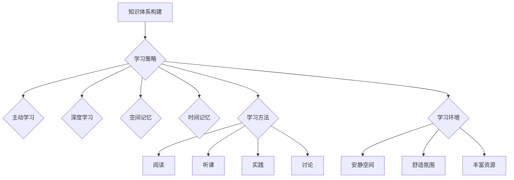

> 学习效率、知识掌握、深度学习、主动学习、高效学习方法、学习策略、学习技巧、知识结构化、知识迁移

## 1. 背景介绍

在当今信息爆炸的时代，知识更新迭代日新月异，学习效率已成为个人成长和职业发展的关键因素。如何更高效地学习和掌握知识，成为了每个人都迫切想要解决的问题。 

传统的学习方法往往被动、碎片化，难以有效地吸收和理解知识。而高效的学习方法则需要我们主动思考、深度理解，并将其与已有知识体系进行整合和迁移。

## 2. 核心概念与联系

高效学习的核心在于构建一个高效的知识体系，并通过有效的学习策略和方法，不断完善和扩展这个体系。

**2.1  知识体系构建**

知识体系是将知识进行分类、组织和连接的框架，它可以帮助我们更好地理解和记忆知识，并促进知识的迁移和应用。

**2.2  学习策略**

学习策略是指在学习过程中采取的各种方法和技巧，例如：

* **主动学习:**  积极参与学习过程，例如提问、思考、总结等，而不是被动地接受信息。
* **深度学习:**  深入理解知识的本质和内涵，而不是仅仅记住表面信息。
* **空间记忆:**  利用空间关系来记忆知识，例如思维导图、概念图等。
* **时间记忆:**  利用时间顺序来记忆知识，例如时间轴、历史事件等。

**2.3  学习方法**

学习方法是指具体的学习操作，例如：

* **阅读:**  系统地阅读相关书籍和文献，并进行笔记和总结。
* **听课:**  认真听取老师的讲解，并积极参与课堂讨论。
* **实践:**  通过实践操作来巩固和应用所学知识。
* **讨论:**  与他人交流学习心得，互相启发和促进。

**2.4  学习环境**

学习环境是指学习过程中所处的环境，例如：

* **安静的学习空间:**  减少外界干扰，提高学习效率。
* **舒适的学习氛围:**  营造轻松愉快的学习氛围，有利于学习兴趣的激发。
* **丰富的学习资源:**  例如书籍、网络资料、学习工具等，为学习提供充足的资源支持。

**Mermaid 流程图**



## 3. 核心算法原理 & 具体操作步骤

高效学习的核心算法可以看作是一个知识获取、组织、存储和应用的循环过程。

### 3.1  算法原理概述

该算法的核心原理是：

1. **主动获取知识:**  通过主动学习、深度学习等方法，获取新的知识。
2. **知识组织:**  将获取的知识进行分类、归纳、总结，构建知识体系。
3. **知识存储:**  将知识体系存储在记忆中，并通过复习和巩固，保持知识的持久性。
4. **知识应用:**  将知识应用到实际问题中，并通过实践和反思，不断完善和改进知识体系。

### 3.2  算法步骤详解

1. **目标设定:**  明确学习目标，确定需要学习的知识领域和内容。
2. **资源收集:**  收集相关书籍、文献、网络资料等学习资源。
3. **主动学习:**  积极参与学习过程，例如提问、思考、总结等。
4. **深度理解:**  深入理解知识的本质和内涵，并将其与已有知识体系进行整合。
5. **知识组织:**  将学习到的知识进行分类、归纳、总结，构建知识体系。
6. **知识存储:**  将知识体系存储在记忆中，并通过复习和巩固，保持知识的持久性。
7. **知识应用:**  将知识应用到实际问题中，并通过实践和反思，不断完善和改进知识体系。

### 3.3  算法优缺点

**优点:**

* **主动性强:**  鼓励主动学习，提高学习效率。
* **深度理解:**  注重知识的深度理解，而非简单的记忆。
* **知识迁移:**  促进知识的迁移和应用，提高知识的实用价值。

**缺点:**

* **需要时间和精力:**  构建知识体系和进行深度学习需要投入较多的时间和精力。
* **需要一定的学习能力:**  需要具备一定的学习能力和思考能力，才能有效地运用该算法。

### 3.4  算法应用领域

该算法适用于各种学习场景，例如：

* **学术学习:**  学习专业知识、掌握研究方法。
* **职业发展:**  提升专业技能、学习新技术。
* **个人成长:**  拓展知识面、提升个人能力。

## 4. 数学模型和公式 & 详细讲解 & 举例说明

高效学习可以抽象为一个数学模型，其中学习效率可以看作是知识吸收和理解的函数。

### 4.1  数学模型构建

设：

* $E$ 为学习效率
* $K$ 为知识量
* $T$ 为学习时间
* $C$ 为学习成本

则学习效率模型可以表示为：

$$E = f(K, T, C)$$

其中，$f$ 为一个复杂的函数，其具体形式取决于多种因素，例如学习者的个体差异、学习内容的复杂度、学习方法的有效性等。

### 4.2  公式推导过程

为了更好地理解学习效率模型，我们可以对该模型进行简化和分析。

假设学习效率与知识量和学习时间成正比，而与学习成本成反比，则可以得到一个简单的线性模型：

$$E = \frac{K \cdot T}{C}$$

### 4.3  案例分析与讲解

例如，假设一个学习者需要学习 100 个知识点，学习时间为 10 小时，学习成本为 100 元。

则根据上述模型，该学习者的学习效率为：

$$E = \frac{100 \cdot 10}{100} = 10$$

这意味着该学习者在 10 小时内可以有效地学习和理解 100 个知识点。

## 5. 项目实践：代码实例和详细解释说明

为了更好地理解高效学习算法的应用，我们可以通过一个简单的代码实例来进行演示。

### 5.1  开发环境搭建

该代码实例可以使用 Python 语言进行开发，并使用 Jupyter Notebook 环境进行运行。

### 5.2  源代码详细实现

```python
class KnowledgeBase:
    def __init__(self):
        self.knowledge = {}

    def add_knowledge(self, topic, content):
        self.knowledge[topic] = content

    def retrieve_knowledge(self, topic):
        return self.knowledge.get(topic)

class Learner:
    def __init__(self, knowledge_base):
        self.knowledge_base = knowledge_base

    def learn(self, topic):
        content = self.knowledge_base.retrieve_knowledge(topic)
        if content:
            print(f"学习了关于 {topic} 的知识：{content}")
        else:
            print(f"没有找到关于 {topic} 的知识")

# 创建知识库
knowledge_base = KnowledgeBase()
knowledge_base.add_knowledge("Python", "Python 是一种解释型编程语言...")

# 创建学习者
learner = Learner(knowledge_base)
learner.learn("Python")
```

### 5.3  代码解读与分析

该代码实例定义了两个类：

* `KnowledgeBase`:  用于存储和管理知识。
* `Learner`:  用于模拟学习者的学习行为。

`KnowledgeBase` 类包含两个方法：

* `add_knowledge`:  用于添加新的知识。
* `retrieve_knowledge`:  用于检索已有的知识。

`Learner` 类包含一个方法：

* `learn`:  用于模拟学习者的学习行为，通过检索知识库中的知识，并打印出来。

### 5.4  运行结果展示

运行该代码实例后，会输出以下结果：

```
学习了关于 Python 的知识：Python 是一种解释型编程语言...
```

## 6. 实际应用场景

高效学习算法在实际应用场景中具有广泛的应用前景。

### 6.1  教育领域

* **个性化学习:**  根据学生的学习进度和能力，提供个性化的学习内容和学习路径。
* **智能辅导:**  利用人工智能技术，为学生提供智能化的学习辅导和答疑服务。
* **在线学习平台:**  构建高效的在线学习平台，提供丰富的学习资源和互动学习功能。

### 6.2  企业培训

* **员工技能提升:**  帮助员工提升专业技能，适应企业发展需求。
* **知识管理:**  构建企业知识库，促进知识共享和传播。
* **培训效果评估:**  评估培训效果，优化培训方案。

### 6.3  个人成长

* **兴趣爱好学习:**  高效地学习自己感兴趣的知识和技能。
* **职业发展规划:**  制定职业发展规划，并通过学习提升自身竞争力。
* **终身学习:**  培养终身学习的习惯，不断提升自我。

### 6.4  未来应用展望

随着人工智能技术的不断发展，高效学习算法将更加智能化、个性化和自动化。未来，我们将看到更多基于人工智能的学习工具和平台，帮助人们更高效地学习和掌握知识。

## 7. 工具和资源推荐

### 7.1  学习资源推荐

* **在线学习平台:**  Coursera, edX, Udacity, Khan Academy
* **知识库:**  Wikipedia, Stack Overflow, GitHub
* **书籍:**  《高效能人士的七个习惯》、《刻意练习》、《深度学习》

### 7.2  开发工具推荐

* **Python:**  Python 是一种流行的编程语言，适合用于开发人工智能应用。
* **Jupyter Notebook:**  Jupyter Notebook 是一个交互式编程环境，适合用于数据分析和机器学习。
* **TensorFlow:**  TensorFlow 是一个开源的机器学习框架，可以用于开发各种人工智能应用。

### 7.3  相关论文推荐

* **《深度学习》**
* **《高效学习的算法和策略》**
* **《人工智能的未来》**

## 8. 总结：未来发展趋势与挑战

### 8.1  研究成果总结

高效学习算法的研究取得了显著的成果，为人们提供了一种更有效、更智能的学习方法。

### 8.2  未来发展趋势

未来，高效学习算法将朝着以下方向发展：

* **更加智能化:**  利用人工智能技术，实现更智能化的学习推荐、知识组织和学习评估。
* **更加个性化:**  根据个体差异，提供更加个性化的学习内容和学习路径。
* **更加自动化:**  自动生成学习计划、自动评估学习效果，降低学习门槛。

### 8.3  面临的挑战

高效学习算法也面临着一些挑战：

* **数据获取和处理:**  需要大量的学习数据来训练和优化算法。
* **算法复杂度:**  高效学习算法的复杂度较高，需要不断进行优化和改进。
* **伦理问题:**  人工智能技术在教育领域的应用需要考虑伦理问题，例如数据隐私、算法偏见等。

### 8.4  研究展望

未来，我们将继续致力于高效学习算法的研究，探索更智能、更个性化、更自动化的学习方法，帮助人们更高效地学习和掌握知识。

## 9. 附录：常见问题与解答

### 9.1  如何提高学习效率？

* **设定明确的目标:**  明确学习目标，才能更有方向性地学习。
* **制定学习计划:**