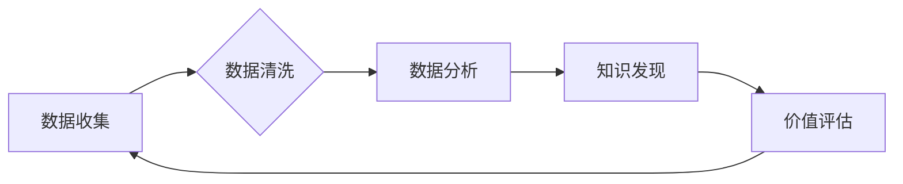

> 平台经济, 数据价值, 数据挖掘, 算法模型,  机器学习, 深度学习,  商业应用

## 1. 背景介绍

在当今数字经济时代，数据已成为重要的生产要素，其价值日益凸显。平台经济作为数据密集型产业，拥有海量用户数据和交易数据，蕴藏着巨大的数据价值。如何有效挖掘这些数据，转化为商业价值，成为平台经济发展的重要课题。

平台经济是指以平台为核心，通过连接用户、提供商和服务，实现资源共享和价值创造的经济模式。代表性平台包括电商平台、社交平台、出行平台、共享经济平台等。这些平台通过用户注册、交易行为、浏览记录等方式收集海量数据，这些数据包含用户画像、消费偏好、市场趋势等宝贵信息。

数据价值挖掘是指通过数据分析、挖掘和建模等技术手段，从海量数据中提取有价值的信息，并将其应用于业务决策、产品创新、市场营销等领域。

## 2. 核心概念与联系

**2.1 数据价值**

数据价值是指数据能够为企业或个人带来的经济效益、社会效益或其他价值。数据价值的体现形式多种多样，包括：

* **商业价值:** 通过数据分析，了解用户需求、预测市场趋势，优化产品和服务，提高营销效率，最终实现商业盈利。
* **运营价值:** 通过数据分析，优化平台运营流程，提高用户体验，降低运营成本，提升平台效率。
* **创新价值:** 通过数据分析，发现新的商业模式、产品和服务，推动平台创新发展。

**2.2 数据挖掘**

数据挖掘是指从海量数据中发现隐藏的模式、趋势和知识的过程。它利用统计学、机器学习、数据库技术等多种方法，对数据进行分析和处理，提取有价值的信息。

**2.3 平台经济数据价值挖掘流程**

平台经济数据价值挖掘流程通常包括以下几个步骤：

1. **数据收集:** 收集平台用户、交易、行为等各种数据。
2. **数据清洗:** 对收集到的数据进行清洗、处理，去除噪声和异常值，保证数据质量。
3. **数据分析:** 利用统计学、机器学习等方法对数据进行分析，发现隐藏的模式和趋势。
4. **知识发现:** 将分析结果转化为可理解的知识，并将其应用于业务决策、产品创新等领域。
5. **价值评估:** 评估数据挖掘结果带来的价值，并不断优化数据挖掘流程。



## 3. 核心算法原理 & 具体操作步骤

### 3.1 算法原理概述

平台经济数据价值挖掘中常用的算法包括：

* **关联规则挖掘:** 发现数据中频繁出现的项集之间的关联关系，例如，用户购买A商品的概率与购买B商品的概率相关。
* **聚类分析:** 将数据划分为若干个具有相似特征的群组，例如，将用户根据消费习惯进行分类。
* **分类预测:** 根据历史数据，预测未来事件的发生概率，例如，预测用户是否会点击广告。
* **推荐系统:** 根据用户的历史行为和偏好，推荐用户可能感兴趣的商品或服务。

### 3.2 算法步骤详解

以关联规则挖掘为例，其具体步骤如下：

1. **构建频繁项集:** 统计数据中频繁出现的项集，例如，频繁购买A和B商品的用户。
2. **计算支持度和置信度:** 支持度表示项集在整个数据集中的出现频率，置信度表示在满足某个条件下，另一个条件发生的概率。
3. **生成关联规则:** 根据支持度和置信度阈值，生成满足条件的关联规则。

### 3.3 算法优缺点

不同的算法具有不同的优缺点，需要根据实际应用场景选择合适的算法。

* **关联规则挖掘:** 优点是能够发现数据中隐藏的关联关系，缺点是计算复杂度较高，难以处理海量数据。
* **聚类分析:** 优点是能够将数据划分为具有相似特征的群组，缺点是聚类结果难以解释，需要人工进行评估。
* **分类预测:** 优点是能够预测未来事件的发生概率，缺点是需要大量的训练数据，模型容易过拟合。
* **推荐系统:** 优点是能够根据用户的历史行为和偏好推荐个性化内容，缺点是需要不断更新模型，才能保持推荐效果。

### 3.4 算法应用领域

平台经济数据价值挖掘算法广泛应用于以下领域：

* **用户画像:** 通过分析用户行为数据，构建用户画像，了解用户的兴趣爱好、消费习惯等信息。
* **个性化推荐:** 根据用户的兴趣爱好和消费习惯，推荐个性化商品或服务。
* **精准营销:** 根据用户画像，进行精准营销，提高营销效率。
* **风险控制:** 通过分析用户行为数据，识别潜在的风险用户，降低平台风险。
* **运营优化:** 通过分析平台运营数据，优化平台运营流程，提高平台效率。

## 4. 数学模型和公式 & 详细讲解 & 举例说明

### 4.1 数学模型构建

**关联规则挖掘:**

关联规则挖掘的核心是寻找频繁项集，并计算其支持度和置信度。

* **支持度:**  表示项集在整个数据集中的出现频率。

$$
Support(A \cup B) = \frac{Number of transactions containing A and B}{Total number of transactions}
$$

* **置信度:** 表示在满足某个条件下，另一个条件发生的概率。

$$
Confidence(A \rightarrow B) = \frac{Support(A \cup B)}{Support(A)}
$$

**聚类分析:**

聚类分析的目标是将数据划分为若干个具有相似特征的群组。常用的聚类算法包括K-means算法、层次聚类算法等。

**K-means算法:**

K-means算法将数据划分为K个簇，每个簇的中心点称为质心。算法迭代地更新质心和数据点的分配，直到收敛。

### 4.2 公式推导过程

K-means算法的迭代更新公式如下：

* **质心更新公式:**

$$
Centroid_i = \frac{1}{N_i} \sum_{j=1}^{N_i} x_j
$$

* **数据点分配公式:**

$$
Cluster_i = argmin_{k=1}^{K} ||x - Centroid_k||^2
$$

其中，$Centroid_i$表示第i个簇的质心，$N_i$表示第i个簇包含的数据点数量，$x_j$表示第j个数据点，$Cluster_i$表示第i个数据点的所属簇。

### 4.3 案例分析与讲解

**案例:** 假设我们有一组用户数据，包含用户的年龄、性别、收入等信息。我们想使用K-means算法将用户划分为不同的消费群体。

**步骤:**

1. 选择K值，例如K=3。
2. 随机选择3个用户作为初始质心。
3. 计算每个用户到每个质心的距离，并将用户分配到距离最近的质心所在的簇。
4. 更新每个簇的质心，即计算每个簇中所有用户的平均值。
5. 重复步骤3和4，直到质心不再变化。

**结果:**

最终，我们将用户划分为3个消费群体，例如：高收入群体、中收入群体和低收入群体。

## 5. 项目实践：代码实例和详细解释说明

### 5.1 开发环境搭建

* **操作系统:** Linux/macOS/Windows
* **编程语言:** Python
* **库依赖:** pandas, numpy, scikit-learn

### 5.2 源代码详细实现

```python
import pandas as pd
from sklearn.cluster import KMeans

# 加载数据
data = pd.read_csv('user_data.csv')

# 选择特征列
features = ['age', 'income']
X = data[features]

# 选择K值
k = 3

# 创建KMeans模型
kmeans = KMeans(n_clusters=k, random_state=42)

# 训练模型
kmeans.fit(X)

# 获取聚类结果
labels = kmeans.labels_

# 将聚类结果添加到数据中
data['cluster'] = labels

# 保存结果
data.to_csv('user_data_clustered.csv', index=False)
```

### 5.3 代码解读与分析

* **数据加载:** 使用pandas库加载用户数据。
* **特征选择:** 选择年龄和收入作为聚类特征。
* **KMeans模型创建:** 创建KMeans模型，指定K值和随机种子。
* **模型训练:** 使用fit()方法训练模型，将数据聚类到k个簇。
* **聚类结果获取:** 使用labels_属性获取每个数据点的所属簇。
* **结果保存:** 将聚类结果添加到数据中，并保存到CSV文件。

### 5.4 运行结果展示

运行代码后，将生成一个包含聚类结果的CSV文件。我们可以使用数据可视化工具，例如matplotlib或seaborn，将聚类结果进行可视化展示。

## 6. 实际应用场景

### 6.1 用户画像分析

平台可以利用数据挖掘技术，分析用户的行为数据，构建用户画像，了解用户的兴趣爱好、消费习惯等信息。例如，电商平台可以根据用户的购买历史，推荐用户可能感兴趣的商品；社交平台可以根据用户的社交行为，推荐用户可能认识的朋友。

### 6.2 个性化推荐

平台可以根据用户的历史行为和偏好，推荐个性化商品或服务。例如，音乐平台可以根据用户的听歌记录，推荐用户可能喜欢的歌曲；视频平台可以根据用户的观看记录，推荐用户可能感兴趣的视频。

### 6.3 精准营销

平台可以根据用户画像，进行精准营销，提高营销效率。例如，电商平台可以根据用户的兴趣爱好，推送相关的广告；金融平台可以根据用户的风险偏好，推荐合适的理财产品。

### 6.4 风险控制

平台可以利用数据挖掘技术，识别潜在的风险用户，降低平台风险。例如，金融平台可以根据用户的交易记录，识别可能进行欺诈行为的用户；社交平台可以根据用户的社交行为，识别可能传播虚假信息的账号。

### 6.5 运营优化

平台可以利用数据挖掘技术，分析平台运营数据，优化平台运营流程，提高平台效率。例如，电商平台可以根据用户的购物行为，优化商品摆放和推荐算法；社交平台可以根据用户的活跃度，优化用户体验和内容推荐算法。

## 7. 工具和资源推荐

### 7.1 学习资源推荐

* **书籍:**
    * 《数据挖掘：概念与技术》
    * 《机器学习》
    * 《Python数据科学手册》
* **在线课程:**
    * Coursera: 数据挖掘与机器学习
    * edX: 数据科学与分析
    * Udemy: Python数据科学

### 7.2 开发工具推荐

* **Python:** 强大的数据分析和机器学习库，例如pandas, numpy, scikit-learn
* **R:** 专注于统计分析和数据可视化的语言
* **Spark:** 大数据处理框架

### 7.3 相关论文推荐

* 《Association Rule Mining: A Data Mining Task》
* 《K-Means Clustering Algorithm》
* 《Recommender Systems: Methods and Trends》

## 8. 总结：未来发展趋势与挑战

### 8.1 研究成果总结

平台经济数据价值挖掘取得了显著成果，为平台经济发展提供了重要的技术支撑。

### 8.2 未来发展趋势

* **数据质量提升:** 数据质量是数据挖掘的基础，未来将更加重视数据清洗、预处理和标准化。
* **模型复杂度提升:** 未来将开发更加复杂、更加智能的数据挖掘模型，例如深度学习模型。
* **隐私保护:** 数据挖掘涉及大量用户隐私数据，未来将更加重视数据隐私保护技术。
* **解释性增强:** 未来将更加注重数据挖掘模型的解释性，使模型结果更加透明