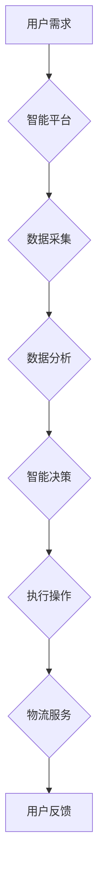

> 智慧物流，无人配送，供应链自动化，人工智能，机器学习，大数据分析，区块链，物联网

## 1. 背景介绍

21世纪，全球经济一体化加速，消费需求日益多元化，物流行业面临着前所未有的挑战和机遇。传统物流模式的局限性日益凸显，例如效率低下、成本高昂、服务质量参差不齐等问题。而人工智能、物联网、大数据等新兴技术的快速发展，为智慧物流的构建提供了强有力的技术支撑。

智慧物流是指利用人工智能、物联网、大数据等先进技术，对物流全流程进行智能化管理和优化，实现物流效率提升、成本降低、服务质量提升的目标。它涵盖了从仓储管理、运输配送到供应链管理等多个环节，旨在构建一个更加智能化、高效化、可持续发展的物流体系。

## 2. 核心概念与联系

智慧物流的核心概念包括：

* **人工智能 (AI):**  通过机器学习、深度学习等算法，赋予物流系统智能决策、预测分析、自动控制等能力。
* **物联网 (IoT):** 通过传感器、RFID等技术，实现物流物品的实时追踪、监控和管理。
* **大数据分析 (Big Data):**  收集和分析海量物流数据，挖掘隐藏的价值，为物流决策提供数据支持。
* **区块链 (Blockchain):**  提供安全、透明、可追溯的物流信息共享平台，提高物流供应链的信任度和效率。

**智慧物流架构**



## 3. 核心算法原理 & 具体操作步骤

### 3.1  算法原理概述

智慧物流中，人工智能算法扮演着至关重要的角色。常见的算法包括：

* **机器学习 (Machine Learning):**  通过训练模型，让系统从数据中学习规律，进行预测和决策。例如，预测货物的运输时间、优化配送路线等。
* **深度学习 (Deep Learning):**  一种更高级的机器学习算法，通过多层神经网络，能够处理更复杂的数据，例如图像识别、语音识别等。
* **强化学习 (Reinforcement Learning):**  通过奖励机制，让系统在不断尝试中学习最佳策略。例如，优化无人配送车辆的路径规划。

### 3.2  算法步骤详解

以机器学习算法为例，其基本步骤包括：

1. **数据收集:** 收集相关物流数据，例如货物信息、运输时间、天气状况等。
2. **数据预处理:** 对收集到的数据进行清洗、转换、特征提取等处理，使其适合模型训练。
3. **模型选择:** 根据具体任务选择合适的机器学习模型，例如线性回归、决策树、支持向量机等。
4. **模型训练:** 使用训练数据训练模型，调整模型参数，使其能够准确预测或决策。
5. **模型评估:** 使用测试数据评估模型的性能，例如准确率、召回率、F1-score等。
6. **模型部署:** 将训练好的模型部署到实际应用场景中，用于预测或决策。

### 3.3  算法优缺点

**优点:**

* 能够自动学习和优化，提高物流效率和决策准确性。
* 可以处理海量数据，挖掘隐藏的价值。
* 能够适应不断变化的物流环境。

**缺点:**

* 需要大量的数据进行训练，数据质量直接影响模型性能。
* 模型训练需要一定的时间和计算资源。
* 算法解释性较差，难以理解模型的决策过程。

### 3.4  算法应用领域

* **预测分析:** 预测货物需求、运输时间、物流成本等。
* **路径规划:** 优化配送路线，提高配送效率。
* **库存管理:**  预测库存需求，优化库存水平。
* **风险控制:**  识别物流风险，采取预警措施。

## 4. 数学模型和公式 & 详细讲解 & 举例说明

### 4.1  数学模型构建

在智慧物流中，数学模型可以用于描述物流系统中的各种关系和现象，例如：

* **运输时间模型:**  根据距离、速度、交通状况等因素，预测货物运输时间。
* **库存优化模型:**  根据需求预测、库存成本、订货成本等因素，优化库存水平。
* **配送路线优化模型:**  根据配送点位置、货物需求、车辆容量等因素，优化配送路线。

### 4.2  公式推导过程

以运输时间模型为例，假设货物运输距离为d，运输速度为v，则运输时间T可以表示为：

$$T = \frac{d}{v}$$

### 4.3  案例分析与讲解

假设货物运输距离为100公里，运输速度为60公里/小时，则运输时间为：

$$T = \frac{100}{60} = 1.67小时$$

## 5. 项目实践：代码实例和详细解释说明

### 5.1  开发环境搭建

* 操作系统：Ubuntu 20.04
* Python 版本：3.8
* 必要的库：pandas, numpy, scikit-learn, matplotlib

### 5.2  源代码详细实现

```python
import pandas as pd
from sklearn.linear_model import LinearRegression

# 加载数据
data = pd.read_csv('logistics_data.csv')

# 特征选择
features = ['distance', 'speed']
target = 'time'

# 数据分割
X = data[features]
y = data[target]

# 模型训练
model = LinearRegression()
model.fit(X, y)

# 模型评估
# ...

# 预测
new_data = pd.DataFrame({'distance': [100], 'speed': [60]})
prediction = model.predict(new_data)
print(f'预测运输时间: {prediction[0]}')
```

### 5.3  代码解读与分析

* 代码首先加载物流数据，并选择相关特征和目标变量。
* 然后使用线性回归模型训练模型，并评估模型性能。
* 最后使用训练好的模型预测新的运输时间。

### 5.4  运行结果展示

运行代码后，会输出预测的运输时间。

## 6. 实际应用场景

智慧物流已在多个领域得到应用，例如：

* **无人配送:**  无人驾驶汽车、无人机等技术，实现货物自动配送，提高配送效率和降低成本。
* **智能仓储:**  利用传感器、机器人等技术，实现仓储自动化，提高仓储效率和准确率。
* **供应链优化:**  通过大数据分析和预测模型，优化供应链各个环节，提高供应链效率和响应能力。

### 6.4  未来应用展望

未来，智慧物流将更加智能化、自动化、个性化。例如：

* **更广泛的无人化应用:**  无人驾驶卡车、无人船舶等，将进一步推动物流自动化。
* **更精准的个性化服务:**  根据用户的需求和偏好，提供个性化的物流服务。
* **更可持续的物流模式:**  利用绿色能源、智能调度等技术，构建更加环保、可持续的物流体系。

## 7. 工具和资源推荐

### 7.1  学习资源推荐

* **书籍:**
    * 《物流管理》
    * 《供应链管理》
    * 《人工智能》
* **在线课程:**
    * Coursera: 物流管理、供应链管理、人工智能
    * edX: 物流管理、供应链管理、数据科学

### 7.2  开发工具推荐

* **Python:**  广泛应用于数据分析、机器学习等领域。
* **R:**  专门用于统计分析和数据可视化。
* **Hadoop:**  分布式存储和计算框架，用于处理海量数据。

### 7.3  相关论文推荐

* **论文:**
    * 《智慧物流发展趋势及挑战》
    * 《人工智能在物流中的应用》
    * 《区块链技术在供应链管理中的应用》

## 8. 总结：未来发展趋势与挑战

### 8.1  研究成果总结

智慧物流的发展取得了显著成果，例如：

* 物流效率显著提升
* 物流成本降低
* 物流服务质量提高

### 8.2  未来发展趋势

* **更智能化:**  利用更先进的人工智能算法，实现更智能的物流决策和控制。
* **更自动化:**  利用机器人、无人驾驶等技术，实现更自动化物流操作。
* **更个性化:**  根据用户的需求和偏好，提供更个性化的物流服务。

### 8.3  面临的挑战

* **技术难题:**  例如，无人驾驶技术、大数据分析技术等仍需进一步突破。
* **数据安全:**  物流数据涉及到敏感信息，需要加强数据安全保护。
* **法律法规:**  智慧物流的发展需要完善相关的法律法规。

### 8.4  研究展望

未来，智慧物流将继续朝着更智能化、自动化、个性化的方向发展，为全球经济发展提供强有力的支撑。


## 9. 附录：常见问题与解答

* **Q1: 智慧物流与传统物流有什么区别？**

* **A1:** 智慧物流利用人工智能、物联网等新兴技术，实现物流全流程的智能化管理和优化，而传统物流主要依靠人工操作和经验判断。

* **Q2: 智慧物流有哪些应用场景？**

* **A2:** 智慧物流已应用于无人配送、智能仓储、供应链优化等多个领域。

* **Q3: 智慧物流有哪些挑战？**

* **A3:** 智慧物流面临的技术难题、数据安全问题、法律法规问题等挑战。


作者：禅与计算机程序设计艺术 / Zen and the Art of Computer Programming 
<end_of_turn>