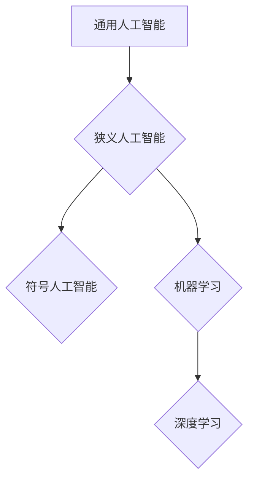

> 人工智能，达特茅斯会议，通用人工智能，机器学习，神经网络，计算机科学

## 1. 背景介绍

1956年，美国达特茅斯学院举办了一场具有里程碑意义的会议，被誉为人工智能（Artificial Intelligence，简称AI）的诞生地。这场会议汇集了当时世界各地的计算机科学家、数学家、心理学家和哲学家，共同探讨了人工智能的定义、可能性和挑战。

这场会议的组织者包括约翰·麦卡锡（John McCarthy）、马文·明斯基（Marvin Minsky）、克莱德·舍费尔（Claude Shannon）和Nathaniel Rochester。他们邀请了众多当时人工智能领域的前沿学者，共同探讨人工智能的未来发展方向。

## 2. 核心概念与联系

达特茅斯会议上，参与者们对人工智能的定义进行了深入探讨，最终达成共识：人工智能是指使机器能够像人类一样思考、学习和解决问题的能力。

**核心概念：**

* **通用人工智能 (AGI):** 指能够像人类一样进行任何智能任务的机器。
* **狭义人工智能 (ANI):** 指能够执行特定任务的机器，例如玩游戏、识别图像或翻译语言。
* **强人工智能 (AGI):** 指拥有与人类同等或更高的智能水平的机器。

**联系：**

达特茅斯会议的成果为人工智能的发展奠定了基础，并推动了人工智能研究的多个方向，包括：

* **符号人工智能:** 基于符号逻辑和规则推理的 AI 系统。
* **机器学习:** 使机器能够从数据中学习和改进的 AI 系统。
* **深度学习:** 使用多层神经网络进行学习的 AI 系统。

**Mermaid 流程图：**



## 3. 核心算法原理 & 具体操作步骤

### 3.1  算法原理概述

达特茅斯会议上，许多学者提出了不同的算法和方法来实现人工智能，其中一些算法至今仍被广泛应用。例如：

* **搜索算法:** 用于在搜索空间中找到最优解的算法，例如深度优先搜索和广度优先搜索。
* **逻辑推理算法:** 用于根据逻辑规则进行推理的算法，例如前向推理和后向推理。
* **决策树算法:** 用于将数据分类或预测的算法，通过构建决策树来实现。

### 3.2  算法步骤详解

以搜索算法为例，其基本步骤如下：

1. **定义搜索空间:** 确定需要搜索的范围。
2. **选择搜索策略:** 选择合适的搜索算法，例如深度优先搜索或广度优先搜索。
3. **生成候选解:** 从搜索空间中生成候选解。
4. **评估候选解:** 对候选解进行评估，选择最优解。
5. **重复步骤3-4:** 直到找到最优解或搜索空间为空。

### 3.3  算法优缺点

**搜索算法的优点:**

* 能够解决许多复杂问题。
* 算法原理相对简单易懂。

**搜索算法的缺点:**

* 搜索空间越大，算法效率越低。
* 无法解决所有问题，例如NP难问题。

### 3.4  算法应用领域

搜索算法广泛应用于人工智能领域，例如：

* **游戏 AI:** 用于控制游戏角色，寻找最佳策略。
* **路径规划:** 用于规划机器人或车辆的路径。
* **自然语言处理:** 用于文本分析、机器翻译等任务。

## 4. 数学模型和公式 & 详细讲解 & 举例说明

### 4.1  数学模型构建

人工智能算法通常基于数学模型，例如：

* **线性回归:** 用于预测连续变量的算法，其数学模型为：

$$y = mx + c$$

其中，$y$ 是预测值，$x$ 是输入变量，$m$ 是斜率，$c$ 是截距。

* **逻辑回归:** 用于分类问题的算法，其数学模型为：

$$p(y=1|x) = \frac{1}{1 + e^{-(wx + b)}}$$

其中，$p(y=1|x)$ 是预测类别为1的概率，$x$ 是输入变量，$w$ 是权重，$b$ 是偏置。

### 4.2  公式推导过程

例如，线性回归的损失函数为均方误差，其公式为：

$$J(w,b) = \frac{1}{n} \sum_{i=1}^{n} (y_i - (wx_i + b))^2$$

其中，$n$ 是样本数量，$y_i$ 是真实值，$x_i$ 是输入变量。

通过梯度下降算法，可以迭代更新权重和偏置，最小化损失函数。

### 4.3  案例分析与讲解

例如，可以使用线性回归模型预测房价。输入变量包括房屋面积、房间数量等，输出变量为房价。通过训练模型，可以得到房价预测公式，并根据新的房屋信息进行预测。

## 5. 项目实践：代码实例和详细解释说明

### 5.1  开发环境搭建

可以使用Python语言和相关的库进行人工智能项目开发，例如：

* **NumPy:** 用于数值计算。
* **Pandas:** 用于数据处理。
* **Scikit-learn:** 用于机器学习算法。
* **TensorFlow:** 用于深度学习。

### 5.2  源代码详细实现

以下是一个使用Scikit-learn库实现线性回归模型的代码示例：

```python
import numpy as np
from sklearn.linear_model import LinearRegression
from sklearn.model_selection import train_test_split

# 生成样本数据
X = np.array([[1], [2], [3], [4], [5]])
y = np.array([2, 4, 5, 4, 5])

# 将数据分为训练集和测试集
X_train, X_test, y_train, y_test = train_test_split(X, y, test_size=0.2)

# 创建线性回归模型
model = LinearRegression()

# 训练模型
model.fit(X_train, y_train)

# 预测测试集数据
y_pred = model.predict(X_test)

# 打印预测结果
print(y_pred)
```

### 5.3  代码解读与分析

这段代码首先生成了一些样本数据，然后将数据分为训练集和测试集。接着，创建了一个线性回归模型，并使用训练集数据训练模型。最后，使用训练好的模型预测测试集数据，并打印预测结果。

### 5.4  运行结果展示

运行这段代码后，会输出测试集数据的预测结果。

## 6. 实际应用场景

人工智能技术在各个领域都有广泛的应用，例如：

* **医疗保健:** 用于疾病诊断、药物研发、个性化医疗。
* **金融:** 用于风险管理、欺诈检测、投资决策。
* **制造业:** 用于自动化生产、质量控制、预测维护。
* **交通:** 用于自动驾驶、交通流量管理、路线规划。

### 6.4  未来应用展望

人工智能技术还在不断发展，未来将有更多新的应用场景出现，例如：

* **人机交互:** 更自然、更智能的人机交互方式。
* **个性化服务:** 根据用户的需求提供个性化的服务。
* **科学研究:** 加速科学研究的进程，解决复杂科学问题。

## 7. 工具和资源推荐

### 7.1  学习资源推荐

* **在线课程:** Coursera、edX、Udacity 等平台提供丰富的 AI 课程。
* **书籍:** 《人工智能：现代方法》 (Stuart Russell, Peter Norvig)、《深度学习》 (Ian Goodfellow, Yoshua Bengio, Aaron Courville) 等。
* **博客和论坛:** AI 相关的博客和论坛，例如 OpenAI Blog、Towards Data Science 等。

### 7.2  开发工具推荐

* **Python:** 广泛用于 AI 开发的编程语言。
* **TensorFlow:** 深度学习框架。
* **PyTorch:** 深度学习框架。
* **Scikit-learn:** 机器学习库。

### 7.3  相关论文推荐

* **《A Logical Calculus of the Ideas Immanent in Nervous Activity》 (Warren McCulloch, Walter Pitts, 1943):** 奠定了神经网络基础的论文。
* **《Perceptrons》 (Frank Rosenblatt, 1962):** 介绍了感知器算法的论文。
* **《Learning Representations by Back-Propagating Errors》 (Rumelhart, Hinton, Williams, 1986):** 介绍了反向传播算法的论文。

## 8. 总结：未来发展趋势与挑战

### 8.1  研究成果总结

达特茅斯会议的成果为人工智能的发展奠定了基础，推动了人工智能研究的多个方向，并取得了显著的成果。例如，深度学习技术取得了突破性进展，在图像识别、语音识别等领域取得了优异的性能。

### 8.2  未来发展趋势

人工智能技术将继续快速发展，未来发展趋势包括：

* **更强大的计算能力:** 更强大的计算能力将推动人工智能算法的复杂度和性能提升。
* **更丰富的训练数据:** 更丰富的训练数据将使人工智能模型更加智能和准确。
* **更深入的人机交互:** 人机交互方式将更加自然、智能和人性化。

### 8.3  面临的挑战

人工智能技术也面临着一些挑战，例如：

* **数据安全和隐私:** 人工智能算法依赖于大量数据，如何保护数据安全和隐私是一个重要问题。
* **算法偏见:** 人工智能算法可能存在偏见，导致不公平的结果。
* **伦理问题:** 人工智能技术的发展引发了一些伦理问题，例如人工智能的责任和义务。

### 8.4  研究展望

未来，人工智能研究需要更加注重伦理、安全和可解释性，并探索人工智能与人类的协同发展路径。

## 9. 附录：常见问题与解答

**常见问题:**

* 什么是人工智能？
* 人工智能有哪些应用场景？
* 人工智能技术有哪些发展趋势？

**解答:**

* 人工智能是指使机器能够像人类一样思考、学习和解决问题的能力。
* 人工智能技术广泛应用于医疗保健、金融、制造业、交通等各个领域。
* 人工智能技术将继续快速发展，未来将更加智能、强大和人性化。


作者：禅与计算机程序设计艺术 / Zen and the Art of Computer Programming 
<end_of_turn>