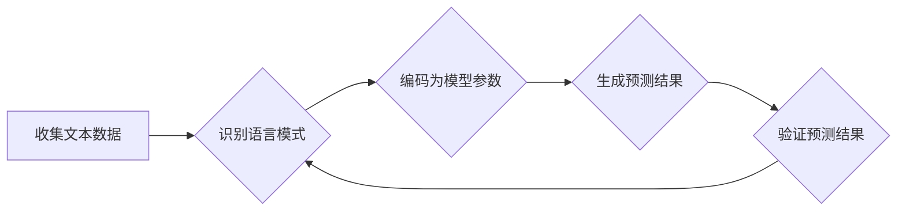

> 所罗门诺夫归纳法，大模型，机器学习，自然语言处理，文本生成，知识提取，推理

## 1. 背景介绍

近年来，深度学习模型，特别是 Transformer 架构的大模型，在自然语言处理 (NLP) 等领域取得了显著的成就。这些模型能够处理海量文本数据，学习复杂的语言模式，并完成各种任务，例如文本生成、机器翻译、问答系统等。然而，大模型的训练和部署仍然面临着诸多挑战，例如数据规模、计算资源、模型复杂度等。

所罗门诺夫归纳法是一种经典的逻辑推理方法，它通过从具体实例中归纳出普遍规律来进行推理。这种方法在人工智能领域有着广泛的应用，例如知识表示、推理系统、机器学习算法等。

## 2. 核心概念与联系

### 2.1 所罗门诺夫归纳法

所罗门诺夫归纳法是一种基于实例的推理方法，它遵循以下步骤：

1. **观察和收集实例：** 从现实世界中收集大量相关实例。
2. **识别模式：** 分析实例，识别出其中的共同特征和规律。
3. **提出假设：** 根据识别出的模式，提出一个概括性的假设。
4. **验证假设：** 通过对更多实例进行测试，验证假设的正确性。

### 2.2 大模型与所罗门诺夫归纳法

大模型的训练过程可以看作是一种特殊的归纳过程。模型通过学习海量文本数据，识别出语言模式和规律，并将其编码成模型参数。这些参数可以看作是所罗门诺夫归纳法中提出的假设，而模型的预测结果则是对这些假设的验证。

**Mermaid 流程图**



## 3. 核心算法原理 & 具体操作步骤

### 3.1 算法原理概述

所罗门诺夫归纳法在大模型中的应用主要体现在以下几个方面：

1. **数据增强：** 通过对现有数据进行各种变换，例如 paraphrasing、back translation 等，可以生成更多的数据样本，丰富模型的训练数据。
2. **知识蒸馏：** 将大型模型的知识迁移到小型模型中，可以提高小型模型的性能，同时降低模型的计算成本。
3. **主动学习：** 模型可以根据自身预测的置信度，选择需要更多训练数据的样本，从而提高训练效率。

### 3.2 算法步骤详解

1. **数据预处理：** 对原始文本数据进行清洗、分词、标记等预处理操作，使其能够被模型理解。
2. **模型训练：** 使用所选择的训练算法，例如 Transformer、BERT 等，训练大模型。
3. **模型评估：** 使用标准的评估指标，例如 perplexity、BLEU 等，评估模型的性能。
4. **模型优化：** 根据评估结果，调整模型参数、训练策略等，以提高模型性能。

### 3.3 算法优缺点

**优点：**

* 可以有效提高大模型的性能。
* 可以降低大模型的训练成本。
* 可以使大模型更加灵活和适应性强。

**缺点：**

* 需要大量的训练数据和计算资源。
* 算法的复杂性较高，需要专业的技术人员进行操作。
* 算法的性能仍然存在一定的局限性。

### 3.4 算法应用领域

所罗门诺夫归纳法在大模型中的应用领域非常广泛，例如：

* **自然语言理解：** 文本分类、情感分析、问答系统等。
* **自然语言生成：** 文本摘要、机器翻译、对话系统等。
* **知识图谱构建：** 知识提取、关系抽取、知识推理等。

## 4. 数学模型和公式 & 详细讲解 & 举例说明

### 4.1 数学模型构建

所罗门诺夫归纳法的核心思想可以用一个简单的数学模型来表示：

$$
H = \text{argmax}_{h} P(h|D)
$$

其中：

* $H$ 是所提出的假设。
* $D$ 是训练数据。
* $P(h|D)$ 是给定训练数据 $D$ 下，假设 $h$ 的概率。

这个模型表示，我们希望找到一个最符合训练数据的假设 $H$。

### 4.2 公式推导过程

这个公式的推导过程基于贝叶斯定理：

$$
P(h|D) = \frac{P(D|h)P(h)}{P(D)}
$$

其中：

* $P(D|h)$ 是给定假设 $h$ 下，观察到训练数据 $D$ 的概率。
* $P(h)$ 是假设 $h$ 的先验概率。
* $P(D)$ 是观察到训练数据 $D$ 的概率。

在实际应用中，我们通常会使用最大似然估计来估计 $P(D|h)$ 和 $P(h)$。

### 4.3 案例分析与讲解

例如，假设我们想要训练一个模型来识别垃圾邮件。我们可以将垃圾邮件和正常邮件作为训练数据，并将邮件内容作为输入特征。模型的目标是学习一个假设 $H$，这个假设能够将邮件分类为垃圾邮件或正常邮件。

在训练过程中，模型会根据训练数据调整其参数，以最大化 $P(D|h)$。最终，模型将能够根据新的邮件内容，预测其是否为垃圾邮件。

## 5. 项目实践：代码实例和详细解释说明

### 5.1 开发环境搭建

* Python 3.7+
* TensorFlow 2.0+
* PyTorch 1.0+
* CUDA 10.0+ (可选)

### 5.2 源代码详细实现

```python
# 导入必要的库
import tensorflow as tf

# 定义模型结构
class SimpleModel(tf.keras.Model):
    def __init__(self):
        super(SimpleModel, self).__init__()
        self.dense1 = tf.keras.layers.Dense(64, activation='relu')
        self.dense2 = tf.keras.layers.Dense(1, activation='sigmoid')

    def call(self, inputs):
        x = self.dense1(inputs)
        x = self.dense2(x)
        return x

# 实例化模型
model = SimpleModel()

# 定义损失函数和优化器
loss_fn = tf.keras.losses.BinaryCrossentropy()
optimizer = tf.keras.optimizers.Adam(learning_rate=0.001)

# 训练模型
for epoch in range(10):
    for batch in dataset:
        with tf.GradientTape() as tape:
            predictions = model(batch)
            loss = loss_fn(batch_labels, predictions)
        gradients = tape.gradient(loss, model.trainable_variables)
        optimizer.apply_gradients(zip(gradients, model.trainable_variables))

# 保存模型
model.save('simple_model.h5')
```

### 5.3 代码解读与分析

这段代码实现了一个简单的二分类模型，用于识别垃圾邮件。

* 模型结构：模型由两层全连接层组成，第一层有 64 个神经元，激活函数为 ReLU，第二层有 1 个神经元，激活函数为 sigmoid。
* 损失函数：使用二元交叉熵损失函数，用于衡量模型预测结果与真实标签之间的差异。
* 优化器：使用 Adam 优化器，用于更新模型参数。
* 训练过程：模型在训练数据上进行迭代训练，每次迭代更新模型参数，以最小化损失函数的值。
* 模型保存：训练完成后，将模型保存为 h5 文件，以便后续使用。

### 5.4 运行结果展示

训练完成后，可以使用测试数据评估模型的性能。常用的评估指标包括准确率、召回率、F1-score 等。

## 6. 实际应用场景

所罗门诺夫归纳法在大模型中的应用场景非常广泛，例如：

### 6.1 文本分类

例如，可以训练一个模型来识别新闻文章的主题，例如政治、体育、娱乐等。

### 6.2 情感分析

例如，可以训练一个模型来分析文本的情感倾向，例如正面、负面、中性等。

### 6.3 问答系统

例如，可以训练一个模型来回答用户提出的问题，例如“今天的天气怎么样？”、“北京的邮政编码是多少？”等。

### 6.4 机器翻译

例如，可以训练一个模型来将文本从一种语言翻译成另一种语言，例如将英文翻译成中文。

### 6.5 代码生成

例如，可以训练一个模型来根据自然语言描述生成代码，例如根据用户描述生成一个简单的 Python 函数。

## 7. 工具和资源推荐

### 7.1 学习资源推荐

* **书籍：**
    * 《深度学习》 by Ian Goodfellow, Yoshua Bengio, Aaron Courville
    * 《自然语言处理》 by Dan Jurafsky, James H. Martin
* **在线课程：**
    * Coursera: Deep Learning Specialization
    * Udacity: Machine Learning Engineer Nanodegree
* **博客和网站：**
    * TensorFlow Blog: https://blog.tensorflow.org/
    * PyTorch Blog: https://pytorch.org/blog/

### 7.2 开发工具推荐

* **深度学习框架：**
    * TensorFlow: https://www.tensorflow.org/
    * PyTorch: https://pytorch.org/
* **自然语言处理库：**
    * NLTK: https://www.nltk.org/
    * SpaCy: https://spacy.io/
* **代码编辑器：**
    * VS Code: https://code.visualstudio.com/
    * PyCharm: https://www.jetbrains.com/pycharm/

### 7.3 相关论文推荐

* **Transformer:** https://arxiv.org/abs/1706.03762
* **BERT:** https://arxiv.org/abs/1810.04805
* **GPT-3:** https://openai.com/blog/gpt-3/

## 8. 总结：未来发展趋势与挑战

### 8.1 研究成果总结

所罗门诺夫归纳法在大模型中的应用取得了显著的成果，例如提高了模型的性能、降低了模型的训练成本、使模型更加灵活和适应性强。

### 8.2 未来发展趋势

未来，所罗门诺夫归纳法在大模型中的应用将朝着以下几个方向发展：

* **更有效的归纳算法：** 研究更有效的归纳算法，以提高模型的性能和效率。
* **更强大的模型架构：** 设计更强大的模型架构，以处理更复杂的任务。
* **更广泛的应用场景：** 将所罗门诺夫归纳法应用到更多领域，例如医疗、金融、教育等。

### 8.3 面临的挑战

所罗门诺夫归纳法在大模型中的应用仍然面临着一些挑战：

* **数据质量：** 归纳算法的性能依赖于训练数据的质量。
* **计算资源：** 训练大型模型需要大量的计算资源。
* **模型解释性：** 大模型的决策过程往往难以解释，这可能会影响模型的信任度。

### 8.4 研究展望

未来，我们将继续研究所罗门诺夫归纳法在大模型中的应用，以解决上述挑战，并推动人工智能技术的发展。

## 9. 附录：常见问题与解答

### 9.1 什么是所罗门诺夫归纳法？

所罗门诺夫归纳法是一种经典的逻辑推理方法，它通过从具体实例中归纳出普遍规律来进行推理。

### 9.2 所罗门诺夫归纳法在大模型中的应用有哪些？

所罗门诺夫归纳法在大模型中的应用主要体现在以下几个方面：

* 数据增强
* 知识蒸馏
* 主