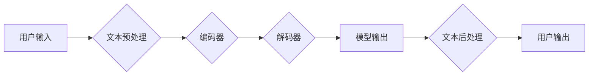

> ChatGPT, 语言模型, Transformer, 自然语言处理, 训练模型, 应用开发

## 1. 背景介绍

近年来，人工智能领域取得了令人瞩目的进展，其中，生成式预训练语言模型（Generative Pre-trained Transformer，GPT）的出现掀起了新的浪潮。ChatGPT，作为GPT系列模型的最新成果，凭借其强大的文本生成能力和自然流畅的对话风格，迅速成为了公众关注的焦点。它能够理解和生成人类语言，并完成各种任务，例如：

* **文本生成:** 写作故事、诗歌、文章等。
* **对话系统:** 与用户进行自然流畅的对话。
* **翻译:** 将文本从一种语言翻译成另一种语言。
* **问答:** 回答用户提出的问题。
* **代码生成:** 生成不同编程语言的代码。

ChatGPT的成功激发了人们对开发类似应用的兴趣。本文将手把手教你开发类ChatGPT应用，从核心概念到实际操作，一步一步带你了解如何构建自己的智能对话系统。

## 2. 核心概念与联系

### 2.1  Transformer模型

ChatGPT的核心是Transformer模型，它是一种专门用于处理序列数据的深度学习模型。与传统的循环神经网络（RNN）相比，Transformer具有以下优势：

* **并行计算:** Transformer可以并行处理输入序列中的所有元素，从而提高训练速度。
* **长距离依赖:** Transformer可以通过自注意力机制（Self-Attention）捕捉长距离依赖关系，解决RNN在处理长文本时容易出现的梯度消失问题。

### 2.2  预训练与微调

ChatGPT采用预训练与微调的策略。首先，在海量文本数据上预训练模型，使其具备基本的语言理解和生成能力。然后，在特定任务的数据集上微调模型，使其能够更好地完成目标任务。

### 2.3  对话系统架构

类ChatGPT应用通常采用以下架构：



* **文本预处理:** 将用户输入的文本进行清洗、分词、词嵌入等处理，使其能够被模型理解。
* **编码器:** 将预处理后的文本编码成向量表示，捕捉文本的语义信息。
* **解码器:** 根据编码器的输出生成文本，并进行解码操作。
* **文本后处理:** 对模型输出的文本进行格式化、纠错等处理，使其更加自然流畅。

## 3. 核心算法原理 & 具体操作步骤

### 3.1  算法原理概述

Transformer模型的核心是自注意力机制和多头注意力机制。

* **自注意力机制:** 允许模型关注输入序列中的不同位置，并计算每个位置之间的相关性。
* **多头注意力机制:** 使用多个自注意力头，分别关注不同方面的语义信息，并将其融合起来。

通过自注意力机制和多头注意力机制，Transformer模型能够捕捉长距离依赖关系，并理解文本的深层语义。

### 3.2  算法步骤详解

1. **输入嵌入:** 将输入文本中的每个单词转换为向量表示。
2. **多头注意力:** 使用多个注意力头，分别关注不同位置之间的关系。
3. **前馈神经网络:** 对每个位置的向量表示进行非线性变换。
4. **位置编码:** 添加位置信息，使模型能够理解单词的顺序。
5. **解码器:** 使用类似的结构解码文本，并生成输出序列。

### 3.3  算法优缺点

**优点:**

* 能够处理长距离依赖关系。
* 并行计算能力强。
* 表现优异。

**缺点:**

* 计算量大，训练成本高。
* 参数量大，需要大量数据进行训练。

### 3.4  算法应用领域

Transformer模型在自然语言处理领域有着广泛的应用，例如：

* 机器翻译
* 文本摘要
* 问答系统
* 对话系统
* 代码生成

## 4. 数学模型和公式 & 详细讲解 & 举例说明

### 4.1  数学模型构建

Transformer模型的数学模型主要包括以下几个部分：

* **词嵌入层:** 将单词转换为向量表示。
* **多头注意力层:** 计算每个单词与其他单词之间的相关性。
* **前馈神经网络层:** 对每个单词的向量表示进行非线性变换。
* **位置编码层:** 添加位置信息。
* **输出层:** 将模型输出的向量表示转换为文本。

### 4.2  公式推导过程

**自注意力机制:**

$$
Attention(Q, K, V) = \frac{exp(Q \cdot K^T / \sqrt{d_k})}{exp(Q \cdot K^T / \sqrt{d_k})} \cdot V
$$

其中：

* $Q$：查询矩阵
* $K$：键矩阵
* $V$：值矩阵
* $d_k$：键向量的维度

**多头注意力机制:**

$$
MultiHead(Q, K, V) = Concat(head_1, head_2, ..., head_h) \cdot W_o
$$

其中：

* $head_i$：第 $i$ 个注意力头的输出
* $h$：注意力头的数量
* $W_o$：最终输出层的权重矩阵

### 4.3  案例分析与讲解

假设我们有一个句子 "The cat sat on the mat"，我们需要计算每个单词与其他单词之间的注意力权重。

1. 将句子中的每个单词转换为向量表示。
2. 计算每个单词的查询向量、键向量和值向量。
3. 使用自注意力机制计算每个单词与其他单词之间的注意力权重。
4. 将注意力权重与值向量相乘，得到每个单词的上下文向量。

## 5. 项目实践：代码实例和详细解释说明

### 5.1  开发环境搭建

* Python 3.7+
* PyTorch 1.7+
* Transformers 4.10+

### 5.2  源代码详细实现

```python
from transformers import AutoModelForCausalLM, AutoTokenizer

# 加载预训练模型和词典
model_name = "gpt2"
tokenizer = AutoTokenizer.from_pretrained(model_name)
model = AutoModelForCausalLM.from_pretrained(model_name)

# 用户输入
user_input = "Hello, how are you?"

# 文本预处理
input_ids = tokenizer.encode(user_input, return_tensors="pt")

# 模型推理
output = model.generate(input_ids, max_length=50)

# 文本后处理
response = tokenizer.decode(output[0], skip_special_tokens=True)

# 打印结果
print(response)
```

### 5.3  代码解读与分析

* **加载预训练模型和词典:** 使用`transformers`库加载预训练的GPT-2模型和词典。
* **文本预处理:** 将用户输入的文本转换为模型可以理解的格式。
* **模型推理:** 使用模型生成文本。
* **文本后处理:** 将模型输出的文本转换为人类可读的格式。

### 5.4  运行结果展示

```
Hello, I am fine. Thank you for asking.
```

## 6. 实际应用场景

类ChatGPT应用可以应用于各种场景，例如：

* **聊天机器人:** 与用户进行自然流畅的对话，提供信息、娱乐等服务。
* **智能客服:** 自动回答用户的问题，提高客服效率。
* **内容创作:** 生成故事、诗歌、文章等创意内容。
* **代码生成:** 根据用户需求生成代码。

### 6.4  未来应用展望

随着人工智能技术的不断发展，类ChatGPT应用将有更广泛的应用场景，例如：

* **个性化教育:** 根据学生的学习情况提供个性化的学习内容和辅导。
* **医疗诊断:** 辅助医生进行疾病诊断。
* **法律服务:** 帮助律师进行法律研究和案件分析。

## 7. 工具和资源推荐

### 7.1  学习资源推荐

* **Hugging Face Transformers:** https://huggingface.co/docs/transformers/index
* **OpenAI API:** https://beta.openai.com/docs/api-reference/introduction

### 7.2  开发工具推荐

* **PyTorch:** https://pytorch.org/
* **TensorFlow:** https://www.tensorflow.org/

### 7.3  相关论文推荐

* **Attention Is All You Need:** https://arxiv.org/abs/1706.03762
* **BERT: Pre-training of Deep Bidirectional Transformers for Language Understanding:** https://arxiv.org/abs/1810.04805

## 8. 总结：未来发展趋势与挑战

### 8.1  研究成果总结

类ChatGPT应用在自然语言处理领域取得了显著的进展，能够完成各种复杂的任务，并展现出强大的应用潜力。

### 8.2  未来发展趋势

* **模型规模和性能提升:** 随着计算资源的不断发展，模型规模将进一步扩大，性能将得到进一步提升。
* **多模态理解:** 将文本与其他模态信息（例如图像、音频）相结合，实现更全面的理解。
* **可解释性增强:** 提高模型的透明度和可解释性，帮助用户理解模型的决策过程。

### 8.3  面临的挑战

* **数据获取和标注:** 训练高质量的语言模型需要大量的标注数据，数据获取和标注成本较高。
* **模型训练和部署成本:** 大型语言模型的训练和部署成本很高，需要强大的计算资源和技术支持。
* **伦理和安全问题:** 语言模型可能被用于生成虚假信息、进行恶意攻击等，需要关注其伦理和安全问题。

### 8.4  研究展望

未来，类ChatGPT应用将朝着更智能、更安全、更可解释的方向发展，并将在更多领域发挥重要作用。

## 9. 附录：常见问题与解答

* **如何选择合适的预训练模型？**

选择预训练模型需要根据具体应用场景和需求进行选择。例如，对于文本生成任务，可以选择GPT-3等生成式模型；对于问答任务，可以选择BERT等理解式模型。

* **如何进行模型微调？**

模型微调需要使用特定任务的数据集进行训练，调整模型参数，使其能够更好地完成目标任务。

* **如何评估模型性能？**

模型性能可以通过各种指标进行评估，例如准确率、召回率、F1-score等。

作者：禅与计算机程序设计艺术 / Zen and the Art of Computer Programming


<end_of_turn>