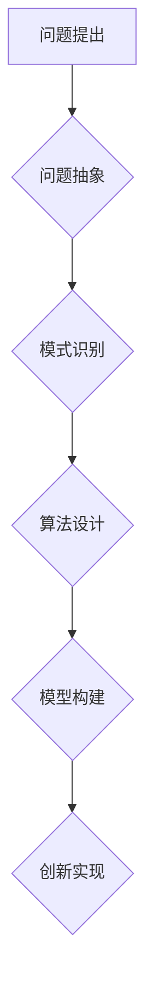

> 抽象思维，人工智能，创新，算法设计，模型构建，问题解决，逻辑推理，创造力

## 1. 背景介绍

人工智能（AI）正以惊人的速度发展，从语音识别到图像生成，AI已经渗透到我们生活的方方面面。然而，推动AI创新的关键因素并非仅仅是强大的计算能力和海量数据，更重要的是人类的抽象思维能力。抽象思维是指能够将具体的事物概括为更抽象的概念，并从中发现隐藏的模式和规律的能力。

在AI领域，抽象思维扮演着至关重要的角色。它赋予AI系统理解复杂问题、设计高效算法、构建灵活模型的能力。例如，在自然语言处理领域，抽象思维帮助AI理解语言的语法规则和语义关系，从而实现更精准的文本理解和生成。在计算机视觉领域，抽象思维帮助AI识别图像中的物体和场景，并从中提取有用的信息。

## 2. 核心概念与联系

**2.1 抽象思维的本质**

抽象思维是一种高级认知能力，它超越了对具体事物的直接感知，能够将多个具体的事物归纳为一个更抽象的概念，并从中发现隐藏的规律和模式。

**2.2 抽象思维与AI创新的关系**

抽象思维是AI创新的基石，它为AI系统提供了以下关键能力：

* **问题抽象:** 将复杂问题分解为更易于理解和解决的子问题。
* **模式识别:** 从海量数据中识别出隐藏的模式和规律。
* **算法设计:** 设计出高效、灵活的算法解决特定问题。
* **模型构建:** 构建出能够模拟真实世界复杂现象的模型。
* **创新驱动:** 提出新的解决方案和创新思路。

**2.3 抽象思维的实现机制**

抽象思维的实现机制涉及到大脑中多个区域的协同工作，包括前额叶皮层、顶叶皮层和颞叶皮层等。这些区域负责处理语言、视觉、空间信息以及逻辑推理等功能，共同完成抽象思维的过程。

**Mermaid 流程图**



## 3. 核心算法原理 & 具体操作步骤

**3.1 算法原理概述**

在AI领域，许多算法都依赖于抽象思维来实现其功能。例如，深度学习算法通过抽象出不同层次的特征表示，能够学习复杂的模式和关系。

**3.2 算法步骤详解**

以深度学习算法为例，其具体操作步骤如下：

1. **数据预处理:** 将原始数据进行清洗、转换和特征工程，使其适合深度学习模型的训练。
2. **网络结构设计:** 根据具体任务需求，设计深度神经网络的结构，包括层数、节点数量、激活函数等。
3. **模型训练:** 使用训练数据训练深度神经网络，通过调整网络参数，使模型能够准确地预测目标输出。
4. **模型评估:** 使用测试数据评估模型的性能，并根据评估结果进行模型调优。
5. **模型部署:** 将训练好的模型部署到实际应用场景中，用于进行预测或决策。

**3.3 算法优缺点**

深度学习算法具有以下优点：

* **强大的学习能力:** 可以学习复杂的非线性关系。
* **自动特征提取:** 不需要人工特征工程，能够自动提取特征。
* **泛化能力强:** 可以应用于多种不同的任务和领域。

但也存在一些缺点：

* **训练数据需求量大:** 需要大量的训练数据才能达到良好的性能。
* **训练时间长:** 训练过程耗时较长，需要强大的计算资源。
* **可解释性差:** 模型内部的决策过程难以理解。

**3.4 算法应用领域**

深度学习算法已广泛应用于以下领域：

* **计算机视觉:** 图像识别、物体检测、图像分割、人脸识别等。
* **自然语言处理:** 文本分类、情感分析、机器翻译、对话系统等。
* **语音识别:** 语音转文本、语音合成等。
* **推荐系统:** 商品推荐、内容推荐等。

## 4. 数学模型和公式 & 详细讲解 & 举例说明

**4.1 数学模型构建**

在AI领域，数学模型是描述算法和系统行为的抽象表示。例如，线性回归模型可以用以下数学公式表示：

$$y = mx + c$$

其中，y是预测值，x是输入特征，m是斜率，c是截距。

**4.2 公式推导过程**

线性回归模型的系数m和c可以通过最小二乘法推导出来。最小二乘法旨在找到一条直线，使得该直线与所有数据点的距离之和最小。

**4.3 案例分析与讲解**

假设我们有一组数据，包含房屋面积和房屋价格的信息。我们可以使用线性回归模型来预测房屋价格。

* **输入特征:** 房屋面积
* **输出目标:** 房屋价格

通过训练线性回归模型，我们可以得到一个预测公式，例如：

$$价格 = 5000 * 面积 + 100000$$

这个公式表示，房屋面积每增加1平方米，房屋价格就会增加5000元，并且房屋价格还有100000元的基准值。

## 5. 项目实践：代码实例和详细解释说明

**5.1 开发环境搭建**

为了实现深度学习算法，我们需要搭建一个开发环境。常用的开发环境包括：

* **Python:** 深度学习的编程语言。
* **TensorFlow/PyTorch:** 深度学习框架。
* **GPU:** 加速深度学习训练的硬件。

**5.2 源代码详细实现**

以下是一个使用TensorFlow实现图像分类的简单代码示例：

```python
import tensorflow as tf

# 定义模型结构
model = tf.keras.models.Sequential([
    tf.keras.layers.Conv2D(32, (3, 3), activation='relu', input_shape=(28, 28, 1)),
    tf.keras.layers.MaxPooling2D((2, 2)),
    tf.keras.layers.Flatten(),
    tf.keras.layers.Dense(10, activation='softmax')
])

# 编译模型
model.compile(optimizer='adam',
              loss='sparse_categorical_crossentropy',
              metrics=['accuracy'])

# 训练模型
model.fit(x_train, y_train, epochs=5)

# 评估模型
loss, accuracy = model.evaluate(x_test, y_test)
print('Test loss:', loss)
print('Test accuracy:', accuracy)
```

**5.3 代码解读与分析**

这段代码定义了一个简单的卷积神经网络模型，用于图像分类任务。

* **Conv2D层:** 用于提取图像特征。
* **MaxPooling2D层:** 用于降维，减少计算量。
* **Flatten层:** 将多维特征转换为一维向量。
* **Dense层:** 全连接层，用于分类。

**5.4 运行结果展示**

训练完成后，我们可以使用测试数据评估模型的性能。

## 6. 实际应用场景

**6.1 医疗诊断**

AI可以帮助医生分析医学影像，例如X光片和CT扫描，以辅助诊断疾病。

**6.2 金融风险管理**

AI可以分析金融数据，识别潜在的风险，并帮助金融机构进行风险管理。

**6.3 自动驾驶**

AI可以帮助汽车感知周围环境，做出驾驶决策，实现自动驾驶。

**6.4 未来应用展望**

随着AI技术的不断发展，其应用场景将更加广泛，例如：

* **个性化教育:** 根据学生的学习情况，提供个性化的学习方案。
* **智能家居:** 通过AI技术，实现家居自动化和智能化。
* **精准农业:** 利用AI技术，提高农业生产效率和产品质量。

## 7. 工具和资源推荐

**7.1 学习资源推荐**

* **Coursera:** 提供丰富的AI课程，例如Andrew Ng的机器学习课程。
* **Udacity:** 提供AI相关的职业培训课程。
* **Kaggle:** 提供AI竞赛和数据集，可以用于实践和学习。

**7.2 开发工具推荐**

* **TensorFlow:** Google开发的开源深度学习框架。
* **PyTorch:** Facebook开发的开源深度学习框架。
* **Keras:** TensorFlow的高级API，易于使用。

**7.3 相关论文推荐**

* **《ImageNet Classification with Deep Convolutional Neural Networks》**
* **《Attention Is All You Need》**
* **《BERT: Pre-training of Deep Bidirectional Transformers for Language Understanding》**

## 8. 总结：未来发展趋势与挑战

**8.1 研究成果总结**

近年来，AI领域取得了显著的进展，例如：

* **深度学习算法的突破:** 深度学习算法在图像识别、自然语言处理等领域取得了突破性进展。
* **模型规模的扩大:** 模型规模不断扩大，例如GPT-3和DALL-E等模型拥有数十亿甚至千亿参数。
* **跨模态学习的兴起:** AI系统开始能够处理多种模态数据，例如文本、图像、音频等。

**8.2 未来发展趋势**

* **更强大的计算能力:** 随着硬件技术的进步，AI模型将变得更加强大。
* **更注重可解释性:** 研究者将更加关注AI模型的可解释性，使其决策过程更加透明。
* **更广泛的应用场景:** AI将应用于更多领域，例如医疗、教育、金融等。

**8.3 面临的挑战**

* **数据安全和隐私:** AI模型的训练需要大量数据，如何保证数据安全和隐私是一个重要挑战。
* **算法偏见:** AI模型可能存在算法偏见，需要采取措施避免和解决。
* **伦理问题:** AI技术的应用引发了一些伦理问题，需要进行深入探讨和研究。

**8.4 研究展望**

未来，AI研究将更加注重以下方面：

* **通用人工智能:** 研究能够像人类一样学习和解决各种问题的通用人工智能。
* **安全可靠的AI:** 研究开发安全可靠的AI系统，避免其被恶意利用。
* **人机协作:** 研究人机协作的AI系统，提高人类工作效率和生活质量。

## 9. 附录：常见问题与解答

**9.1 如何学习AI？**

学习AI需要掌握一定的数学基础，例如线性代数、概率论和统计学。此外，还需要学习编程语言，例如Python，以及深度学习框架，例如TensorFlow或PyTorch。

**9.2 AI会取代人类工作吗？**

AI技术的发展可能会改变一些工作岗位，但同时也创造新的工作机会。重要的是，人类需要不断学习和提升自己的技能，适应未来的工作环境。

**9.3 AI技术对社会有什么影响？**

AI技术对社会的影响是多方面的，既有积极的一面，也有消极的一面。我们需要积极引导AI技术的发展，使其更好地服务于人类社会。


作者：禅与计算机程序设计艺术 / Zen and the Art of Computer Programming 
<end_of_turn>