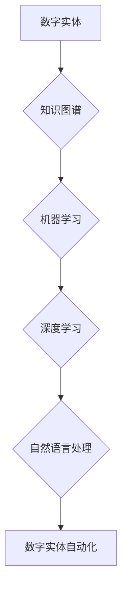

> 数字实体、自动化、机器学习、深度学习、自然语言处理、知识图谱、智能代理

## 1. 背景介绍

数字实体自动化是近年来人工智能领域的一个重要研究方向，它旨在通过自动化手段，使数字实体能够自主地感知、理解和交互于周围环境。数字实体可以是任何具有数字化表示的实体，例如产品、服务、人员、事件等。随着数字化的加速发展，数字实体的数量和复杂度不断增加，传统的基于人工操作的管理方式已经难以满足需求。因此，数字实体自动化技术显得尤为重要。

数字实体自动化的应用场景广泛，包括但不限于：

* **智能客服:** 自动化处理客户咨询、订单处理等任务，提高服务效率和客户满意度。
* **智能推荐:** 根据用户的行为和偏好，自动推荐相关产品或服务，提升用户体验。
* **智能决策支持:** 自动分析数据，提供决策建议，帮助企业做出更明智的决策。
* **智能制造:** 自动化控制生产流程，提高生产效率和产品质量。

## 2. 核心概念与联系

数字实体自动化的核心概念包括：

* **数字实体:** 具有数字化表示的实体，可以是物理实体的数字化模型，也可以是抽象概念的数字化表示。
* **知识图谱:** 用于存储和组织数字实体及其关系的知识库。
* **机器学习:** 利用算法从数据中学习，提高系统性能。
* **深度学习:** 一种机器学习的子领域，利用多层神经网络进行特征提取和模式识别。
* **自然语言处理:** 使计算机能够理解和处理人类语言。

这些概念相互关联，共同构成了数字实体自动化的基础。

**Mermaid 流程图:**



## 3. 核心算法原理 & 具体操作步骤

### 3.1  算法原理概述

数字实体自动化的核心算法主要包括：

* **知识图谱构建算法:** 用于从数据中提取实体和关系，构建知识图谱。
* **实体识别算法:** 用于识别文本中的实体，例如人名、地名、机构名等。
* **关系抽取算法:** 用于识别文本中的实体关系，例如“张三工作于百度”。
* **知识推理算法:** 用于根据知识图谱中的知识，进行推理和推断。

### 3.2  算法步骤详解

以知识图谱构建算法为例，其具体操作步骤如下：

1. **数据预处理:** 对原始数据进行清洗、格式化等处理，使其适合算法处理。
2. **实体识别:** 使用实体识别算法识别文本中的实体。
3. **关系抽取:** 使用关系抽取算法识别实体之间的关系。
4. **知识表示:** 将实体和关系表示为知识图谱的形式。
5. **知识图谱优化:** 对知识图谱进行优化，例如消除冗余信息、规范实体命名等。

### 3.3  算法优缺点

数字实体自动化算法各有优缺点，需要根据具体应用场景选择合适的算法。

* **优点:** 可以自动化处理大量数据，提高效率和准确性。
* **缺点:** 算法的性能依赖于训练数据质量，数据质量差会导致算法性能下降。

### 3.4  算法应用领域

数字实体自动化算法广泛应用于各个领域，例如：

* **搜索引擎:** 用于理解用户搜索意图，提供更精准的搜索结果。
* **电商平台:** 用于推荐商品、个性化营销等。
* **医疗保健:** 用于辅助诊断、预测疾病风险等。

## 4. 数学模型和公式 & 详细讲解 & 举例说明

### 4.1  数学模型构建

数字实体自动化的数学模型通常基于图论、概率论和统计学等基础理论。

* **图论:** 用于表示数字实体及其关系，例如知识图谱可以表示为一个图结构。
* **概率论:** 用于描述实体和关系出现的概率，例如实体识别算法通常使用概率模型进行预测。
* **统计学:** 用于分析数据，例如关系抽取算法通常使用统计方法进行特征提取和模型训练。

### 4.2  公式推导过程

例如，实体识别算法中常用的条件随机场（CRF）模型，其目标函数为：

$$
P(y|x) = \frac{exp( \sum_{i=1}^{n} \alpha_i y_i + \sum_{i<j} \beta_{ij} y_i y_j)}{Z(x)}
$$

其中：

* $P(y|x)$ 表示给定输入序列 $x$，输出序列 $y$ 的概率。
* $\alpha_i$ 和 $\beta_{ij}$ 为模型参数。
* $y_i$ 为第 $i$ 个实体的标签。
* $Z(x)$ 为归一化因子。

### 4.3  案例分析与讲解

例如，在实体识别任务中，我们可以使用CRF模型对文本进行实体识别。训练数据包括文本序列和对应的实体标签。模型训练过程就是通过调整参数 $\alpha_i$ 和 $\beta_{ij}$，使得模型预测的实体标签与真实标签的匹配度最大化。

## 5. 项目实践：代码实例和详细解释说明

### 5.1  开发环境搭建

数字实体自动化项目开发环境通常包括：

* **操作系统:** Linux 或 Windows
* **编程语言:** Python 或 Java
* **深度学习框架:** TensorFlow 或 PyTorch
* **自然语言处理库:** NLTK 或 spaCy

### 5.2  源代码详细实现

以下是一个简单的实体识别代码示例，使用Python和spaCy库：

```python
import spacy

# 加载spaCy模型
nlp = spacy.load("en_core_web_sm")

# 文本输入
text = "Apple is looking at buying U.K. startup for $1 billion."

# 使用spaCy模型进行实体识别
doc = nlp(text)

# 打印识别出的实体
for ent in doc.ents:
    print(ent.text, ent.label_)
```

### 5.3  代码解读与分析

* `spacy.load("en_core_web_sm")` 加载预训练的英文实体识别模型。
* `nlp(text)` 使用模型对文本进行处理，识别实体。
* `doc.ents` 获取识别出的实体列表。
* `ent.text` 获取实体的文本内容。
* `ent.label_` 获取实体的标签类型。

### 5.4  运行结果展示

运行上述代码，输出结果如下：

```
Apple ORG
U.K. GPE
$1 billion MONEY
```

## 6. 实际应用场景

### 6.1  智能客服

数字实体自动化技术可以用于构建智能客服系统，自动处理客户咨询、订单处理等任务。例如，可以识别客户的意图，并根据知识图谱中的信息，提供相应的解决方案。

### 6.2  智能推荐

数字实体自动化技术可以用于构建智能推荐系统，根据用户的行为和偏好，推荐相关产品或服务。例如，可以识别用户的兴趣爱好，并根据知识图谱中的商品信息，推荐用户可能感兴趣的商品。

### 6.3  智能决策支持

数字实体自动化技术可以用于构建智能决策支持系统，自动分析数据，提供决策建议。例如，可以分析市场数据，预测产品销量，帮助企业做出更明智的决策。

### 6.4  未来应用展望

数字实体自动化技术在未来将有更广泛的应用场景，例如：

* **虚拟助手:** 更智能、更人性化的虚拟助手，可以理解用户的自然语言指令，并提供更精准的帮助。
* **自动驾驶:** 自动驾驶系统可以利用数字实体自动化技术，识别道路上的障碍物、交通信号等信息，并做出相应的决策。
* **医疗诊断:** 数字实体自动化技术可以辅助医生进行诊断，提高诊断准确率。

## 7. 工具和资源推荐

### 7.1  学习资源推荐

* **书籍:**
    * 《深度学习》
    * 《自然语言处理》
    * 《知识图谱》
* **在线课程:**
    * Coursera
    * edX
    * Udacity

### 7.2  开发工具推荐

* **编程语言:** Python, Java
* **深度学习框架:** TensorFlow, PyTorch
* **自然语言处理库:** NLTK, spaCy

### 7.3  相关论文推荐

* **知识图谱构建:**
    * "A Survey on Knowledge Graph Construction"
* **实体识别:**
    * "Named Entity Recognition with Deep Learning"
* **关系抽取:**
    * "Relation Extraction Using Deep Learning"

## 8. 总结：未来发展趋势与挑战

### 8.1  研究成果总结

数字实体自动化技术取得了显著的进展，在实体识别、关系抽取、知识推理等方面取得了突破。

### 8.2  未来发展趋势

未来数字实体自动化技术将朝着以下方向发展：

* **更智能的实体理解:** 能够理解实体之间的复杂关系，并进行更深层次的推理。
* **更强大的泛化能力:** 能够应用于更多不同的领域和场景。
* **更安全的数字实体管理:** 能够保障数字实体的安全性、隐私性和可信度。

### 8.3  面临的挑战

数字实体自动化技术还面临一些挑战，例如：

* **数据质量问题:** 算法的性能依赖于训练数据质量，数据质量差会导致算法性能下降。
* **知识图谱构建难度:** 构建高质量的知识图谱是一个复杂的任务，需要大量的专业知识和人工干预。
* **伦理问题:** 数字实体自动化技术可能会带来一些伦理问题，例如数据隐私、算法偏见等。

### 8.4  研究展望

未来，我们需要继续加强对数字实体自动化技术的研发，解决其面临的挑战，并将其应用于更多领域，为人类社会带来更多福祉。

## 9. 附录：常见问题与解答

### 9.1  Q1: 数字实体自动化技术与人工智能有什么关系？

**A1:** 数字实体自动化技术是人工智能的一个重要分支，它利用人工智能技术，使数字实体能够自主地感知、理解和交互于周围环境。

### 9.2  Q2: 数字实体自动化技术有哪些应用场景？

**A2:** 数字实体自动化技术广泛应用于各个领域，例如智能客服、智能推荐、智能决策支持、自动驾驶等。

### 9.3  Q3: 如何学习数字实体自动化技术？

**A3:** 可以通过阅读相关书籍、参加在线课程、学习开源项目等方式学习数字实体自动化技术。

作者：禅与计算机程序设计艺术 / Zen and the Art of Computer Programming


<end_of_turn>