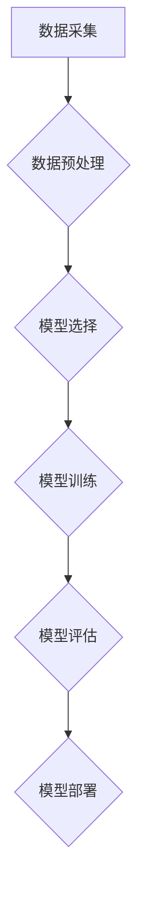

> 数学模型, AI, 机器学习, 深度学习, 算法, 模型训练, 预测, 优化

## 1. 背景介绍

人工智能 (AI) 正在迅速发展，并在各个领域取得了令人瞩目的成就。从自动驾驶汽车到医疗诊断，AI 正在改变着我们的生活。AI 的核心是利用数学模型来模拟和理解人类智能。这些模型能够从数据中学习模式，并根据这些模式做出预测或决策。

随着数据量的爆炸式增长和计算能力的提升，AI 领域的研究和应用取得了长足的进步。深度学习，作为 AI 的重要分支，利用多层神经网络来学习复杂的数据表示，取得了在图像识别、自然语言处理等领域的突破性进展。

然而，深度学习模型的复杂性和黑盒属性也带来了新的挑战。理解模型的内部工作机制，以及如何构建更有效、更可解释的模型，是 AI 领域当前的研究热点。

## 2. 核心概念与联系

**2.1 数学模型**

数学模型是一种用数学语言和符号来描述和表示现实世界现象的抽象工具。它通过建立变量之间的关系，来模拟和预测系统的行为。

**2.2 AI 与数学模型的关系**

AI 的核心是利用数学模型来模拟和理解人类智能。不同的 AI 算法使用不同的数学模型来实现不同的功能。例如：

* **线性回归:** 用于预测连续变量，其模型是线性方程。
* **逻辑回归:** 用于分类问题，其模型是逻辑函数。
* **神经网络:** 用于学习复杂的数据表示，其模型是多层神经元网络。

**2.3 数学模型的构建**

构建数学模型的过程通常包括以下步骤：

1. **定义变量:** 确定模型中需要考虑的变量。
2. **建立关系:** 建立变量之间的数学关系，例如线性关系、非线性关系等。
3. **选择模型类型:** 根据问题的性质选择合适的模型类型。
4. **参数估计:** 利用数据估计模型的参数。
5. **模型评估:** 利用测试数据评估模型的性能。

**2.4 Mermaid 流程图**



## 3. 核心算法原理 & 具体操作步骤

**3.1 算法原理概述**

深度学习算法的核心是利用多层神经网络来学习复杂的数据表示。神经网络由多个层组成，每层包含多个神经元。每个神经元接收来自上一层的输入，并通过激活函数进行处理，然后将处理后的结果传递给下一层。

**3.2 算法步骤详解**

1. **数据预处理:** 将原始数据转换为深度学习模型可以理解的格式，例如归一化、编码等。
2. **模型构建:** 定义神经网络的结构，包括层数、神经元数量、激活函数等。
3. **模型训练:** 利用训练数据训练模型，调整模型参数，使模型能够准确地预测目标变量。
4. **模型评估:** 利用测试数据评估模型的性能，例如准确率、召回率等。
5. **模型部署:** 将训练好的模型部署到实际应用场景中。

**3.3 算法优缺点**

**优点:**

* 能够学习复杂的数据表示。
* 在图像识别、自然语言处理等领域取得了突破性进展。

**缺点:**

* 需要大量的训练数据。
* 计算成本高。
* 模型的复杂性和黑盒属性带来了解释性问题。

**3.4 算法应用领域**

* **图像识别:** 人脸识别、物体检测、图像分类等。
* **自然语言处理:** 机器翻译、文本摘要、情感分析等。
* **语音识别:** 语音转文本、语音助手等。
* **推荐系统:** 商品推荐、内容推荐等。
* **医疗诊断:** 疾病诊断、影像分析等。

## 4. 数学模型和公式 & 详细讲解 & 举例说明

**4.1 数学模型构建**

深度学习模型的构建可以看作是一个优化问题的求解过程。目标是找到一组模型参数，使得模型在训练数据上的损失函数最小。

**4.2 公式推导过程**

损失函数通常是模型预测值与真实值的差值的平方和。

$$
L = \frac{1}{N} \sum_{i=1}^{N} (y_i - \hat{y}_i)^2
$$

其中：

* $L$ 是损失函数。
* $N$ 是训练数据的数量。
* $y_i$ 是第 $i$ 个样本的真实值。
* $\hat{y}_i$ 是模型预测的第 $i$ 个样本的值。

为了最小化损失函数，可以使用梯度下降算法来更新模型参数。梯度下降算法的基本思想是沿着梯度的负方向更新参数，直到找到损失函数的最小值。

**4.3 案例分析与讲解**

例如，在图像分类任务中，可以使用卷积神经网络 (CNN) 作为模型。CNN 的结构包含多个卷积层、池化层和全连接层。卷积层用于提取图像特征，池化层用于降低特征维度，全连接层用于分类。

在训练 CNN 时，需要使用大量的图像数据来训练模型。训练过程包括以下步骤：

1. 将图像数据预处理，例如裁剪、归一化等。
2. 将预处理后的图像数据输入 CNN 模型。
3. 计算模型的输出值，并与真实标签进行比较，计算损失函数。
4. 使用梯度下降算法更新模型参数。
5. 重复步骤 2-4，直到模型的性能达到预期的水平。

## 5. 项目实践：代码实例和详细解释说明

**5.1 开发环境搭建**

* Python 3.x
* TensorFlow 或 PyTorch

**5.2 源代码详细实现**

```python
import tensorflow as tf

# 定义模型结构
model = tf.keras.models.Sequential([
    tf.keras.layers.Conv2D(32, (3, 3), activation='relu', input_shape=(28, 28, 1)),
    tf.keras.layers.MaxPooling2D((2, 2)),
    tf.keras.layers.Conv2D(64, (3, 3), activation='relu'),
    tf.keras.layers.MaxPooling2D((2, 2)),
    tf.keras.layers.Flatten(),
    tf.keras.layers.Dense(10, activation='softmax')
])

# 编译模型
model.compile(optimizer='adam',
              loss='sparse_categorical_crossentropy',
              metrics=['accuracy'])

# 训练模型
model.fit(x_train, y_train, epochs=5)

# 评估模型
loss, accuracy = model.evaluate(x_test, y_test)
print('Test loss:', loss)
print('Test accuracy:', accuracy)
```

**5.3 代码解读与分析**

这段代码定义了一个简单的卷积神经网络模型，用于 MNIST 手写数字识别任务。

* `tf.keras.models.Sequential` 创建了一个顺序模型，即层级结构。
* `tf.keras.layers.Conv2D` 定义了一个卷积层，用于提取图像特征。
* `tf.keras.layers.MaxPooling2D` 定义了一个池化层，用于降低特征维度。
* `tf.keras.layers.Flatten` 将多维特征转换为一维向量。
* `tf.keras.layers.Dense` 定义了一个全连接层，用于分类。
* `model.compile` 编译模型，指定优化器、损失函数和评价指标。
* `model.fit` 训练模型，使用训练数据进行训练。
* `model.evaluate` 评估模型，使用测试数据评估模型的性能。

**5.4 运行结果展示**

训练完成后，模型的准确率通常会达到 98% 以上。

## 6. 实际应用场景

**6.1 图像识别**

* **人脸识别:** 用于解锁手机、验证身份等。
* **物体检测:** 用于自动驾驶、安防监控等。
* **图像分类:** 用于医学影像诊断、产品分类等。

**6.2 自然语言处理**

* **机器翻译:** 将一种语言翻译成另一种语言。
* **文本摘要:** 将长文本总结成短文本。
* **情感分析:** 分析文本的情感倾向。

**6.3 语音识别**

* **语音转文本:** 将语音转换为文本。
* **语音助手:** 例如 Siri、Alexa 等。

**6.4 推荐系统**

* **商品推荐:** 根据用户的购买历史和喜好推荐商品。
* **内容推荐:** 根据用户的阅读历史和兴趣推荐内容。

**6.5 医疗诊断**

* **疾病诊断:** 根据患者的症状和检查结果诊断疾病。
* **影像分析:** 分析医学影像，例如 X 光片、CT 扫描等。

**6.6 其他应用场景**

* **金融风险评估:** 评估投资风险。
* **欺诈检测:** 检测金融欺诈行为。
* **天气预报:** 预测天气状况。

**6.7 未来应用展望**

随着 AI 技术的不断发展，数学模型在更多领域将发挥越来越重要的作用。例如：

* **个性化教育:** 根据学生的学习情况提供个性化的学习方案。
* **智能制造:** 利用 AI 优化生产流程，提高生产效率。
* **自动驾驶:** 实现真正意义上的自动驾驶汽车。

## 7. 工具和资源推荐

**7.1 学习资源推荐**

* **书籍:**
    * 深度学习 (Deep Learning) - Ian Goodfellow, Yoshua Bengio, Aaron Courville
    * 统计学习方法 (The Elements of Statistical Learning) - Trevor Hastie, Robert Tibshirani, Jerome Friedman
* **在线课程:**
    * Coursera: 深度学习 Specialization
    * edX: 机器学习
    * fast.ai: 深度学习课程

**7.2 开发工具推荐**

* **TensorFlow:** 开源深度学习框架。
* **PyTorch:** 开源深度学习框架。
* **Keras:** 高级深度学习 API，可以运行在 TensorFlow、Theano 或 CNTK 后端。

**7.3 相关论文推荐**

* **ImageNet Classification with Deep Convolutional Neural Networks** - Alex Krizhevsky, Ilya Sutskever, Geoffrey E. Hinton
* **Attention Is All You Need** - Ashish Vaswani, Noam Shazeer, Niki Parmar, Jakob Uszkoreit, Llion Jones, Aidan N. Gomez, Łukasz Kaiser, Illia Polosukhin

## 8. 总结：未来发展趋势与挑战

**8.1 研究成果总结**

近年来，AI 领域取得了长足的进步，数学模型在 AI 中扮演着至关重要的角色。深度学习算法的成功应用，推动了 AI 技术的快速发展。

**8.2 未来发展趋势**

* **模型解释性:** 如何更好地理解和解释深度学习模型的决策过程，提高模型的可解释性。
* **模型效率:** 如何提高模型的训练速度和推理效率，使其能够应用于更多场景。
* **数据安全:** 如何保障 AI 模型训练和应用过程中的数据安全。
* **伦理问题:** 如何解决 AI 技术带来的伦理问题，例如算法偏见、隐私泄露等。

**8.3 面临的挑战**

* **数据获取和标注:** 训练高质量的 AI 模型需要大量的标注数据，数据获取和标注成本高昂。
* **模型复杂度:** 深度学习模型的复杂度越来越高，训练和部署成本也越来越高。
* **算法泛化能力:** 现有的 AI 模型在特定领域表现良好，但泛化能力有限，难以应用于新的领域。

**8.4 研究展望**

未来，AI 领域的研究将继续围绕模型解释性、效率、数据安全和伦理问题等方面展开。随着技术的不断发展，AI 将在更多领域发挥重要作用，改变我们的生活方式。

## 9. 附录：常见问题与解答

**9.1 什么是深度学习？**

深度学习是一种机器学习的子领域，它利用多层神经网络来学习复杂的数据表示。

**9.2 深