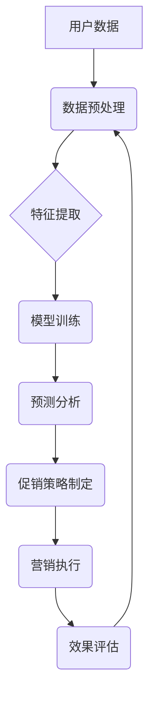

> 智能促销、机器学习、数据挖掘、推荐系统、个性化营销、预测分析、A/B测试

## 1. 背景介绍

在当今数据爆炸的时代，企业拥有海量用户数据，但如何有效利用这些数据来制定精准的促销策略，提升营销效果，一直是企业面临的挑战。传统的促销策略往往依赖于经验和直觉，缺乏数据支撑，难以精准定位目标用户，导致资源浪费和营销效果不佳。

智能促销策略的出现，为企业提供了全新的解决方案。通过结合机器学习、数据挖掘、推荐系统等先进技术，智能促销策略能够分析用户行为、偏好和购买历史，精准预测用户需求，制定个性化的促销方案，从而提高营销效率和转化率。

## 2. 核心概念与联系

**2.1 核心概念**

* **智能促销:** 利用人工智能技术，分析用户数据，制定个性化、精准的促销策略，以提高营销效果。
* **机器学习:** 一种人工智能技术，通过算法训练，使系统能够从数据中学习，并做出预测或决策。
* **数据挖掘:** 从海量数据中发现隐藏的模式和规律，以支持决策和分析。
* **推荐系统:** 根据用户的历史行为和偏好，推荐相关的商品或服务。
* **个性化营销:** 根据用户的不同特征和需求，定制个性化的营销内容和方案。

**2.2 架构图**



**2.3 联系**

智能促销策略的核心是利用机器学习算法对用户数据进行分析，挖掘用户行为模式和偏好，从而制定个性化的促销方案。数据预处理是机器学习算法的基础，需要将原始数据清洗、转换和格式化。特征提取是指从用户数据中提取有价值的特征，用于训练机器学习模型。模型训练是指使用机器学习算法，对提取的特征进行训练，建立预测模型。预测分析是指利用训练好的模型，对用户的行为进行预测，例如预测用户的购买意愿、喜欢的商品类型等。促销策略制定是指根据预测分析的结果，制定个性化的促销方案，例如推荐商品、提供优惠券、设置限时优惠等。营销执行是指将制定好的促销方案进行推广和执行。效果评估是指对促销活动的执行效果进行评估，并根据评估结果进行调整和优化。

## 3. 核心算法原理 & 具体操作步骤

**3.1 算法原理概述**

智能促销策略中常用的算法包括：

* **协同过滤:** 根据用户的历史行为和相似用户的信息，推荐相关的商品或服务。
* **内容过滤:** 根据商品的特征和用户的偏好，推荐相关的商品或服务。
* **深度学习:** 利用深度神经网络，对用户数据进行更深入的分析，挖掘更复杂的模式和关系。

**3.2 算法步骤详解**

以协同过滤算法为例，其具体步骤如下：

1. **数据收集:** 收集用户购买历史、浏览记录、评分等数据。
2. **数据预处理:** 清洗、转换和格式化数据，例如处理缺失值、去除重复数据等。
3. **用户相似度计算:** 计算用户之间的相似度，例如使用余弦相似度或皮尔逊相关系数。
4. **推荐商品:** 根据用户的相似用户和商品评分信息，推荐相关的商品。

**3.3 算法优缺点**

* **协同过滤:**
    * **优点:** 可以推荐用户可能感兴趣但从未接触过的商品。
    * **缺点:** 当数据稀疏时，算法效果会下降。
* **内容过滤:**
    * **优点:** 可以根据用户的兴趣爱好，推荐更精准的商品。
    * **缺点:** 难以发现用户潜在的兴趣。
* **深度学习:**
    * **优点:** 可以挖掘更复杂的模式和关系，提高推荐效果。
    * **缺点:** 需要大量的训练数据和计算资源。

**3.4 算法应用领域**

智能促销策略的算法广泛应用于电商、金融、旅游、娱乐等各个领域，例如：

* **电商平台:** 推荐商品、个性化优惠券、限时抢购等。
* **金融机构:** 推广理财产品、个性化贷款方案等。
* **旅游平台:** 推荐旅游线路、酒店预订等。
* **娱乐平台:** 推荐电影、音乐、游戏等。

## 4. 数学模型和公式 & 详细讲解 & 举例说明

**4.1 数学模型构建**

协同过滤算法的数学模型可以表示为用户-商品评分矩阵，其中每个元素代表用户对商品的评分。

**4.2 公式推导过程**

用户相似度计算可以使用余弦相似度公式：

$$
similarity(u_i, u_j) = \frac{u_i \cdot u_j}{||u_i|| ||u_j||}
$$

其中：

* $u_i$ 和 $u_j$ 分别表示用户 $i$ 和用户 $j$ 的评分向量。
* $u_i \cdot u_j$ 表示用户 $i$ 和用户 $j$ 的评分向量的点积。
* $||u_i||$ 和 $||u_j||$ 分别表示用户 $i$ 和用户 $j$ 的评分向量的模长。

**4.3 案例分析与讲解**

假设有两个用户 $A$ 和 $B$，他们的评分向量分别为：

* $u_A = [5, 4, 3, 2, 1]$
* $u_B = [4, 3, 2, 1, 5]$

则用户 $A$ 和 $B$ 的余弦相似度为：

$$
similarity(A, B) = \frac{5 \cdot 4 + 4 \cdot 3 + 3 \cdot 2 + 2 \cdot 1 + 1 \cdot 5}{\sqrt{5^2 + 4^2 + 3^2 + 2^2 + 1^2} \sqrt{4^2 + 3^2 + 2^2 + 1^2 + 5^2}}
$$

计算结果表明，用户 $A$ 和 $B$ 的相似度较高，因此可以推荐用户 $A$ 喜欢的商品给用户 $B$。

## 5. 项目实践：代码实例和详细解释说明

**5.1 开发环境搭建**

* 操作系统: Ubuntu 20.04
* Python 版本: 3.8
* 必要的库: pandas, numpy, scikit-learn, matplotlib

**5.2 源代码详细实现**

```python
import pandas as pd
from sklearn.metrics.pairwise import cosine_similarity

# 加载用户评分数据
ratings_data = pd.read_csv('ratings.csv')

# 构建用户-商品评分矩阵
user_item_matrix = ratings_data.pivot_table(index='user_id', columns='item_id', values='rating')

# 计算用户相似度
user_similarity = cosine_similarity(user_item_matrix)

# 获取用户 A 的相似用户
user_A_id = 1
similar_users = user_similarity[user_A_id].argsort()[:-6:-1]  # 获取前 5 个相似用户

# 推荐商品给用户 A
recommended_items = []
for similar_user in similar_users:
    # 获取相似用户喜欢的商品
    similar_user_ratings = user_item_matrix.loc[similar_user].dropna()
    # 推荐用户 A 没有评分过的商品
    recommended_items.extend(similar_user_ratings.index[~user_item_matrix.loc[user_A_id].index.isin(similar_user_ratings.index)])

# 去除重复商品
recommended_items = list(set(recommended_items))

# 打印推荐结果
print(f'推荐给用户 {user_A_id} 的商品: {recommended_items}')
```

**5.3 代码解读与分析**

* 首先，加载用户评分数据并构建用户-商品评分矩阵。
* 然后，使用余弦相似度计算用户之间的相似度。
* 接着，获取用户 A 的相似用户，并根据相似用户的评分信息，推荐用户 A 没有评分过的商品。
* 最后，打印推荐结果。

**5.4 运行结果展示**

运行代码后，将输出用户 A 的推荐商品列表。

## 6. 实际应用场景

**6.1 电商平台**

* **商品推荐:** 根据用户的浏览历史、购买记录和评分信息，推荐相关的商品。
* **个性化优惠券:** 根据用户的消费习惯和偏好，发送个性化的优惠券。
* **限时抢购:** 根据用户的购买意愿和时间节点，推送限时抢购活动。

**6.2 金融机构**

* **理财产品推荐:** 根据用户的风险偏好和投资目标，推荐合适的理财产品。
* **个性化贷款方案:** 根据用户的收入、支出和信用记录，提供个性化的贷款方案。
* **信用卡推荐:** 根据用户的消费习惯和信用记录，推荐合适的信用卡。

**6.3 旅游平台**

* **旅游线路推荐:** 根据用户的旅行偏好和预算，推荐合适的旅游线路。
* **酒店预订:** 根据用户的入住时间、地点和预算，推荐合适的酒店。
* **机票预订:** 根据用户的出行时间、目的地和预算，推荐合适的机票。

**6.4 未来应用展望**

随着人工智能技术的不断发展，智能促销策略将应用于更多领域，例如：

* **医疗保健:** 根据用户的健康状况和需求，推荐合适的医疗服务和药品。
* **教育:** 根据学生的学习进度和兴趣，推荐合适的学习资源和课程。
* **娱乐:** 根据用户的兴趣爱好，推荐合适的电影、音乐和游戏。

## 7. 工具和资源推荐

**7.1 学习资源推荐**

* **书籍:**
    * 《机器学习》 by Tom Mitchell
    * 《深度学习》 by Ian Goodfellow, Yoshua Bengio, and Aaron Courville
* **在线课程:**
    * Coursera: Machine Learning
    * edX: Artificial Intelligence
* **博客和网站:**
    * Towards Data Science
    * Machine Learning Mastery

**7.2 开发工具推荐**

* **Python:** 广泛应用于机器学习和数据分析。
* **Scikit-learn:** Python 的机器学习库，提供各种算法和工具。
* **TensorFlow:** Google 开发的深度学习框架。
* **PyTorch:** Facebook 开发的深度学习框架。

**7.3 相关论文推荐**

* **Collaborative Filtering for Recommender Systems** by Su-Yin Lee and Wei-Chun Lee
* **Deep Learning for Recommender Systems** by Xiangnan He et al.
* **A Survey on Recommender Systems** by Charu C. Aggarwal

## 8. 总结：未来发展趋势与挑战

**8.1 研究成果总结**

智能促销策略的应用取得了显著的成果，例如提高了营销效率、提升了用户体验、降低了营销成本等。

**8.2 未来发展趋势**

* **个性化程度更高:** 利用更先进的算法和技术，实现更精准的个性化推荐。
* **跨平台融合:** 将智能促销策略应用于多个平台，例如电商平台、社交媒体平台、移动应用等。
* **数据安全和隐私保护:** 加强数据安全和隐私保护措施，确保用户数据的安全和隐私。

**8.3 面临的挑战**

* **数据质量:** 智能促销策略依赖于高质量的数据，数据质量问题会影响算法效果。
* **算法复杂度:** 一些智能促销算法的复杂度较高，需要强大的计算资源。
* **用户隐私:** 如何平衡智能促销策略的应用和用户隐私保护是一个重要的挑战。

**8.4 研究展望**

未来，智能促销策略的研究将更加注重个性化、跨平台融合和数据安全等方面，并探索新的算法和技术，以更好地服务于企业和用户。

## 9. 附录：常见问题与解答

**9.1 如何评估智能促销策略的效果？**

智能促销策略的效果可以通过多种指标进行评估，例如：

* 点击率 (