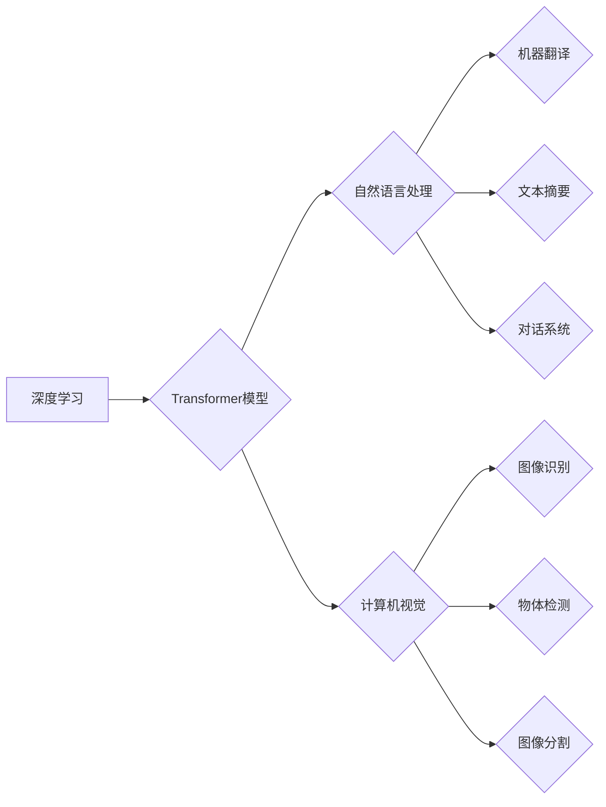

> 人工智能，深度学习，Transformer，自然语言处理，计算机视觉，应用场景，未来趋势

## 1. 背景介绍

人工智能（AI）技术近年来发展迅速，从最初的局限于特定领域的应用，逐渐发展到广泛应用于各个领域，深刻地改变着我们的生活方式和工作模式。随着计算能力的提升和算法的不断完善，人工智能进入了一个新的发展阶段——AI 2.0时代。

AI 2.0时代的特点是：

* **更强大的计算能力:**  GPU、TPU等专用芯片的出现，以及云计算平台的普及，为深度学习模型的训练提供了强大的计算支持。
* **更先进的算法:**  Transformer模型的出现，以及其在自然语言处理领域的成功应用，标志着深度学习算法取得了新的突破。
* **更丰富的应用场景:**  AI技术已经应用于各个领域，包括医疗、金融、教育、交通、娱乐等，并不断涌现出新的应用场景。

## 2. 核心概念与联系

AI 2.0时代的核心概念包括：

* **深度学习:**  深度学习是机器学习的一种，通过多层神经网络来模拟人类大脑的学习过程，能够从海量数据中学习到复杂的特征和模式。
* **Transformer模型:**  Transformer模型是一种新的神经网络架构，能够有效地处理序列数据，例如文本和语音。其自注意力机制能够捕捉序列中不同元素之间的关系，从而提高了模型的性能。
* **自然语言处理 (NLP):**  NLP是人工智能的一个分支，旨在使计算机能够理解和处理人类语言。Transformer模型在NLP领域取得了突破性的进展，例如机器翻译、文本摘要、对话系统等。
* **计算机视觉 (CV):**  CV是人工智能的另一个分支，旨在使计算机能够“看”和理解图像和视频。深度学习算法在CV领域也取得了显著的进展，例如图像识别、物体检测、图像分割等。

**Mermaid 流程图:**



## 3. 核心算法原理 & 具体操作步骤

### 3.1  算法原理概述

Transformer模型的核心是自注意力机制，它能够捕捉序列中不同元素之间的关系，从而提高模型的性能。

自注意力机制的工作原理是：

1. 将输入序列中的每个元素与所有其他元素进行比较，计算它们之间的相关性。
2. 将这些相关性信息汇总起来，得到每个元素的注意力权重。
3. 根据注意力权重，对输入序列进行加权求和，得到输出序列。

### 3.2  算法步骤详解

1. **输入嵌入:** 将输入序列中的每个元素转换为向量表示。
2. **多头自注意力:** 对输入序列进行多头自注意力操作，计算每个元素与所有其他元素之间的相关性。
3. **前馈神经网络:** 对每个元素进行前馈神经网络处理，进一步提取特征。
4. **位置编码:** 添加位置信息，使模型能够理解序列中的元素顺序。
5. **输出层:** 将输出序列转换为目标输出格式。

### 3.3  算法优缺点

**优点:**

* 能够有效地捕捉序列中不同元素之间的关系。
* 训练速度快，性能优异。
* 可并行化训练，适合大规模数据处理。

**缺点:**

* 计算量大，需要强大的计算资源。
* 对训练数据要求较高。

### 3.4  算法应用领域

Transformer模型在自然语言处理、计算机视觉、语音识别等领域都有广泛的应用。

* **自然语言处理:** 机器翻译、文本摘要、问答系统、对话系统等。
* **计算机视觉:** 图像识别、物体检测、图像分割等。
* **语音识别:** 语音转文本、语音合成等。

## 4. 数学模型和公式 & 详细讲解 & 举例说明

### 4.1  数学模型构建

Transformer模型的数学模型主要包括以下几个部分：

* **嵌入层:** 将输入序列中的每个元素转换为向量表示。
* **多头自注意力层:** 计算每个元素与所有其他元素之间的相关性。
* **前馈神经网络层:** 对每个元素进行非线性变换。
* **位置编码层:** 添加位置信息。
* **输出层:** 将输出序列转换为目标输出格式。

### 4.2  公式推导过程

**自注意力机制的计算公式:**

$$
Attention(Q, K, V) = softmax(\frac{QK^T}{\sqrt{d_k}})V
$$

其中：

* $Q$：查询矩阵
* $K$：键矩阵
* $V$：值矩阵
* $d_k$：键向量的维度
* $softmax$：softmax函数

### 4.3  案例分析与讲解

**举例说明:**

假设我们有一个句子 "The cat sat on the mat"，将其转换为向量表示，然后使用自注意力机制计算每个词与所有其他词之间的相关性。

例如，"cat" 与 "sat" 之间的相关性较高，因为它们在语义上相关。

## 5. 项目实践：代码实例和详细解释说明

### 5.1  开发环境搭建

* Python 3.6+
* TensorFlow 或 PyTorch
* CUDA 和 cuDNN

### 5.2  源代码详细实现

```python
import tensorflow as tf

# 定义 Transformer 模型
class Transformer(tf.keras.Model):
    def __init__(self, vocab_size, embedding_dim, num_heads, num_layers):
        super(Transformer, self).__init__()
        self.embedding = tf.keras.layers.Embedding(vocab_size, embedding_dim)
        self.transformer_layers = tf.keras.layers.StackedRNNCells([
            tf.keras.layers.MultiHeadAttention(num_heads=num_heads, key_dim=embedding_dim)
            for _ in range(num_layers)
        ])

    def call(self, inputs):
        # 嵌入输入序列
        embedded_inputs = self.embedding(inputs)
        # 通过 Transformer 层进行处理
        outputs = self.transformer_layers(embedded_inputs)
        return outputs

# 实例化 Transformer 模型
model = Transformer(vocab_size=10000, embedding_dim=512, num_heads=8, num_layers=6)

# 训练模型
model.compile(optimizer='adam', loss='mse')
model.fit(x_train, y_train, epochs=10)
```

### 5.3  代码解读与分析

* **嵌入层:** 将输入序列中的每个词转换为向量表示。
* **Transformer 层:** 包含多头自注意力层和前馈神经网络层，用于提取特征和捕捉序列关系。
* **训练模型:** 使用 Adam 优化器和均方误差损失函数训练模型。

### 5.4  运行结果展示

训练完成后，可以使用模型对新的输入序列进行预测。

## 6. 实际应用场景

### 6.1  医疗领域

* **疾病诊断:** 利用深度学习模型分析患者的医疗影像和病历数据，辅助医生进行疾病诊断。
* **药物研发:** 利用深度学习模型分析药物分子结构和生物活性数据，加速药物研发过程。

### 6.2  金融领域

* **欺诈检测:** 利用深度学习模型分析交易数据，识别异常交易行为，防止金融欺诈。
* **风险评估:** 利用深度学习模型分析客户的信用信息，评估客户的贷款风险。

### 6.3  教育领域

* **个性化学习:** 利用深度学习模型分析学生的学习数据，提供个性化的学习方案。
* **智能辅导:** 利用深度学习模型开发智能辅导系统，帮助学生解决学习难题。

### 6.4  未来应用展望

AI 2.0时代，人工智能技术将更加深入地融入到我们的生活和工作中，带来更多创新和改变。

* **更智能的助手:** AI助手将更加智能化，能够理解和响应用户的复杂指令，提供更个性化的服务。
* **更安全的社会:** AI技术将用于提高社会安全水平，例如监控犯罪行为、预防事故发生等。
* **更美好的生活:** AI技术将用于改善人们的生活质量，例如开发新的医疗技术、提高能源效率等。

## 7. 工具和资源推荐

### 7.1  学习资源推荐

* **书籍:**
    * 《深度学习》
    * 《自然语言处理》
    * 《计算机视觉》
* **在线课程:**
    * Coursera
    * edX
    * Udacity

### 7.2  开发工具推荐

* **TensorFlow:** 开源深度学习框架
* **PyTorch:** 开源深度学习框架
* **Keras:** 高级深度学习API

### 7.3  相关论文推荐

* **Attention Is All You Need:** https://arxiv.org/abs/1706.03762
* **BERT: Pre-training of Deep Bidirectional Transformers for Language Understanding:** https://arxiv.org/abs/1810.04805

## 8. 总结：未来发展趋势与挑战

### 8.1  研究成果总结

AI 2.0时代，人工智能技术取得了显著的进展，特别是深度学习算法在自然语言处理和计算机视觉领域取得了突破性的成果。

### 8.2  未来发展趋势

* **更强大的计算能力:** 量子计算、神经形态芯片等新兴技术将为深度学习模型的训练提供更强大的计算支持。
* **更先进的算法:** 

新的深度学习算法将不断涌现，例如强化学习、联邦学习等，进一步提高模型的性能和泛化能力。
* **更广泛的应用场景:** AI技术将应用于更多领域，例如自动驾驶、机器人、医疗保健等，带来更多创新和改变。

### 8.3  面临的挑战

* **数据安全和隐私保护:** AI模型的训练需要大量数据，如何保证数据安全和隐私保护是一个重要的挑战。
* **算法可解释性和公平性:** 深度学习模型的决策过程往往难以解释，如何提高模型的可解释性和公平性是一个重要的研究方向。
* **伦理问题:** AI技术的快速发展也带来了伦理问题，例如人工智能的责任归属、人工智能的潜在风险等，需要社会各界共同探讨和解决。

### 8.4  研究展望

未来，人工智能研究将继续朝着更智能、更安全、更公平的方向发展。

## 9. 附录：常见问题与解答

* **什么是 Transformer 模型?** Transformer模型是一种新的神经网络架构，能够有效地处理序列数据，例如文本和语音。
* **Transformer 模型的优势是什么?** Transformer模型能够有效地捕捉序列中不同元素之间的关系，训练速度快，性能优异。
* **Transformer 模型有哪些应用场景?** Transformer模型在自然语言处理、计算机视觉、语音识别等领域都有广泛的应用。


作者：禅与计算机程序设计艺术 / Zen and the Art of Computer Programming 
<end_of_turn>