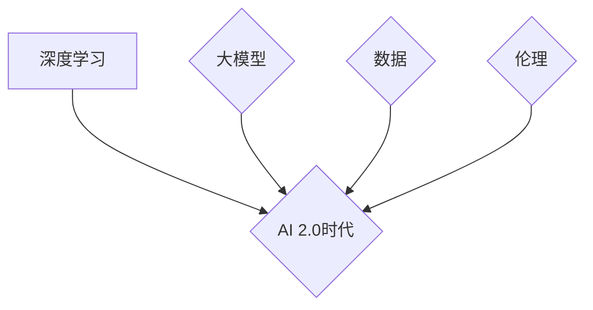

> 人工智能，深度学习，Transformer，大模型，通用人工智能，AI 2.0，伦理问题，未来趋势

## 1. 背景介绍

人工智能（AI）技术近年来发展迅速，从最初的局限于特定领域的应用，逐渐发展到能够处理更复杂的任务，甚至展现出一些类似人类智能的能力。2010年以来，深度学习技术的兴起，特别是Transformer模型的出现，为AI发展带来了新的突破。这些模型能够处理海量数据，学习复杂的模式，并在自然语言处理、计算机视觉等领域取得了显著的成果。

李开复，作为一位杰出的AI专家，在《AI 2.0 时代的意义》一文中，深刻地分析了AI 2.0时代的到来，并探讨了其对社会、经济和人类未来的深远影响。

## 2. 核心概念与联系

AI 2.0时代的核心概念是**通用人工智能（AGI）**。AGI是指能够像人类一样学习、思考、解决问题和创造的智能系统。与传统的AI不同，AGI不局限于特定的任务，而是拥有更广泛的知识和能力，能够适应各种不同的环境和挑战。

**AI 2.0时代与深度学习的关系**

深度学习是AI 2.0时代的基石。深度学习模型能够通过多层神经网络学习复杂的模式，并不断提升其性能。Transformer模型作为深度学习的代表，其强大的处理能力和泛化能力，为实现AGI提供了重要的技术支撑。

**AI 2.0时代与大模型的关系**

大模型是指参数量巨大、训练数据海量、计算资源消耗巨大的AI模型。大模型能够学习更复杂的知识和模式，并展现出更强的泛化能力。例如，GPT-3、LaMDA等大模型，在自然语言处理领域取得了突破性的进展。

**AI 2.0时代与数据的关系**

数据是AI 2.0时代的燃料。大模型的训练需要海量的数据，而数据质量直接影响模型的性能。因此，数据收集、清洗、标注等环节都至关重要。

**AI 2.0时代与伦理的关系**

AI 2.0时代的到来也带来了新的伦理挑战。例如，AI算法的偏见、数据隐私保护、AI技术的滥用等问题都需要得到认真思考和解决。



## 3. 核心算法原理 & 具体操作步骤

### 3.1  算法原理概述

Transformer模型是一种基于注意力机制的深度学习模型，其核心思想是通过学习文本中的上下文关系，更好地理解和处理语言信息。

Transformer模型的主要结构包括：

* **编码器（Encoder）**: 用于将输入文本序列编码成向量表示。
* **解码器（Decoder）**: 用于根据编码后的向量表示生成输出文本序列。
* **注意力机制**: 用于学习文本中不同词之间的关系，并赋予重要词更大的权重。

### 3.2  算法步骤详解

1. **输入处理**: 将输入文本序列分割成单词或子词，并将其转换为数字表示。
2. **编码**: 将每个单词或子词的数字表示输入编码器，编码器通过多层Transformer模块进行处理，最终将每个单词或子词编码成一个向量表示。
3. **注意力机制**: 在解码器中，注意力机制用于学习每个输出单词与输入文本序列中所有单词之间的关系，并根据这些关系调整每个输出单词的权重。
4. **解码**: 解码器根据编码后的向量表示和注意力机制的输出，生成输出文本序列。

### 3.3  算法优缺点

**优点**:

* **强大的处理能力**: Transformer模型能够处理长文本序列，并学习复杂的上下文关系。
* **优秀的泛化能力**: Transformer模型在各种自然语言处理任务中都表现出色。
* **可并行化训练**: Transformer模型的训练可以并行化，从而缩短训练时间。

**缺点**:

* **计算资源消耗大**: Transformer模型的参数量巨大，训练需要大量的计算资源。
* **训练数据需求高**: Transformer模型的训练需要海量的数据。
* **可解释性差**: Transformer模型的内部机制比较复杂，难以解释其决策过程。

### 3.4  算法应用领域

Transformer模型在自然语言处理领域有着广泛的应用，例如：

* **机器翻译**: 将一种语言翻译成另一种语言。
* **文本摘要**: 将长文本压缩成短文本。
* **问答系统**: 回答用户提出的问题。
* **对话系统**: 与用户进行自然语言对话。
* **文本生成**: 生成新的文本内容。

## 4. 数学模型和公式 & 详细讲解 & 举例说明

### 4.1  数学模型构建

Transformer模型的核心是注意力机制，其数学模型可以表示为：

$$
Attention(Q, K, V) = softmax(\frac{QK^T}{\sqrt{d_k}})V
$$

其中：

* $Q$：查询矩阵
* $K$：键矩阵
* $V$：值矩阵
* $d_k$：键向量的维度
* $softmax$：softmax函数

### 4.2  公式推导过程

注意力机制的目的是学习文本中不同词之间的关系，并赋予重要词更大的权重。

1. 计算查询矩阵 $Q$ 与键矩阵 $K$ 的点积，并除以 $\sqrt{d_k}$。
2. 对点积结果应用softmax函数，得到每个词对其他词的注意力权重。
3. 将注意力权重与值矩阵 $V$ 相乘，得到每个词的加权和，即注意力输出。

### 4.3  案例分析与讲解

例如，在翻译句子“The cat sat on the mat”时，注意力机制会学习到“cat”与“sat”之间的关系，并赋予它们更大的权重，从而更好地理解句子的含义。

## 5. 项目实践：代码实例和详细解释说明

### 5.1  开发环境搭建

* Python 3.7+
* TensorFlow 2.0+
* PyTorch 1.0+

### 5.2  源代码详细实现

```python
import tensorflow as tf

# 定义Transformer模型
class Transformer(tf.keras.Model):
    def __init__(self, vocab_size, embedding_dim, num_heads, num_layers):
        super(Transformer, self).__init__()
        self.embedding = tf.keras.layers.Embedding(vocab_size, embedding_dim)
        self.transformer_layers = [
            tf.keras.layers.MultiHeadAttention(num_heads=num_heads, key_dim=embedding_dim)
            for _ in range(num_layers)
        ]
        self.dense = tf.keras.layers.Dense(vocab_size)

    def call(self, inputs):
        # Embedding
        embeddings = self.embedding(inputs)
        # Transformer layers
        for layer in self.transformer_layers:
            embeddings = layer(embeddings)
        # Output
        outputs = self.dense(embeddings)
        return outputs

# 实例化模型
model = Transformer(vocab_size=10000, embedding_dim=512, num_heads=8, num_layers=6)
```

### 5.3  代码解读与分析

* **Embedding层**: 将单词转换为向量表示。
* **MultiHeadAttention层**: 实现注意力机制，学习文本中不同词之间的关系。
* **Transformer层**: 多层Transformer模块，用于学习更复杂的上下文关系。
* **Dense层**: 将编码后的向量表示转换为输出文本序列。

### 5.4  运行结果展示

训练模型后，可以将其用于各种自然语言处理任务，例如机器翻译、文本摘要等。

## 6. 实际应用场景

### 6.1  自然语言处理

* **机器翻译**: 将一种语言翻译成另一种语言，例如Google Translate。
* **文本摘要**: 将长文本压缩成短文本，例如新闻摘要、会议记录摘要。
* **问答系统**: 回答用户提出的问题，例如搜索引擎的问答功能。
* **对话系统**: 与用户进行自然语言对话，例如聊天机器人。

### 6.2  计算机视觉

* **图像识别**: 将图像分类为不同的类别，例如人脸识别、物体识别。
* **图像生成**: 生成新的图像，例如艺术作品、产品设计。
* **图像分割**: 将图像分割成不同的区域，例如医学图像分割。

### 6.3  其他领域

* **语音识别**: 将语音转换为文本，例如语音助手。
* **音乐生成**: 生成新的音乐，例如作曲、配乐。
* **药物发现**: 预测药物的活性，加速药物研发。

### 6.4  未来应用展望

AI 2.0时代，AI技术将更加智能化、自动化，并应用于更广泛的领域，例如：

* **个性化教育**: 根据学生的学习情况提供个性化的学习方案。
* **精准医疗**: 根据患者的基因信息和病史提供个性化的医疗方案。
* **自动驾驶**: 实现无人驾驶汽车，提高交通安全和效率。

## 7. 工具和资源推荐

### 7.1  学习资源推荐

* **书籍**:
    * 《深度学习》
    * 《自然语言处理》
    * 《机器学习》
* **在线课程**:
    * Coursera
    * edX
    * Udacity

### 7.2  开发工具推荐

* **TensorFlow**: 开源深度学习框架。
* **PyTorch**: 开源深度学习框架。
* **Jupyter Notebook**: 用于编写和运行Python代码的交互式环境。

### 7.3  相关论文推荐

* **Attention Is All You Need**: Transformer模型的论文。
* **BERT**: 基于Transformer的预训练语言模型。
* **GPT-3**: 基于Transformer的文本生成模型。

## 8. 总结：未来发展趋势与挑战

### 8.1  研究成果总结

AI 2.0时代，深度学习技术取得了显著的进展，Transformer模型展现出强大的能力，并在自然语言处理领域取得了突破性的成果。

### 8.2  未来发展趋势

* **更强大的模型**: 模型参数量更大、训练数据更多，能够学习更复杂的知识和模式。
* **更广泛的应用**: AI技术将应用于更多领域，例如医疗、教育、金融等。
* **更智能的交互**: 人机交互更加自然、智能。

### 8.3  面临的挑战

* **数据安全**: AI模型的训练需要海量数据，如何保证数据安全和隐私保护是一个重要挑战。
* **算法偏见**: AI算法可能存在偏见，需要进行公平性和可解释性方面的研究。
* **伦理问题**: AI技术的应用可能带来伦理问题，需要进行深入的思考和讨论。

### 8.4  研究展望

未来，AI研究需要更加注重伦理、公平性和可解释性，并探索更安全、更可靠的AI技术。


## 9. 附录：常见问题与解答

**Q1: Transformer模型的优势是什么？**

**A1:** Transformer模型具有强大的处理能力、优秀的泛化能力和可并行化训练的特点。

**Q2: Transformer模型的缺点是什么？**

**A2:** Transformer模型的计算资源消耗大、训练数据需求高、可解释性差。

**Q3: Transformer模型有哪些应用场景？**

**A3:** Transformer模型广泛应用于自然语言处理、计算机视觉等领域。

**Q4: 如何学习Transformer模型？**

**A4:** 可以通过阅读相关书籍、在线课程和论文，并进行实践练习来学习Transformer模型。


作者：禅与计算机程序设计艺术 / Zen and the Art of Computer Programming 
<end_of_turn>