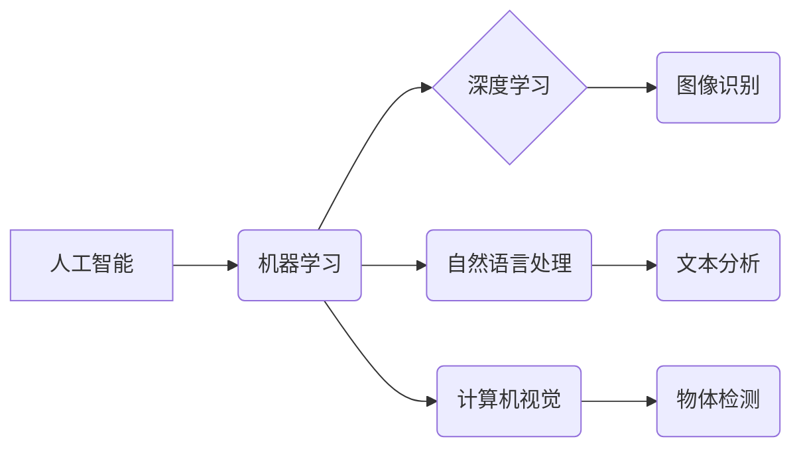

> 苹果、AI应用、科技价值、机器学习、深度学习、自然语言处理、计算机视觉、数据分析、创新

## 1. 背景介绍

近年来，人工智能（AI）技术飞速发展，已渗透到生活的方方面面。苹果公司作为科技巨头，也积极布局AI领域，并将其融入到产品和服务中。2023年，苹果发布了一系列搭载AI技术的应用，引发了业界和消费者的广泛关注。

李开复，作为一位享誉全球的人工智能专家，对苹果发布的AI应用给予了高度评价，并从多个角度分析了其背后的科技价值。

## 2. 核心概念与联系

### 2.1  人工智能（AI）

人工智能是指模拟人类智能行为的计算机系统。它涵盖了多个领域，包括机器学习、深度学习、自然语言处理、计算机视觉等。

### 2.2  机器学习（ML）

机器学习是人工智能的一个重要分支，它通过算法训练模型，使模型能够从数据中学习并做出预测或决策。

### 2.3  深度学习（DL）

深度学习是机器学习的一种更高级形式，它使用多层神经网络来模拟人类大脑的学习过程，能够处理更复杂的数据并取得更优的性能。

### 2.4  自然语言处理（NLP）

自然语言处理是指让计算机能够理解和处理人类语言的技术。它包括文本分析、机器翻译、语音识别等应用。

### 2.5  计算机视觉（CV）

计算机视觉是指让计算机能够“看”和理解图像的技术。它包括图像识别、物体检测、图像分割等应用。

**核心概念与联系流程图**



## 3. 核心算法原理 & 具体操作步骤

### 3.1  算法原理概述

苹果发布的AI应用中，使用了多种先进的算法，例如卷积神经网络（CNN）、循环神经网络（RNN）和Transformer等。这些算法能够有效地处理图像、文本和语音等数据，并进行相应的分析和预测。

### 3.2  算法步骤详解

**以图像识别为例，CNN算法的具体操作步骤如下：**

1. **数据预处理：** 将图像数据转换为适合CNN算法处理的格式，例如调整大小、归一化等。
2. **卷积层：** 使用卷积核对图像数据进行卷积运算，提取图像特征。
3. **池化层：** 对卷积层的输出进行池化操作，减少数据维度，提高计算效率。
4. **全连接层：** 将池化层的输出连接到全连接层，进行分类或回归预测。
5. **输出层：** 输出最终的分类结果或预测值。

### 3.3  算法优缺点

**CNN算法的优点：**

* 能够有效地提取图像特征。
* 具有较高的识别精度。
* 能够处理不同大小的图像。

**CNN算法的缺点：**

* 计算量较大。
* 训练时间较长。
* 对数据标注要求较高。

### 3.4  算法应用领域

CNN算法广泛应用于图像识别、物体检测、图像分割、人脸识别等领域。

## 4. 数学模型和公式 & 详细讲解 & 举例说明

### 4.1  数学模型构建

CNN算法的核心是卷积神经网络模型，其数学模型可以表示为：

$$
y = f(W * x + b)
$$

其中：

* $y$：输出结果
* $x$：输入数据
* $W$：卷积核权重
* $b$：偏置项
* $f$：激活函数

### 4.2  公式推导过程

卷积运算的数学公式如下：

$$
y_{i,j} = \sum_{m=0}^{M-1} \sum_{n=0}^{N-1} x_{i+m,j+n} * W_{m,n}
$$

其中：

* $y_{i,j}$：卷积结果的第 $i$ 行第 $j$ 列元素
* $x_{i+m,j+n}$：输入数据第 $i+m$ 行第 $j+n$ 列元素
* $W_{m,n}$：卷积核第 $m$ 行第 $n$ 列元素
* $M$：卷积核的高度
* $N$：卷积核的宽度

### 4.3  案例分析与讲解

假设我们有一个3x3的输入图像和一个3x3的卷积核，则卷积运算的结果是一个2x2的输出特征图。

**举例说明：**

```
输入图像：
1 2 3
4 5 6
7 8 9

卷积核：
0 1 0
1 0 1
0 1 0

输出特征图：
```

## 5. 项目实践：代码实例和详细解释说明

### 5.1  开发环境搭建

使用Python语言开发AI应用，需要安装以下软件包：

* TensorFlow或PyTorch：深度学习框架
* NumPy：数值计算库
* Matplotlib：数据可视化库

### 5.2  源代码详细实现

```python
import tensorflow as tf

# 定义卷积神经网络模型
model = tf.keras.models.Sequential([
    tf.keras.layers.Conv2D(32, (3, 3), activation='relu', input_shape=(28, 28, 1)),
    tf.keras.layers.MaxPooling2D((2, 2)),
    tf.keras.layers.Conv2D(64, (3, 3), activation='relu'),
    tf.keras.layers.MaxPooling2D((2, 2)),
    tf.keras.layers.Flatten(),
    tf.keras.layers.Dense(10, activation='softmax')
])

# 编译模型
model.compile(optimizer='adam',
              loss='sparse_categorical_crossentropy',
              metrics=['accuracy'])

# 训练模型
model.fit(x_train, y_train, epochs=5)

# 评估模型
loss, accuracy = model.evaluate(x_test, y_test)
print('Test loss:', loss)
print('Test accuracy:', accuracy)
```

### 5.3  代码解读与分析

这段代码定义了一个简单的卷积神经网络模型，用于手写数字识别任务。

* `tf.keras.models.Sequential()`：创建一个顺序模型，层级结构清晰。
* `tf.keras.layers.Conv2D()`：定义卷积层，提取图像特征。
* `tf.keras.layers.MaxPooling2D()`：定义池化层，减少数据维度。
* `tf.keras.layers.Flatten()`：将多维数据转换为一维数据。
* `tf.keras.layers.Dense()`：定义全连接层，进行分类预测。
* `model.compile()`：编译模型，指定优化器、损失函数和评价指标。
* `model.fit()`：训练模型，使用训练数据进行迭代训练。
* `model.evaluate()`：评估模型，使用测试数据计算损失和准确率。

### 5.4  运行结果展示

训练完成后，模型能够识别手写数字，并输出相应的准确率。

## 6. 实际应用场景

### 6.1  智能助手

苹果的Siri智能助手利用自然语言处理技术，能够理解用户的语音指令并执行相应的操作。

### 6.2  图像识别

iPhone的相机应用使用计算机视觉技术，能够识别物体、场景和人脸。

### 6.3  个性化推荐

苹果的App Store和音乐应用使用机器学习算法，根据用户的历史行为和偏好进行个性化推荐。

### 6.4  未来应用展望

随着AI技术的不断发展，苹果未来将更多地将AI应用于其产品和服务中，例如：

* 更智能的语音助手
* 更精准的图像识别和视频分析
* 更个性化的用户体验
* 更安全的生物识别验证

## 7. 工具和资源推荐

### 7.1  学习资源推荐

* **在线课程：** Coursera、edX、Udacity等平台提供丰富的AI课程。
* **书籍：** 《深度学习》、《机器学习实战》等书籍是学习AI的基础教材。
* **博客和论坛：** TensorFlow、PyTorch等框架的官方博客和论坛提供最新的技术信息和社区支持。

### 7.2  开发工具推荐

* **TensorFlow：** Google开发的开源深度学习框架。
* **PyTorch：** Facebook开发的开源深度学习框架。
* **Keras：** TensorFlow的高级API，简化了深度学习模型的构建和训练。

### 7.3  相关论文推荐

* **《ImageNet Classification with Deep Convolutional Neural Networks》**
* **《Attention Is All You Need》**
* **《BERT: Pre-training of Deep Bidirectional Transformers for Language Understanding》**

## 8. 总结：未来发展趋势与挑战

### 8.1  研究成果总结

苹果发布的AI应用展现了AI技术的强大应用潜力，在智能助手、图像识别、个性化推荐等领域取得了显著成果。

### 8.2  未来发展趋势

未来，AI技术将继续发展，并更加深入地融入到我们的生活和工作中。

* **更强大的计算能力：** 随着芯片技术的进步，AI模型将能够处理更大规模的数据，并实现更复杂的计算任务。
* **更丰富的应用场景：** AI技术将应用于更多领域，例如医疗、教育、金融等，带来更智能化的服务和体验。
* **更注重伦理和安全：** 随着AI技术的应用越来越广泛，伦理和安全问题将更加重要，需要制定相应的规范和制度。

### 8.3  面临的挑战

AI技术的发展也面临着一些挑战：

* **数据获取和隐私保护：** AI模型的训练需要大量的数据，如何获取高质量的数据并保护用户隐私是一个重要问题。
* **算法解释性和可信度：** 许多AI算法是黑箱模型，难以解释其决策过程，这可能会导致信任问题。
* **公平性和偏见：** AI算法可能会受到训练数据中的偏见影响，导致不公平的结果。

### 8.4  研究展望

未来，我们需要继续加强对AI技术的研发和应用，并积极应对其带来的挑战，以确保AI技术能够真正造福人类。

## 9. 附录：常见问题与解答

### 9.1  什么是深度学习？

深度学习是一种机器学习的子领域，它使用多层神经网络来模拟人类大脑的学习过程。

### 9.2  如何训练一个深度学习模型？

训练深度学习模型需要使用大量的训练数据和强大的计算资源。

### 9.3  深度学习有哪些应用场景？

深度学习应用广泛，包括图像识别、语音识别、自然语言处理、机器翻译等。

### 9.4  如何学习深度学习？

可以通过在线课程、书籍、博客和论坛等方式学习深度学习。

### 9.5  深度学习的未来发展趋势？

深度学习技术将继续发展，并应用于更多领域，例如医疗、教育、金融等。


作者：禅与计算机程序设计艺术 / Zen and the Art of Computer Programming 
<end_of_turn>