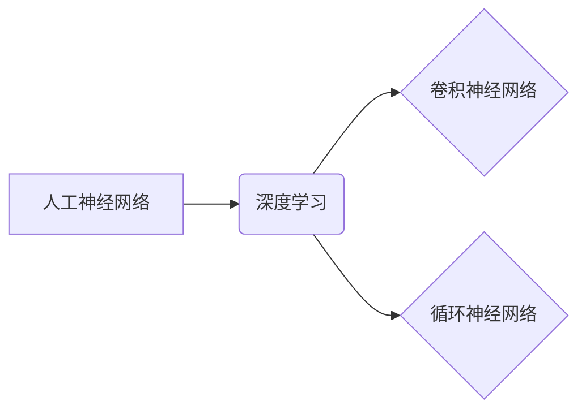

> 人工神经网络，深度学习，卷积神经网络，循环神经网络，梯度下降，激活函数，正则化，迁移学习

## 1. 背景介绍

人工智能（AI）近年来取得了令人瞩目的进展，其中人工神经网络（ANN）作为其核心技术，在图像识别、自然语言处理、语音识别等领域展现出强大的应用潜力。然而，构建高效、鲁棒、可解释的人工神经网络仍然是一个巨大的挑战。

传统的 ANN 往往面临着以下问题：

* **过拟合：** 模型在训练数据上表现出色，但在未见过的数据上表现欠佳。
* **梯度消失/爆炸：** 在深层网络中，梯度可能会在反向传播过程中消失或爆炸，导致训练困难。
* **参数量大：** 深层网络通常拥有大量的参数，需要大量的计算资源和存储空间。
* **可解释性差：** ANN 的决策过程通常是黑盒，难以理解模型是如何做出预测的。

为了解决这些问题，研究者们不断探索新的 ANN 架构、训练方法和正则化技术。本文将深入探讨构建更好的人工神经网络的最新进展，包括深度学习、卷积神经网络、循环神经网络、梯度下降算法、激活函数、正则化技术和迁移学习等关键技术。

## 2. 核心概念与联系

### 2.1 人工神经网络

人工神经网络 (ANN) 是一种受生物神经网络启发的计算模型。它由 interconnected 的节点（神经元）组成，每个神经元接收来自其他神经元的输入，并根据权重进行加权求和，然后通过激活函数进行非线性变换，输出到其他神经元。

### 2.2 深度学习

深度学习是 ANN 的一种特殊形式，其特点是拥有多层隐藏层。深度学习模型能够学习到更复杂的特征表示，从而在许多任务中取得更好的性能。

### 2.3 卷积神经网络

卷积神经网络 (CNN) 是一种专门用于处理图像数据的 ANN 架构。它利用卷积操作来提取图像特征，并通过池化操作来降低特征维度。CNN 在图像识别、物体检测、图像分割等任务中表现出色。

### 2.4 循环神经网络

循环神经网络 (RNN) 是一种专门用于处理序列数据的 ANN 架构。它具有记忆单元，能够记住之前的信息，从而处理时间序列数据。RNN 在自然语言处理、语音识别、机器翻译等任务中表现出色。

**核心概念与联系流程图**



## 3. 核心算法原理 & 具体操作步骤

### 3.1 算法原理概述

深度学习的核心算法是反向传播算法 (Backpropagation)。反向传播算法通过计算误差梯度，更新网络参数，从而使模型的预测结果越来越接近真实值。

### 3.2 算法步骤详解

1. **前向传播：** 将输入数据通过网络层层传递，计算每个神经元的输出。
2. **损失函数计算：** 计算模型预测结果与真实值的差异，即损失函数值。
3. **反向传播：** 计算损失函数对每个参数的梯度，并根据梯度更新参数值。
4. **迭代训练：** 重复前向传播、损失函数计算和反向传播步骤，直到模型性能达到预定目标。

### 3.3 算法优缺点

**优点：**

* 能够学习到复杂的特征表示。
* 在许多任务中取得了state-of-the-art的性能。

**缺点：**

* 训练时间长，计算资源消耗大。
* 容易过拟合。
* 可解释性差。

### 3.4 算法应用领域

深度学习算法广泛应用于图像识别、自然语言处理、语音识别、机器翻译、推荐系统、医疗诊断等领域。

## 4. 数学模型和公式 & 详细讲解 & 举例说明

### 4.1 数学模型构建

一个简单的 ANN 可以用以下数学模型表示：

* **输入层：** $x = [x_1, x_2, ..., x_n]$
* **隐藏层：** $h = f(W_1x + b_1)$
* **输出层：** $y = g(W_2h + b_2)$

其中：

* $x$ 是输入向量。
* $h$ 是隐藏层的输出向量。
* $y$ 是输出向量。
* $W_1$ 和 $W_2$ 是权重矩阵。
* $b_1$ 和 $b_2$ 是偏置向量。
* $f$ 和 $g$ 是激活函数。

### 4.2 公式推导过程

反向传播算法的核心是计算损失函数对每个参数的梯度。

损失函数通常是均方误差 (MSE)：

$$
L = \frac{1}{2} \sum_{i=1}^{m} (y_i - \hat{y}_i)^2
$$

其中：

* $y_i$ 是真实值。
* $\hat{y}_i$ 是模型预测值。
* $m$ 是样本数量。

通过链式法则，可以计算损失函数对每个参数的梯度，并使用梯度下降算法更新参数值。

### 4.3 案例分析与讲解

假设我们有一个简单的 ANN 用于预测房价。输入特征包括房屋面积、房间数量、地理位置等，输出是房价。

我们可以使用反向传播算法训练这个模型，并通过损失函数值来评估模型性能。

## 5. 项目实践：代码实例和详细解释说明

### 5.1 开发环境搭建

* Python 3.x
* TensorFlow 或 PyTorch

### 5.2 源代码详细实现

```python
import tensorflow as tf

# 定义模型
model = tf.keras.models.Sequential([
    tf.keras.layers.Dense(64, activation='relu', input_shape=(7,)),
    tf.keras.layers.Dense(32, activation='relu'),
    tf.keras.layers.Dense(1)
])

# 编译模型
model.compile(optimizer='adam', loss='mse')

# 训练模型
model.fit(X_train, y_train, epochs=10)

# 评估模型
loss = model.evaluate(X_test, y_test)
```

### 5.3 代码解读与分析

* 我们使用 TensorFlow 库构建了一个简单的 ANN 模型。
* 模型包含三层神经元：输入层、隐藏层和输出层。
* 隐藏层使用 ReLU 激活函数，输出层使用线性激活函数。
* 我们使用 Adam 优化器和均方误差损失函数训练模型。
* 训练完成后，我们使用测试数据评估模型性能。

### 5.4 运行结果展示

训练完成后，我们可以查看模型的损失函数值，以及在测试数据上的预测精度。

## 6. 实际应用场景

### 6.1 图像识别

CNN 在图像识别领域取得了突破性进展，例如：

* **物体检测：** 识别图像中包含的物体，并标注其位置和类别。
* **图像分类：** 将图像分类到预定义的类别中。
* **图像分割：** 将图像分割成不同的区域，每个区域代表不同的物体或场景。

### 6.2 自然语言处理

RNN 在自然语言处理领域表现出色，例如：

* **机器翻译：** 将一种语言翻译成另一种语言。
* **文本摘要：** 从长文本中提取关键信息生成摘要。
* **情感分析：** 分析文本表达的情感倾向。

### 6.3 语音识别

RNN 和 CNN 结合使用，可以实现高准确率的语音识别。

### 6.4 未来应用展望

随着人工智能技术的不断发展，人工神经网络将在更多领域得到应用，例如：

* **医疗诊断：** 利用图像和文本数据辅助医生诊断疾病。
* **自动驾驶：** 帮助车辆感知周围环境并做出决策。
* **个性化推荐：** 根据用户的喜好推荐商品或服务。

## 7. 工具和资源推荐

### 7.1 学习资源推荐

* **书籍：**
    * Deep Learning by Ian Goodfellow, Yoshua Bengio, and Aaron Courville
    * Hands-On Machine Learning with Scikit-Learn, Keras & TensorFlow by Aurélien Géron
* **在线课程：**
    * TensorFlow 官方教程
    * PyTorch 官方教程
    * Coursera 上的深度学习课程

### 7.2 开发工具推荐

* **TensorFlow:** 开源深度学习框架，支持多种硬件平台。
* **PyTorch:** 开源深度学习框架，以其灵活性和易用性而闻名。
* **Keras:** 高级深度学习 API，可以运行在 TensorFlow、Theano 或 CNTK 后端。

### 7.3 相关论文推荐

* **AlexNet:** ImageNet Classification with Deep Convolutional Neural Networks
* **VGGNet:** Very Deep Convolutional Networks for Large-Scale Image Recognition
* **ResNet:** Deep Residual Learning for Image Recognition

## 8. 总结：未来发展趋势与挑战

### 8.1 研究成果总结

近年来，人工神经网络取得了令人瞩目的进展，在许多领域取得了突破性成果。

### 8.2 未来发展趋势

* **模型规模和复杂度提升：** 研究者们将继续探索更大的模型规模和更复杂的架构，以提高模型性能。
* **高效训练方法研究：** 为了解决深度学习训练时间长的问题，研究者们将继续探索更有效的训练方法，例如迁移学习和联邦学习。
* **可解释性研究：** 如何理解和解释 ANN 的决策过程是一个重要的研究方向。

### 8.3 面临的挑战

* **数据获取和标注：** 深度学习模型需要大量的训练数据，而获取和标注高质量数据是一个巨大的挑战。
* **计算资源需求：** 训练大型深度学习模型需要大量的计算资源，这对于资源有限的机构来说是一个障碍。
* **伦理问题：** 人工智能技术的快速发展也带来了伦理问题，例如算法偏见和隐私泄露。

### 8.4 研究展望

未来，人工神经网络将继续朝着更强大、更智能、更可解释的方向发展。

## 9. 附录：常见问题与解答

### 9.1 什么是激活函数？

激活函数是神经网络中一个重要的组成部分，它决定了神经元的输出。常见的激活函数包括 ReLU、Sigmoid 和 Tanh。

### 9.2 什么是正则化？

正则化技术用于防止模型过拟合。常见的正则化方法包括 L1 正则化和 L2 正则化。

### 9.3 什么是迁移学习？

迁移学习是指将预训练模型的知识迁移到新的任务中。

作者：禅与计算机程序设计艺术 / Zen and the Art of Computer Programming


<end_of_turn>