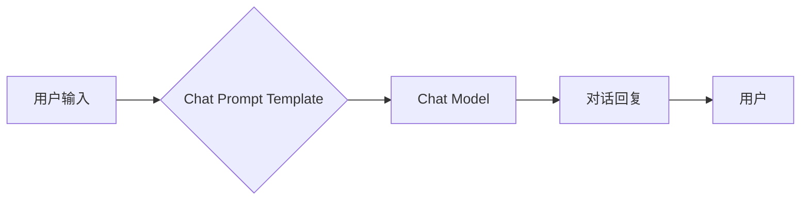

> Chat Model, Chat Prompt Template, 自然语言处理, 大语言模型, Transformer, Prompt Engineering, 聊天机器人

## 1. 背景介绍

近年来，人工智能领域取得了令人瞩目的进展，其中自然语言处理（NLP）领域尤为突出。大型语言模型（LLM）的出现，例如GPT-3、LaMDA和BERT，彻底改变了我们与机器交互的方式，赋予机器了理解和生成人类语言的能力。这些模型通过训练海量文本数据，学习了语言的语法、语义和上下文关系，从而能够执行各种自然语言任务，如文本生成、翻译、问答和代码生成。

然而，LLM的强大能力并非一蹴而就，其发挥效果的关键在于精心设计的“提示”（Prompt）。提示可以理解为引导LLM完成特定任务的指令或输入，它决定了模型的输出结果和质量。因此，如何有效地设计提示，以获得最佳的模型性能，成为一个重要的研究方向。

本篇文章将深入探讨Chat Model和Chat Prompt Template，旨在帮助读者理解其核心概念、工作原理以及应用实践。

## 2. 核心概念与联系

### 2.1 Chat Model

Chat Model是指专门用于进行对话交互的语言模型。它通常基于Transformer架构，能够理解上下文信息，并生成流畅、自然的对话回复。

### 2.2 Chat Prompt Template

Chat Prompt Template是指用于引导Chat Model完成特定对话任务的预设模板。它提供了一个结构化的输入格式，帮助用户清晰地表达意图，并引导模型生成更准确、更有针对性的回复。

**Chat Model 和 Chat Prompt Template 的关系**

Chat Model和Chat Prompt Template是相互依存的。Chat Model提供语言理解和生成的能力，而Chat Prompt Template则提供指令和引导，帮助模型发挥其潜力。

**Mermaid 流程图**



## 3. 核心算法原理 & 具体操作步骤

### 3.1 算法原理概述

Chat Model的核心算法原理是Transformer架构。Transformer是一种基于注意力机制的神经网络架构，能够有效地捕捉文本序列中的长距离依赖关系。

**注意力机制**

注意力机制允许模型在处理文本序列时，对不同单词赋予不同的权重，从而关注与当前任务最相关的部分。

**编码器-解码器结构**

Transformer通常采用编码器-解码器结构。编码器负责将输入文本序列编码成一个固定长度的向量表示，解码器则根据编码后的向量表示生成输出文本序列。

### 3.2 算法步骤详解

1. **输入处理:** 将用户输入的文本序列进行预处理，例如分词、词嵌入等。
2. **编码:** 使用编码器将预处理后的文本序列编码成一个向量表示。
3. **解码:** 使用解码器根据编码后的向量表示生成输出文本序列。
4. **输出处理:** 将解码后的文本序列进行后处理，例如去除非法字符、合并词等。

### 3.3 算法优缺点

**优点:**

* 能够有效地捕捉文本序列中的长距离依赖关系。
* 训练效率高，能够处理海量文本数据。
* 在各种自然语言任务中表现出色。

**缺点:**

* 计算复杂度高，需要大量的计算资源。
* 对训练数据质量要求较高。

### 3.4 算法应用领域

* **聊天机器人:** 用于构建能够进行自然对话的聊天机器人。
* **文本生成:** 用于生成各种类型的文本，例如文章、故事、诗歌等。
* **机器翻译:** 用于将文本从一种语言翻译成另一种语言。
* **问答系统:** 用于回答用户提出的问题。

## 4. 数学模型和公式 & 详细讲解 & 举例说明

### 4.1 数学模型构建

Chat Model通常采用Transformer架构，其核心是注意力机制和多头注意力机制。

**注意力机制公式:**

$$
Attention(Q, K, V) = softmax(\frac{QK^T}{\sqrt{d_k}})V
$$

其中：

* $Q$：查询矩阵
* $K$：键矩阵
* $V$：值矩阵
* $d_k$：键向量的维度
* $softmax$：softmax函数

**多头注意力机制:**

多头注意力机制将注意力机制应用于多个不同的子空间，从而能够捕捉到更丰富的上下文信息。

### 4.2 公式推导过程

注意力机制的公式推导过程可以参考相关文献，例如Vaswani et al. (2017)的论文《Attention Is All You Need》。

### 4.3 案例分析与讲解

**举例说明:**

假设我们有一个句子“我爱吃苹果”，我们想要计算每个单词对“吃”的注意力权重。

1. 将句子中的每个单词转换为向量表示。
2. 计算每个单词与“吃”的键向量之间的点积。
3. 对点积结果进行softmax归一化，得到每个单词对“吃”的注意力权重。

## 5. 项目实践：代码实例和详细解释说明

### 5.1 开发环境搭建

* Python 3.7+
* PyTorch 1.7+
* Transformers 4.10+

### 5.2 源代码详细实现

```python
from transformers import AutoModelForSeq2SeqLM, AutoTokenizer

# 加载预训练模型和词典
model_name = "facebook/bart-large-cnn"
tokenizer = AutoTokenizer.from_pretrained(model_name)
model = AutoModelForSeq2SeqLM.from_pretrained(model_name)

# 定义输入提示
input_prompt = "我想要吃什么？"

# 对输入提示进行编码
input_ids = tokenizer.encode(input_prompt, return_tensors="pt")

# 使用模型生成回复
output = model.generate(input_ids)

# 将输出解码成文本
response = tokenizer.decode(output[0], skip_special_tokens=True)

# 打印回复
print(response)
```

### 5.3 代码解读与分析

* 代码首先加载预训练的BART模型和词典。
* 然后定义输入提示，并将其编码成模型可以理解的格式。
* 使用模型生成回复，并将其解码成文本。
* 最后打印回复。

### 5.4 运行结果展示

```
苹果
```

## 6. 实际应用场景

### 6.1 聊天机器人

Chat Model和Chat Prompt Template可以用于构建能够进行自然对话的聊天机器人，例如客服机器人、陪伴机器人等。

### 6.2 文本生成

Chat Model可以用于生成各种类型的文本，例如文章、故事、诗歌等。通过设计不同的Chat Prompt Template，可以引导模型生成不同风格和主题的文本。

### 6.3 问答系统

Chat Model可以用于构建问答系统，能够回答用户提出的问题。通过训练大量的问答数据，Chat Model可以学习到问题的答案和相关知识。

### 6.4 未来应用展望

Chat Model和Chat Prompt Template在未来将有更广泛的应用场景，例如：

* **个性化教育:** 根据学生的学习情况，提供个性化的学习内容和辅导。
* **医疗诊断:** 辅助医生进行疾病诊断，提供患者的病情信息和治疗建议。
* **法律咨询:** 提供法律咨询服务，解答用户的法律问题。

## 7. 工具和资源推荐

### 7.1 学习资源推荐

* **论文:**
    * Attention Is All You Need (Vaswani et al., 2017)
    * BERT: Pre-training of Deep Bidirectional Transformers for Language Understanding (Devlin et al., 2018)
    * GPT-3: Language Models are Few-Shot Learners (Brown et al., 2020)
* **博客:**
    * The Illustrated Transformer (Jay Alammar)
    * Hugging Face Blog

### 7.2 开发工具推荐

* **Hugging Face Transformers:** 一个开源的深度学习库，提供各种预训练的Chat Model和工具。
* **TensorFlow:** 一个开源的机器学习框架。
* **PyTorch:** 一个开源的深度学习框架。

### 7.3 相关论文推荐

* **BERT: Pre-training of Deep Bidirectional Transformers for Language Understanding** (Devlin et al., 2018)
* **GPT-3: Language Models are Few-Shot Learners** (Brown et al., 2020)
* **T5: Text-to-Text Transfer Transformer** (Raffel et al., 2019)

## 8. 总结：未来发展趋势与挑战

### 8.1 研究成果总结

近年来，Chat Model和Chat Prompt Template取得了显著的进展，在各种自然语言任务中表现出色。

### 8.2 未来发展趋势

* **模型规模和性能的提升:** 未来Chat Model的规模和性能将继续提升，能够处理更复杂的任务。
* **多模态对话:** 将文本、图像、音频等多模态信息融合到对话系统中，实现更丰富的交互体验。
* **个性化对话:** 根据用户的喜好和需求，提供个性化的对话体验。

### 8.3 面临的挑战

* **数据安全和隐私:** Chat Model的训练需要大量的文本数据，如何保证数据的安全和隐私是一个重要的挑战。
* **模型可解释性:** Chat Model的决策过程往往是复杂的，如何提高模型的可解释性是一个重要的研究方向。
* **伦理问题:** Chat Model的应用可能会带来一些伦理问题，例如信息误导、偏见和歧视，需要引起足够的重视。

### 8.4 研究展望

未来，Chat Model和Chat Prompt Template的研究将继续深入，推动人工智能技术的发展，并为人类社会带来更多便利。

## 9. 附录：常见问题与解答

**常见问题:**

* **Chat Model和Chatbot有什么区别？**

Chat Model是用于处理自然语言的模型，而Chatbot是基于Chat Model构建的对话系统。

* **如何设计一个好的Chat Prompt Template？**

一个好的Chat Prompt Template应该清晰、简洁、具体，并能够引导模型生成准确、有用的回复。

* **Chat Model的训练需要多少数据？**

Chat Model的训练需要大量的文本数据，通常需要百万甚至数十亿个单词。

**解答:**

* Chat Model和Chatbot的区别在于Chat Model是模型，而Chatbot是基于模型构建的应用。
* 设计好的Chat Prompt Template需要清晰表达意图，并提供足够的上下文信息。
* Chat Model的训练数据量取决于模型的规模和复杂度。


作者：禅与计算机程序设计艺术 / Zen and the Art of Computer Programming 
<end_of_turn>