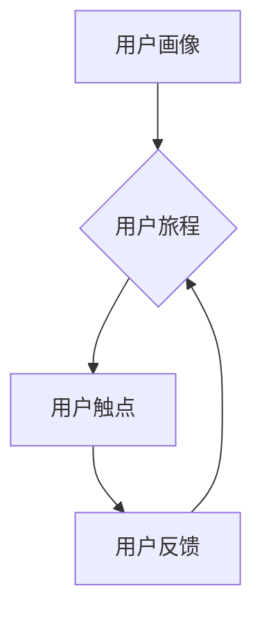

> 用户成长体系, 知识付费, 运营策略, 数据分析, 增长黑客

## 1. 背景介绍

知识付费行业近年来发展迅速，涌现出众多优秀平台和内容创作者。然而，用户增长和留存仍然是行业面临的共同挑战。如何构建一个高效的用户成长体系，引导用户持续学习、付费和参与，成为知识付费创业者亟需解决的问题。

传统的营销模式难以有效应对知识付费的独特需求。用户对知识的价值感知、学习习惯和付费意愿都存在差异，需要更加精准的运营策略和个性化的服务。

## 2. 核心概念与联系

用户成长体系是一个以用户为中心，通过一系列运营策略和服务，引导用户从初次接触到深度参与，最终形成忠诚用户群体的系统。

**用户成长体系的核心概念包括：**

* **用户画像:** 深入了解用户的需求、兴趣、学习习惯和付费意愿，为个性化运营提供数据支撑。
* **用户旅程:** 构建用户在平台上的完整旅程，从发现、注册、学习、付费到分享，每个阶段都有相应的运营策略。
* **用户触点:** 识别用户在平台上的所有触点，例如课程推荐、社区互动、直播答疑等，并优化用户体验。
* **用户反馈:** 持续收集用户反馈，及时调整运营策略，提升用户满意度。

**用户成长体系的架构：**



## 3. 核心算法原理 & 具体操作步骤

**3.1 算法原理概述**

用户成长体系的设计需要结合数据分析和算法模型，例如：

* **推荐算法:** 根据用户的学习历史、兴趣偏好和行为数据，推荐个性化的课程和内容。
* **用户分层算法:** 将用户根据学习进度、付费行为和活跃度等指标进行分层，制定针对不同层级的运营策略。
* **用户生命周期价值 (CLTV) 模型:** 预估用户的长期价值，帮助平台制定用户留存和转化策略。

**3.2 算法步骤详解**

* **数据收集:** 收集用户行为数据，例如课程浏览、学习时长、付费记录、社区互动等。
* **数据清洗:** 处理数据中的缺失值、异常值和重复数据。
* **特征工程:** 从原始数据中提取有价值的特征，例如用户年龄、性别、学习领域、学习习惯等。
* **模型训练:** 使用机器学习算法训练推荐、分层和 CLTV 模型。
* **模型评估:** 使用测试数据评估模型的性能，并进行模型调优。
* **模型部署:** 将训练好的模型部署到线上环境，实时推荐课程、分层用户和预测 CLTV。

**3.3 算法优缺点**

* **优点:** 能够精准推荐课程、个性化运营用户，提高用户留存和转化率。
* **缺点:** 需要大量的数据支持，模型训练和维护成本较高。

**3.4 算法应用领域**

* **课程推荐:** 根据用户的学习历史和兴趣推荐相关课程。
* **用户分层:** 将用户根据学习进度和付费行为进行分层，制定针对不同层级的运营策略。
* **用户留存预测:** 预估用户的留存率，帮助平台制定留存策略。
* **个性化学习路径:** 根据用户的学习目标和进度，构建个性化的学习路径。

## 4. 数学模型和公式 & 详细讲解 & 举例说明

**4.1 数学模型构建**

用户成长体系的数学模型可以基于用户生命周期价值 (CLTV) 模型构建，该模型旨在预测用户的长期价值。

**4.2 公式推导过程**

CLTV 公式如下：

$$CLTV = \sum_{t=1}^{T} \frac{R_t}{(1+r)^t}$$

其中：

* $R_t$ 是用户在第 t 个时间段的净收入。
* $r$ 是用户留存率。
* $T$ 是用户生命周期长度。

**4.3 案例分析与讲解**

假设一个知识付费平台的用户在第一个月付费 100 元，第二个月付费 50 元，第三个月付费 0 元，留存率为 80%。

根据 CLTV 公式，该用户的 CLTV 为：

$$CLTV = \frac{100}{(1+0.1)^1} + \frac{50}{(1+0.1)^2} = 90.91 + 41.32 = 132.23$$

## 5. 项目实践：代码实例和详细解释说明

**5.1 开发环境搭建**

* Python 3.x
* Jupyter Notebook
* scikit-learn
* pandas
* numpy

**5.2 源代码详细实现**

```python
import pandas as pd
from sklearn.linear_model import LinearRegression

# 加载用户数据
data = pd.read_csv('user_data.csv')

# 提取特征和目标变量
features = ['age', 'gender', 'education', 'income']
target = 'cltv'

# 训练线性回归模型
model = LinearRegression()
model.fit(data[features], data[target])

# 预测新用户的 CLTV
new_user_data = pd.DataFrame({
    'age': [30],
    'gender': ['male'],
    'education': ['master'],
    'income': [100000]
})
predicted_cltv = model.predict(new_user_data)

print(f'Predicted CLTV: {predicted_cltv[0]}')
```

**5.3 代码解读与分析**

* 代码首先加载用户数据，提取特征和目标变量。
* 然后使用线性回归模型训练，预测用户的 CLTV。
* 最后使用新用户的特征数据预测其 CLTV。

**5.4 运行结果展示**

运行代码后，会输出新用户的预测 CLTV 值。

## 6. 实际应用场景

**6.1 用户画像分析**

通过用户画像分析，可以了解用户的年龄、性别、职业、兴趣爱好等信息，为个性化运营提供数据支撑。

**6.2 课程推荐**

根据用户的学习历史和兴趣偏好，推荐个性化的课程，提高用户学习兴趣和付费意愿。

**6.3 用户分层运营**

将用户根据学习进度、付费行为和活跃度等指标进行分层，制定针对不同层级的运营策略，例如 VIP 用户享有专属课程和服务。

**6.4 营销活动策划**

根据用户画像和行为数据，策划精准的营销活动，提高活动转化率。

**6.5 用户留存策略**

通过分析用户留存数据，制定有效的留存策略，例如发送提醒邮件、提供学习奖励等。

## 7. 工具和资源推荐

**7.1 学习资源推荐**

* **书籍:** 《用户增长黑客》、《数据驱动营销》
* **课程:** Coursera 上的《数据分析》课程
* **博客:**  GrowthHackers,  MarketingProfs

**7.2 开发工具推荐**

* **数据分析工具:**  Tableau, Power BI
* **机器学习库:** scikit-learn, TensorFlow
* **用户行为分析工具:**  Google Analytics, Mixpanel

**7.3 相关论文推荐**

* 《用户生命周期价值 (CLTV) 的计算方法》
* 《基于机器学习的知识付费用户推荐算法》

## 8. 总结：未来发展趋势与挑战

**8.1 研究成果总结**

用户成长体系的设计和构建是知识付费行业发展的重要方向。通过数据分析、算法模型和运营策略的结合，可以有效提升用户增长、留存和转化率。

**8.2 未来发展趋势**

* **人工智能技术的应用:**  利用人工智能技术，实现更精准的个性化推荐、用户分层和留存预测。
* **用户体验的提升:**  不断优化用户体验，打造更便捷、更智能的学习平台。
* **多元化内容形式:**  探索更多元的知识付费内容形式，例如直播、互动课程、社区学习等。

**8.3 面临的挑战**

* **数据质量问题:**  知识付费平台的数据质量参差不齐，需要加强数据清洗和处理。
* **算法模型的复杂性:**  一些算法模型的训练和维护成本较高，需要不断优化和改进。
* **用户隐私保护:**  需要加强用户隐私保护，确保用户数据安全。

**8.4 研究展望**

未来，用户成长体系的设计将更加注重用户体验、个性化和智能化。随着人工智能技术的不断发展，用户成长体系将更加精准、高效和智能。

## 9. 附录：常见问题与解答

**9.1 如何构建用户画像？**

可以通过用户行为数据、问卷调查、用户访谈等方式收集用户数据，并使用数据分析工具进行分析，构建用户画像。

**9.2 如何设计用户旅程？**

需要根据用户的学习目标、学习习惯和付费意愿，构建用户在平台上的完整旅程，并为每个阶段设计相应的运营策略。

**9.3 如何评估用户成长体系的成效？**

可以通过用户增长、留存、转化率等指标来评估用户成长体系的成效。


作者：禅与计算机程序设计艺术 / Zen and the Art of Computer Programming 
<end_of_turn>