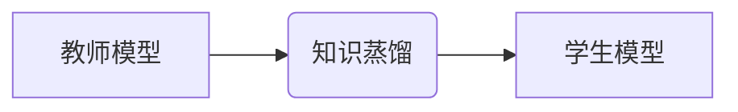
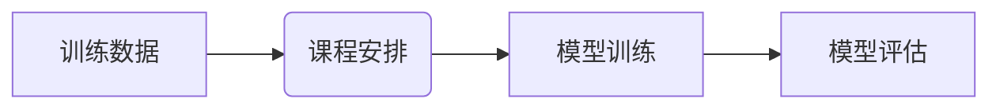
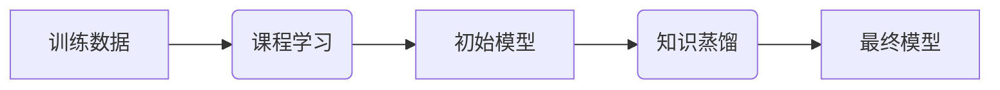

> 知识蒸馏，课程学习，渐进式训练，模型优化，深度学习

## 1. 背景介绍

深度学习模型在图像识别、自然语言处理等领域取得了显著成就，但其训练成本高昂，对计算资源和数据需求巨大。如何更高效地训练深度学习模型，使其在有限资源下也能达到较好的性能，是当前研究的热点问题。

知识蒸馏（Knowledge Distillation）和课程学习（Curriculum Learning）是两种有效的模型优化技术。知识蒸馏通过将知识从大型模型（教师模型）传递到小型模型（学生模型）中，实现模型压缩和性能提升。课程学习则通过逐步增加训练数据的难度，引导模型从简单到复杂地学习，从而提高训练效率和泛化能力。

将知识蒸馏和课程学习相结合，可以构建一个渐进式模型优化框架，通过知识传递和循序渐进的训练，实现模型的更高效训练和性能提升。

## 2. 核心概念与联系

### 2.1 知识蒸馏

知识蒸馏的核心思想是将大型模型的知识（例如预测概率分布）传递到小型模型中。

**原理：**

* 教师模型：训练好的大型模型，拥有丰富的知识和表达能力。
* 学生模型：小型模型，参数量少，训练成本低。

知识蒸馏通过最小化教师模型和学生模型的输出概率分布之间的差异，将教师模型的知识“蒸馏”到学生模型中。

**架构：**



### 2.2 课程学习

课程学习的核心思想是通过逐步增加训练数据的难度，引导模型从简单到复杂地学习。

**原理：**

* 课程：训练数据的有序排列，按照难度递增的顺序。
* 模型：在每个课程阶段学习不同的知识，逐步提升模型的能力。

课程学习通过精心设计的课程安排，可以提高模型的训练效率和泛化能力。

**架构：**



### 2.3 结合

将知识蒸馏和课程学习相结合，可以构建一个渐进式模型优化框架。

**流程：**

1. **课程学习阶段：** 使用课程学习策略，逐步增加训练数据的难度，训练一个初始模型。
2. **知识蒸馏阶段：** 使用训练好的初始模型作为教师模型，将知识蒸馏到一个小型模型中，得到最终模型。

**架构：**



## 3. 核心算法原理 & 具体操作步骤

### 3.1 算法原理概述

知识蒸馏与课程学习的结合，主要通过以下步骤实现渐进式模型优化：

1. **课程学习阶段：**

   * 将训练数据按照难度进行排序，形成课程。
   * 从简单的课程开始训练模型，逐步增加课程难度。
   * 在每个课程阶段，使用交叉熵损失函数训练模型，并根据模型性能调整学习率等超参数。

2. **知识蒸馏阶段：**

   * 使用训练好的初始模型作为教师模型，将知识蒸馏到小型模型中。
   * 使用教师模型的预测概率分布作为目标，最小化教师模型和学生模型的输出概率分布之间的差异。
   * 常用的损失函数包括交叉熵损失函数、KL散度等。

### 3.2 算法步骤详解

**课程学习阶段：**

1. **数据预处理：** 对训练数据进行清洗、转换、归一化等预处理操作。
2. **课程设计：** 根据数据的难度特征，将训练数据按照难度进行排序，形成课程。
3. **模型训练：** 从简单的课程开始训练模型，逐步增加课程难度。
4. **模型评估：** 在每个课程阶段，使用验证集评估模型性能，并根据模型性能调整学习率等超参数。

**知识蒸馏阶段：**

1. **教师模型选择：** 选择训练好的初始模型作为教师模型。
2. **学生模型初始化：** 初始化小型模型的参数。
3. **知识蒸馏训练：** 使用教师模型的预测概率分布作为目标，最小化教师模型和学生模型的输出概率分布之间的差异。
4. **模型评估：** 使用测试集评估学生模型的性能。

### 3.3 算法优缺点

**优点：**

* **提高训练效率：** 课程学习可以减少模型训练时间，知识蒸馏可以减少模型参数量，从而提高训练效率。
* **提升模型性能：** 知识蒸馏可以将教师模型的知识传递到学生模型中，从而提升学生模型的性能。
* **降低资源消耗：** 学生模型参数量少，训练成本低，可以降低资源消耗。

**缺点：**

* **课程设计难度：** 课程学习需要精心设计课程，才能有效提升模型性能。
* **教师模型依赖：** 知识蒸馏依赖于教师模型的性能，如果教师模型性能不佳，学生模型性能也会受到影响。

### 3.4 算法应用领域

* **图像识别：** 将大型图像识别模型的知识蒸馏到小型模型中，用于移动设备上的图像识别。
* **自然语言处理：** 将大型语言模型的知识蒸馏到小型模型中，用于文本分类、机器翻译等任务。
* **语音识别：** 将大型语音识别模型的知识蒸馏到小型模型中，用于语音助手、语音搜索等应用。

## 4. 数学模型和公式 & 详细讲解 & 举例说明

### 4.1 数学模型构建

知识蒸馏的目标是最小化教师模型和学生模型的输出概率分布之间的差异。常用的损失函数包括交叉熵损失函数和KL散度。

**交叉熵损失函数：**

$$
L_{CE} = -\sum_{i=1}^{N} y_i \log(p_i)
$$

其中：

* $N$ 是样本数量。
* $y_i$ 是真实标签。
* $p_i$ 是模型预测的概率。

**KL散度：**

$$
L_{KL} = \sum_{i=1}^{N} p_i \log \frac{p_i}{q_i}
$$

其中：

* $p_i$ 是教师模型的预测概率。
* $q_i$ 是学生模型的预测概率。

### 4.2 公式推导过程

**交叉熵损失函数的推导：**

交叉熵损失函数衡量预测概率分布与真实标签分布之间的差异。其目标是使模型预测的概率分布尽可能接近真实标签分布。

**KL散度的推导：**

KL散度衡量两个概率分布之间的差异。其目标是使学生模型的预测概率分布尽可能接近教师模型的预测概率分布。

### 4.3 案例分析与讲解

**案例：**

使用知识蒸馏技术将大型图像识别模型的知识蒸馏到小型模型中，用于移动设备上的图像识别。

**分析：**

* 教师模型：使用预训练好的大型图像识别模型，例如ResNet-50。
* 学生模型：使用小型图像识别模型，例如MobileNet-V2。
* 损失函数：使用交叉熵损失函数和KL散度作为损失函数。

**讲解：**

通过知识蒸馏技术，将大型模型的知识传递到小型模型中，可以有效提升小型模型的图像识别性能，同时降低模型参数量和计算成本，从而实现移动设备上的高效图像识别。

## 5. 项目实践：代码实例和详细解释说明

### 5.1 开发环境搭建

* 操作系统：Ubuntu 20.04
* Python 版本：3.8
* 深度学习框架：PyTorch 1.8

### 5.2 源代码详细实现

```python
import torch
import torch.nn as nn
import torch.optim as optim

# 定义教师模型
class TeacherModel(nn.Module):
    # ...

# 定义学生模型
class StudentModel(nn.Module):
    # ...

# 初始化模型
teacher_model = TeacherModel()
student_model = StudentModel()

# 加载教师模型权重
teacher_model.load_state_dict(torch.load('teacher_model.pth'))

# 定义损失函数
criterion = nn.CrossEntropyLoss()

# 定义优化器
optimizer = optim.Adam(student_model.parameters(), lr=0.001)

# 训练循环
for epoch in range(num_epochs):
    for batch_idx, (data, target) in enumerate(train_loader):
        # 前向传播
        output_teacher = teacher_model(data)
        output_student = student_model(data)

        # 计算损失
        loss_ce = criterion(output_student, target)
        loss_kl = nn.KLDivLoss()(torch.softmax(output_teacher, dim=1), torch.softmax(output_student, dim=1))
        loss = loss_ce + 0.1 * loss_kl

        # 反向传播
        optimizer.zero_grad()
        loss.backward()
        optimizer.step()

# 保存学生模型权重
torch.save(student_model.state_dict(), 'student_model.pth')
```

### 5.3 代码解读与分析

* 代码首先定义了教师模型和学生模型，并加载教师模型的权重。
* 然后定义了损失函数和优化器，并开始训练循环。
* 在训练循环中，首先使用教师模型和学生模型分别对输入数据进行前向传播，然后计算损失函数。
* 损失函数包括交叉熵损失函数和KL散度，交叉熵损失函数用于衡量学生模型的预测概率分布与真实标签分布之间的差异，KL散度用于衡量学生模型的预测概率分布与教师模型的预测概率分布之间的差异。
* 最后，使用优化器更新学生模型的参数。

### 5.4 运行结果展示

训练完成后，可以将学生模型的性能与教师模型和原始模型进行比较，观察知识蒸馏的效果。

## 6. 实际应用场景

### 6.1 医疗诊断

知识蒸馏可以将大型医学图像识别模型的知识蒸馏到小型模型中，用于移动设备上的医疗诊断。

### 6.2 自动驾驶

知识蒸馏可以将大型自动驾驶模型的知识蒸馏到小型模型中，用于降低自动驾驶系统的计算成本和功耗。

### 6.3 语音助手

知识蒸馏可以将大型语音识别模型的知识蒸馏到小型模型中，用于提高语音助手的识别准确率和响应速度。

### 6.4 未来应用展望

随着深度学习技术的不断发展，知识蒸馏和课程学习的结合将有更广泛的应用场景，例如：

* **个性化学习：** 根据用户的学习情况，动态调整课程难度，实现个性化学习。
* **机器人控制：** 将大型机器人控制模型的知识蒸馏到小型模型中，提高机器人控制的效率和鲁棒性。
* **药物研发：** 使用知识蒸馏技术加速药物研发过程，例如预测药物的活性或毒性。

## 7. 工具和资源推荐

### 7.1 学习资源推荐

* **书籍：**
    * Deep Learning by Ian Goodfellow, Yoshua Bengio, and Aaron Courville
    * Hands-On Machine Learning with Scikit-Learn, Keras & TensorFlow by Aurélien Géron
* **在线课程：**
    * Deep Learning Specialization by Andrew Ng (Coursera)
    * Fast.ai Practical Deep Learning for Coders

### 7.2 开发工具推荐

* **深度学习框架：** PyTorch, TensorFlow
* **数据处理工具：** Pandas, NumPy
* **可视化工具：** Matplotlib, Seaborn

### 7.3 相关论文推荐

* **知识蒸馏：**
    * Hinton, G., Vinyals, O., & Dean, J. (2015). Distilling the knowledge in