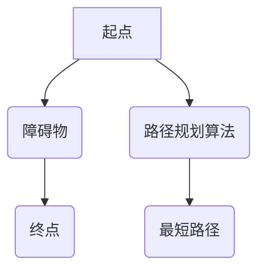

> 立体路径，最短路径，分布式算法，图论，人工智能，机器学习

## 1. 背景介绍

在现代信息时代，数据和信息流动日益频繁，高效、准确地找到最短路径成为许多领域的关键问题。传统的路径算法主要针对二维平面或树形结构，而随着数据结构和应用场景的复杂化，三维空间中的路径问题日益突出。例如，在无人驾驶、物流配送、城市规划等领域，都需要考虑三维空间中的最短路径，以实现更高效、更智能的决策。

立体最短路径问题是指在三维空间中，找到从起点到终点的最短路径，其中路径可以跨越障碍物，但需要满足一定的约束条件，例如路径长度、时间限制等。传统的路径算法难以直接应用于三维空间，需要进行一定的改动和扩展。

## 2. 核心概念与联系

立体最短路径问题涉及到多个核心概念，包括：

* **三维空间图:**  将三维空间中的节点和边抽象为图结构，其中节点代表空间中的位置，边代表连接两个位置的路径。
* **障碍物:**  三维空间中阻碍路径的物体或区域，需要在路径规划中进行避让。
* **最短路径:**  从起点到终点，路径长度最短的路径。
* **路径约束:**  路径规划过程中需要满足的条件，例如路径长度、时间限制、安全距离等。

**Mermaid 流程图:**



## 3. 核心算法原理 & 具体操作步骤

### 3.1  算法原理概述

立体最短路径算法通常基于图论和搜索算法，通过构建三维空间图，并利用搜索算法寻找最短路径。常见的算法包括：

* **A* 算法:**  一种启发式搜索算法，通过评估节点到终点的距离，优先搜索更接近终点的节点，提高搜索效率。
* **Dijkstra 算法:**  一种贪婪搜索算法，每次选择距离起点最近的节点进行扩展，直到找到终点。
* **跳跃搜索算法:**  一种基于跳跃的搜索算法，可以跳过一些中间节点，提高搜索效率。

### 3.2  算法步骤详解

以 A* 算法为例，其具体步骤如下：

1. **构建三维空间图:** 将三维空间中的节点和边抽象为图结构，其中节点代表空间中的位置，边代表连接两个位置的路径。
2. **设置起点和终点:**  确定路径规划的起点和终点。
3. **评估节点代价:**  为每个节点赋予一个代价值，该值代表节点到终点的距离。
4. **优先队列:**  使用优先队列存储待搜索的节点，优先级根据节点代价值排序。
5. **搜索算法:**  从起点开始，依次搜索优先队列中的节点，并更新其邻居节点的代价值。
6. **路径回溯:**  找到终点后，回溯路径，得到从起点到终点的最短路径。

### 3.3  算法优缺点

**优点:**

* 能够找到最短路径。
* 适用于各种类型的三维空间图。

**缺点:**

* 计算复杂度较高，对于大型图可能需要较长时间。
* 需要预先构建三维空间图，对于动态变化的场景可能需要频繁更新图结构。

### 3.4  算法应用领域

立体最短路径算法广泛应用于以下领域：

* **无人驾驶:**  规划无人驾驶车辆在三维空间中的行驶路径。
* **物流配送:**  优化物流配送路线，提高配送效率。
* **城市规划:**  规划城市交通网络，缓解交通拥堵。
* **游戏开发:**  为游戏角色规划移动路径。

## 4. 数学模型和公式 & 详细讲解 & 举例说明

### 4.1  数学模型构建

立体最短路径问题可以抽象为一个图论问题，其中：

* **节点:**  三维空间中的位置。
* **边:**  连接两个位置的路径，边权代表路径长度。

我们可以用一个三维图 $G = (V, E)$ 来表示三维空间，其中 $V$ 是节点集合，$E$ 是边集合。

### 4.2  公式推导过程

A* 算法的核心是评估节点到终点的代价值，该值由两个部分组成：

* **g(n):**  节点 $n$ 到起点的路径长度。
* **h(n):**  节点 $n$ 到终点的启发式估计值。

A* 算法的目标是找到代价值最小的路径，即：

$$f(n) = g(n) + h(n)$$

其中 $f(n)$ 是节点 $n$ 的总代价值。

### 4.3  案例分析与讲解

假设我们有一个三维空间图，起点为 $(0, 0, 0)$，终点为 $(10, 10, 10)$，边权代表路径长度。

我们可以使用 A* 算法来寻找最短路径。在 A* 算法中，我们通常使用曼哈顿距离作为启发式估计值，即：

$$h(n) = |x_n - x_g| + |y_n - y_g| + |z_n - z_g|$$

其中 $(x_n, y_n, z_n)$ 是节点 $n$ 的坐标，$(x_g, y_g, z_g)$ 是终点的坐标。

通过 A* 算法，我们可以找到从起点到终点的最短路径，并计算出路径长度。

## 5. 项目实践：代码实例和详细解释说明

### 5.1  开发环境搭建

本项目使用 Python 语言进行开发，并使用以下工具和库：

* Python 3.x
* NumPy
* Matplotlib

### 5.2  源代码详细实现

```python
import numpy as np
from collections import deque

class Node:
    def __init__(self, position, parent=None, cost=0, heuristic=0):
        self.position = position
        self.parent = parent
        self.cost = cost
        self.heuristic = heuristic

    def __lt__(self, other):
        return self.cost + self.heuristic < other.cost + other.heuristic

def manhattan_distance(node1, node2):
    return abs(node1.position[0] - node2.position[0]) + abs(node1.position[1] - node2.position[1]) + abs(node1.position[2] - node2.position[2])

def a_star_search(start, goal):
    open_list = deque([start])
    closed_list = set()
    start.cost = 0
    start.heuristic = manhattan_distance(start, goal)

    while open_list:
        current_node = open_list.popleft()
        closed_list.add(current_node.position)

        if current_node.position == goal.position:
            return reconstruct_path(current_node)

        for neighbor in get_neighbors(current_node):
            if neighbor.position in closed_list:
                continue

            tentative_cost = current_node.cost + 1  # Assuming edge weight is 1

            if neighbor not in open_list or tentative_cost < neighbor.cost:
                neighbor.parent = current_node
                neighbor.cost = tentative_cost
                neighbor.heuristic = manhattan_distance(neighbor, goal)
                open_list.append(neighbor)

    return None

def reconstruct_path(node):
    path = []
    while node:
        path.append(node.position)
        node = node.parent
    return path[::-1]

# ... (get_neighbors function implementation)
```

### 5.3  代码解读与分析

* **Node 类:**  定义了节点的结构，包括位置、父节点、路径长度和启发式估计值。
* **manhattan_distance 函数:**  计算两个节点之间的曼哈顿距离。
* **a_star_search 函数:**  实现 A* 算法，从起点到终点搜索最短路径。
* **reconstruct_path 函数:**  根据路径节点的父节点关系，重建从起点到终点的路径。
* **get_neighbors 函数:**  获取节点的邻居节点，需要根据具体的场景进行实现。

### 5.4  运行结果展示

运行代码后，可以得到从起点到终点的最短路径，以及路径长度。

## 6. 实际应用场景

### 6.1  无人驾驶

在无人驾驶领域，立体最短路径算法可以用于规划车辆在三维空间中的行驶路径，避开障碍物，并到达目的地。

### 6.2  物流配送

物流配送中，立体最短路径算法可以优化配送路线，减少运输距离和时间，提高配送效率。

### 6.3  城市规划

城市规划中，立体最短路径算法可以用于规划城市交通网络，缓解交通拥堵，提高交通效率。

### 6.4  未来应用展望

随着人工智能和机器学习技术的不断发展，立体最短路径算法将在更多领域得到应用，例如：

* **机器人导航:**  为机器人规划在复杂环境中的导航路径。
* **虚拟现实:**  为虚拟现实场景中的角色规划移动路径。
* **医疗诊断:**  辅助医生规划手术路径，提高手术效率和安全性。

## 7. 工具和资源推荐

### 7.1  学习资源推荐

* **书籍:**
    * 《人工智能：现代方法》
    * 《图论及其应用》
* **在线课程:**
    * Coursera:  人工智能
    * edX:  图论

### 7.2  开发工具推荐

* **Python:**  一种流行的编程语言，广泛用于人工智能和机器学习开发。
* **NumPy:**  Python 的科学计算库，用于处理数值数据。
* **Matplotlib:**  Python 的数据可视化库，用于绘制图形和图表。

### 7.3  相关论文推荐

* **A* Search Algorithm for Pathfinding in 3D Environments**
* **Distributed A* Search for Real-Time Pathfinding in Large-Scale Environments**

## 8. 总结：未来发展趋势与挑战

### 8.1  研究成果总结

立体最短路径算法在解决三维空间路径规划问题方面取得了显著成果，为无人驾驶、物流配送、城市规划等领域提供了有效的解决方案。

### 8.2  未来发展趋势

未来，立体最短路径算法将朝着以下方向发展：

* **更智能的路径规划:**  结合人工智能和机器学习技术，实现更智能、更灵活的路径规划。
* **更鲁棒的算法:**  提高算法的鲁棒性，能够应对更复杂、更动态的场景。
* **更分布式的实现:**  利用分布式计算技术，提高算法的效率和 scalability。

### 8.3  面临的挑战

立体最短路径算法仍然面临一些挑战，例如：

* **计算复杂度:**  对于大型图，计算复杂度较高，需要进一步优化算法效率。
* **动态环境:**  在动态变化的环境中，需要实时更新路径规划，提高算法的适应性。
* **数据获取:**  获取三维空间的完整数据仍然是一个挑战，需要开发新的数据采集和处理技术。

### 8.4  研究展望

未来，我们将继续致力于立体最短路径算法的研究，探索更智能、更鲁棒、更分布式的解决方案，为人工智能和机器学习的发展做出贡献。

## 9. 附录：常见问题与解答

**Q1:  A* 算法的启发式估计值如何选择？**

**A1:**  启发式估计值的选择对 A* 算法的性能有很大影响。常用的启发式估计值包括曼哈顿距离、欧几里得距离等。选择合适的启发式估计值可以提高算法的效率。

**Q2:  立体最短路径算法适用于哪些场景？