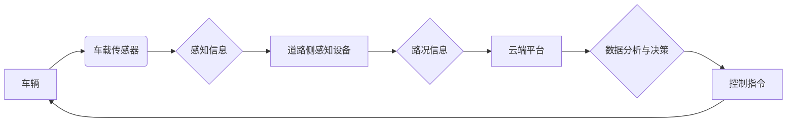

> 自动驾驶, 车路协同, 云计算, 深度学习, 计算机视觉, 决策控制, 安全保障

## 1. 背景介绍

自动驾驶技术作为未来交通运输的重要发展方向，近年来取得了显著进展。从早期基于规则的控制系统到如今的深度学习驱动的智能驾驶，自动驾驶技术不断突破创新。然而，现阶段自动驾驶技术仍面临着诸多挑战，例如复杂路况感知、决策控制、安全保障等。

为了解决这些挑战，车路云一体化方案应运而生。该方案将车辆、道路基础设施和云端计算平台有机结合，形成一个协同互补的智能交通生态系统。通过车路协同感知、决策融合和数据共享，车路云一体化方案能够提升自动驾驶系统的感知能力、决策效率和安全性，最终实现更加智能、安全、高效的自动驾驶体验。

## 2. 核心概念与联系

**2.1 车路协同**

车路协同是指车辆与道路基础设施之间进行实时信息交互，实现感知共享、决策融合和控制协同。通过车载传感器和道路侧感知设备的协同感知，可以获得更全面的路况信息，提高自动驾驶系统的感知精度和可靠性。

**2.2 云计算**

云计算是指利用互联网技术，提供计算资源、存储资源和软件服务，实现按需使用、弹性扩展和资源共享。在自动驾驶领域，云计算可以为自动驾驶系统提供海量数据存储、高性能计算和智能分析服务，支持自动驾驶系统的训练、优化和升级。

**2.3 车路云一体化架构**

车路云一体化架构将车辆、道路基础设施和云端计算平台有机结合，形成一个协同互补的智能交通生态系统。



**2.4 核心功能**

车路云一体化方案的核心功能包括：

* **感知融合:** 车载传感器和道路侧感知设备协同感知路况信息，提高感知精度和可靠性。
* **决策融合:** 云端平台对感知信息进行分析和决策，提供更智能、更安全的驾驶决策。
* **数据共享:** 车辆、道路基础设施和云端平台之间进行实时数据共享，实现数据协同利用和资源优化。
* **安全保障:** 通过多重安全机制，保障车路云一体化系统的安全稳定运行。

## 3. 核心算法原理 & 具体操作步骤

### 3.1  算法原理概述

车路云一体化方案的核心算法包括感知融合算法、决策融合算法和数据共享算法。

* **感知融合算法:** 通过融合车载传感器和道路侧感知设备的感知信息，提高感知精度和可靠性。常用的感知融合算法包括 Kalman 滤波、粒子滤波和深度学习算法。
* **决策融合算法:** 通过云端平台对感知信息进行分析和决策，提供更智能、更安全的驾驶决策。常用的决策融合算法包括强化学习、决策树和贝叶斯网络。
* **数据共享算法:** 通过安全可靠的通信协议，实现车辆、道路基础设施和云端平台之间的数据共享。常用的数据共享算法包括数据加密、数据压缩和数据分发。

### 3.2  算法步骤详解

**3.2.1 感知融合算法步骤:**

1. **数据采集:** 车载传感器和道路侧感知设备采集路况信息，例如车辆位置、速度、方向、障碍物信息等。
2. **数据预处理:** 对采集到的数据进行预处理，例如去除噪声、进行数据校正等。
3. **数据融合:** 使用感知融合算法，融合车载传感器和道路侧感知设备的感知信息，得到更加准确和可靠的路况信息。
4. **信息输出:** 将融合后的路况信息输出到决策融合算法。

**3.2.2 决策融合算法步骤:**

1. **数据输入:** 接收感知融合算法输出的路况信息。
2. **数据分析:** 对路况信息进行分析，例如识别障碍物、预测车辆运动轨迹等。
3. **决策生成:** 使用决策融合算法，生成驾驶决策，例如转向、加速、减速等。
4. **指令输出:** 将驾驶决策指令发送到车辆控制系统。

**3.2.3 数据共享算法步骤:**

1. **数据加密:** 对需要共享的数据进行加密，保障数据安全。
2. **数据压缩:** 对数据进行压缩，减少数据传输量。
3. **数据分发:** 将加密后的压缩数据发送到目标节点，例如云端平台或其他车辆。
4. **数据接收:** 目标节点接收数据，进行解密和解压缩。

### 3.3  算法优缺点

**3.3.1 感知融合算法:**

* **优点:** 提高感知精度和可靠性，增强自动驾驶系统的鲁棒性。
* **缺点:** 算法复杂度高，计算量大，对硬件资源要求高。

**3.3.2 决策融合算法:**

* **优点:** 提供更智能、更安全的驾驶决策，提高自动驾驶系统的安全性。
* **缺点:** 算法训练需要大量数据，对数据质量要求高。

**3.3.3 数据共享算法:**

* **优点:** 实现数据协同利用，提高资源利用效率，促进自动驾驶技术发展。
* **缺点:** 需要解决数据安全、隐私保护等问题。

### 3.4  算法应用领域

车路云一体化方案的核心算法在自动驾驶领域有着广泛的应用，例如：

* **自动驾驶汽车:** 提高自动驾驶汽车的感知能力、决策效率和安全性。
* **智能交通系统:** 优化交通流量，提高道路通行效率，降低交通拥堵。
* **智慧城市:** 建立智能交通网络，促进城市化发展。

## 4. 数学模型和公式 & 详细讲解 & 举例说明

### 4.1  数学模型构建

车路云一体化方案的数学模型可以描述车辆、道路基础设施和云端平台之间的交互关系，以及感知融合、决策融合和数据共享等过程的数学原理。

例如，可以构建一个状态空间模型来描述车辆的运动状态，包括位置、速度、方向等。

$$
\dot{x} = f(x, u) + w
$$

其中：

* $x$ 是车辆的状态向量。
* $u$ 是控制输入。
* $w$ 是过程噪声。

### 4.2  公式推导过程

感知融合算法的数学推导过程通常涉及概率论和统计学，例如卡尔曼滤波算法的推导过程。

卡尔曼滤波算法是一种基于状态空间模型的估计算法，可以用来估计系统状态的估计值。

卡尔曼滤波算法的公式如下：

$$
\hat{x}_{k|k} = \hat{x}_{k|k-1} + K_k (y_k - h(\hat{x}_{k|k-1}))
$$

$$
P_{k|k} = P_{k|k-1} - K_k H(\hat{x}_{k|k-1}) P_{k|k-1}
$$

其中：

* $\hat{x}_{k|k}$ 是时间 $k$ 时刻对状态 $x_k$ 的估计值。
* $P_{k|k}$ 是时间 $k$ 时刻对状态估计误差的协方差矩阵。
* $y_k$ 是时间 $k$ 时刻的观测值。
* $h(\cdot)$ 是观测模型。
* $K_k$ 是卡尔曼增益。

### 4.3  案例分析与讲解

可以利用实际案例分析车路云一体化方案的数学模型和算法的应用效果。例如，可以分析车路协同感知在复杂路况下的效果，或者分析决策融合算法在紧急情况下的决策效率。

## 5. 项目实践：代码实例和详细解释说明

### 5.1  开发环境搭建

车路云一体化方案的开发环境通常包括：

* **硬件平台:** 
    * 车载平台: 嵌入式系统，配备传感器、处理器、通信模块等硬件。
    * 道路侧平台: 基于云计算平台，配备感知设备、数据存储、计算资源等硬件。
* **软件平台:** 
    * 操作系统: Linux、Android 等。
    * 开发工具: ROS、Python 等。
    * 数据处理框架: TensorFlow、PyTorch 等。

### 5.2  源代码详细实现

以下是一个简单的车路协同感知代码示例，使用 Python 和 ROS 框架实现：

```python
# 订阅道路侧感知设备发布的障碍物信息
obstacle_sub = rospy.Subscriber('/obstacle_data', Obstacle, obstacle_callback)

# 定义障碍物回调函数
def obstacle_callback(data):
    # 获取障碍物信息
    obstacle_x = data.x
    obstacle_y = data.y
    obstacle_size = data.size

    # 将障碍物信息发布到车载平台
    rospy.Publisher('/local_obstacle', Obstacle, queue_size=10).publish(Obstacle(x=obstacle_x, y=obstacle_y, size=obstacle_size))
```

### 5.3  代码解读与分析

* 该代码订阅道路侧感知设备发布的障碍物信息，并将其发布到车载平台。
* 使用 ROS 框架实现消息订阅和发布，方便不同节点之间的数据交互。
* 定义 Obstacle 消息类型，用于传输障碍物信息。

### 5.4  运行结果展示

运行该代码后，道路侧感知设备发布的障碍物信息将被订阅并转发到车载平台，车载平台可以根据接收到的障碍物信息进行决策控制。

## 6. 实际应用场景

### 6.1  智能交通管理

车路云一体化方案可以用于智能交通管理，例如：

* **交通流量优化:** 通过感知路况信息，优化交通信号灯控制，减少交通拥堵。
* **事故预警:** 通过感知车辆运动轨迹，预测潜在事故，及时发出预警。
* **道路维护:** 通过感知道路状况，及时发现道路缺陷，进行维修保养。

### 6.2  自动驾驶汽车

车路云一体化方案可以用于自动驾驶汽车，例如：

* **增强感知能力:** 通过车路协同感知，提高自动驾驶汽车的感知精度和可靠性。
* **提高决策效率:** 通过云端平台的决策融合，提供更智能、更安全的驾驶决策。
* **实现远程驾驶:** 通过云端平台，实现远程驾驶功能，例如远程操控、远程监控等。

### 6.3  智慧城市

车路云一体化方案可以用于智慧城市建设，例如：

* **智能停车:** 通过感知停车位信息，引导车辆驶入空闲停车位。
* **智能公交:** 通过感知公交车位置信息，优化公交线路和调度，提高公交效率。
* **智能出行:** 通过感知交通状况，提供个性化出行建议，提高出行效率和舒适度。

### 6.4  未来应用展望

车路云一体化方案在未来将有更广泛的应用场景，例如：

* **无人驾驶物流:** 实现无人驾驶卡车、无人驾驶快递等物流服务。
* **自动驾驶出租车:** 实现自动驾驶出租车服务，提高出行效率和安全性。
* **自动驾驶公共交通:** 实现自动驾驶公交车、自动驾驶地铁等公共交通服务。

## 7. 工具和资源推荐

### 7.1  学习资源推荐

* **书籍:**
    * 《自动驾驶汽车》
    * 《深度学习》
    * 《机器人操作系统》
* **在线课程:**
    * Coursera: 自动驾驶汽车课程
    * Udacity: 深度学习课程
    * edX: 机器人操作系统课程

### 7.2  开发工具推荐

* **ROS (Robot Operating System):** 用于机器人软件开发的开源框架。
* **Python:** 用于数据处理、算法开发的编程语言。
* **