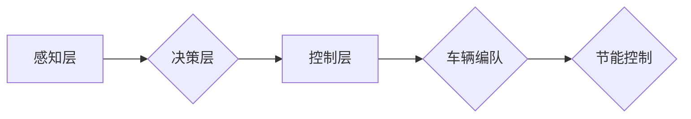

> 自动驾驶,车辆编队,节能控制,深度学习,强化学习,模型预测,路径规划

## 1. 背景介绍

随着智能交通系统的快速发展，车辆编队技术作为一种提高道路交通效率和降低能源消耗的有效手段，越来越受到关注。车辆编队是指多个车辆按照预定的规则和距离紧密地行驶在一起，通过协同控制来实现更优的交通流和能源利用。

传统车辆编队控制策略主要依赖于规则-基于的控制方法，例如车间距保持、速度匹配等。然而，这些方法难以应对复杂的路况和车辆动态变化，控制性能有限。近年来，随着深度学习和强化学习等人工智能技术的快速发展，端到端自动驾驶的车辆编队节能控制策略逐渐成为研究热点。

## 2. 核心概念与联系

端到端自动驾驶的车辆编队节能控制策略的核心概念包括：

* **端到端学习:** 将感知、决策和控制三个环节统一在一个深度学习模型中，实现从传感器数据到控制指令的直接映射，无需人工设计复杂的中间环节。
* **车辆编队:** 多辆车辆按照预定的规则和距离紧密行驶在一起，通过协同控制来实现更优的交通流和能源利用。
* **节能控制:** 通过优化车辆行驶策略，例如速度控制、加速减速策略等，降低车辆的油耗和碳排放。

**核心概念架构:**

## 3. 核心算法原理 & 具体操作步骤

### 3.1  算法原理概述

端到端自动驾驶的车辆编队节能控制策略通常采用深度强化学习 (Deep Reinforcement Learning, DRL) 算法。DRL 算法将智能体 (车辆) 置于一个环境中，通过与环境交互学习最优的策略。

在车辆编队节能控制场景中，智能体是车辆，环境是道路和周围车辆，状态是车辆的位置、速度、周围车辆的信息等，动作是车辆的加速度和转向角。DRL 算法的目标是学习一个策略，使得车辆在编队行驶过程中能够最大化节能，同时保证安全和舒适性。

### 3.2  算法步骤详解

1. **环境建模:** 建立一个模拟车辆编队行驶的环境，包括道路、车辆、交通规则等。
2. **状态空间定义:** 定义车辆的状态空间，包括车辆的位置、速度、加速度、方向、周围车辆的信息等。
3. **动作空间定义:** 定义车辆的动作空间，例如加速度、转向角等。
4. **奖励函数设计:** 设计一个奖励函数，根据车辆的编队性能、节能效果、安全性和舒适性等因素进行评价。
5. **DRL 算法训练:** 使用 DRL 算法，例如深度 Q 网络 (DQN) 或策略梯度算法 (Policy Gradient)，训练智能体学习最优的控制策略。
6. **策略评估:** 在真实环境或模拟环境中评估训练得到的策略的性能。

### 3.3  算法优缺点

**优点:**

* 可以学习到复杂的非线性关系，适应复杂的路况和车辆动态变化。
* 不需要人工设计复杂的控制规则，提高了控制策略的鲁棒性和泛化能力。

**缺点:**

* 训练过程需要大量的样本数据和计算资源。
* 算法的稳定性和安全性需要进一步研究和验证。

### 3.4  算法应用领域

端到端自动驾驶的车辆编队节能控制策略可以应用于以下领域:

* **高速公路:** 提高车辆编队行驶效率，降低油耗和碳排放。
* **城市道路:** 缓解交通拥堵，提高道路通行效率。
* **无人驾驶物流:** 提高物流效率，降低运输成本。

## 4. 数学模型和公式 & 详细讲解 & 举例说明

### 4.1  数学模型构建

车辆编队节能控制策略的数学模型通常基于以下几个方面:

* **车辆动力学模型:** 描述车辆的运动状态和动力学特性。
* **路径规划模型:** 根据目标位置和周围环境，规划车辆行驶路径。
* **编队控制模型:** 控制车辆之间的距离和速度，实现编队行驶。
* **节能控制模型:** 优化车辆行驶策略，降低油耗和碳排放。

### 4.2  公式推导过程

例如，车辆动力学模型可以表示为以下公式:

$$
F = m \cdot a
$$

其中:

* $F$ 为车辆受力
* $m$ 为车辆质量
* $a$ 为车辆加速度

### 4.3  案例分析与讲解

假设一辆车辆想要在高速公路上与前车编队行驶，目标车间距为 20 米。根据车辆动力学模型和编队控制模型，可以推导出一组控制指令，例如加速度和转向角，使得车辆能够保持与前车预定的车间距。

## 5. 项目实践：代码实例和详细解释说明

### 5.1  开发环境搭建

开发环境搭建包括以下步骤:

1. 安装 Python 语言和相关库，例如 TensorFlow、PyTorch、NumPy 等。
2. 设置仿真环境，例如 CARLA、SUMO 等。
3. 安装必要的开发工具，例如 Git、IDE 等。

### 5.2  源代码详细实现

代码实现包括以下部分:

1. **数据采集:** 使用仿真环境或真实车辆采集车辆行驶数据，包括位置、速度、加速度、方向、周围车辆信息等。
2. **数据预处理:** 对采集到的数据进行预处理，例如归一化、降维等。
3. **模型训练:** 使用 DRL 算法，例如 DQN 或策略梯度算法，训练智能体学习最优的控制策略。
4. **模型评估:** 在真实环境或模拟环境中评估训练得到的策略的性能。

### 5.3  代码解读与分析

代码解读包括以下方面:

1. 算法实现细节
2. 模型结构和参数设置
3. 训练过程和评估指标

### 5.4  运行结果展示

运行结果展示包括以下方面:

1. 智能体在编队行驶过程中的轨迹
2. 智能体在编队行驶过程中的油耗和碳排放
3. 智能体在编队行驶过程中的安全性和舒适性

## 6. 实际应用场景

### 6.1  高速公路编队

在高速公路上，车辆编队可以提高交通流效率，降低油耗和碳排放。

### 6.2  城市道路编队

在城市道路上，车辆编队可以缓解交通拥堵，提高道路通行效率。

### 6.3  无人驾驶物流编队

在无人驾驶物流场景中，车辆编队可以提高物流效率，降低运输成本。

### 6.4  未来应用展望

未来，端到端自动驾驶的车辆编队节能控制策略将应用于更广泛的场景，例如：

* **智能交通系统:** 优化交通流量，提高道路通行效率。
* **智慧城市:** 降低城市碳排放，改善城市环境。
* **自动驾驶汽车:** 提高自动驾驶汽车的安全性、舒适性和节能性能。

## 7. 工具和资源推荐

### 7.1  学习资源推荐

* **书籍:**
    * Deep Reinforcement Learning Hands-On
    * Reinforcement Learning: An Introduction
* **在线课程:**
    * Coursera: Reinforcement Learning Specialization
    * Udacity: Deep Reinforcement Learning Nanodegree

### 7.2  开发工具推荐

* **仿真环境:** CARLA, SUMO
* **深度学习框架:** TensorFlow, PyTorch
* **编程语言:** Python

### 7.3  相关论文推荐

* **论文:**
    * End-to-End Learning for Autonomous Driving
    * Deep Reinforcement Learning for Autonomous Driving

## 8. 总结：未来发展趋势与挑战

### 8.1  研究成果总结

端到端自动驾驶的车辆编队节能控制策略取得了显著的进展，能够有效提高车辆编队行驶效率和节能效果。

### 8.2  未来发展趋势

未来，该领域的研究将朝着以下方向发展:

* **更鲁棒和安全的算法:** 开发更鲁棒和安全的 DRL 算法，能够应对更复杂的路况和车辆动态变化。
* **更有效的模型压缩:** 研究更有效的模型压缩技术，降低模型的计算复杂度和存储需求。
* **更广泛的应用场景:** 将该技术应用于更广泛的场景，例如智能交通系统、智慧城市等。

### 8.3  面临的挑战

该领域还面临着一些挑战:

* **数据获取和标注:** 训练 DRL 算法需要大量的标注数据，数据获取和标注成本较高。
* **算法稳定性和安全性:** DRL 算法的稳定性和安全性需要进一步研究和验证。
* **法律法规和伦理问题:** 自动驾驶技术的发展需要考虑法律法规和伦理问题。

### 8.4  研究展望

未来，我们将继续致力于端到端自动驾驶的车辆编队节能控制策略的研究，推动该技术的发展和应用，为构建更加智能、高效、安全的交通系统做出贡献。

## 9. 附录：常见问题与解答

### 9.1  常见问题

* **什么是端到端学习?**
* **DRL 算法有哪些?**
* **车辆编队节能控制策略的应用场景有哪些?**

### 9.2  解答

* **什么是端到端学习?** 端到端学习是指将感知、决策和控制三个环节统一在一个深度学习模型中，实现从传感器数据到控制指令的直接映射，无需人工设计复杂的中间环节。
* **DRL 算法有哪些?** 常见的 DRL 算法包括深度 Q 网络 (DQN)、策略梯度算法 (Policy Gradient) 等。
* **车辆编队节能控制策略的应用场景有哪些?** 该策略可以应用于高速公路、城市道路、无人驾驶物流等场景。

作者：禅与计算机程序设计艺术 / Zen and the Art of Computer Programming 
<end_of_turn>