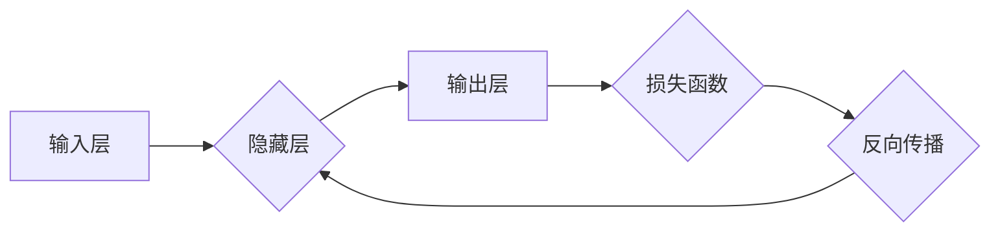

> 深度学习、神经网络、卷积神经网络、反向传播、梯度下降、激活函数

## 1. 背景介绍

在当今数据爆炸的时代，深度学习作为机器学习领域最前沿的技术，在图像识别、自然语言处理、语音识别等领域取得了突破性的进展。然而，想要真正理解深度学习的精髓，需要深入探究其核心概念、算法原理以及数学模型。本文将从基础概念开始，逐步深入到深度学习的实现细节，并结合实际案例，帮助读者建立对深度学习的系统性认知。

## 2. 核心概念与联系

深度学习的核心概念是**人工神经网络 (Artificial Neural Network, ANN)**。它模仿了人脑的神经元结构和功能，通过多层神经网络的连接和激活函数，学习数据中的复杂模式和关系。

**神经网络的结构**

* **输入层:**接收原始数据，每个神经元代表一个特征。
* **隐藏层:**隐藏层可以有多层，每个神经元接收上一层的输出，并进行非线性变换，提取数据的特征表示。
* **输出层:**输出最终的结果，每个神经元对应一个输出类别或值。

**神经网络的学习过程**

深度学习的学习过程本质上是**参数调整**的过程。通过**反向传播算法**，计算网络输出与真实值的误差，并根据误差反向调整各神经元的权重和偏置，使得网络输出越来越接近真实值。

**Mermaid 流程图**



## 3. 核心算法原理 & 具体操作步骤

### 3.1  算法原理概述

**反向传播算法 (Backpropagation)**是深度学习的核心算法，用于计算网络参数的梯度，并根据梯度更新参数值。

**算法步骤:**

1. **正向传播:** 将输入数据通过网络传递，计算输出结果。
2. **损失函数计算:** 计算输出结果与真实值的误差，使用损失函数衡量误差大小。
3. **反向传播:** 从输出层开始，计算每个神经元的梯度，并反向传播到输入层。
4. **参数更新:** 使用梯度下降算法，根据梯度更新网络参数。

### 3.2  算法步骤详解

**正向传播:**

* 将输入数据传递到第一层神经元。
* 每个神经元接收上一层神经元的输出，并进行加权求和和激活函数处理，得到该神经元的输出。
* 将输出传递到下一层神经元，重复上述过程，直到输出层。

**反向传播:**

* 从输出层开始，计算输出神经元的梯度，根据损失函数和链式法则计算。
* 将梯度反向传播到上一层神经元，计算上一层神经元的梯度。
* 重复上述过程，直到计算到输入层。

**参数更新:**

* 使用梯度下降算法，根据梯度更新网络参数，例如权重和偏置。

### 3.3  算法优缺点

**优点:**

* 能够学习复杂的数据模式。
* 具有较强的泛化能力。

**缺点:**

* 训练时间长，需要大量的计算资源。
* 容易陷入局部最优解。

### 3.4  算法应用领域

* **图像识别:** 人脸识别、物体检测、图像分类。
* **自然语言处理:** 文本分类、机器翻译、情感分析。
* **语音识别:** 语音转文本、语音助手。
* **推荐系统:** 商品推荐、用户画像。

## 4. 数学模型和公式 & 详细讲解 & 举例说明

### 4.1  数学模型构建

深度学习的数学模型主要包括以下几个方面:

* **激活函数:** 用于引入非线性，使神经网络能够学习复杂的数据模式。常见的激活函数包括 sigmoid 函数、ReLU 函数、tanh 函数等。
* **损失函数:** 用于衡量模型预测结果与真实值的误差。常见的损失函数包括均方误差 (MSE)、交叉熵损失 (Cross-Entropy Loss) 等。
* **梯度下降算法:** 用于更新网络参数，使模型的损失函数最小化。常见的梯度下降算法包括随机梯度下降 (SGD)、动量梯度下降 (Momentum) 等。

### 4.2  公式推导过程

**激活函数:**

* **sigmoid 函数:** $$f(x) = \frac{1}{1 + e^{-x}}$$
* **ReLU 函数:** $$f(x) = max(0, x)$$

**损失函数:**

* **均方误差 (MSE):** $$L = \frac{1}{n} \sum_{i=1}^{n} (y_i - \hat{y}_i)^2$$

**梯度下降算法:**

* **SGD:** $$\theta = \theta - \alpha \nabla L(\theta)$$

### 4.3  案例分析与讲解

**举例说明:**

假设我们有一个简单的线性回归问题，目标是预测房价。我们可以使用一个单层神经网络，输入房屋面积，输出房价。

* **输入层:** 一个神经元，接收房屋面积作为输入。
* **隐藏层:** 一个神经元，使用 sigmoid 函数作为激活函数。
* **输出层:** 一个神经元，输出房价预测值。

我们可以使用 MSE 作为损失函数，SGD 作为优化算法，训练这个神经网络。通过反向传播算法，计算每个参数的梯度，并根据梯度更新参数值，最终得到一个能够预测房价的模型。

## 5. 项目实践：代码实例和详细解释说明

### 5.1  开发环境搭建

* Python 3.x
* TensorFlow 或 PyTorch

### 5.2  源代码详细实现

```python
import tensorflow as tf

# 定义模型
model = tf.keras.models.Sequential([
    tf.keras.layers.Dense(128, activation='relu', input_shape=(1,)),
    tf.keras.layers.Dense(1)
])

# 编译模型
model.compile(optimizer='adam', loss='mse')

# 训练模型
model.fit(x_train, y_train, epochs=100)

# 评估模型
loss = model.evaluate(x_test, y_test)
print('Loss:', loss)

# 预测房价
prediction = model.predict(x_new)
print('Prediction:', prediction)
```

### 5.3  代码解读与分析

* **定义模型:** 使用 Keras API 定义一个简单的单层神经网络模型。
* **编译模型:** 使用 Adam 优化器和均方误差损失函数编译模型。
* **训练模型:** 使用训练数据训练模型，设置训练轮数为 100。
* **评估模型:** 使用测试数据评估模型的性能，输出损失值。
* **预测房价:** 使用训练好的模型预测新的房价。

### 5.4  运行结果展示

运行代码后，会输出模型的训练损失值和预测结果。

## 6. 实际应用场景

深度学习在各个领域都有广泛的应用，例如:

* **图像识别:** 自动驾驶、医疗诊断、人脸识别。
* **自然语言处理:** 机器翻译、聊天机器人、文本摘要。
* **语音识别:** 语音助手、语音搜索、语音转文本。
* **推荐系统:** 商品推荐、用户画像、个性化内容推荐。

### 6.4  未来应用展望

随着计算能力和数据量的不断增长，深度学习将在更多领域发挥重要作用，例如:

* **药物研发:** 利用深度学习加速药物发现和开发。
* **材料科学:** 利用深度学习设计新型材料。
* **金融科技:** 利用深度学习进行风险管理、欺诈检测和投资决策。

## 7. 工具和资源推荐

### 7.1  学习资源推荐

* **书籍:**
    * 深度学习 (Deep Learning) - Ian Goodfellow, Yoshua Bengio, Aaron Courville
    * 深度学习实践 (Deep Learning with Python) - Francois Chollet
* **在线课程:**
    * Coursera: 深度学习 Specialization
    * Udacity: 深度学习 Nanodegree
* **博客和网站:**
    * TensorFlow Blog
    * PyTorch Blog
    * Towards Data Science

### 7.2  开发工具推荐

* **TensorFlow:** 开源深度学习框架，支持多种硬件平台。
* **PyTorch:** 开源深度学习框架，以其灵活性和易用性而闻名。
* **Keras:** 高级深度学习 API，可以运行在 TensorFlow、Theano 或 CNTK 后端。

### 7.3  相关论文推荐

* **ImageNet Classification with Deep Convolutional Neural Networks** - Alex Krizhevsky, Ilya Sutskever, Geoffrey E. Hinton
* **Sequence to Sequence Learning with Neural Networks** - Ilya Sutskever, Oriol Vinyals, Quoc V. Le
* **Attention Is All You Need** - Ashish Vaswani, Noam Shazeer, Niki Parmar, Jakob Uszkoreit, Llion Jones, Aidan N. Gomez, Łukasz Kaiser, Illia Polosukhin

## 8. 总结：未来发展趋势与挑战

### 8.1  研究成果总结

深度学习取得了令人瞩目的成就，在图像识别、自然语言处理等领域取得了突破性的进展。

### 8.2  未来发展趋势

* **模型规模和复杂度:** 模型规模和复杂度将继续增加，例如 Transformer 模型的出现。
* **数据效率:** 研究更有效的训练方法，降低对数据量的依赖。
* **可解释性:** 研究更可解释的深度学习模型，提高模型的透明度和可信度。
* **边缘计算:** 将深度学习模型部署到边缘设备，实现更快速的推理和更低的延迟。

### 8.3  面临的挑战

* **计算资源:** 训练大型深度学习模型需要大量的计算资源，成本较高。
* **数据标注:** 深度学习模型需要大量的标注数据，标注成本高昂。
* **公平性和偏见:** 深度学习模型可能存在公平性和偏见问题，需要进行更深入的研究和解决。

### 8.4  研究展望

未来，深度学习的研究将继续朝着更强大、更智能、更安全的方向发展，为人类社会带来更多福祉。

## 9. 附录：常见问题与解答

* **什么是深度学习？**

深度学习是一种机器学习的子领域，它使用多层神经网络来学习数据中的复杂模式和关系。

* **深度学习有哪些应用？**

深度学习在图像识别、自然语言处理、语音识别、推荐系统等领域都有广泛的应用。

* **如何学习深度学习？**

可以通过阅读书籍、在线课程、博客和网站等方式学习深度学习。

作者：禅与计算机程序设计艺术 / Zen and the Art of Computer Programming


<end_of_turn>