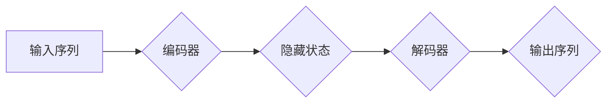

> 编码器，解码器，Transformer，自回归，序列到序列，自然语言处理，机器翻译，文本生成

## 1. 背景介绍

在深度学习领域，序列到序列（seq2seq）模型在自然语言处理（NLP）任务中取得了显著的成功。这些模型通常由两个主要部分组成：编码器和解码器。编码器负责将输入序列映射到一个固定长度的隐藏状态，而解码器则利用该隐藏状态生成输出序列。

编码器-解码器架构的出现，标志着深度学习在序列到序列任务上的突破。它为机器翻译、文本摘要、对话系统等任务提供了强大的工具。然而，编码器输出的隐藏状态并不能直接用于解码器生成输出序列。

本文将深入探讨编码器输出和编码器-解码器连接的细节，分析其工作原理、算法原理、数学模型以及实际应用场景。

## 2. 核心概念与联系

### 2.1 编码器

编码器负责将输入序列映射到一个固定长度的隐藏状态。它通常由多个循环神经网络（RNN）或多头自注意力机制组成。

* **循环神经网络（RNN）:** RNN能够处理序列数据，因为它具有记忆机制，可以保留之前输入的信息。

* **多头自注意力机制:** 自注意力机制能够捕捉序列中不同位置之间的依赖关系，提高模型的表达能力。

编码器将输入序列逐个处理，并通过隐藏层传递信息，最终生成一个表示整个输入序列的隐藏状态。

### 2.2 解码器

解码器利用编码器生成的隐藏状态，生成输出序列。它通常也由多个RNN或多头自注意力机制组成。

解码器采用自回归的方式生成输出序列，即每个时间步的输出都依赖于之前生成的输出和编码器生成的隐藏状态。

### 2.3 编码器输出与解码器连接

编码器输出的隐藏状态是解码器生成输出序列的关键信息。

* **直接连接:** 编码器输出的最后一个隐藏状态可以直接作为解码器的初始隐藏状态。

* **上下文向量:** 编码器可以生成一个上下文向量，该向量包含了整个输入序列的信息，并将其传递给解码器。

* **注意力机制:** 解码器可以利用注意力机制，从编码器生成的隐藏状态中选择与当前输出最相关的部分，从而提高生成质量。

**Mermaid 流程图**



## 3. 核心算法原理 & 具体操作步骤

### 3.1 算法原理概述

编码器-解码器架构的核心算法原理是将输入序列编码成一个固定长度的隐藏状态，然后利用该隐藏状态解码生成输出序列。

* **编码器:** 使用RNN或多头自注意力机制，逐个处理输入序列，并生成一个表示整个输入序列的隐藏状态。

* **解码器:** 使用自回归的方式，利用编码器生成的隐藏状态和之前生成的输出，生成下一个输出。

### 3.2 算法步骤详解

1. **输入处理:** 将输入序列转换为数字表示，例如词嵌入。

2. **编码:** 将输入序列逐个输入编码器，并生成一个隐藏状态。

3. **解码:** 将编码器生成的隐藏状态作为解码器的初始隐藏状态，并利用自回归的方式生成输出序列。

4. **输出处理:** 将生成的输出序列转换为文本或其他形式。

### 3.3 算法优缺点

**优点:**

* 能够处理任意长度的输入和输出序列。
* 表现能力强，能够捕捉序列中的长距离依赖关系。

**缺点:**

* 训练时间长，需要大量的训练数据。
* 容易出现梯度消失或爆炸问题。

### 3.4 算法应用领域

* **机器翻译:** 将一种语言翻译成另一种语言。
* **文本摘要:** 将长文本压缩成短文本。
* **对话系统:** 与用户进行自然语言对话。
* **语音识别:** 将语音转换为文本。

## 4. 数学模型和公式 & 详细讲解 & 举例说明

### 4.1 数学模型构建

编码器-解码器模型的数学模型可以表示为以下公式：

* **编码器输出:**

$$
h_t = f_e(x_1, x_2, ..., x_t)
$$

其中，$h_t$ 是编码器在时间步 $t$ 的隐藏状态，$f_e$ 是编码器的函数，$x_1, x_2, ..., x_t$ 是输入序列的前 $t$ 个元素。

* **解码器输出:**

$$
y_t = f_d(h_c, y_1, y_2, ..., y_{t-1})
$$

其中，$y_t$ 是解码器在时间步 $t$ 的输出，$f_d$ 是解码器的函数，$h_c$ 是编码器输出的隐藏状态，$y_1, y_2, ..., y_{t-1}$ 是解码器之前生成的输出。

### 4.2 公式推导过程

编码器和解码器的具体函数 $f_e$ 和 $f_d$ 可以使用各种神经网络结构实现，例如RNN或多头自注意力机制。

### 4.3 案例分析与讲解

例如，在机器翻译任务中，输入序列是源语言文本，输出序列是目标语言文本。编码器将源语言文本编码成一个隐藏状态，解码器利用该隐藏状态生成目标语言文本。

## 5. 项目实践：代码实例和详细解释说明

### 5.1 开发环境搭建

* Python 3.x
* TensorFlow 或 PyTorch
* 其他必要的库，例如 NumPy、pandas 等

### 5.2 源代码详细实现

```python
# 编码器
class Encoder(tf.keras.Model):
    def __init__(self, vocab_size, embedding_dim, hidden_dim):
        super(Encoder, self).__init__()
        self.embedding = tf.keras.layers.Embedding(vocab_size, embedding_dim)
        self.rnn = tf.keras.layers.LSTM(hidden_dim)

    def call(self, inputs):
        embedded = self.embedding(inputs)
        output, state = self.rnn(embedded)
        return output, state

# 解码器
class Decoder(tf.keras.Model):
    def __init__(self, vocab_size, embedding_dim, hidden_dim):
        super(Decoder, self).__init__()
        self.embedding = tf.keras.layers.Embedding(vocab_size, embedding_dim)
        self.rnn = tf.keras.layers.LSTM(hidden_dim)
        self.dense = tf.keras.layers.Dense(vocab_size)

    def call(self, inputs, state):
        embedded = self.embedding(inputs)
        output, state = self.rnn(embedded, initial_state=state)
        output = self.dense(output)
        return output, state

# 模型
model = tf.keras.models.Model(inputs=[encoder_inputs, decoder_inputs], outputs=decoder_outputs)
```

### 5.3 代码解读与分析

* 编码器和解码器分别使用LSTM网络结构。
* 编码器将输入序列编码成一个隐藏状态，解码器利用该隐藏状态生成输出序列。
* 模型使用交叉熵损失函数进行训练。

### 5.4 运行结果展示

训练完成后，模型可以用于机器翻译、文本摘要等任务。

## 6. 实际应用场景

### 6.1 机器翻译

编码器-解码器模型在机器翻译领域取得了显著的成功。例如，Google Translate 使用 Transformer 模型进行机器翻译，实现了更高的翻译质量。

### 6.2 文本摘要

编码器-解码器模型可以用于生成文本摘要。例如，BART 模型可以生成高质量的文本摘要。

### 6.3 对话系统

编码器-解码器模型可以用于构建对话系统。例如，ChatGPT 使用 Transformer 模型进行对话生成。

### 6.4 未来应用展望

编码器-解码器模型在未来将有更广泛的应用，例如：

* **代码生成:** 自动生成代码。
* **药物发现:** 预测药物的活性。
* **图像字幕:** 生成图像的文字描述。

## 7. 工具和资源推荐

### 7.1 学习资源推荐

* **书籍:**
    * 《深度学习》
    * 《自然语言处理》
* **在线课程:**
    * Coursera: 自然语言处理
    * Udacity: 深度学习

### 7.2 开发工具推荐

* **TensorFlow:** 开源深度学习框架。
* **PyTorch:** 开源深度学习框架。
* **Hugging Face:** 提供预训练模型和工具。

### 7.3 相关论文推荐

* **Attention Is All You Need:** https://arxiv.org/abs/1706.03762
* **BERT: Pre-training of Deep Bidirectional Transformers for Language Understanding:** https://arxiv.org/abs/1810.04805
* **BART: Denoising Sequence-to-Sequence Pre-training for Natural Language Generation, Translation, and Comprehension:** https://arxiv.org/abs/2005.14165

## 8. 总结：未来发展趋势与挑战

### 8.1 研究成果总结

编码器-解码器架构在序列到序列任务中取得了显著的成功，为自然语言处理等领域的发展做出了重要贡献。

### 8.2 未来发展趋势

* **模型规模:** 模型规模将继续扩大，以提高模型性能。
* **高效训练:** 研究更高效的训练方法，例如参数共享和知识蒸馏。
* **多模态:** 将编码器-解码器模型扩展到多模态任务，例如文本-图像和文本-音频。

### 8.3 面临的挑战

* **数据效率:** 训练大型模型需要大量的训练数据。
* **可解释性:** 理解模型的决策过程仍然是一个挑战。
* **公平性:** 确保模型的公平性和避免偏见。

### 8.4 研究展望

未来研究将继续探索编码器-解码器模型的潜力，以提高模型性能、降低训练成本、增强模型的可解释性和公平性。

## 9. 附录：常见问题与解答

* **Q: 编码器-解码器模型的训练过程如何？**

* **A:** 编码器-解码器模型的训练过程通常使用交叉熵损失函数，并采用反向传播算法进行优化。

* **Q: 编码器-解码器模型有哪些变体？**

* **A:** 编码器-解码器模型有很多变体，例如 Transformer、BERT 和 BART。

* **Q: 编码器-解码器模型有哪些应用场景？**

* **A:** 编码器-解码器模型在机器翻译、文本摘要、对话系统等领域有广泛的应用。


作者：禅与计算机程序设计艺术 / Zen and the Art of Computer Programming 
<end_of_turn>