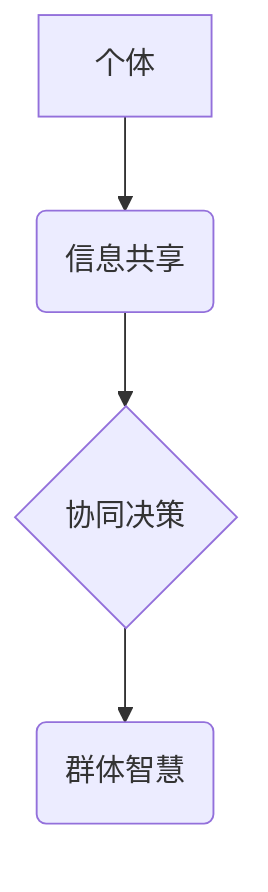

>群体智慧，协同决策，人工智能，机器学习，优化算法，分布式计算，大数据分析

## 1. 背景介绍

在当今数据爆炸和计算能力飞速发展的时代，传统的决策模式面临着越来越大的挑战。单一决策者往往难以处理海量数据和复杂问题，而群体智慧则为我们提供了一种全新的决策思路。群体智慧是指由多个个体协同决策而产生的智能，其决策结果往往优于任何单个个体的决策。

群体智慧的应用领域广泛，涵盖了科学研究、商业决策、社会治理等多个方面。例如，在科学研究中，群体智慧可以用于解决复杂科学问题，例如蛋白质折叠、药物研发等；在商业决策中，群体智慧可以用于优化产品设计、市场营销等；在社会治理中，群体智慧可以用于解决交通拥堵、环境污染等社会问题。

## 2. 核心概念与联系

群体智慧的核心概念是“集体智慧”，即由多个个体协同决策而产生的智能，其决策结果往往优于任何单个个体的决策。群体智慧的形成依赖于以下几个关键因素：

* **个体多样性:** 个体之间拥有不同的知识、经验和观点，能够提供更全面的信息和更丰富的视角。
* **信息共享:** 个体之间能够有效地共享信息，避免重复劳动和信息孤岛。
* **协同机制:** 个体之间能够有效地协同工作，共同解决问题。

**群体智慧架构**



## 3. 核心算法原理 & 具体操作步骤

### 3.1  算法原理概述

群体智慧算法通常基于以下几个核心原理：

* **启发式搜索:** 通过启发式函数引导搜索过程，提高算法效率。
* **模拟退火:** 通过模拟物质的退火过程，逐步逼近最优解。
* **遗传算法:** 通过模拟生物的进化过程，不断优化解空间。

### 3.2  算法步骤详解

具体操作步骤根据不同的算法有所不同，以下以遗传算法为例进行说明：

1. **编码:** 将决策变量编码成染色体，例如，将产品设计参数编码成基因序列。
2. **初始化种群:** 生成初始种群，每个个体代表一种可能的决策方案。
3. **评估适应度:** 计算每个个体的适应度，即其决策方案的优劣程度。
4. **选择:** 根据适应度选择部分个体进行交叉和变异。
5. **交叉:** 将两个父代个体进行交叉操作，产生两个子代个体。
6. **变异:** 对子代个体进行随机变异操作，增加种群的多样性。
7. **更新种群:** 将新一代个体替换旧一代个体，重复步骤3-6，直到达到终止条件。

### 3.3  算法优缺点

**优点:**

* 能够解决复杂、多目标决策问题。
* 具有较强的鲁棒性，能够适应环境变化。
* 能够发现非线性、非凸的优化解。

**缺点:**

* 计算复杂度较高，需要大量的计算资源。
* 算法参数的选择对结果影响较大。
* 难以保证找到全局最优解。

### 3.4  算法应用领域

群体智慧算法广泛应用于以下领域：

* **优化问题:** 例如，生产调度、资源分配、路径规划等。
* **机器学习:** 例如，分类、回归、聚类等。
* **金融投资:** 例如，股票预测、风险管理等。

## 4. 数学模型和公式 & 详细讲解 & 举例说明

### 4.1  数学模型构建

群体智慧算法的数学模型通常基于概率论和统计学，例如，个体选择概率、交叉概率、变异概率等。

### 4.2  公式推导过程

例如，遗传算法中的适应度函数可以定义为：

$$
f(x) = \sum_{i=1}^{n} w_i \cdot g_i(x)
$$

其中，$f(x)$ 是个体 $x$ 的适应度，$w_i$ 是第 $i$ 个目标函数的权重，$g_i(x)$ 是第 $i$ 个目标函数的值。

### 4.3  案例分析与讲解

例如，假设我们想要优化一个产品的尺寸，目标函数包括产品的重量、体积和成本。我们可以将这些目标函数的权重设置为不同的值，以反映不同的决策目标。

## 5. 项目实践：代码实例和详细解释说明

### 5.1  开发环境搭建

可以使用 Python 语言和相关的库进行群体智慧算法的实现，例如，Scikit-learn 库提供了一些常用的群体智慧算法的实现。

### 5.2  源代码详细实现

```python
import numpy as np
from sklearn.datasets import make_classification
from sklearn.model_selection import train_test_split
from sklearn.ensemble import RandomForestClassifier

# 生成样本数据
X, y = make_classification(n_samples=1000, n_features=20, random_state=42)

# 将数据划分为训练集和测试集
X_train, X_test, y_train, y_test = train_test_split(X, y, test_size=0.2, random_state=42)

# 创建随机森林分类器
clf = RandomForestClassifier(n_estimators=100, random_state=42)

# 训练模型
clf.fit(X_train, y_train)

# 评估模型性能
accuracy = clf.score(X_test, y_test)
print(f"Accuracy: {accuracy}")
```

### 5.3  代码解读与分析

这段代码演示了如何使用 Scikit-learn 库中的随机森林分类器实现群体智慧算法。随机森林是一种集成学习算法，它通过构建多个决策树并投票决定最终分类结果。

### 5.4  运行结果展示

运行这段代码后，会输出模型的准确率，例如：

```
Accuracy: 0.95
```

## 6. 实际应用场景

群体智慧算法在各个领域都有着广泛的应用场景，例如：

### 6.1  科学研究

* **蛋白质折叠预测:** 利用群体智慧算法模拟蛋白质折叠过程，预测蛋白质的三维结构。
* **药物研发:** 利用群体智慧算法筛选潜在的药物候选分子，加速药物研发过程。

### 6.2  商业决策

* **产品设计优化:** 利用群体智慧算法优化产品设计参数，提高产品性能和用户体验。
* **市场营销策略:** 利用群体智慧算法分析市场数据，制定更有效的营销策略。

### 6.3  社会治理

* **交通流量优化:** 利用群体智慧算法预测交通流量，优化交通信号灯控制策略。
* **环境污染治理:** 利用群体智慧算法分析环境数据，制定更有效的污染治理方案。

### 6.4  未来应用展望

随着人工智能技术的不断发展，群体智慧算法的应用场景将会更加广泛，例如：

* **个性化推荐:** 利用群体智慧算法分析用户的行为数据，提供更个性化的产品和服务推荐。
* **自动驾驶:** 利用群体智慧算法协同控制多个车辆，实现更安全、更智能的自动驾驶。
* **医疗诊断:** 利用群体智慧算法分析患者的医疗数据，辅助医生进行更准确的诊断。

## 7. 工具和资源推荐

### 7.1  学习资源推荐

* **书籍:**
    * 《群体智慧：决策的新引擎》
    * 《人工智能：一种现代方法》
* **在线课程:**
    * Coursera 上的《人工智能》课程
    * edX 上的《机器学习》课程

### 7.2  开发工具推荐

* **Python:** 
    * Scikit-learn 库
    * TensorFlow 库
    * PyTorch 库

### 7.3  相关论文推荐

* **群体智慧算法的综述:**
    * Swarm Intelligence: A Comprehensive Introduction
* **群体智慧算法在优化问题中的应用:**
    * Particle Swarm Optimization: A Review

## 8. 总结：未来发展趋势与挑战

### 8.1  研究成果总结

群体智慧算法在解决复杂决策问题方面取得了显著的成果，并展现出巨大的应用潜力。

### 8.2  未来发展趋势

未来群体智慧算法的研究将朝着以下几个方向发展：

* **算法效率提升:** 提高群体智慧算法的计算效率，使其能够处理更大规模的数据和更复杂的问题。
* **算法鲁棒性增强:** 提高群体智慧算法的鲁棒性，使其能够更好地适应环境变化和数据噪声。
* **算法解释性增强:** 提高群体智慧算法的解释性，使其能够更好地解释决策结果，增强用户信任。

### 8.3  面临的挑战

群体智慧算法也面临着一些挑战，例如：

* **算法参数调优:** 群体智慧算法的参数设置对结果影响较大，需要进行仔细的调优。
* **数据质量:** 群体智慧算法的性能依赖于数据质量，数据不准确或不完整会影响算法结果。
* **伦理问题:** 群体智慧算法的应用可能会引发一些伦理问题，例如，算法决策的透明度和可解释性。

### 8.4  研究展望

未来，群体智慧算法将继续发展壮大，并在更多领域发挥重要作用。我们需要加强对群体智慧算法的研究，解决其面临的挑战，并将其应用于更多实际问题，为人类社会创造更多价值。

## 9. 附录：常见问题与解答

### 9.1  群体智慧算法与传统决策方法相比有什么优势？

群体智慧算法能够处理复杂、多目标决策问题，具有较强的鲁棒性和探索能力，能够发现非线性、非凸的优化解，而传统决策方法往往局限于线性规划或简单的启发式搜索。

### 9.2  群体智慧算法的应用场景有哪些？

群体智慧算法广泛应用于科学研究、商业决策、社会治理等多个领域，例如，蛋白质折叠预测、药物研发、产品设计优化、市场营销策略、交通流量优化、环境污染治理等。

### 9.3  如何选择合适的群体智慧算法？

选择合适的群体智慧算法需要根据具体问题特点和数据特点进行综合考虑，例如，问题规模、目标函数复杂度、数据类型等。

### 9.4  群体智慧算法的局限性有哪些？

群体智慧算法也存在一些局限性，例如，计算复杂度较高、算法参数选择对结果影响较大、难以保证找到全局最优解等。

### 9.5  群体智慧算法的未来发展趋势是什么？

未来群体智慧算法的研究将朝着算法效率提升、算法鲁棒性增强、算法解释性增强等方向发展。


作者：禅与计算机程序设计艺术 / Zen and the Art of Computer Programming 
<end_of_turn>